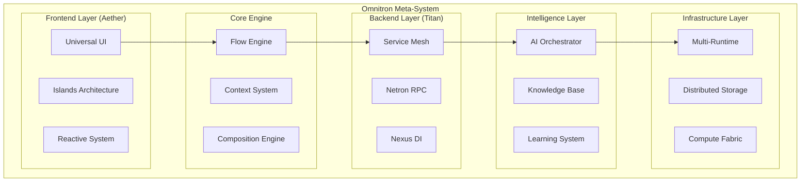

# Omnitron Core Architecture
**Fractal System Design & Component Hierarchy**

Version: 1.0.0
Date: 2025-10-15
Status: Technical Architecture

---

## System Overview



---

## Core Components

### 1. Flow Engine (Heart of Omnitron)

The Flow Engine is the fundamental computation model, implementing the Holon Flow specification with extensions for distributed execution.

```typescript
// Core Flow interface extended for Omnitron
interface OmnitronFlow<In = any, Out = any> extends Flow<In, Out> {
  // Basic Flow capabilities
  (input: In): Out | Promise<Out>;
  pipe<Next>(next: Flow<Out, Next>): Flow<In, Next>;

  // Omnitron extensions
  readonly id: symbol;
  readonly metadata: FlowMetadata;
  readonly capabilities: Capability[];
  readonly effects: Effect[];
  readonly telemetry: TelemetryConfig;

  // Distributed execution
  readonly location?: ExecutionLocation;
  readonly replication?: ReplicationStrategy;
  readonly persistence?: PersistenceConfig;

  // AI enhancement
  readonly intelligence?: {
    model?: string;
    optimization?: OptimizationStrategy;
    learning?: LearningConfig;
  };
}

interface FlowMetadata {
  name: string;
  version: string;
  description: string;
  author: string;
  created: Date;
  modified: Date;
  tags: string[];
  documentation?: string;
  examples?: Example[];
  tests?: TestSuite;
  performance?: PerformanceProfile;
}
```

### 2. Context System (Information Substrate)

The Context System provides immutable, hierarchical context propagation with information boundaries and capability-based security.

```typescript
interface OmnitronContext extends Context {
  // Hierarchical context
  readonly parent?: OmnitronContext;
  readonly children: Set<OmnitronContext>;

  // Capability-based security
  readonly capabilities: Set<Capability>;
  readonly permissions: PermissionSet;

  // Service injection via Titan's Nexus DI
  readonly services: ServiceContainer;

  // Distributed state
  readonly distributed: {
    nodeId: string;
    clusterId: string;
    region: string;
    consistency: ConsistencyLevel;
  };

  // AI context
  readonly ai: {
    models: Map<string, ModelInstance>;
    embeddings: EmbeddingSpace;
    memory: ContextualMemory;
  };

  // Observability
  readonly telemetry: {
    tracer: Tracer;
    meter: Meter;
    logger: Logger;
  };

  // Methods
  spawn(config?: SpawnConfig): OmnitronContext;
  merge(other: OmnitronContext): OmnitronContext;
  isolate(boundary: Boundary): OmnitronContext;
  checkpoint(): ContextSnapshot;
  restore(snapshot: ContextSnapshot): void;
}
```

### 3. Composition Engine

The Composition Engine provides advanced composition patterns beyond simple piping.

```typescript
interface CompositionEngine {
  // Basic composition
  sequence<T>(...flows: Flow<any, any>[]): Flow<T, any>;
  parallel<T>(...flows: Flow<T, any>[]): Flow<T, any[]>;
  race<T>(...flows: Flow<T, any>[]): Flow<T, any>;

  // Conditional composition
  when<T, R>(
    predicate: Predicate<T>,
    then: Flow<T, R>,
    else?: Flow<T, R>
  ): Flow<T, R>;

  switch<T, R>(
    selector: (input: T) => string,
    cases: Record<string, Flow<T, R>>,
    default?: Flow<T, R>
  ): Flow<T, R>;

  // Advanced patterns
  retry<T, R>(
    flow: Flow<T, R>,
    strategy: RetryStrategy
  ): Flow<T, R>;

  timeout<T, R>(
    flow: Flow<T, R>,
    ms: number,
    fallback?: Flow<T, R>
  ): Flow<T, R>;

  cache<T, R>(
    flow: Flow<T, R>,
    strategy: CacheStrategy
  ): Flow<T, R>;

  batch<T, R>(
    flow: Flow<T[], R[]>,
    config: BatchConfig
  ): Flow<T, R>;

  // Distributed patterns
  scatter<T, R>(
    flow: Flow<T, R>,
    nodes: Node[]
  ): Flow<T[], R[]>;

  gather<T, R>(
    flows: Flow<T, R>[],
    reducer: (results: R[]) => R
  ): Flow<T, R>;

  // AI-enhanced composition
  optimize<T, R>(
    flow: Flow<T, R>,
    objectives: Objective[]
  ): Flow<T, R>;

  learn<T, R>(
    flow: Flow<T, R>,
    examples: Example<T, R>[]
  ): Flow<T, R>;
}
```

---

## System Layers

### Frontend Layer (Aether-based)

The frontend leverages Aether's fine-grained reactivity for optimal performance.

```typescript
interface OmnitronUI {
  // Core UI components
  readonly shell: Shell;           // Main application shell
  readonly workspace: Workspace;   // Workspace management
  readonly panels: PanelSystem;    // Panel-based layout
  readonly command: CommandPalette; // Universal command interface

  // Specialized views
  readonly canvas: FlowCanvas;     // Visual flow editor
  readonly editor: CodeEditor;     // Code editing
  readonly chat: ChatInterface;    // AI interaction
  readonly terminal: Terminal;     // System terminal
  readonly dashboard: Dashboard;   // Metrics & monitoring

  // Reactive bindings
  readonly state: ReactiveState;
  readonly effects: EffectSystem;
  readonly router: Router;

  // Real-time features
  readonly sync: RealtimeSync;     // Collaboration
  readonly notifications: NotificationSystem;
  readonly presence: PresenceSystem;
}
```

### Backend Layer (Titan-based)

The backend leverages Titan's distributed architecture for scalability.

```typescript
interface OmnitronBackend {
  // Service architecture
  readonly services: {
    flow: FlowService;
    execution: ExecutionService;
    storage: StorageService;
    intelligence: IntelligenceService;
    monitoring: MonitoringService;
  };

  // Communication
  readonly rpc: NetronRPC;
  readonly events: EventBus;
  readonly pubsub: PubSubSystem;

  // Data layer
  readonly database: DatabaseCluster;
  readonly cache: DistributedCache;
  readonly search: SearchEngine;

  // Infrastructure
  readonly cluster: ClusterManager;
  readonly scheduler: TaskScheduler;
  readonly orchestrator: ServiceOrchestrator;
}
```

### Intelligence Layer

The AI layer provides cognitive capabilities throughout the system.

```typescript
interface IntelligenceLayer {
  // Model management
  readonly models: {
    registry: ModelRegistry;
    loader: ModelLoader;
    inference: InferenceEngine;
    training: TrainingPipeline;
  };

  // Agent orchestration
  readonly agents: {
    registry: AgentRegistry;
    executor: AgentExecutor;
    coordinator: AgentCoordinator;
    supervisor: AgentSupervisor;
  };

  // Knowledge systems
  readonly knowledge: {
    base: KnowledgeBase;
    graph: KnowledgeGraph;
    vectors: VectorStore;
    memory: LongTermMemory;
  };

  // Learning & adaptation
  readonly learning: {
    collector: DataCollector;
    pipeline: LearningPipeline;
    evaluator: ModelEvaluator;
    deployer: ModelDeployer;
  };
}
```

---

## Communication Architecture

### 1. Netron RPC Protocol

All components communicate via Netron's unified RPC protocol.

```typescript
interface NetronProtocol {
  // Service definition
  @Service('omnitron.flow@1.0.0')
  class FlowService {
    @Method({ cache: true, rateLimit: 100 })
    async executeFlow(id: string, input: any): Promise<any> {
      // Implementation
    }

    @Method({ auth: { roles: ['admin'] } })
    async deployFlow(flow: FlowDefinition): Promise<string> {
      // Implementation
    }
  }

  // Client usage
  const client = await netron.connect('omnitron://flow-service');
  const result = await client.executeFlow('flow-123', { data: 'input' });
}
```

### 2. Event-Driven Architecture

Events flow through the system via typed event buses.

```typescript
interface OmnitronEvents {
  // Flow events
  'flow:created': { id: string; metadata: FlowMetadata };
  'flow:executed': { id: string; input: any; output: any; duration: number };
  'flow:error': { id: string; error: Error; context: any };

  // System events
  'node:joined': { nodeId: string; capabilities: string[] };
  'node:left': { nodeId: string; reason: string };

  // AI events
  'model:loaded': { modelId: string; version: string };
  'agent:completed': { agentId: string; task: string; result: any };

  // User events
  'user:action': { userId: string; action: string; context: any };
  'workspace:changed': { workspaceId: string; changes: Change[] };
}
```

---

## Data Architecture

### 1. Persistence Layer

Multi-modal persistence for different data types.

```typescript
interface PersistenceLayer {
  // Flow storage
  flows: FlowStore;           // Flow definitions and versions

  // Execution history
  executions: ExecutionStore; // Execution logs and results

  // Knowledge storage
  knowledge: {
    documents: DocumentStore;  // Text documents
    vectors: VectorStore;      // Embeddings
    graphs: GraphStore;        // Relationships
    timeseries: TimeSeriesStore; // Metrics
  };

  // Configuration
  config: ConfigStore;        // System configuration

  // Binary data
  artifacts: ArtifactStore;  // Models, datasets, binaries
}
```

### 2. Caching Strategy

Multi-level caching for optimal performance.

```typescript
interface CacheHierarchy {
  // L1: In-memory process cache
  memory: MemoryCache;

  // L2: Shared memory cache (Redis)
  shared: SharedCache;

  // L3: Distributed cache (Hazelcast)
  distributed: DistributedCache;

  // L4: CDN edge cache
  edge: EdgeCache;

  // Cache coordination
  coordinator: CacheCoordinator;
}
```

---

## Security Architecture

### 1. Capability-Based Security

Fine-grained capability model for all operations.

```typescript
interface SecurityModel {
  // Capability definition
  interface Capability {
    resource: string;     // What resource
    action: string;       // What action
    constraints?: any;    // Additional constraints
  }

  // Security context
  interface SecurityContext {
    principal: Principal;       // Who
    capabilities: Capability[]; // What they can do
    audit: AuditLog;           // What they did
  }

  // Enforcement
  enforce<T>(
    capability: Capability,
    operation: () => T
  ): T;
}
```

### 2. Zero-Trust Architecture

No implicit trust between components.

```typescript
interface ZeroTrust {
  // Mutual authentication
  authenticate: MutualAuth;

  // Encrypted communication
  encrypt: EndToEndEncryption;

  // Request validation
  validate: RequestValidator;

  // Audit logging
  audit: AuditSystem;
}
```

---

## Scalability Architecture

### 1. Horizontal Scaling

Components scale independently.

```typescript
interface ScalabilityModel {
  // Auto-scaling policies
  policies: {
    cpu: CPUScalingPolicy;
    memory: MemoryScalingPolicy;
    queue: QueueScalingPolicy;
    custom: CustomScalingPolicy[];
  };

  // Scaling strategies
  strategies: {
    predictive: PredictiveScaling;
    reactive: ReactiveScaling;
    scheduled: ScheduledScaling;
  };

  // Load balancing
  balancer: {
    algorithm: 'round-robin' | 'least-conn' | 'weighted' | 'custom';
    healthCheck: HealthCheckConfig;
    failover: FailoverStrategy;
  };
}
```

### 2. Federation

Multiple Omnitron instances can federate.

```typescript
interface Federation {
  // Cluster management
  clusters: Map<string, Cluster>;

  // Cross-cluster communication
  mesh: ServiceMesh;

  // Global coordination
  consensus: ConsensusProtocol;

  // Data synchronization
  sync: DataSyncStrategy;
}
```

---

## Deployment Architecture

### 1. Deployment Targets

Omnitron runs anywhere.

```typescript
interface DeploymentTargets {
  // Local development
  local: {
    docker: DockerCompose;
    native: NativeProcess;
  };

  // Cloud deployment
  cloud: {
    kubernetes: K8sManifests;
    serverless: ServerlessConfig;
    paas: PaaSConfig;
  };

  // Edge deployment
  edge: {
    iot: IoTConfig;
    browser: BrowserBundle;
    mobile: MobileApp;
  };

  // Hybrid deployment
  hybrid: {
    onPrem: OnPremConfig;
    multiCloud: MultiCloudConfig;
  };
}
```

### 2. Deployment Pipeline

Automated deployment with GitOps.

```typescript
interface DeploymentPipeline {
  // Source
  source: GitRepository;

  // Build
  build: BuildConfig;

  // Test
  test: TestSuite;

  // Deploy
  deploy: DeploymentStrategy;

  // Monitor
  monitor: MonitoringConfig;

  // Rollback
  rollback: RollbackStrategy;
}
```

---

## Next Steps

This architecture provides the foundation for implementing Omnitron. The next documents will detail:

1. **Flow System Implementation** - Deep dive into Flow engine
2. **UI/UX Architecture** - Frontend system design
3. **Intelligence Integration** - AI orchestration details
4. **Communication Protocols** - Netron RPC specifications
5. **Data Management** - Storage and retrieval systems
6. **Security Model** - Complete security implementation
7. **Deployment Guide** - How to deploy Omnitron
8. **API Reference** - Complete API documentation

The architecture is designed to be:
- **Fractal**: Same patterns at every scale
- **Evolutionary**: Grows with needs
- **Resilient**: Handles failures gracefully
- **Intelligent**: Learns and adapts
- **Universal**: Runs anywhere, does anything