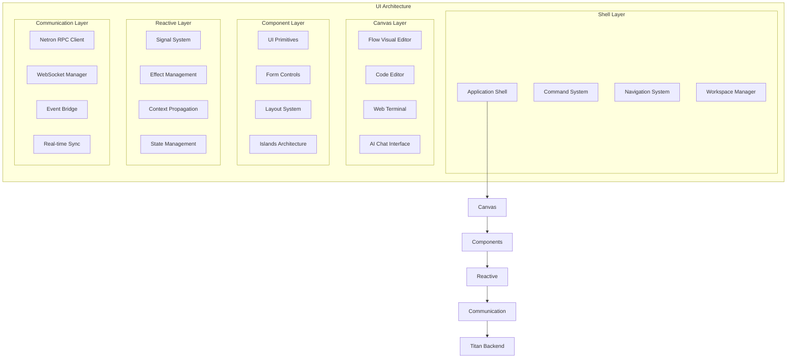

# Omnitron Frontend Architecture
**Aether-Based Universal UI System**

Version: 1.0.0
Date: 2025-10-15
Status: Technical Specification

---

## Overview

The Omnitron frontend leverages Aether's fine-grained reactivity to create a universal UI system that can adapt to any computational paradigm. Unlike traditional IDEs or development environments, Omnitron's UI is itself a living system that evolves with usage and learns from patterns.



---

## Core UI Components

### 1. Application Shell

The Shell is the main container that orchestrates all UI elements.

```typescript
interface OmnitronShell {
  // Layout management
  readonly layout: {
    mode: 'desktop' | 'tablet' | 'mobile' | 'immersive';
    theme: 'light' | 'dark' | 'auto' | CustomTheme;
    density: 'comfortable' | 'compact' | 'spacious';
    direction: 'ltr' | 'rtl';
  };

  // Workspace management
  readonly workspaces: {
    current: Workspace;
    list: Workspace[];
    create(config: WorkspaceConfig): Workspace;
    switch(id: string): void;
    save(): WorkspaceSnapshot;
    restore(snapshot: WorkspaceSnapshot): void;
  };

  // Panel system
  readonly panels: {
    main: PanelContainer;
    left: PanelContainer;
    right: PanelContainer;
    bottom: PanelContainer;
    floating: FloatingPanels;

    register(panel: PanelDefinition): void;
    toggle(panelId: string): void;
    focus(panelId: string): void;
    maximize(panelId: string): void;
  };

  // Global features
  readonly command: CommandPalette;
  readonly notifications: NotificationSystem;
  readonly search: GlobalSearch;
  readonly presence: PresenceIndicator;
}
```

### 2. Flow Canvas (Visual Programming)

The Flow Canvas is the heart of visual system design in Omnitron.

```typescript
interface FlowCanvas {
  // Canvas state
  readonly viewport: {
    zoom: signal<number>;
    pan: signal<{ x: number; y: number }>;
    selection: signal<Set<string>>;
  };

  // Node management
  readonly nodes: {
    add(type: NodeType, position: Point): FlowNode;
    remove(nodeId: string): void;
    update(nodeId: string, updates: Partial<FlowNode>): void;
    connect(from: Port, to: Port): Connection;
    disconnect(connectionId: string): void;
  };

  // Visual features
  readonly features: {
    grid: GridSystem;
    minimap: Minimap;
    toolbar: CanvasToolbar;
    contextMenu: ContextMenu;
    shortcuts: KeyboardShortcuts;
  };

  // Execution visualization
  readonly execution: {
    visualize(flow: Flow): void;
    animate(execution: ExecutionTrace): void;
    highlight(path: ExecutionPath): void;
    showMetrics(metrics: FlowMetrics): void;
  };

  // AI assistance
  readonly ai: {
    suggest(context: CanvasContext): Suggestion[];
    complete(partial: PartialFlow): Flow;
    optimize(flow: Flow): OptimizedFlow;
    explain(selection: FlowNode[]): string;
  };
}

// Flow Node component using Aether
const FlowNode = defineComponent<{
  node: FlowNode;
  canvas: FlowCanvas;
}>((props) => {
  const selected = computed(() =>
    props.canvas.viewport.selection().has(props.node.id)
  );

  const position = signal(props.node.position);
  const isDragging = signal(false);

  // Drag handling with fine-grained updates
  const handleDrag = (e: DragEvent) => {
    if (!isDragging()) return;

    position.set({
      x: e.clientX - props.canvas.viewport.pan().x,
      y: e.clientY - props.canvas.viewport.pan().y
    });
  };

  return div({
    class: computed(() => ({
      'flow-node': true,
      'selected': selected(),
      'dragging': isDragging()
    })),
    style: computed(() => ({
      transform: `translate(${position().x}px, ${position().y}px)`
    })),
    onmousedown: () => isDragging.set(true),
    onmouseup: () => isDragging.set(false),
    onmousemove: handleDrag
  }, [
    // Node header
    div({ class: 'node-header' }, [
      span({ class: 'node-type' }, props.node.type),
      span({ class: 'node-name' }, props.node.name)
    ]),

    // Input ports
    div({ class: 'node-inputs' },
      props.node.inputs.map(port =>
        Port({ port, direction: 'input', canvas: props.canvas })
      )
    ),

    // Node content
    div({ class: 'node-content' }, [
      props.node.renderContent?.() ||
      DefaultNodeContent({ node: props.node })
    ]),

    // Output ports
    div({ class: 'node-outputs' },
      props.node.outputs.map(port =>
        Port({ port, direction: 'output', canvas: props.canvas })
      )
    )
  ]);
});
```

### 3. Code Editor Integration

Monaco-based code editor with Omnitron enhancements.

```typescript
interface OmnitronEditor {
  // Editor instances
  readonly editors: Map<string, EditorInstance>;

  // Features
  readonly features: {
    intellisense: {
      providers: IntelliSenseProvider[];
      flowTypes: FlowTypeProvider;
      aiSuggestions: AISuggestionProvider;
    };

    debugging: {
      breakpoints: BreakpointManager;
      inspector: VariableInspector;
      callStack: CallStackView;
      console: DebugConsole;
    };

    collaboration: {
      cursors: CollaborativeCursors;
      selections: SharedSelections;
      changes: OperationalTransform;
      presence: PresenceAwareness;
    };
  };

  // Language support
  readonly languages: {
    register(language: LanguageDefinition): void;
    setModelMarkers(uri: string, markers: Marker[]): void;
    registerCompletionProvider(provider: CompletionProvider): void;
    registerHoverProvider(provider: HoverProvider): void;
  };

  // AI integration
  readonly ai: {
    complete(context: EditorContext): Promise<Completion>;
    explain(selection: Selection): Promise<string>;
    refactor(code: string, instruction: string): Promise<string>;
    generate(prompt: string, context: EditorContext): Promise<string>;
  };
}
```

### 4. Terminal Component

Full-featured web terminal with shell integration.

```typescript
interface OmnitronTerminal {
  // Terminal instances
  readonly terminals: Map<string, TerminalInstance>;

  // Shell integration
  readonly shell: {
    type: 'bash' | 'zsh' | 'powershell' | 'cmd' | 'custom';
    env: Environment;
    cwd: string;

    execute(command: string): Promise<CommandResult>;
    spawn(program: string, args: string[]): Process;
  };

  // Features
  readonly features: {
    multiplexer: TerminalMultiplexer;
    search: TerminalSearch;
    replay: SessionReplay;
    sharing: TerminalSharing;
  };

  // Remote connections
  readonly remote: {
    ssh(config: SSHConfig): Promise<RemoteTerminal>;
    docker(container: string): Promise<ContainerTerminal>;
    kubernetes(pod: string): Promise<PodTerminal>;
  };
}
```

### 5. AI Chat Interface

Integrated AI assistant for system interaction.

```typescript
interface OmnitronChat {
  // Conversation management
  readonly conversations: {
    current: Conversation;
    history: Conversation[];
    create(config?: ConversationConfig): Conversation;
    fork(from: Conversation): Conversation;
  };

  // Message handling
  readonly messages: {
    send(content: string, attachments?: Attachment[]): Promise<Response>;
    stream(content: string): AsyncIterator<Token>;
    edit(messageId: string, newContent: string): Promise<Response>;
    regenerate(messageId: string): Promise<Response>;
  };

  // Context awareness
  readonly context: {
    workspace: WorkspaceContext;
    selection: SelectionContext;
    execution: ExecutionContext;
    knowledge: KnowledgeContext;

    inject(context: any): void;
    clear(): void;
  };

  // Tools integration
  readonly tools: {
    available: Tool[];
    execute(tool: string, params: any): Promise<any>;
    register(tool: Tool): void;
  };

  // Model selection
  readonly models: {
    current: AIModel;
    available: AIModel[];
    switch(modelId: string): void;
    configure(config: ModelConfig): void;
  };
}
```

---

## Reactive Architecture

### 1. Signal-Based State Management

Using Aether's fine-grained reactivity for optimal performance.

```typescript
// Global UI state using signals
const UIStore = {
  // Theme and appearance
  theme: signal<Theme>('dark'),
  fontSize: signal<number>(14),

  // Layout state
  sidebarVisible: signal<boolean>(true),
  panelLayout: signal<PanelLayout>('default'),

  // Canvas state
  canvasZoom: signal<number>(1),
  canvasPan: signal<Point>({ x: 0, y: 0 }),
  selectedNodes: signal<Set<string>>(new Set()),

  // Editor state
  activeFile: signal<string | null>(null),
  openFiles: signal<string[]>([]),
  unsavedChanges: signal<Set<string>>(new Set()),

  // Execution state
  isExecuting: signal<boolean>(false),
  executionResults: signal<Map<string, any>>(new Map()),

  // AI state
  aiModel: signal<string>('gpt-4'),
  aiStreaming: signal<boolean>(false),

  // Derived states
  hasUnsavedChanges: computed(() =>
    UIStore.unsavedChanges().size > 0
  ),

  canExecute: computed(() =>
    !UIStore.isExecuting() && UIStore.selectedNodes().size > 0
  ),

  statusMessage: computed(() => {
    if (UIStore.isExecuting()) return 'Executing...';
    if (UIStore.hasUnsavedChanges()) return 'Unsaved changes';
    return 'Ready';
  })
};

// Component using reactive state
const StatusBar = defineComponent(() => {
  // Auto-tracks dependencies
  return div({ class: 'status-bar' }, [
    span({ class: 'status-message' }, UIStore.statusMessage()),

    Show({
      when: UIStore.hasUnsavedChanges,
      children: button({
        onclick: () => saveAll(),
        children: 'Save All'
      })
    }),

    span({ class: 'execution-status' }, [
      Show({
        when: UIStore.isExecuting,
        children: LoadingSpinner()
      })
    ])
  ]);
});
```

### 2. Effect Management

Coordinating side effects with the reactive system.

```typescript
// Auto-save effect
effect(() => {
  const unsaved = UIStore.unsavedChanges();
  if (unsaved.size > 0) {
    // Debounced auto-save
    const timer = setTimeout(() => {
      saveFiles(Array.from(unsaved));
    }, 5000);

    onCleanup(() => clearTimeout(timer));
  }
});

// Theme synchronization effect
effect(() => {
  const theme = UIStore.theme();
  document.documentElement.dataset.theme = theme;

  // Notify all editors
  UIStore.editors.forEach(editor => {
    editor.setTheme(theme === 'dark' ? 'vs-dark' : 'vs-light');
  });
});

// Execution state effect
effect(() => {
  const executing = UIStore.isExecuting();
  if (executing) {
    // Show progress indicator
    UIStore.progressBar.show();

    // Disable certain UI elements
    UIStore.canvasInteractive.set(false);
  } else {
    UIStore.progressBar.hide();
    UIStore.canvasInteractive.set(true);
  }
});
```

### 3. Context System

Hierarchical context for component communication.

```typescript
// Define contexts
const ThemeContext = createContext<{
  theme: Signal<Theme>;
  setTheme: (theme: Theme) => void;
}>();

const CanvasContext = createContext<{
  canvas: FlowCanvas;
  selection: Signal<Set<string>>;
  zoom: Signal<number>;
}>();

const WorkspaceContext = createContext<{
  workspace: Workspace;
  files: Signal<FileTree>;
  activeFile: Signal<string | null>;
}>();

// Provide context at app level
const App = defineComponent(() => {
  const theme = signal<Theme>('dark');
  const workspace = signal<Workspace>(loadWorkspace());

  return ContextProvider({
    contexts: [
      [ThemeContext, { theme, setTheme: (t) => theme.set(t) }],
      [WorkspaceContext, { workspace, /* ... */ }]
    ],
    children: Shell()
  });
});

// Consume context in components
const ThemedButton = defineComponent<{ label: string }>((props) => {
  const theme = useContext(ThemeContext);

  return button({
    class: computed(() => `btn btn-${theme.theme()}`),
    children: props.label
  });
});
```

---

## Islands Architecture

### 1. Partial Hydration Strategy

Only hydrate interactive components, keeping static content as HTML.

```typescript
interface Island {
  // Island definition
  id: string;
  component: Component;
  props: any;
  priority: 'immediate' | 'idle' | 'visible' | 'hover';

  // Hydration control
  hydrate(): void;
  dehydrate(): void;
  isHydrated: Signal<boolean>;
}

// Island component wrapper
const Island = defineComponent<{
  name: string;
  props?: any;
  priority?: IslandPriority;
}>((props) => {
  const isHydrated = signal(false);
  const shouldHydrate = signal(false);

  // Hydration strategies
  onMount(() => {
    switch (props.priority || 'idle') {
      case 'immediate':
        shouldHydrate.set(true);
        break;

      case 'idle':
        requestIdleCallback(() => shouldHydrate.set(true));
        break;

      case 'visible':
        const observer = new IntersectionObserver(([entry]) => {
          if (entry.isIntersecting) {
            shouldHydrate.set(true);
            observer.disconnect();
          }
        });
        observer.observe(el);
        onCleanup(() => observer.disconnect());
        break;

      case 'hover':
        const handleHover = () => {
          shouldHydrate.set(true);
          el.removeEventListener('mouseenter', handleHover);
        };
        el.addEventListener('mouseenter', handleHover);
        onCleanup(() => el.removeEventListener('mouseenter', handleHover));
        break;
    }
  });

  // Conditional hydration
  return div({
    class: 'island',
    'data-island': props.name
  }, [
    Show({
      when: shouldHydrate,
      fallback: () => div({
        innerHTML: props.serverHTML || 'Loading...'
      }),
      children: () => {
        const Component = loadComponent(props.name);
        return Component(props.props);
      }
    })
  ]);
});
```

### 2. Progressive Enhancement

Start with HTML, enhance with JavaScript.

```typescript
// Server-rendered HTML with island markers
const serverHTML = `
  <div class="flow-canvas" data-island="FlowCanvas">
    <!-- Static preview of flow -->
    <svg class="flow-preview">...</svg>

    <!-- Island hydration point -->
    <script type="application/json" data-island-props>
      {"flowId": "flow-123", "readOnly": false}
    </script>
  </div>
`;

// Client-side enhancement
document.addEventListener('DOMContentLoaded', () => {
  // Find all islands
  const islands = document.querySelectorAll('[data-island]');

  // Hydrate based on priority
  const immediate = [];
  const idle = [];
  const visible = [];

  islands.forEach(el => {
    const name = el.dataset.island;
    const propsEl = el.querySelector('[data-island-props]');
    const props = propsEl ? JSON.parse(propsEl.textContent) : {};

    const island = {
      element: el,
      name,
      props,
      priority: el.dataset.islandPriority || 'idle'
    };

    switch (island.priority) {
      case 'immediate':
        immediate.push(island);
        break;
      case 'idle':
        idle.push(island);
        break;
      case 'visible':
        visible.push(island);
        break;
    }
  });

  // Hydrate in priority order
  immediate.forEach(hydrateIsland);
  requestIdleCallback(() => idle.forEach(hydrateIsland));
  setupIntersectionObserver(visible);
});
```

---

## Communication with Backend

### 1. Netron RPC Client

Type-safe communication with Titan backend.

```typescript
// Define service contracts
interface FlowService {
  executeFlow(id: string, input: any): Promise<any>;
  saveFlow(flow: FlowDefinition): Promise<string>;
  loadFlow(id: string): Promise<FlowDefinition>;
  listFlows(): Promise<FlowSummary[]>;
}

// Create typed client
const client = createNetronClient<{
  flow: FlowService;
  workspace: WorkspaceService;
  ai: AIService;
}>({
  url: 'ws://localhost:8080',
  reconnect: true,
  heartbeat: true
});

// Use in components
const FlowList = defineComponent(() => {
  const flows = signal<FlowSummary[]>([]);
  const loading = signal(true);

  onMount(async () => {
    try {
      const list = await client.flow.listFlows();
      flows.set(list);
    } finally {
      loading.set(false);
    }
  });

  return div({ class: 'flow-list' }, [
    Show({
      when: loading,
      fallback: () => flows().map(flow =>
        FlowItem({ flow, client })
      ),
      children: LoadingSpinner()
    })
  ]);
});
```

### 2. Real-time Synchronization

Collaborative editing and state sync.

```typescript
interface RealtimeSync {
  // Connection management
  connect(roomId: string): Promise<void>;
  disconnect(): void;

  // State synchronization
  syncState<T>(key: string, initial: T): Signal<T>;

  // Collaborative editing
  syncDocument(uri: string): CollaborativeDocument;

  // Presence
  broadcastPresence(data: any): void;
  onPresenceChange(callback: (peers: Peer[]) => void): void;

  // Custom events
  emit(event: string, data: any): void;
  on(event: string, handler: (data: any) => void): void;
}

// Usage in Flow Canvas
const FlowCanvasCollaborative = defineComponent<{
  flowId: string;
}>((props) => {
  const sync = useRealtimeSync();

  // Sync canvas state
  const nodes = sync.syncState(`flow:${props.flowId}:nodes`, []);
  const connections = sync.syncState(`flow:${props.flowId}:connections`, []);

  // Presence indicators
  const peers = signal<Peer[]>([]);

  onMount(() => {
    sync.connect(`flow:${props.flowId}`);

    sync.onPresenceChange((p) => peers.set(p));

    // Broadcast cursor position
    let frame: number;
    const broadcastCursor = (e: MouseEvent) => {
      cancelAnimationFrame(frame);
      frame = requestAnimationFrame(() => {
        sync.broadcastPresence({
          cursor: { x: e.clientX, y: e.clientY },
          selection: UIStore.selectedNodes()
        });
      });
    };

    document.addEventListener('mousemove', broadcastCursor);
    onCleanup(() => {
      document.removeEventListener('mousemove', broadcastCursor);
      sync.disconnect();
    });
  });

  return div({ class: 'canvas-collaborative' }, [
    // Render canvas with synced state
    FlowCanvas({ nodes, connections }),

    // Render peer cursors
    For({
      each: peers,
      children: (peer) => PeerCursor({ peer })
    })
  ]);
});
```

---

## Performance Optimizations

### 1. Virtual Scrolling

For large lists and canvases.

```typescript
const VirtualList = defineComponent<{
  items: any[];
  itemHeight: number;
  renderItem: (item: any, index: number) => JSX.Element;
}>((props) => {
  const containerRef = ref<HTMLElement>();
  const scrollTop = signal(0);
  const containerHeight = signal(0);

  const visibleRange = computed(() => {
    const start = Math.floor(scrollTop() / props.itemHeight);
    const end = Math.ceil(
      (scrollTop() + containerHeight()) / props.itemHeight
    );
    return { start, end };
  });

  const visibleItems = computed(() => {
    const { start, end } = visibleRange();
    return props.items.slice(start, end).map((item, i) => ({
      item,
      index: start + i,
      top: (start + i) * props.itemHeight
    }));
  });

  return div({
    ref: containerRef,
    class: 'virtual-list',
    onscroll: (e) => scrollTop.set(e.target.scrollTop),
    style: { height: '100%', overflow: 'auto' }
  }, [
    // Total height spacer
    div({
      style: {
        height: `${props.items.length * props.itemHeight}px`,
        position: 'relative'
      }
    }, [
      // Visible items only
      For({
        each: visibleItems,
        children: ({ item, index, top }) =>
          div({
            style: {
              position: 'absolute',
              top: `${top}px`,
              height: `${props.itemHeight}px`
            }
          }, props.renderItem(item, index))
      })
    ])
  ]);
});
```

### 2. Code Splitting

Dynamic imports for large components.

```typescript
// Lazy load heavy components
const MonacoEditor = lazy(() => import('./editors/MonacoEditor'));
const FlowCanvas = lazy(() => import('./canvas/FlowCanvas'));
const Terminal = lazy(() => import('./terminal/Terminal'));

// Component with lazy loading
const Workspace = defineComponent(() => {
  const activePanel = signal<'editor' | 'canvas' | 'terminal'>('editor');

  return div({ class: 'workspace' }, [
    // Tab bar
    TabBar({
      tabs: ['editor', 'canvas', 'terminal'],
      active: activePanel,
      onSelect: (tab) => activePanel.set(tab)
    }),

    // Lazy loaded panels
    div({ class: 'workspace-content' }, [
      Switch({
        value: activePanel,
        cases: {
          'editor': () => Suspense({
            fallback: LoadingSpinner(),
            children: MonacoEditor()
          }),
          'canvas': () => Suspense({
            fallback: LoadingSpinner(),
            children: FlowCanvas()
          }),
          'terminal': () => Suspense({
            fallback: LoadingSpinner(),
            children: Terminal()
          })
        }
      })
    ])
  ]);
});
```

### 3. Web Workers

Offload heavy computations.

```typescript
// Flow execution worker
const executionWorker = new Worker('./workers/flow-executor.js');

const executeFlowOffthread = (flow: Flow, input: any): Promise<any> => {
  return new Promise((resolve, reject) => {
    const id = generateId();

    const handler = (e: MessageEvent) => {
      if (e.data.id === id) {
        executionWorker.removeEventListener('message', handler);
        if (e.data.error) {
          reject(new Error(e.data.error));
        } else {
          resolve(e.data.result);
        }
      }
    };

    executionWorker.addEventListener('message', handler);
    executionWorker.postMessage({ id, flow, input });
  });
};

// AI processing worker
const aiWorker = new Worker('./workers/ai-processor.js');

const processWithAI = async (
  prompt: string,
  context: any
): Promise<string> => {
  // Offload to worker
  const response = await aiWorker.process({ prompt, context });
  return response;
};
```

---

## Theming System

### 1. CSS Variables Based

Dynamic theming with CSS custom properties.

```typescript
interface Theme {
  name: string;
  colors: {
    // Base colors
    background: string;
    foreground: string;
    primary: string;
    secondary: string;
    accent: string;

    // Semantic colors
    error: string;
    warning: string;
    info: string;
    success: string;

    // UI colors
    border: string;
    shadow: string;
    overlay: string;
  };

  typography: {
    fontFamily: string;
    fontSize: {
      xs: string;
      sm: string;
      md: string;
      lg: string;
      xl: string;
    };
    fontWeight: {
      normal: number;
      medium: number;
      bold: number;
    };
    lineHeight: {
      tight: number;
      normal: number;
      loose: number;
    };
  };

  spacing: {
    xs: string;
    sm: string;
    md: string;
    lg: string;
    xl: string;
  };

  borderRadius: {
    sm: string;
    md: string;
    lg: string;
    full: string;
  };

  animation: {
    duration: {
      fast: string;
      normal: string;
      slow: string;
    };
    easing: {
      linear: string;
      ease: string;
      spring: string;
    };
  };
}

// Apply theme
const applyTheme = (theme: Theme) => {
  const root = document.documentElement;

  // Colors
  Object.entries(theme.colors).forEach(([key, value]) => {
    root.style.setProperty(`--color-${key}`, value);
  });

  // Typography
  root.style.setProperty('--font-family', theme.typography.fontFamily);
  Object.entries(theme.typography.fontSize).forEach(([key, value]) => {
    root.style.setProperty(`--font-size-${key}`, value);
  });

  // Spacing
  Object.entries(theme.spacing).forEach(([key, value]) => {
    root.style.setProperty(`--spacing-${key}`, value);
  });

  // Animation
  Object.entries(theme.animation.duration).forEach(([key, value]) => {
    root.style.setProperty(`--duration-${key}`, value);
  });
};
```

### 2. Theme Builder

Visual theme customization interface.

```typescript
const ThemeBuilder = defineComponent(() => {
  const currentTheme = signal<Theme>(defaultTheme);
  const preview = signal(true);

  // Color picker for each color
  const ColorControl = (name: string, value: Signal<string>) => {
    return div({ class: 'theme-control' }, [
      label({ for: name }, name),
      input({
        type: 'color',
        id: name,
        value: value(),
        oninput: (e) => {
          value.set(e.target.value);
          if (preview()) {
            applyTheme(currentTheme());
          }
        }
      })
    ]);
  };

  return div({ class: 'theme-builder' }, [
    // Theme name
    input({
      type: 'text',
      placeholder: 'Theme name',
      value: currentTheme().name,
      oninput: (e) => {
        currentTheme.update(t => ({ ...t, name: e.target.value }));
      }
    }),

    // Color controls
    section({ class: 'theme-colors' }, [
      h3('Colors'),
      ...Object.entries(currentTheme().colors).map(([key, value]) =>
        ColorControl(key, signal(value))
      )
    ]),

    // Preview toggle
    label({ class: 'preview-toggle' }, [
      input({
        type: 'checkbox',
        checked: preview(),
        onchange: (e) => {
          preview.set(e.target.checked);
          if (e.target.checked) {
            applyTheme(currentTheme());
          } else {
            applyTheme(defaultTheme);
          }
        }
      }),
      span('Live preview')
    ]),

    // Export/Import
    div({ class: 'theme-actions' }, [
      button({
        onclick: () => exportTheme(currentTheme())
      }, 'Export Theme'),

      button({
        onclick: () => importTheme().then(t => currentTheme.set(t))
      }, 'Import Theme')
    ])
  ]);
});
```

---

## Accessibility

### 1. ARIA Support

Full accessibility with ARIA attributes.

```typescript
// Accessible Flow Node
const AccessibleFlowNode = defineComponent<{
  node: FlowNode;
}>((props) => {
  const expanded = signal(false);
  const selected = signal(false);

  return div({
    role: 'article',
    'aria-label': `Flow node: ${props.node.name}`,
    'aria-selected': selected(),
    'aria-expanded': expanded(),
    tabindex: 0,
    onkeydown: (e) => {
      switch (e.key) {
        case 'Enter':
        case ' ':
          selected.update(s => !s);
          e.preventDefault();
          break;
        case 'ArrowRight':
          expanded.set(true);
          break;
        case 'ArrowLeft':
          expanded.set(false);
          break;
      }
    }
  }, [
    // Node content with proper ARIA
    div({
      role: 'heading',
      'aria-level': 2
    }, props.node.name),

    Show({
      when: expanded,
      children: div({
        role: 'group',
        'aria-label': 'Node properties'
      }, [
        // Properties list
      ])
    })
  ]);
});
```

### 2. Keyboard Navigation

Complete keyboard support for all interactions.

```typescript
const KeyboardNavigableList = defineComponent<{
  items: any[];
  renderItem: (item: any) => JSX.Element;
}>((props) => {
  const focusedIndex = signal(0);

  const handleKeydown = (e: KeyboardEvent) => {
    switch (e.key) {
      case 'ArrowDown':
        focusedIndex.update(i =>
          Math.min(i + 1, props.items.length - 1)
        );
        e.preventDefault();
        break;

      case 'ArrowUp':
        focusedIndex.update(i => Math.max(i - 1, 0));
        e.preventDefault();
        break;

      case 'Home':
        focusedIndex.set(0);
        e.preventDefault();
        break;

      case 'End':
        focusedIndex.set(props.items.length - 1);
        e.preventDefault();
        break;
    }
  };

  return ul({
    role: 'listbox',
    'aria-label': 'Items',
    tabindex: 0,
    onkeydown: handleKeydown
  },
    props.items.map((item, index) =>
      li({
        role: 'option',
        'aria-selected': index === focusedIndex(),
        tabindex: index === focusedIndex() ? 0 : -1,
        ref: (el) => {
          if (index === focusedIndex()) {
            el?.focus();
          }
        }
      }, props.renderItem(item))
    )
  );
});
```

---

## Mobile Support

### 1. Responsive Design

Adaptive layouts for different screen sizes.

```typescript
const ResponsiveShell = defineComponent(() => {
  const screenSize = useScreenSize();
  const isMobile = computed(() => screenSize.width() < 768);
  const isTablet = computed(() =>
    screenSize.width() >= 768 && screenSize.width() < 1024
  );

  return div({
    class: computed(() => ({
      'shell': true,
      'shell-mobile': isMobile(),
      'shell-tablet': isTablet(),
      'shell-desktop': !isMobile() && !isTablet()
    }))
  }, [
    Show({
      when: isMobile,
      fallback: DesktopLayout(),
      children: MobileLayout()
    })
  ]);
});
```

### 2. Touch Gestures

Native touch support for mobile interactions.

```typescript
const TouchCanvas = defineComponent(() => {
  const scale = signal(1);
  const position = signal({ x: 0, y: 0 });

  let lastDistance = 0;
  let lastCenter = { x: 0, y: 0 };

  const handleTouchMove = (e: TouchEvent) => {
    if (e.touches.length === 2) {
      // Pinch zoom
      const distance = Math.hypot(
        e.touches[1].clientX - e.touches[0].clientX,
        e.touches[1].clientY - e.touches[0].clientY
      );

      if (lastDistance > 0) {
        scale.update(s => s * (distance / lastDistance));
      }
      lastDistance = distance;

      // Pan
      const center = {
        x: (e.touches[0].clientX + e.touches[1].clientX) / 2,
        y: (e.touches[0].clientY + e.touches[1].clientY) / 2
      };

      if (lastCenter.x > 0) {
        position.update(p => ({
          x: p.x + (center.x - lastCenter.x),
          y: p.y + (center.y - lastCenter.y)
        }));
      }
      lastCenter = center;
    }
  };

  return div({
    class: 'touch-canvas',
    ontouchmove: handleTouchMove,
    ontouchend: () => {
      lastDistance = 0;
      lastCenter = { x: 0, y: 0 };
    },
    style: computed(() => ({
      transform: `translate(${position().x}px, ${position().y}px) scale(${scale()})`
    }))
  }, [
    // Canvas content
  ]);
});
```

---

## Next Steps

This frontend architecture provides:
1. **Universal UI System** - Adaptable to any paradigm
2. **Fine-grained Reactivity** - Optimal performance with Aether
3. **Islands Architecture** - Progressive enhancement strategy
4. **Full-featured Development Environment** - Editor, terminal, canvas, chat
5. **Collaborative Features** - Real-time sync and presence
6. **Accessibility & Mobile** - Complete support for all users

The next specification will detail the backend architecture using Titan.