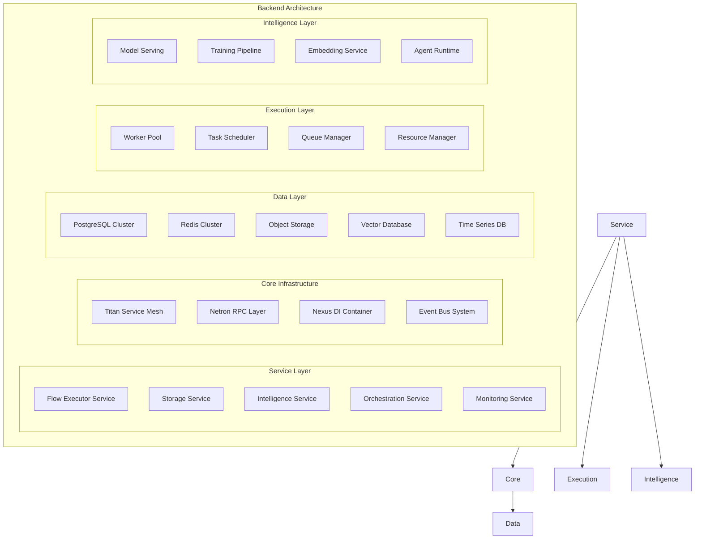

# Omnitron Backend Architecture
**Titan-Based Distributed Service Architecture**

Version: 1.0.0
Date: 2025-10-15
Status: Technical Specification

---

## Overview

The Omnitron backend leverages Titan's distributed architecture to create a scalable, resilient service mesh that executes Flows at any scale. Unlike traditional microservices, Omnitron's backend is a living, adaptive system that can reorganize itself based on load, failures, and learning.



---

## Core Services

### 1. Flow Executor Service

The heart of Omnitron - executes Flows with distributed coordination.

```typescript
import { Injectable, Service, Module } from '@omnitron-dev/titan';
import { Netron, Public, Protected } from '@omnitron-dev/titan/netron';
import { Flow, Context, ExecutionResult } from '@omnitron-dev/holon';

@Injectable()
@Service('flow-executor@1.0.0')
export class FlowExecutorService {
  constructor(
    private readonly storage: StorageService,
    private readonly monitoring: MonitoringService,
    private readonly queue: QueueManager,
    private readonly resources: ResourceManager,
    private readonly intelligence: IntelligenceService
  ) {}

  @Public()
  async executeFlow(
    flowId: string,
    input: any,
    options?: ExecutionOptions
  ): Promise<ExecutionResult> {
    // Load flow definition
    const flow = await this.storage.loadFlow(flowId);

    // Create execution context
    const context = this.createContext(flow, options);

    // Check resource availability
    const resources = await this.resources.allocate(flow.requirements);

    try {
      // Start monitoring
      const monitor = this.monitoring.startExecution(flowId, context);

      // Execute based on flow type
      const result = await this.routeExecution(flow, input, context);

      // Record metrics
      await monitor.complete(result);

      // Learn from execution
      await this.intelligence.learn(flow, input, result);

      return result;
    } finally {
      // Release resources
      await this.resources.release(resources);
    }
  }

  @Protected({ roles: ['admin'] })
  async deployFlow(definition: FlowDefinition): Promise<string> {
    // Validate flow
    const validation = await this.validateFlow(definition);
    if (!validation.valid) {
      throw new Error(`Invalid flow: ${validation.errors.join(', ')}`);
    }

    // Optimize flow
    const optimized = await this.intelligence.optimizeFlow(definition);

    // Store flow
    const flowId = await this.storage.saveFlow(optimized);

    // Pre-compile if needed
    if (definition.precompile) {
      await this.precompileFlow(flowId, optimized);
    }

    // Register with service mesh
    await this.registerFlowService(flowId, optimized);

    return flowId;
  }

  private async routeExecution(
    flow: Flow,
    input: any,
    context: Context
  ): Promise<any> {
    switch (flow.executionMode) {
      case 'local':
        return this.executeLocal(flow, input, context);

      case 'distributed':
        return this.executeDistributed(flow, input, context);

      case 'streaming':
        return this.executeStreaming(flow, input, context);

      case 'batch':
        return this.executeBatch(flow, input, context);

      case 'gpu':
        return this.executeGPU(flow, input, context);

      default:
        return this.executeLocal(flow, input, context);
    }
  }

  private async executeDistributed(
    flow: Flow,
    input: any,
    context: Context
  ): Promise<any> {
    // Partition work
    const partitions = await this.partitionFlow(flow, input);

    // Distribute to workers
    const promises = partitions.map(partition =>
      this.queue.enqueue({
        type: 'flow-execution',
        flowId: flow.id,
        partition,
        context: context.serialize()
      })
    );

    // Wait for results
    const results = await Promise.all(promises);

    // Reduce results
    return this.reduceResults(flow, results);
  }

  @Public()
  async streamFlow(
    flowId: string,
    input: AsyncIterator<any>
  ): AsyncIterator<any> {
    const flow = await this.storage.loadFlow(flowId);
    const context = this.createContext(flow, { streaming: true });

    return {
      async next() {
        const { value, done } = await input.next();
        if (done) return { done: true, value: undefined };

        const result = await this.executeLocal(flow, value, context);
        return { done: false, value: result };
      }
    };
  }
}

// Flow Executor Module
@Module({
  providers: [
    FlowExecutorService,
    FlowCompiler,
    FlowOptimizer,
    FlowValidator,
    FlowProfiler
  ],
  exports: [FlowExecutorService],
  imports: [StorageModule, MonitoringModule, QueueModule]
})
export class FlowExecutorModule {}
```

### 2. Storage Service

Distributed storage for Flows, data, and artifacts.

```typescript
@Injectable()
@Service('storage@1.0.0')
export class StorageService {
  constructor(
    @Inject('POSTGRES') private readonly postgres: PostgresClient,
    @Inject('REDIS') private readonly redis: RedisClient,
    @Inject('S3') private readonly s3: S3Client,
    @Inject('VECTOR_DB') private readonly vectorDb: VectorDBClient
  ) {}

  // Flow storage
  @Public()
  async saveFlow(flow: FlowDefinition): Promise<string> {
    const flowId = generateId();

    // Store metadata in PostgreSQL
    await this.postgres.query(
      `INSERT INTO flows (id, name, version, metadata, created_at)
       VALUES ($1, $2, $3, $4, NOW())`,
      [flowId, flow.name, flow.version, JSON.stringify(flow.metadata)]
    );

    // Store definition in S3
    await this.s3.putObject({
      Bucket: 'omnitron-flows',
      Key: `flows/${flowId}/definition.json`,
      Body: JSON.stringify(flow),
      ContentType: 'application/json'
    });

    // Cache in Redis for fast access
    await this.redis.setex(
      `flow:${flowId}`,
      3600,
      JSON.stringify(flow)
    );

    // Index for search
    await this.indexFlow(flowId, flow);

    return flowId;
  }

  @Public()
  async loadFlow(flowId: string): Promise<FlowDefinition> {
    // Try cache first
    const cached = await this.redis.get(`flow:${flowId}`);
    if (cached) {
      return JSON.parse(cached);
    }

    // Load from S3
    const object = await this.s3.getObject({
      Bucket: 'omnitron-flows',
      Key: `flows/${flowId}/definition.json`
    });

    const flow = JSON.parse(await object.Body.toString());

    // Re-cache
    await this.redis.setex(
      `flow:${flowId}`,
      3600,
      JSON.stringify(flow)
    );

    return flow;
  }

  // Execution storage
  @Public()
  async saveExecution(execution: ExecutionRecord): Promise<void> {
    // Store in PostgreSQL
    await this.postgres.query(
      `INSERT INTO executions
       (id, flow_id, input, output, status, duration, error, created_at)
       VALUES ($1, $2, $3, $4, $5, $6, $7, NOW())`,
      [
        execution.id,
        execution.flowId,
        JSON.stringify(execution.input),
        JSON.stringify(execution.output),
        execution.status,
        execution.duration,
        execution.error
      ]
    );

    // Store detailed logs in S3
    if (execution.logs) {
      await this.s3.putObject({
        Bucket: 'omnitron-executions',
        Key: `executions/${execution.id}/logs.jsonl`,
        Body: execution.logs.map(l => JSON.stringify(l)).join('\n')
      });
    }

    // Update metrics
    await this.updateFlowMetrics(execution);
  }

  // Vector storage for AI
  @Public()
  async storeEmbedding(
    content: string,
    metadata: any
  ): Promise<string> {
    const embedding = await this.generateEmbedding(content);
    const id = generateId();

    await this.vectorDb.insert({
      id,
      vector: embedding,
      metadata: {
        ...metadata,
        content,
        created_at: new Date()
      }
    });

    return id;
  }

  @Public()
  async searchSimilar(
    query: string,
    limit: number = 10
  ): Promise<SearchResult[]> {
    const queryEmbedding = await this.generateEmbedding(query);

    return this.vectorDb.search({
      vector: queryEmbedding,
      limit,
      includeMetadata: true
    });
  }

  // Versioning
  @Public()
  async createVersion(
    flowId: string,
    changes: FlowChanges
  ): Promise<string> {
    const current = await this.loadFlow(flowId);
    const version = incrementVersion(current.version);

    const newFlow = {
      ...current,
      ...changes,
      version,
      previousVersion: current.version
    };

    const newFlowId = await this.saveFlow(newFlow);

    // Link versions
    await this.postgres.query(
      `INSERT INTO flow_versions (flow_id, version, version_id)
       VALUES ($1, $2, $3)`,
      [flowId, version, newFlowId]
    );

    return newFlowId;
  }

  // Collaboration
  @Public()
  async createSnapshot(workspaceId: string): Promise<string> {
    const snapshotId = generateId();

    // Get all workspace data
    const flows = await this.getWorkspaceFlows(workspaceId);
    const data = await this.getWorkspaceData(workspaceId);
    const config = await this.getWorkspaceConfig(workspaceId);

    // Create snapshot
    const snapshot = {
      id: snapshotId,
      workspaceId,
      flows,
      data,
      config,
      timestamp: new Date()
    };

    // Store in S3
    await this.s3.putObject({
      Bucket: 'omnitron-snapshots',
      Key: `snapshots/${snapshotId}/data.json`,
      Body: JSON.stringify(snapshot)
    });

    return snapshotId;
  }

  private async indexFlow(flowId: string, flow: FlowDefinition) {
    // Create searchable index
    const indexData = {
      id: flowId,
      name: flow.name,
      description: flow.description,
      tags: flow.tags,
      content: this.extractFlowContent(flow)
    };

    // Store embedding for semantic search
    await this.storeEmbedding(
      `${flow.name} ${flow.description} ${indexData.content}`,
      { type: 'flow', flowId }
    );

    // Update search index
    await this.postgres.query(
      `INSERT INTO flow_search (flow_id, content, tsv)
       VALUES ($1, $2, to_tsvector('english', $2))`,
      [flowId, indexData.content]
    );
  }
}

// Storage Module
@Module({
  providers: [
    StorageService,
    {
      provide: 'POSTGRES',
      useFactory: () => new PostgresClient(config.postgres)
    },
    {
      provide: 'REDIS',
      useFactory: () => new RedisClient(config.redis)
    },
    {
      provide: 'S3',
      useFactory: () => new S3Client(config.s3)
    },
    {
      provide: 'VECTOR_DB',
      useFactory: () => new VectorDBClient(config.vectorDb)
    }
  ],
  exports: [StorageService]
})
export class StorageModule {}
```

### 3. Intelligence Service

AI orchestration and cognitive capabilities.

```typescript
@Injectable()
@Service('intelligence@1.0.0')
export class IntelligenceService {
  private readonly models = new Map<string, ModelInstance>();
  private readonly agents = new Map<string, Agent>();

  constructor(
    private readonly modelRegistry: ModelRegistry,
    private readonly agentOrchestrator: AgentOrchestrator,
    private readonly embedding: EmbeddingService,
    private readonly training: TrainingPipeline,
    private readonly knowledge: KnowledgeBase
  ) {}

  // Model management
  @Public()
  async loadModel(modelId: string): Promise<void> {
    if (this.models.has(modelId)) return;

    const model = await this.modelRegistry.load(modelId);
    this.models.set(modelId, model);

    // Warm up model
    await model.warmup();
  }

  @Public()
  async inference(
    modelId: string,
    input: any,
    options?: InferenceOptions
  ): Promise<any> {
    const model = this.models.get(modelId);
    if (!model) {
      await this.loadModel(modelId);
    }

    return model.predict(input, options);
  }

  // Agent orchestration
  @Public()
  async createAgent(config: AgentConfig): Promise<string> {
    const agent = await this.agentOrchestrator.create({
      name: config.name,
      capabilities: config.capabilities,
      model: config.model || 'gpt-4',
      tools: config.tools,
      memory: config.memory || 'short-term',
      personality: config.personality
    });

    this.agents.set(agent.id, agent);
    return agent.id;
  }

  @Public()
  async executeAgent(
    agentId: string,
    task: string,
    context?: any
  ): Promise<AgentResult> {
    const agent = this.agents.get(agentId);
    if (!agent) {
      throw new Error(`Agent ${agentId} not found`);
    }

    // Enrich context with knowledge
    const enrichedContext = await this.enrichContext(context);

    // Execute task
    const result = await agent.execute(task, enrichedContext);

    // Learn from execution
    await this.recordAgentExecution(agent, task, result);

    return result;
  }

  // Flow optimization
  @Public()
  async optimizeFlow(flow: FlowDefinition): Promise<FlowDefinition> {
    // Analyze flow structure
    const analysis = await this.analyzeFlow(flow);

    // Identify optimization opportunities
    const optimizations = await this.identifyOptimizations(analysis);

    // Apply optimizations
    let optimized = flow;
    for (const opt of optimizations) {
      optimized = await this.applyOptimization(optimized, opt);
    }

    // Validate optimized flow
    await this.validateOptimization(flow, optimized);

    return optimized;
  }

  // Learning from executions
  @Public()
  async learn(
    flow: Flow,
    input: any,
    result: ExecutionResult
  ): Promise<void> {
    // Extract features
    const features = this.extractFeatures(flow, input, result);

    // Update model
    await this.training.addExample({
      flow: flow.id,
      features,
      performance: result.metrics,
      success: result.status === 'success'
    });

    // Trigger training if needed
    if (await this.shouldRetrain(flow.id)) {
      await this.triggerRetraining(flow.id);
    }

    // Update knowledge base
    await this.knowledge.add({
      type: 'execution',
      flow: flow.id,
      pattern: this.extractPattern(input, result),
      timestamp: new Date()
    });
  }

  // Semantic search
  @Public()
  async semanticSearch(
    query: string,
    options?: SearchOptions
  ): Promise<SearchResult[]> {
    // Generate embedding
    const embedding = await this.embedding.generate(query);

    // Search knowledge base
    const results = await this.knowledge.search(embedding, options);

    // Rank by relevance
    const ranked = await this.rankResults(query, results);

    return ranked;
  }

  // Code generation
  @Public()
  async generateCode(
    prompt: string,
    context?: CodeContext
  ): Promise<string> {
    const model = this.models.get('codegen') ||
                  await this.loadModel('codegen');

    const enrichedPrompt = await this.enrichCodePrompt(prompt, context);

    const code = await model.generate(enrichedPrompt, {
      temperature: 0.7,
      maxTokens: 2000,
      stopSequences: ['```']
    });

    // Validate generated code
    await this.validateGeneratedCode(code, context);

    return code;
  }

  // Multi-modal processing
  @Public()
  async processMultiModal(
    inputs: MultiModalInput
  ): Promise<MultiModalOutput> {
    const results = await Promise.all([
      inputs.text ? this.processText(inputs.text) : null,
      inputs.image ? this.processImage(inputs.image) : null,
      inputs.audio ? this.processAudio(inputs.audio) : null,
      inputs.video ? this.processVideo(inputs.video) : null
    ]);

    // Fuse results
    return this.fuseMultiModalResults(results);
  }

  private async analyzeFlow(flow: FlowDefinition) {
    return {
      complexity: this.calculateComplexity(flow),
      bottlenecks: await this.identifyBottlenecks(flow),
      parallelizable: this.findParallelizableNodes(flow),
      cacheable: this.findCacheableNodes(flow),
      redundant: this.findRedundantNodes(flow)
    };
  }

  private async enrichContext(context: any) {
    // Add relevant knowledge
    const relevantKnowledge = await this.knowledge.getRelevant(context);

    // Add execution history
    const history = await this.getExecutionHistory(context);

    // Add environmental context
    const environment = this.getEnvironmentContext();

    return {
      ...context,
      knowledge: relevantKnowledge,
      history,
      environment
    };
  }
}

// Intelligence Module
@Module({
  providers: [
    IntelligenceService,
    ModelRegistry,
    AgentOrchestrator,
    EmbeddingService,
    TrainingPipeline,
    KnowledgeBase
  ],
  exports: [IntelligenceService],
  imports: [StorageModule, MonitoringModule]
})
export class IntelligenceModule {}
```

### 4. Orchestration Service

Manages distributed execution and coordination.

```typescript
@Injectable()
@Service('orchestration@1.0.0')
export class OrchestrationService {
  private readonly nodes = new Map<string, NodeInfo>();
  private readonly tasks = new Map<string, TaskInfo>();
  private readonly workflows = new Map<string, Workflow>();

  constructor(
    private readonly raft: RaftConsensus,
    private readonly scheduler: TaskScheduler,
    private readonly balancer: LoadBalancer,
    private readonly discovery: ServiceDiscovery,
    private readonly health: HealthChecker
  ) {}

  // Cluster management
  @Protected()
  async joinCluster(nodeInfo: NodeInfo): Promise<void> {
    // Register node
    await this.discovery.register(nodeInfo);

    // Join consensus
    await this.raft.addNode(nodeInfo.id);

    // Update topology
    this.nodes.set(nodeInfo.id, nodeInfo);

    // Rebalance if needed
    await this.rebalance();
  }

  @Protected()
  async leaveCluster(nodeId: string): Promise<void> {
    // Migrate tasks
    await this.migrateTasks(nodeId);

    // Remove from consensus
    await this.raft.removeNode(nodeId);

    // Unregister
    await this.discovery.unregister(nodeId);

    // Update topology
    this.nodes.delete(nodeId);
  }

  // Task scheduling
  @Public()
  async scheduleTask(
    task: TaskDefinition
  ): Promise<string> {
    const taskId = generateId();

    // Find optimal node
    const node = await this.selectNode(task);

    // Schedule task
    const scheduled = await this.scheduler.schedule({
      id: taskId,
      task,
      node,
      priority: task.priority || 'normal',
      deadline: task.deadline
    });

    // Track task
    this.tasks.set(taskId, {
      id: taskId,
      task,
      node,
      status: 'scheduled',
      scheduledAt: new Date()
    });

    // Monitor task
    this.monitorTask(taskId);

    return taskId;
  }

  @Public()
  async executeWorkflow(
    workflow: WorkflowDefinition
  ): Promise<WorkflowExecution> {
    const workflowId = generateId();

    // Parse DAG
    const dag = this.parseWorkflow(workflow);

    // Initialize execution
    const execution = {
      id: workflowId,
      workflow,
      dag,
      status: 'running',
      tasks: new Map<string, TaskExecution>(),
      startedAt: new Date()
    };

    this.workflows.set(workflowId, execution);

    // Execute stages
    for (const stage of dag.stages) {
      await this.executeStage(execution, stage);
    }

    // Finalize
    execution.status = 'completed';
    execution.completedAt = new Date();

    return execution;
  }

  // Load balancing
  private async selectNode(task: TaskDefinition): Promise<string> {
    // Get healthy nodes
    const healthyNodes = await this.getHealthyNodes();

    // Filter by capabilities
    const capableNodes = healthyNodes.filter(node =>
      this.hasCapabilities(node, task.requirements)
    );

    // Select based on strategy
    return this.balancer.select(capableNodes, {
      strategy: task.affinity || 'least-loaded',
      constraints: task.constraints
    });
  }

  private async rebalance(): Promise<void> {
    // Calculate load distribution
    const distribution = await this.calculateLoadDistribution();

    // Identify imbalances
    const imbalances = this.identifyImbalances(distribution);

    // Migrate tasks to balance
    for (const imbalance of imbalances) {
      await this.migrateForBalance(imbalance);
    }
  }

  // Fault tolerance
  private async handleNodeFailure(nodeId: string): Promise<void> {
    // Get tasks on failed node
    const tasks = this.getNodeTasks(nodeId);

    // Reschedule tasks
    for (const task of tasks) {
      await this.rescheduleTask(task);
    }

    // Update cluster state
    await this.raft.reportFailure(nodeId);

    // Trigger recovery
    await this.recoverNode(nodeId);
  }

  private async monitorTask(taskId: string): Promise<void> {
    const interval = setInterval(async () => {
      const task = this.tasks.get(taskId);
      if (!task) {
        clearInterval(interval);
        return;
      }

      // Check health
      const healthy = await this.health.checkTask(taskId);

      if (!healthy) {
        // Handle failure
        await this.handleTaskFailure(taskId);
      }

      // Check timeout
      if (task.deadline && new Date() > task.deadline) {
        await this.handleTaskTimeout(taskId);
      }
    }, 5000);
  }

  // Workflow execution
  private async executeStage(
    execution: WorkflowExecution,
    stage: WorkflowStage
  ): Promise<void> {
    // Get tasks in stage
    const tasks = stage.tasks;

    // Execute in parallel
    const promises = tasks.map(task =>
      this.executeWorkflowTask(execution, task)
    );

    // Wait for completion
    const results = await Promise.allSettled(promises);

    // Handle failures
    const failures = results.filter(r => r.status === 'rejected');
    if (failures.length > 0 && !stage.continueOnError) {
      throw new Error(`Stage ${stage.name} failed: ${failures}`);
    }
  }

  private async executeWorkflowTask(
    execution: WorkflowExecution,
    task: WorkflowTask
  ): Promise<any> {
    // Get dependencies
    const dependencies = await this.resolveDependencies(
      execution,
      task.dependencies
    );

    // Schedule task
    const taskId = await this.scheduleTask({
      ...task,
      input: dependencies
    });

    // Wait for completion
    const result = await this.waitForTask(taskId);

    // Store result
    execution.tasks.set(task.name, {
      taskId,
      status: 'completed',
      result
    });

    return result;
  }
}

// Orchestration Module
@Module({
  providers: [
    OrchestrationService,
    RaftConsensus,
    TaskScheduler,
    LoadBalancer,
    ServiceDiscovery,
    HealthChecker
  ],
  exports: [OrchestrationService],
  imports: [MonitoringModule]
})
export class OrchestrationModule {}
```

### 5. Monitoring Service

Observability and telemetry for the entire system.

```typescript
@Injectable()
@Service('monitoring@1.0.0')
export class MonitoringService {
  private readonly metrics = new Map<string, Metric>();
  private readonly traces = new Map<string, Trace>();
  private readonly alerts = new Map<string, Alert>();

  constructor(
    @Inject('PROMETHEUS') private readonly prometheus: PrometheusClient,
    @Inject('JAEGER') private readonly jaeger: JaegerClient,
    @Inject('ALERTMANAGER') private readonly alertManager: AlertManager,
    private readonly timeseries: TimeSeriesDB,
    private readonly logger: LoggerService
  ) {}

  // Metrics collection
  @Public()
  async recordMetric(
    name: string,
    value: number,
    labels?: Record<string, string>
  ): Promise<void> {
    // Update Prometheus
    const metric = this.prometheus.gauge(name, labels);
    metric.set(value);

    // Store in time series DB
    await this.timeseries.write({
      metric: name,
      value,
      labels,
      timestamp: Date.now()
    });

    // Check thresholds
    await this.checkThresholds(name, value);
  }

  @Public()
  async incrementCounter(
    name: string,
    labels?: Record<string, string>
  ): Promise<void> {
    const counter = this.prometheus.counter(name, labels);
    counter.inc();
  }

  @Public()
  async observeHistogram(
    name: string,
    value: number,
    labels?: Record<string, string>
  ): Promise<void> {
    const histogram = this.prometheus.histogram(name, labels);
    histogram.observe(value);
  }

  // Distributed tracing
  @Public()
  startTrace(
    operation: string,
    context?: TraceContext
  ): TraceSpan {
    const span = this.jaeger.startSpan(operation, {
      childOf: context?.span
    });

    const traceId = span.context().toTraceId();
    this.traces.set(traceId, {
      id: traceId,
      operation,
      startTime: Date.now(),
      spans: [span]
    });

    return {
      span,
      traceId,
      finish: (error?: Error) => {
        if (error) {
          span.setTag('error', true);
          span.log({ event: 'error', message: error.message });
        }
        span.finish();
      },
      addEvent: (name: string, attributes?: any) => {
        span.log({ event: name, ...attributes });
      },
      setTag: (key: string, value: any) => {
        span.setTag(key, value);
      }
    };
  }

  // Execution monitoring
  startExecution(
    flowId: string,
    context: Context
  ): ExecutionMonitor {
    const executionId = generateId();
    const trace = this.startTrace(`flow:${flowId}`, context.trace);

    const monitor = {
      id: executionId,
      flowId,
      startTime: Date.now(),
      trace,
      metrics: new Map<string, number>(),

      recordMetric: (name: string, value: number) => {
        monitor.metrics.set(name, value);
        this.recordMetric(`flow.${flowId}.${name}`, value, {
          execution: executionId
        });
      },

      recordEvent: (event: string, data?: any) => {
        trace.addEvent(event, data);
        this.logger.info({ event, flowId, executionId, ...data });
      },

      complete: async (result: ExecutionResult) => {
        const duration = Date.now() - monitor.startTime;

        // Record execution metrics
        await this.recordMetric(`flow.${flowId}.duration`, duration);
        await this.incrementCounter(`flow.${flowId}.executions`, {
          status: result.status
        });

        // Finish trace
        trace.finish(result.error);

        // Store execution record
        await this.storeExecutionMetrics(executionId, {
          flowId,
          duration,
          status: result.status,
          metrics: Object.fromEntries(monitor.metrics)
        });

        return monitor;
      }
    };

    return monitor;
  }

  // Alerting
  @Public()
  async createAlert(config: AlertConfig): Promise<string> {
    const alertId = generateId();

    const alert = {
      id: alertId,
      ...config,
      created: new Date(),
      status: 'active'
    };

    this.alerts.set(alertId, alert);

    // Register with AlertManager
    await this.alertManager.createRule({
      name: config.name,
      expr: config.condition,
      for: config.duration || '5m',
      labels: {
        severity: config.severity,
        alertId
      },
      annotations: {
        summary: config.summary,
        description: config.description
      }
    });

    return alertId;
  }

  // Health checks
  @Public()
  async checkHealth(): Promise<HealthStatus> {
    const checks = await Promise.allSettled([
      this.checkDatabase(),
      this.checkRedis(),
      this.checkServices(),
      this.checkResources()
    ]);

    const healthy = checks.every(c => c.status === 'fulfilled');

    return {
      healthy,
      checks: checks.map((c, i) => ({
        name: ['database', 'redis', 'services', 'resources'][i],
        status: c.status === 'fulfilled' ? 'healthy' : 'unhealthy',
        error: c.status === 'rejected' ? c.reason : undefined
      })),
      timestamp: new Date()
    };
  }

  // Dashboard data
  @Public()
  async getDashboardData(): Promise<DashboardData> {
    const [
      systemMetrics,
      executionStats,
      activeAlerts,
      recentTraces
    ] = await Promise.all([
      this.getSystemMetrics(),
      this.getExecutionStats(),
      this.getActiveAlerts(),
      this.getRecentTraces()
    ]);

    return {
      systemMetrics,
      executionStats,
      activeAlerts,
      recentTraces,
      timestamp: new Date()
    };
  }

  private async getSystemMetrics() {
    return {
      cpu: await this.getMetric('system.cpu.usage'),
      memory: await this.getMetric('system.memory.usage'),
      disk: await this.getMetric('system.disk.usage'),
      network: {
        in: await this.getMetric('system.network.bytes.in'),
        out: await this.getMetric('system.network.bytes.out')
      }
    };
  }

  private async checkThresholds(
    metric: string,
    value: number
  ): Promise<void> {
    const thresholds = await this.getThresholds(metric);

    for (const threshold of thresholds) {
      if (this.evaluateThreshold(value, threshold)) {
        await this.triggerAlert({
          metric,
          value,
          threshold,
          severity: threshold.severity
        });
      }
    }
  }
}

// Monitoring Module
@Module({
  providers: [
    MonitoringService,
    LoggerService,
    {
      provide: 'PROMETHEUS',
      useFactory: () => new PrometheusClient(config.prometheus)
    },
    {
      provide: 'JAEGER',
      useFactory: () => new JaegerClient(config.jaeger)
    },
    {
      provide: 'ALERTMANAGER',
      useFactory: () => new AlertManager(config.alertManager)
    }
  ],
  exports: [MonitoringService]
})
export class MonitoringModule {}
```

---

## Infrastructure Patterns

### 1. Service Mesh Architecture

```typescript
// Service registration and discovery
@Module({
  providers: [
    {
      provide: 'SERVICE_MESH',
      useFactory: async () => {
        const mesh = new ServiceMesh({
          discovery: new ConsulDiscovery(config.consul),
          proxy: new EnvoyProxy(config.envoy),
          loadBalancer: new AdaptiveLoadBalancer(),
          circuitBreaker: new CircuitBreaker({
            threshold: 5,
            timeout: 30000,
            resetTimeout: 60000
          })
        });

        // Register services
        await mesh.register({
          name: 'flow-executor',
          version: '1.0.0',
          endpoints: [
            { protocol: 'grpc', port: 9090 },
            { protocol: 'http', port: 8080 }
          ],
          healthCheck: {
            http: '/health',
            interval: 10000
          }
        });

        return mesh;
      }
    }
  ]
})
export class ServiceMeshModule {}
```

### 2. Event-Driven Architecture

```typescript
// Event bus configuration
@Module({
  providers: [
    {
      provide: 'EVENT_BUS',
      useFactory: () => {
        const bus = new EventBus({
          transport: new KafkaTransport(config.kafka),
          serializer: new MessagePackSerializer(),
          middleware: [
            new LoggingMiddleware(),
            new TracingMiddleware(),
            new RetryMiddleware({ maxRetries: 3 }),
            new DeduplicationMiddleware()
          ]
        });

        // Register event handlers
        bus.subscribe('flow.executed', async (event) => {
          await analyticsService.recordExecution(event);
        });

        bus.subscribe('flow.failed', async (event) => {
          await alertService.notifyFailure(event);
        });

        return bus;
      }
    }
  ]
})
export class EventBusModule {}
```

### 3. Caching Strategy

```typescript
// Multi-level caching
@Injectable()
export class CacheService {
  private readonly l1Cache = new LRUCache<string, any>({
    max: 1000,
    ttl: 60000 // 1 minute
  });

  private readonly l2Cache = new RedisCache({
    client: this.redis,
    ttl: 3600 // 1 hour
  });

  private readonly l3Cache = new CDNCache({
    provider: 'cloudflare',
    ttl: 86400 // 1 day
  });

  async get(key: string): Promise<any> {
    // L1: Memory
    let value = this.l1Cache.get(key);
    if (value) return value;

    // L2: Redis
    value = await this.l2Cache.get(key);
    if (value) {
      this.l1Cache.set(key, value);
      return value;
    }

    // L3: CDN
    value = await this.l3Cache.get(key);
    if (value) {
      await this.l2Cache.set(key, value);
      this.l1Cache.set(key, value);
      return value;
    }

    return null;
  }

  async set(
    key: string,
    value: any,
    options?: CacheOptions
  ): Promise<void> {
    // Write-through caching
    await Promise.all([
      this.l1Cache.set(key, value),
      this.l2Cache.set(key, value),
      options?.cdn ? this.l3Cache.set(key, value) : null
    ]);
  }

  async invalidate(pattern: string): Promise<void> {
    // Invalidate all levels
    this.l1Cache.clear();
    await this.l2Cache.del(pattern);
    await this.l3Cache.purge(pattern);
  }
}
```

### 4. Queue Management

```typescript
// Queue manager with multiple strategies
@Injectable()
export class QueueManager {
  private readonly queues = new Map<string, Queue>();

  constructor(
    private readonly redis: RedisClient,
    private readonly monitoring: MonitoringService
  ) {
    // Initialize queues
    this.createQueue('high-priority', {
      type: 'priority',
      concurrency: 10,
      rateLimit: { max: 100, duration: 1000 }
    });

    this.createQueue('default', {
      type: 'fifo',
      concurrency: 50,
      rateLimit: { max: 1000, duration: 1000 }
    });

    this.createQueue('batch', {
      type: 'batch',
      batchSize: 100,
      batchTimeout: 5000
    });

    this.createQueue('delayed', {
      type: 'delayed',
      checkInterval: 1000
    });
  }

  async enqueue(
    task: Task,
    options?: EnqueueOptions
  ): Promise<string> {
    const queueName = options?.queue || 'default';
    const queue = this.queues.get(queueName);

    if (!queue) {
      throw new Error(`Queue ${queueName} not found`);
    }

    const job = await queue.add(task, {
      priority: options?.priority,
      delay: options?.delay,
      attempts: options?.attempts || 3,
      backoff: options?.backoff || {
        type: 'exponential',
        delay: 1000
      }
    });

    // Monitor job
    this.monitoring.incrementCounter('queue.enqueued', {
      queue: queueName
    });

    return job.id;
  }

  createQueue(name: string, config: QueueConfig): Queue {
    const queue = new Queue(name, {
      redis: this.redis,
      ...config
    });

    // Setup processors
    queue.process(config.concurrency, async (job) => {
      const trace = this.monitoring.startTrace(`queue:${name}:process`);

      try {
        const result = await this.processJob(job);
        trace.finish();
        return result;
      } catch (error) {
        trace.finish(error);
        throw error;
      }
    });

    // Setup event handlers
    queue.on('completed', (job) => {
      this.monitoring.incrementCounter('queue.completed', {
        queue: name
      });
    });

    queue.on('failed', (job, err) => {
      this.monitoring.incrementCounter('queue.failed', {
        queue: name,
        error: err.name
      });
    });

    this.queues.set(name, queue);
    return queue;
  }

  private async processJob(job: Job): Promise<any> {
    // Route to appropriate processor
    switch (job.data.type) {
      case 'flow-execution':
        return this.processFlowExecution(job);
      case 'data-processing':
        return this.processData(job);
      case 'ai-inference':
        return this.processInference(job);
      default:
        throw new Error(`Unknown job type: ${job.data.type}`);
    }
  }
}
```

---

## Security Architecture

### 1. Authentication & Authorization

```typescript
// Security module with multiple auth strategies
@Module({
  providers: [
    {
      provide: 'AUTH_SERVICE',
      useFactory: () => {
        return new AuthService({
          strategies: [
            new JWTStrategy(config.jwt),
            new OAuth2Strategy(config.oauth2),
            new APIKeyStrategy(config.apiKey),
            new mTLSStrategy(config.mtls)
          ],
          rbac: new RBACService({
            roles: config.roles,
            permissions: config.permissions
          }),
          audit: new AuditService({
            logger: new AuditLogger(),
            storage: new AuditStorage()
          })
        });
      }
    }
  ]
})
export class SecurityModule {}

// Secure service example
@Injectable()
@Service('secure-flow-executor@1.0.0')
export class SecureFlowExecutorService {
  @Protected({ roles: ['user', 'admin'] })
  @Audit({ action: 'flow.execute' })
  @RateLimit({ max: 100, window: 60000 })
  async executeFlow(
    @User() user: UserContext,
    @Validated() input: FlowExecutionRequest
  ): Promise<ExecutionResult> {
    // Check permissions
    if (!await this.canExecute(user, input.flowId)) {
      throw new ForbiddenError('Insufficient permissions');
    }

    // Execute with user context
    return this.executor.execute(input, { user });
  }

  @Protected({ roles: ['admin'] })
  @Audit({ action: 'flow.deploy', level: 'critical' })
  async deployFlow(
    @User() admin: AdminContext,
    @Validated() flow: FlowDefinition
  ): Promise<string> {
    // Additional admin validation
    await this.validateAdminAction(admin, 'deploy');

    // Deploy with full audit trail
    return this.executor.deploy(flow, {
      deployedBy: admin.id,
      deployedAt: new Date()
    });
  }
}
```

### 2. Encryption & Data Protection

```typescript
// Encryption service
@Injectable()
export class EncryptionService {
  private readonly kms = new KMSClient(config.kms);

  async encryptData(
    data: any,
    classification: DataClassification
  ): Promise<EncryptedData> {
    // Get appropriate key based on classification
    const keyId = await this.getKeyForClassification(classification);

    // Encrypt data
    const encrypted = await this.kms.encrypt({
      KeyId: keyId,
      Plaintext: JSON.stringify(data)
    });

    return {
      ciphertext: encrypted.CiphertextBlob,
      keyId,
      algorithm: 'AES-256-GCM',
      classification,
      encryptedAt: new Date()
    };
  }

  async decryptData(
    encrypted: EncryptedData,
    context: DecryptionContext
  ): Promise<any> {
    // Verify permissions
    if (!await this.canDecrypt(context, encrypted.classification)) {
      throw new Error('Insufficient permissions for decryption');
    }

    // Decrypt
    const decrypted = await this.kms.decrypt({
      CiphertextBlob: encrypted.ciphertext
    });

    // Audit decryption
    await this.auditDecryption(context, encrypted);

    return JSON.parse(decrypted.Plaintext.toString());
  }
}
```

---

## Deployment Architecture

### 1. Container Orchestration

```yaml
# Kubernetes deployment
apiVersion: apps/v1
kind: Deployment
metadata:
  name: omnitron-backend
spec:
  replicas: 3
  selector:
    matchLabels:
      app: omnitron-backend
  template:
    metadata:
      labels:
        app: omnitron-backend
    spec:
      containers:
      - name: flow-executor
        image: omnitron/flow-executor:latest
        resources:
          requests:
            memory: "1Gi"
            cpu: "500m"
          limits:
            memory: "2Gi"
            cpu: "1000m"
        env:
        - name: NODE_ENV
          value: production
        - name: REDIS_URL
          valueFrom:
            secretKeyRef:
              name: redis-secret
              key: url
      - name: monitoring-sidecar
        image: omnitron/monitoring:latest
        resources:
          requests:
            memory: "256Mi"
            cpu: "100m"
---
apiVersion: v1
kind: Service
metadata:
  name: omnitron-backend
spec:
  selector:
    app: omnitron-backend
  ports:
  - name: http
    port: 8080
    targetPort: 8080
  - name: grpc
    port: 9090
    targetPort: 9090
  type: LoadBalancer
```

### 2. Auto-scaling Configuration

```typescript
// Auto-scaling policies
const autoScaler = new AutoScaler({
  // Horizontal scaling
  horizontal: {
    minReplicas: 2,
    maxReplicas: 100,
    metrics: [
      {
        type: 'cpu',
        target: 70 // 70% CPU utilization
      },
      {
        type: 'memory',
        target: 80 // 80% memory utilization
      },
      {
        type: 'custom',
        name: 'queue_depth',
        target: 1000 // Scale when queue > 1000
      }
    ],
    scaleUpRate: 2, // Double instances
    scaleDownRate: 0.5, // Halve instances
    cooldown: 300 // 5 minutes
  },

  // Vertical scaling
  vertical: {
    enabled: true,
    minCPU: '500m',
    maxCPU: '4000m',
    minMemory: '1Gi',
    maxMemory: '8Gi'
  },

  // Predictive scaling
  predictive: {
    enabled: true,
    model: 'lstm',
    lookback: 7 * 24 * 60 * 60 * 1000, // 7 days
    forecast: 60 * 60 * 1000 // 1 hour ahead
  }
});
```

---

## Next Steps

This backend architecture provides:
1. **Distributed Flow Execution** - Scalable execution at any scale
2. **Multi-modal Storage** - Optimized for different data types
3. **Intelligent Orchestration** - AI-enhanced task scheduling
4. **Complete Observability** - Metrics, traces, logs, and alerts
5. **Enterprise Security** - Multi-layer security architecture
6. **Cloud-Native Deployment** - Kubernetes-ready with auto-scaling

The next specification will detail the intelligence system and AI orchestration.