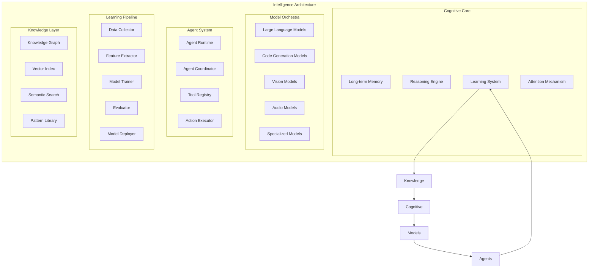

# Omnitron Intelligence System
**Cognitive Architecture & AI Orchestration**

Version: 1.0.0
Date: 2025-10-15
Status: Technical Specification

---

## Overview

The Omnitron Intelligence System transforms the platform from a development environment into a cognitive partner. It provides pervasive intelligence that learns from every interaction, optimizes every operation, and evolves with usage. This isn't just AI integration - it's a fundamental rethinking of how intelligence and computation interweave.



---

## Cognitive Core

### 1. Memory System

Hierarchical memory that mirrors human cognitive architecture.

```typescript
interface MemorySystem {
  // Working Memory (immediate context)
  working: {
    capacity: number; // Miller's 7±2
    items: MemoryItem[];

    add(item: any): void;
    get(query: Query): MemoryItem[];
    prune(): void; // Remove least relevant
    consolidate(): void; // Move to short-term
  };

  // Short-term Memory (session context)
  shortTerm: {
    duration: Duration; // Hours to days
    storage: TemporalStore;

    store(item: MemoryItem): void;
    retrieve(query: Query): MemoryItem[];
    decay(): void; // Natural forgetting
    rehearse(item: MemoryItem): void; // Strengthen memory
  };

  // Long-term Memory (persistent knowledge)
  longTerm: {
    semantic: SemanticMemory; // Facts, concepts
    episodic: EpisodicMemory; // Events, experiences
    procedural: ProceduralMemory; // Skills, procedures

    encode(experience: Experience): void;
    recall(cue: Cue): Memory[];
    consolidate(): void; // Sleep-like consolidation
    forget(threshold: number): void; // Adaptive forgetting
  };

  // Meta-memory (memory about memory)
  meta: {
    confidence(memory: Memory): number;
    source(memory: Memory): MemorySource;
    associations(memory: Memory): Memory[];
    importance(memory: Memory): number;
  };
}

// Memory implementation
@Injectable()
export class CognitiveMemory implements MemorySystem {
  constructor(
    private readonly vector: VectorStore,
    private readonly graph: GraphDatabase,
    private readonly storage: PersistentStorage
  ) {}

  // Encode experience into memory
  async encode(experience: Experience): Promise<void> {
    // Extract features
    const features = await this.extractFeatures(experience);

    // Generate embedding
    const embedding = await this.generateEmbedding(features);

    // Store in appropriate memory type
    if (experience.type === 'fact') {
      await this.longTerm.semantic.store({
        content: experience.content,
        embedding,
        confidence: experience.confidence,
        source: experience.source,
        timestamp: new Date()
      });
    } else if (experience.type === 'event') {
      await this.longTerm.episodic.store({
        event: experience.content,
        context: experience.context,
        embedding,
        emotional_valence: experience.emotion,
        timestamp: experience.timestamp
      });
    } else if (experience.type === 'skill') {
      await this.longTerm.procedural.store({
        procedure: experience.content,
        steps: experience.steps,
        conditions: experience.conditions,
        outcomes: experience.outcomes
      });
    }

    // Create associations
    await this.createAssociations(experience, embedding);

    // Update memory graph
    await this.updateMemoryGraph(experience);
  }

  // Recall memories based on cue
  async recall(cue: Cue): Promise<Memory[]> {
    // Generate cue embedding
    const cueEmbedding = await this.generateEmbedding(cue);

    // Search in vector space
    const similar = await this.vector.search(cueEmbedding, {
      limit: 20,
      threshold: 0.7
    });

    // Activate spreading in graph
    const associated = await this.spreadingActivation(similar);

    // Apply attention mechanism
    const attended = await this.applyAttention(associated, cue);

    // Re-rank by relevance
    const ranked = this.rankByRelevance(attended, cue);

    return ranked;
  }

  // Consolidation process (like sleep)
  async consolidate(): Promise<void> {
    // Get recent memories
    const recent = await this.getRecentMemories();

    // Identify important patterns
    const patterns = await this.extractPatterns(recent);

    // Strengthen important memories
    for (const pattern of patterns) {
      if (pattern.importance > 0.8) {
        await this.strengthen(pattern.memories);
      }
    }

    // Prune weak memories
    await this.pruneWeakMemories();

    // Create abstract concepts
    await this.abstractConcepts(patterns);

    // Update indices
    await this.reindexMemories();
  }

  private async spreadingActivation(
    seeds: Memory[]
  ): Promise<Memory[]> {
    const activated = new Set<Memory>(seeds);
    const queue = [...seeds];
    const visited = new Set<string>();

    while (queue.length > 0) {
      const current = queue.shift()!;
      if (visited.has(current.id)) continue;
      visited.add(current.id);

      // Get connected memories
      const connections = await this.graph.getConnections(current.id);

      for (const conn of connections) {
        const strength = conn.weight * current.activation;
        if (strength > 0.3) {
          const memory = await this.loadMemory(conn.target);
          memory.activation = strength;
          activated.add(memory);
          queue.push(memory);
        }
      }
    }

    return Array.from(activated);
  }
}
```

### 2. Reasoning Engine

Multi-strategy reasoning system that combines different reasoning approaches.

```typescript
interface ReasoningEngine {
  // Deductive reasoning (top-down)
  deduce(premises: Proposition[], query: Query): Conclusion;

  // Inductive reasoning (bottom-up)
  induce(observations: Observation[]): Hypothesis[];

  // Abductive reasoning (best explanation)
  abduce(facts: Fact[], goal: Goal): Explanation;

  // Analogical reasoning (similarity)
  analogize(source: Domain, target: Domain): Mapping;

  // Causal reasoning (cause-effect)
  causalize(events: Event[]): CausalGraph;

  // Probabilistic reasoning (uncertainty)
  probabilize(evidence: Evidence[]): Distribution;

  // Meta-reasoning (reasoning about reasoning)
  metaReason(problem: Problem): ReasoningStrategy;
}

@Injectable()
export class CognitiveReasoning implements ReasoningEngine {
  constructor(
    private readonly knowledge: KnowledgeBase,
    private readonly models: ModelOrchestrator,
    private readonly memory: MemorySystem
  ) {}

  // Solve complex problems using multiple strategies
  async solve(problem: Problem): Promise<Solution> {
    // Analyze problem type
    const analysis = await this.analyzeProblem(problem);

    // Select reasoning strategies
    const strategies = await this.selectStrategies(analysis);

    // Apply strategies in parallel
    const solutions = await Promise.all(
      strategies.map(strategy =>
        this.applyStrategy(strategy, problem)
      )
    );

    // Combine solutions
    const combined = await this.combineSolutions(solutions);

    // Verify solution
    const verified = await this.verifySolution(combined, problem);

    // Learn from solution
    await this.learnFromSolution(problem, verified);

    return verified;
  }

  // Chain-of-thought reasoning
  async chainOfThought(
    question: string,
    context?: Context
  ): Promise<Reasoning> {
    const steps: ReasoningStep[] = [];

    // Break down the question
    const subquestions = await this.decompose(question);

    for (const subq of subquestions) {
      // Retrieve relevant knowledge
      const knowledge = await this.retrieveKnowledge(subq, context);

      // Generate reasoning step
      const step = await this.generateStep(subq, knowledge);
      steps.push(step);

      // Update context with new information
      context = this.updateContext(context, step);
    }

    // Synthesize final answer
    const answer = await this.synthesize(steps);

    return {
      question,
      steps,
      answer,
      confidence: this.calculateConfidence(steps)
    };
  }

  // Causal reasoning with intervention
  async causalIntervention(
    model: CausalModel,
    intervention: Intervention
  ): Promise<Outcome> {
    // Clone causal graph
    const intervened = model.clone();

    // Apply intervention (do-calculus)
    intervened.intervene(intervention.variable, intervention.value);

    // Propagate effects
    const effects = await this.propagateEffects(intervened);

    // Calculate counterfactuals
    const counterfactuals = await this.computeCounterfactuals(
      model,
      intervened
    );

    return {
      direct_effects: effects.direct,
      total_effects: effects.total,
      counterfactuals
    };
  }

  // Probabilistic reasoning with Bayesian inference
  async bayesianInference(
    prior: Distribution,
    evidence: Evidence[]
  ): Promise<Posterior> {
    let posterior = prior;

    for (const e of evidence) {
      // Calculate likelihood
      const likelihood = await this.likelihood(e, posterior);

      // Update posterior (Bayes' rule)
      posterior = this.updatePosterior(posterior, likelihood, e);
    }

    return {
      distribution: posterior,
      confidence_intervals: this.calculateCI(posterior),
      map_estimate: this.maximumAPosteriori(posterior)
    };
  }

  // Analogical reasoning for transfer learning
  async analogicalTransfer(
    source: Problem,
    target: Problem
  ): Promise<Solution> {
    // Find structural mapping
    const mapping = await this.structureMapping(source, target);

    // Retrieve source solution
    const sourceSolution = await this.memory.recall({
      type: 'solution',
      problem: source
    });

    // Adapt solution to target
    const adapted = await this.adaptSolution(
      sourceSolution[0],
      mapping
    );

    // Verify adaptation
    const verified = await this.verifyAdaptation(adapted, target);

    return verified;
  }
}
```

### 3. Learning System

Continuous learning from every interaction.

```typescript
interface LearningSystem {
  // Online learning (real-time)
  online: {
    update(example: Example): void;
    predict(input: any): Prediction;
    adapt(feedback: Feedback): void;
  };

  // Batch learning (periodic)
  batch: {
    train(dataset: Dataset): Model;
    evaluate(model: Model, testset: Dataset): Metrics;
    deploy(model: Model): void;
  };

  // Meta-learning (learning to learn)
  meta: {
    learnTask(task: Task, fewShots: Example[]): TaskModel;
    transfer(source: TaskModel, target: Task): TaskModel;
    optimize(objective: Objective): Hyperparameters;
  };

  // Reinforcement learning (from interaction)
  reinforcement: {
    act(state: State): Action;
    observe(reward: Reward, nextState: State): void;
    updatePolicy(): void;
  };

  // Curriculum learning (progressive difficulty)
  curriculum: {
    selectNext(): Task;
    assessProgress(): Progress;
    adjustDifficulty(): void;
  };
}

@Injectable()
export class CognitiveLearning implements LearningSystem {
  private readonly models = new Map<string, LearnableModel>();
  private readonly experience = new ExperienceBuffer(10000);

  // Learn from user interactions
  async learnFromInteraction(
    interaction: UserInteraction
  ): Promise<void> {
    // Extract learning signal
    const signal = this.extractSignal(interaction);

    // Update relevant models
    for (const [name, model] of this.models) {
      if (model.isRelevant(interaction)) {
        await model.update(signal);
      }
    }

    // Store experience
    this.experience.add({
      state: interaction.state,
      action: interaction.action,
      outcome: interaction.outcome,
      reward: this.calculateReward(interaction)
    });

    // Trigger batch learning if needed
    if (this.experience.size() > 1000) {
      await this.batchLearn();
    }
  }

  // Learn new Flow from examples
  async learnFlow(
    examples: FlowExample[]
  ): Promise<Flow> {
    // Extract patterns
    const patterns = await this.extractFlowPatterns(examples);

    // Generate Flow structure
    const structure = await this.synthesizeStructure(patterns);

    // Learn transformations
    const transformations = await this.learnTransformations(
      examples.map(e => ({
        input: e.input,
        output: e.output
      }))
    );

    // Compose learned Flow
    const flow = this.composeFlow(structure, transformations);

    // Verify with examples
    await this.verifyFlow(flow, examples);

    return flow;
  }

  // Active learning - query for labels
  async activeLearn(
    unlabeled: Data[],
    budget: number
  ): Promise<LabelRequest[]> {
    const requests: LabelRequest[] = [];

    // Calculate uncertainty for each sample
    const uncertainties = await Promise.all(
      unlabeled.map(async data => ({
        data,
        uncertainty: await this.calculateUncertainty(data)
      }))
    );

    // Select most informative samples
    const selected = uncertainties
      .sort((a, b) => b.uncertainty - a.uncertainty)
      .slice(0, budget)
      .map(item => ({
        data: item.data,
        reason: this.explainSelection(item)
      }));

    return selected;
  }

  // Continual learning without forgetting
  async continualLearn(
    newTask: Task,
    oldTasks: Task[]
  ): Promise<void> {
    // Save important weights (elastic weight consolidation)
    const importance = await this.calculateImportance(oldTasks);

    // Train on new task with regularization
    await this.trainWithEWC(newTask, importance);

    // Generate pseudo-examples from old tasks
    const pseudoExamples = await this.generatePseudoExamples(oldTasks);

    // Rehearsal training
    await this.rehearsalTraining(newTask, pseudoExamples);

    // Update task memory
    await this.updateTaskMemory(newTask);
  }

  // Self-supervised learning
  async selfSupervise(
    data: UnlabeledData[]
  ): Promise<Model> {
    // Create pretext tasks
    const pretextTasks = [
      this.createMaskingTask(data),
      this.createContrastiveTask(data),
      this.createPredictionTask(data)
    ];

    // Train on pretext tasks
    const models = await Promise.all(
      pretextTasks.map(task => this.trainPretext(task))
    );

    // Combine learned representations
    const combined = await this.combineRepresentations(models);

    return combined;
  }
}
```

### 4. Attention Mechanism

Focusing computational resources on what matters.

```typescript
interface AttentionMechanism {
  // Self-attention (internal focus)
  self(input: Tensor): Tensor;

  // Cross-attention (external focus)
  cross(query: Tensor, keys: Tensor, values: Tensor): Tensor;

  // Multi-head attention (multiple perspectives)
  multiHead(input: Tensor, heads: number): Tensor;

  // Adaptive attention (dynamic focus)
  adaptive(input: Tensor, context: Context): Tensor;

  // Sparse attention (efficient focus)
  sparse(input: Tensor, sparsity: number): Tensor;
}

@Injectable()
export class CognitiveAttention implements AttentionMechanism {
  // Implement transformer-style attention
  async attendToFlow(
    flow: Flow,
    context: ExecutionContext
  ): Promise<AttentionWeights> {
    // Encode flow nodes
    const encodings = await this.encodeNodes(flow.nodes);

    // Calculate attention scores
    const scores = await this.calculateScores(encodings, context);

    // Apply softmax
    const weights = this.softmax(scores);

    // Focus on important nodes
    const focused = await this.applyWeights(flow, weights);

    return {
      weights,
      focused,
      explanation: this.explainAttention(weights, flow)
    };
  }

  // Attention-guided execution
  async guidedExecution(
    flow: Flow,
    input: any
  ): Promise<ExecutionResult> {
    // Get attention weights
    const attention = await this.attendToFlow(flow, { input });

    // Prioritize execution based on attention
    const prioritized = this.prioritizeNodes(flow, attention);

    // Execute with attention-guided scheduling
    const result = await this.executeWithAttention(
      prioritized,
      input,
      attention
    );

    return result;
  }
}
```

---

## Model Orchestra

### 1. Model Registry

Centralized management of all AI models.

```typescript
interface ModelRegistry {
  // Model lifecycle
  register(model: ModelDefinition): Promise<string>;
  load(modelId: string): Promise<ModelInstance>;
  unload(modelId: string): Promise<void>;
  update(modelId: string, version: string): Promise<void>;

  // Model discovery
  search(criteria: SearchCriteria): Promise<ModelInfo[]>;
  recommend(task: Task): Promise<ModelInfo[]>;

  // Model composition
  ensemble(models: string[]): Promise<EnsembleModel>;
  chain(models: string[]): Promise<ChainedModel>;

  // Model monitoring
  getMetrics(modelId: string): Promise<ModelMetrics>;
  getHealth(modelId: string): Promise<HealthStatus>;
}

@Injectable()
export class ModelOrchestrator {
  private readonly models = new Map<string, ModelInstance>();
  private readonly registry = new ModelRegistry();

  // Dynamic model loading based on task
  async selectModel(task: Task): Promise<ModelInstance> {
    // Analyze task requirements
    const requirements = this.analyzeRequirements(task);

    // Find matching models
    const candidates = await this.registry.search(requirements);

    // Score candidates
    const scored = await this.scoreModels(candidates, task);

    // Select best model
    const best = scored[0];

    // Load if not already loaded
    if (!this.models.has(best.id)) {
      await this.loadModel(best.id);
    }

    return this.models.get(best.id)!;
  }

  // Multi-modal model orchestration
  async processMultiModal(
    input: MultiModalInput
  ): Promise<MultiModalOutput> {
    const tasks = [];

    if (input.text) {
      tasks.push(this.processText(input.text));
    }
    if (input.image) {
      tasks.push(this.processImage(input.image));
    }
    if (input.audio) {
      tasks.push(this.processAudio(input.audio));
    }
    if (input.video) {
      tasks.push(this.processVideo(input.video));
    }

    const results = await Promise.all(tasks);

    // Fuse multi-modal outputs
    return this.fuseOutputs(results);
  }

  // Adaptive model selection
  async adaptiveInference(
    input: any,
    constraints?: Constraints
  ): Promise<any> {
    // Start with fast model
    const fastModel = await this.selectModel({
      type: 'inference',
      latency: 'low'
    });

    const fastResult = await fastModel.predict(input);

    // Check if we need more accuracy
    if (fastResult.confidence < 0.8 && !constraints?.latency) {
      // Use slower but more accurate model
      const accurateModel = await this.selectModel({
        type: 'inference',
        accuracy: 'high'
      });

      return accurateModel.predict(input);
    }

    return fastResult;
  }

  // Model ensemble for robustness
  async ensembleInference(
    input: any,
    models: string[]
  ): Promise<any> {
    // Run all models in parallel
    const predictions = await Promise.all(
      models.map(async modelId => {
        const model = await this.loadModel(modelId);
        return model.predict(input);
      })
    );

    // Combine predictions
    return this.combinePredictions(predictions, {
      strategy: 'weighted_average',
      weights: await this.calculateWeights(models)
    });
  }
}
```

### 2. Language Models

Advanced language understanding and generation.

```typescript
interface LanguageModels {
  // Text generation
  generate(prompt: string, options?: GenerationOptions): Promise<string>;

  // Text understanding
  understand(text: string): Promise<Understanding>;

  // Code generation
  generateCode(spec: string, language: string): Promise<string>;

  // Translation
  translate(text: string, from: string, to: string): Promise<string>;

  // Summarization
  summarize(text: string, style?: SummarizationStyle): Promise<string>;

  // Question answering
  answer(question: string, context: string): Promise<string>;
}

@Injectable()
export class LanguageModelService {
  // Intelligent code generation
  async generateFlow(
    description: string,
    examples?: Example[]
  ): Promise<Flow> {
    // Generate code from description
    const code = await this.generateCode({
      description,
      examples,
      language: 'typescript',
      framework: 'omnitron'
    });

    // Parse into Flow
    const flow = await this.parseToFlow(code);

    // Validate and optimize
    const optimized = await this.optimizeFlow(flow);

    return optimized;
  }

  // Context-aware completion
  async completeInContext(
    partial: string,
    context: CodeContext
  ): Promise<Completion[]> {
    // Analyze context
    const analysis = await this.analyzeContext(context);

    // Generate completions
    const completions = await this.model.complete({
      prompt: this.buildPrompt(partial, analysis),
      n: 5,
      temperature: 0.7
    });

    // Rank by relevance
    const ranked = await this.rankCompletions(
      completions,
      context
    );

    return ranked;
  }

  // Intelligent refactoring
  async refactor(
    code: string,
    instruction: string
  ): Promise<RefactoredCode> {
    // Understand the code
    const understanding = await this.understand(code);

    // Generate refactoring plan
    const plan = await this.planRefactoring(
      understanding,
      instruction
    );

    // Execute refactoring
    const refactored = await this.executeRefactoring(
      code,
      plan
    );

    // Verify correctness
    await this.verifyRefactoring(code, refactored);

    return {
      code: refactored,
      changes: plan.changes,
      explanation: plan.explanation
    };
  }
}
```

### 3. Vision Models

Visual understanding and generation.

```typescript
interface VisionModels {
  // Image understanding
  analyze(image: Image): Promise<ImageAnalysis>;
  detect(image: Image, objects: string[]): Promise<Detection[]>;
  segment(image: Image): Promise<Segmentation>;

  // Image generation
  generate(prompt: string): Promise<Image>;
  edit(image: Image, instruction: string): Promise<Image>;

  // OCR and document understanding
  extractText(image: Image): Promise<string>;
  understandDocument(document: Image[]): Promise<DocumentUnderstanding>;
}

@Injectable()
export class VisionModelService {
  // Visual Flow design
  async designFlowFromSketch(
    sketch: Image
  ): Promise<Flow> {
    // Detect components in sketch
    const components = await this.detectComponents(sketch);

    // Extract connections
    const connections = await this.extractConnections(sketch);

    // Recognize annotations
    const annotations = await this.recognizeAnnotations(sketch);

    // Generate Flow structure
    const flow = await this.generateFlowFromVisual({
      components,
      connections,
      annotations
    });

    return flow;
  }

  // UI generation from mockup
  async generateUIFromMockup(
    mockup: Image
  ): Promise<UIComponent> {
    // Analyze layout
    const layout = await this.analyzeLayout(mockup);

    // Identify components
    const components = await this.identifyUIComponents(mockup);

    // Extract styling
    const styles = await this.extractStyles(mockup);

    // Generate component code
    const code = await this.generateUICode({
      layout,
      components,
      styles
    });

    return code;
  }
}
```

---

## Agent System

### 1. Agent Runtime

Autonomous agents that can plan and execute complex tasks.

```typescript
interface Agent {
  id: string;
  name: string;
  role: string;
  capabilities: Capability[];
  tools: Tool[];
  memory: AgentMemory;

  // Agent actions
  plan(goal: Goal): Promise<Plan>;
  execute(plan: Plan): Promise<Result>;
  observe(environment: Environment): Promise<Observation>;
  learn(experience: Experience): Promise<void>;
  communicate(message: Message, recipient: Agent): Promise<Response>;
}

@Injectable()
export class AgentRuntime {
  private readonly agents = new Map<string, Agent>();

  // Create specialized agent
  async createAgent(config: AgentConfig): Promise<Agent> {
    const agent = new AutonomousAgent({
      id: generateId(),
      name: config.name,
      role: config.role,
      model: await this.selectModelForRole(config.role),
      tools: await this.loadTools(config.tools),
      memory: new AgentMemory(config.memorySize),
      personality: config.personality
    });

    // Initialize agent
    await agent.initialize();

    // Register agent
    this.agents.set(agent.id, agent);

    return agent;
  }

  // Multi-agent collaboration
  async collaborate(
    goal: Goal,
    agents: Agent[]
  ): Promise<CollaborationResult> {
    // Create collaboration space
    const space = new CollaborationSpace(goal);

    // Assign roles
    const assignments = await this.assignRoles(goal, agents);

    // Execute collaboration
    const coordinator = new AgentCoordinator();

    return coordinator.orchestrate({
      goal,
      agents: assignments,
      space,
      strategy: 'consensus',
      timeout: 300000 // 5 minutes
    });
  }

  // Agent swarm for complex tasks
  async swarm(task: ComplexTask): Promise<SwarmResult> {
    // Decompose task
    const subtasks = await this.decomposeTask(task);

    // Spawn specialized agents
    const agents = await Promise.all(
      subtasks.map(subtask =>
        this.createAgent({
          name: `agent-${subtask.id}`,
          role: subtask.type,
          tools: subtask.requiredTools
        })
      )
    );

    // Execute in swarm
    const swarm = new AgentSwarm(agents);

    return swarm.execute({
      task,
      subtasks,
      coordination: 'distributed',
      communication: 'broadcast'
    });
  }
}

// Example specialized agent
export class FlowDesignAgent extends AutonomousAgent {
  async designFlow(
    requirements: Requirements
  ): Promise<Flow> {
    // Understand requirements
    const understanding = await this.understand(requirements);

    // Generate design plan
    const plan = await this.plan({
      goal: 'design_flow',
      constraints: requirements.constraints,
      context: understanding
    });

    // Iterate on design
    let design = await this.initialDesign(understanding);

    for (const step of plan.steps) {
      design = await this.refineDesign(design, step);

      // Get feedback
      const feedback = await this.requestFeedback(design);

      if (feedback.approved) break;

      // Learn from feedback
      await this.learn({ design, feedback });
    }

    return design;
  }

  private async refineDesign(
    design: Flow,
    refinement: RefinementStep
  ): Promise<Flow> {
    switch (refinement.type) {
      case 'optimize_performance':
        return this.optimizePerformance(design);

      case 'improve_readability':
        return this.improveReadability(design);

      case 'add_error_handling':
        return this.addErrorHandling(design);

      case 'enhance_modularity':
        return this.enhanceModularity(design);

      default:
        return design;
    }
  }
}
```

### 2. Tool Registry

Tools that agents can use to interact with the world.

```typescript
interface Tool {
  name: string;
  description: string;
  parameters: ParameterSchema;
  execute(params: any): Promise<any>;

  // Tool metadata
  cost: number; // Computational cost
  reliability: number; // Success rate
  latency: number; // Expected time
}

@Injectable()
export class ToolRegistry {
  private readonly tools = new Map<string, Tool>();

  constructor() {
    // Register built-in tools
    this.registerBuiltinTools();
  }

  private registerBuiltinTools() {
    // File system tools
    this.register({
      name: 'read_file',
      description: 'Read contents of a file',
      parameters: {
        path: { type: 'string', required: true }
      },
      execute: async ({ path }) => {
        return fs.readFile(path, 'utf-8');
      }
    });

    // Code execution tools
    this.register({
      name: 'execute_code',
      description: 'Execute code in a sandboxed environment',
      parameters: {
        code: { type: 'string', required: true },
        language: { type: 'string', required: true }
      },
      execute: async ({ code, language }) => {
        return this.sandbox.execute(code, language);
      }
    });

    // Web search tools
    this.register({
      name: 'search_web',
      description: 'Search the web for information',
      parameters: {
        query: { type: 'string', required: true },
        limit: { type: 'number', default: 10 }
      },
      execute: async ({ query, limit }) => {
        return this.searchEngine.search(query, limit);
      }
    });

    // Database tools
    this.register({
      name: 'query_database',
      description: 'Query database for information',
      parameters: {
        query: { type: 'string', required: true },
        database: { type: 'string', required: true }
      },
      execute: async ({ query, database }) => {
        return this.db.query(query, database);
      }
    });

    // Flow manipulation tools
    this.register({
      name: 'create_flow',
      description: 'Create a new Flow',
      parameters: {
        definition: { type: 'object', required: true }
      },
      execute: async ({ definition }) => {
        return this.flowEngine.create(definition);
      }
    });

    // Communication tools
    this.register({
      name: 'send_message',
      description: 'Send message to another agent or user',
      parameters: {
        recipient: { type: 'string', required: true },
        message: { type: 'string', required: true }
      },
      execute: async ({ recipient, message }) => {
        return this.messenger.send(recipient, message);
      }
    });
  }

  // Dynamic tool creation
  async createTool(spec: ToolSpecification): Promise<Tool> {
    // Generate tool implementation
    const implementation = await this.generateImplementation(spec);

    // Test tool
    await this.testTool(implementation);

    // Register tool
    this.register(implementation);

    return implementation;
  }

  // Tool recommendation for task
  async recommendTools(task: Task): Promise<Tool[]> {
    // Analyze task requirements
    const requirements = await this.analyzeTaskRequirements(task);

    // Find matching tools
    const matches = Array.from(this.tools.values()).filter(tool =>
      this.matchesRequirements(tool, requirements)
    );

    // Rank by relevance
    const ranked = this.rankTools(matches, task);

    return ranked;
  }
}
```

---

## Knowledge Management

### 1. Knowledge Graph

Structured knowledge representation.

```typescript
interface KnowledgeGraph {
  // Node operations
  addNode(node: KnowledgeNode): Promise<string>;
  getNode(id: string): Promise<KnowledgeNode>;
  updateNode(id: string, updates: Partial<KnowledgeNode>): Promise<void>;
  deleteNode(id: string): Promise<void>;

  // Edge operations
  addEdge(edge: KnowledgeEdge): Promise<string>;
  getEdges(nodeId: string): Promise<KnowledgeEdge[]>;

  // Graph queries
  query(sparql: string): Promise<QueryResult>;
  traverse(start: string, pattern: TraversalPattern): Promise<Path[]>;
  shortestPath(from: string, to: string): Promise<Path>;

  // Graph algorithms
  pageRank(): Promise<Map<string, number>>;
  communityDetection(): Promise<Community[]>;
  centrality(type: CentralityType): Promise<Map<string, number>>;
}

@Injectable()
export class KnowledgeGraphService {
  // Build knowledge from code
  async extractKnowledgeFromCode(
    code: string
  ): Promise<KnowledgeGraph> {
    // Parse code
    const ast = await this.parseCode(code);

    // Extract entities
    const entities = this.extractEntities(ast);

    // Extract relationships
    const relationships = this.extractRelationships(ast);

    // Build graph
    const graph = new KnowledgeGraph();

    for (const entity of entities) {
      await graph.addNode({
        type: entity.type,
        name: entity.name,
        properties: entity.properties
      });
    }

    for (const rel of relationships) {
      await graph.addEdge({
        from: rel.from,
        to: rel.to,
        type: rel.type,
        properties: rel.properties
      });
    }

    // Enrich with inferred knowledge
    await this.enrichGraph(graph);

    return graph;
  }

  // Query knowledge for insights
  async queryKnowledge(
    question: string
  ): Promise<Answer> {
    // Parse question into SPARQL
    const query = await this.parseToSPARQL(question);

    // Execute query
    const results = await this.graph.query(query);

    // Format answer
    const answer = await this.formatAnswer(results, question);

    return answer;
  }

  // Knowledge reasoning
  async reason(
    facts: Fact[],
    rules: Rule[]
  ): Promise<Inference[]> {
    // Add facts to knowledge base
    for (const fact of facts) {
      await this.addFact(fact);
    }

    // Apply rules iteratively
    let newInferences = true;
    const inferences: Inference[] = [];

    while (newInferences) {
      newInferences = false;

      for (const rule of rules) {
        const matches = await this.matchRule(rule);

        for (const match of matches) {
          const inference = await this.applyRule(rule, match);

          if (inference && !this.hasInference(inferences, inference)) {
            inferences.push(inference);
            await this.addFact(inference.conclusion);
            newInferences = true;
          }
        }
      }
    }

    return inferences;
  }
}
```

### 2. Vector Index

Semantic search and similarity.

```typescript
interface VectorIndex {
  // Indexing
  index(content: string, metadata: any): Promise<string>;
  batchIndex(items: IndexItem[]): Promise<string[]>;

  // Search
  search(query: string, k: number): Promise<SearchResult[]>;
  searchByVector(vector: Float32Array, k: number): Promise<SearchResult[]>;

  // Similarity
  similarity(id1: string, id2: string): Promise<number>;
  findSimilar(id: string, k: number): Promise<SimilarityResult[]>;

  // Management
  update(id: string, content: string): Promise<void>;
  delete(id: string): Promise<void>;
  optimize(): Promise<void>;
}

@Injectable()
export class SemanticSearchService {
  // Hybrid search combining vector and keyword
  async hybridSearch(
    query: string,
    options?: SearchOptions
  ): Promise<SearchResult[]> {
    // Vector search
    const vectorResults = await this.vectorSearch(query, options);

    // Keyword search
    const keywordResults = await this.keywordSearch(query, options);

    // Graph search
    const graphResults = await this.graphSearch(query, options);

    // Combine and re-rank
    const combined = await this.combineResults([
      { results: vectorResults, weight: 0.5 },
      { results: keywordResults, weight: 0.3 },
      { results: graphResults, weight: 0.2 }
    ]);

    // Apply filters
    const filtered = this.applyFilters(combined, options?.filters);

    return filtered;
  }

  // Semantic code search
  async searchCode(
    query: string,
    language?: string
  ): Promise<CodeSearchResult[]> {
    // Generate code-specific embedding
    const embedding = await this.codeEmbedding.encode(query);

    // Search in code index
    const results = await this.codeIndex.search(embedding, 20);

    // Re-rank with code-specific signals
    const reranked = await this.rerankCode(results, query, {
      syntaxSimilarity: 0.3,
      semanticSimilarity: 0.5,
      structuralSimilarity: 0.2
    });

    return reranked;
  }
}
```

### 3. Pattern Library

Reusable patterns and solutions.

```typescript
interface PatternLibrary {
  // Pattern management
  addPattern(pattern: Pattern): Promise<string>;
  getPattern(id: string): Promise<Pattern>;
  searchPatterns(criteria: SearchCriteria): Promise<Pattern[]>;

  // Pattern matching
  matchPattern(code: string): Promise<PatternMatch[]>;
  suggestPattern(context: Context): Promise<Pattern[]>;

  // Pattern application
  applyPattern(pattern: Pattern, target: any): Promise<any>;
  composePatterns(patterns: Pattern[]): Promise<ComposedPattern>;
}

@Injectable()
export class PatternService {
  // Learn patterns from examples
  async learnPattern(
    examples: Example[]
  ): Promise<Pattern> {
    // Extract common structure
    const structure = await this.extractCommonStructure(examples);

    // Identify variables
    const variables = await this.identifyVariables(structure);

    // Generate pattern template
    const template = await this.generateTemplate(structure, variables);

    // Create pattern
    const pattern = {
      id: generateId(),
      name: await this.generateName(template),
      description: await this.generateDescription(template),
      template,
      variables,
      examples,
      usage: 0,
      rating: 0
    };

    // Store pattern
    await this.library.addPattern(pattern);

    return pattern;
  }

  // Recommend patterns for task
  async recommendPatterns(
    task: Task
  ): Promise<PatternRecommendation[]> {
    // Analyze task
    const analysis = await this.analyzeTask(task);

    // Find relevant patterns
    const patterns = await this.library.searchPatterns({
      domain: analysis.domain,
      complexity: analysis.complexity,
      requirements: analysis.requirements
    });

    // Score patterns
    const scored = await this.scorePatterns(patterns, task);

    // Generate recommendations
    return scored.map(({ pattern, score }) => ({
      pattern,
      score,
      explanation: this.explainRecommendation(pattern, task),
      example: this.generateExample(pattern, task)
    }));
  }
}
```

---

## Learning Pipeline

### 1. Data Collection

Continuous data collection from all interactions.

```typescript
interface DataCollector {
  // Collection strategies
  collect(source: DataSource): AsyncIterator<DataPoint>;
  batch(points: DataPoint[]): Dataset;

  // Data quality
  validate(data: DataPoint): ValidationResult;
  clean(data: DataPoint): DataPoint;
  augment(data: DataPoint): DataPoint[];

  // Privacy & compliance
  anonymize(data: DataPoint): DataPoint;
  checkCompliance(data: DataPoint): ComplianceStatus;
}

@Injectable()
export class LearningDataCollector {
  // Collect from user interactions
  async collectInteractionData(
    interaction: UserInteraction
  ): Promise<void> {
    // Extract features
    const features = await this.extractFeatures(interaction);

    // Check privacy settings
    if (await this.checkPrivacy(interaction.userId)) {
      // Anonymize sensitive data
      const anonymized = await this.anonymize(features);

      // Store for learning
      await this.store({
        type: 'interaction',
        features: anonymized,
        timestamp: new Date(),
        context: interaction.context
      });
    }

    // Real-time learning
    if (this.shouldLearnImmediately(interaction)) {
      await this.immediateLearn(features);
    }
  }

  // Active learning data collection
  async activeCollect(): Promise<void> {
    // Identify areas of uncertainty
    const uncertainAreas = await this.identifyUncertainty();

    // Generate queries
    const queries = await this.generateQueries(uncertainAreas);

    // Request labels
    for (const query of queries) {
      const label = await this.requestLabel(query);

      if (label) {
        await this.store({
          type: 'active',
          query,
          label,
          timestamp: new Date()
        });
      }
    }
  }
}
```

### 2. Model Training

Continuous model improvement.

```typescript
interface ModelTrainer {
  // Training strategies
  train(dataset: Dataset, config: TrainingConfig): Promise<Model>;
  finetune(model: Model, dataset: Dataset): Promise<Model>;
  distill(teacher: Model, config: DistillationConfig): Promise<Model>;

  // Optimization
  optimize(model: Model, objective: Objective): Promise<Model>;
  prune(model: Model, sparsity: number): Promise<Model>;
  quantize(model: Model, bits: number): Promise<Model>;

  // Validation
  validate(model: Model, valset: Dataset): Promise<Metrics>;
  crossValidate(model: Model, dataset: Dataset, folds: number): Promise<Metrics>;
}

@Injectable()
export class ModelTrainingPipeline {
  // Automated training pipeline
  async trainPipeline(
    task: TrainingTask
  ): Promise<TrainedModel> {
    // Prepare data
    const data = await this.prepareData(task.dataset);

    // Split data
    const { train, val, test } = await this.splitData(data, {
      train: 0.7,
      val: 0.15,
      test: 0.15
    });

    // Select architecture
    const architecture = await this.selectArchitecture(task);

    // Train model
    const model = await this.train({
      architecture,
      data: train,
      validation: val,
      epochs: task.epochs || 100,
      batchSize: task.batchSize || 32,
      optimizer: task.optimizer || 'adam',
      learningRate: task.learningRate || 0.001,
      callbacks: [
        new EarlyStopping({ patience: 10 }),
        new ModelCheckpoint({ saveBest: true }),
        new TensorBoard({ logDir: './logs' })
      ]
    });

    // Evaluate
    const metrics = await this.evaluate(model, test);

    // Optimize for deployment
    const optimized = await this.optimizeForDeployment(model);

    return {
      model: optimized,
      metrics,
      metadata: {
        task: task.name,
        trainedAt: new Date(),
        datasetSize: data.length,
        parameters: model.countParams()
      }
    };
  }

  // Continuous learning
  async continuousLearn(
    model: Model,
    stream: DataStream
  ): Promise<void> {
    const buffer = new DataBuffer(1000);

    for await (const data of stream) {
      buffer.add(data);

      if (buffer.isFull()) {
        // Create mini-batch
        const batch = buffer.flush();

        // Update model
        await this.updateModel(model, batch);

        // Validate periodically
        if (Math.random() < 0.1) {
          await this.validateOnline(model);
        }
      }
    }
  }
}
```

### 3. Model Deployment

Seamless model deployment and serving.

```typescript
interface ModelDeployer {
  // Deployment targets
  deployLocal(model: Model): Promise<LocalEndpoint>;
  deployCloud(model: Model, provider: CloudProvider): Promise<CloudEndpoint>;
  deployEdge(model: Model, devices: EdgeDevice[]): Promise<EdgeEndpoint[]>;

  // Serving strategies
  serve(model: Model, config: ServingConfig): Promise<ModelServer>;
  batchServe(model: Model, requests: Request[]): Promise<Response[]>;
  streamServe(model: Model, stream: RequestStream): AsyncIterator<Response>;

  // Management
  monitor(endpoint: Endpoint): Promise<ModelMetrics>;
  update(endpoint: Endpoint, model: Model): Promise<void>;
  rollback(endpoint: Endpoint): Promise<void>;
}

@Injectable()
export class ModelDeploymentService {
  // A/B testing deployment
  async deployAB(
    modelA: Model,
    modelB: Model,
    config: ABTestConfig
  ): Promise<ABDeployment> {
    // Deploy both models
    const endpointA = await this.deploy(modelA);
    const endpointB = await this.deploy(modelB);

    // Setup traffic splitting
    const router = new TrafficRouter({
      endpoints: { A: endpointA, B: endpointB },
      split: config.split || { A: 0.5, B: 0.5 }
    });

    // Setup monitoring
    const monitor = new ABMonitor({
      metrics: config.metrics,
      duration: config.duration
    });

    return {
      router,
      monitor,
      endpoints: { A: endpointA, B: endpointB }
    };
  }

  // Canary deployment
  async deployCanary(
    model: Model,
    config: CanaryConfig
  ): Promise<CanaryDeployment> {
    // Deploy new version
    const canary = await this.deploy(model);

    // Gradual rollout
    const rollout = new GradualRollout({
      start: config.initialPercentage || 5,
      increment: config.increment || 10,
      interval: config.interval || 3600000, // 1 hour
      maxPercentage: 100
    });

    // Health monitoring
    const healthCheck = new HealthMonitor({
      endpoint: canary,
      checks: config.healthChecks,
      threshold: config.threshold || 0.95
    });

    return {
      endpoint: canary,
      rollout,
      healthCheck
    };
  }
}
```

---

## Cognitive Capabilities

### 1. Understanding

Deep understanding of code, requirements, and intent.

```typescript
interface UnderstandingEngine {
  // Code understanding
  understandCode(code: string): Promise<CodeUnderstanding>;
  understandArchitecture(codebase: Codebase): Promise<ArchitectureUnderstanding>;

  // Requirement understanding
  understandRequirements(text: string): Promise<Requirements>;
  understandIntent(input: string): Promise<Intent>;

  // Context understanding
  understandContext(context: Context): Promise<ContextualUnderstanding>;
  understandDomain(artifacts: Artifact[]): Promise<DomainUnderstanding>;
}

@Injectable()
export class CognitiveUnderstanding {
  // Deep code understanding
  async understandFlow(flow: Flow): Promise<FlowUnderstanding> {
    // Structural analysis
    const structure = await this.analyzeStructure(flow);

    // Semantic analysis
    const semantics = await this.analyzeSemantics(flow);

    // Behavioral analysis
    const behavior = await this.analyzeBehavior(flow);

    // Intent inference
    const intent = await this.inferIntent(flow);

    // Quality assessment
    const quality = await this.assessQuality(flow);

    return {
      structure,
      semantics,
      behavior,
      intent,
      quality,
      insights: await this.generateInsights({
        structure,
        semantics,
        behavior,
        intent,
        quality
      }),
      suggestions: await this.generateSuggestions(flow)
    };
  }
}
```

### 2. Creativity

Generating novel solutions and designs.

```typescript
interface CreativityEngine {
  // Creative generation
  generate(constraints: Constraints): Promise<Creation>;
  combine(elements: Element[]): Promise<Combination>;
  mutate(original: any): Promise<Mutation>;

  // Creative exploration
  explore(space: DesignSpace): Promise<Exploration>;
  diverge(seed: any): Promise<Variations[]>;
  converge(options: any[]): Promise<Selection>;
}

@Injectable()
export class CognitiveCreativity {
  // Generate novel Flow designs
  async createNovelFlow(
    purpose: string
  ): Promise<Flow[]> {
    // Generate diverse initial designs
    const seeds = await this.generateSeeds(purpose, 10);

    // Evolve designs
    const evolved = await this.evolveDesigns(seeds, {
      generations: 20,
      populationSize: 50,
      mutationRate: 0.1,
      crossoverRate: 0.7,
      fitness: (design) => this.evaluateFitness(design, purpose)
    });

    // Select best designs
    const best = evolved
      .sort((a, b) => b.fitness - a.fitness)
      .slice(0, 5);

    return best.map(d => d.design);
  }
}
```

### 3. Problem Solving

Solving complex problems autonomously.

```typescript
interface ProblemSolver {
  // Problem analysis
  analyze(problem: Problem): Promise<ProblemAnalysis>;
  decompose(problem: Problem): Promise<SubProblem[]>;

  // Solution generation
  solve(problem: Problem): Promise<Solution>;
  optimize(solution: Solution): Promise<Solution>;

  // Solution validation
  verify(solution: Solution, problem: Problem): Promise<boolean>;
  explain(solution: Solution): Promise<Explanation>;
}

@Injectable()
export class CognitiveProblemSolver {
  // Solve complex system design problems
  async solveSystemDesign(
    requirements: SystemRequirements
  ): Promise<SystemDesign> {
    // Understand the problem
    const understanding = await this.understand(requirements);

    // Generate solution strategies
    const strategies = await this.generateStrategies(understanding);

    // Evaluate strategies
    const evaluated = await this.evaluateStrategies(strategies, requirements);

    // Select best strategy
    const bestStrategy = evaluated[0];

    // Implement solution
    const solution = await this.implementStrategy(bestStrategy);

    // Optimize solution
    const optimized = await this.optimize(solution, requirements);

    // Verify solution
    await this.verify(optimized, requirements);

    return optimized;
  }
}
```

---

## Next Steps

This intelligence system provides:
1. **Cognitive Core** - Memory, reasoning, learning, and attention
2. **Model Orchestra** - Multi-modal AI model management
3. **Agent System** - Autonomous agents for complex tasks
4. **Knowledge Management** - Graph, vector, and pattern-based knowledge
5. **Learning Pipeline** - Continuous improvement from interactions
6. **Cognitive Capabilities** - Understanding, creativity, and problem-solving

The next specification will detail the communication protocols using Netron RPC.