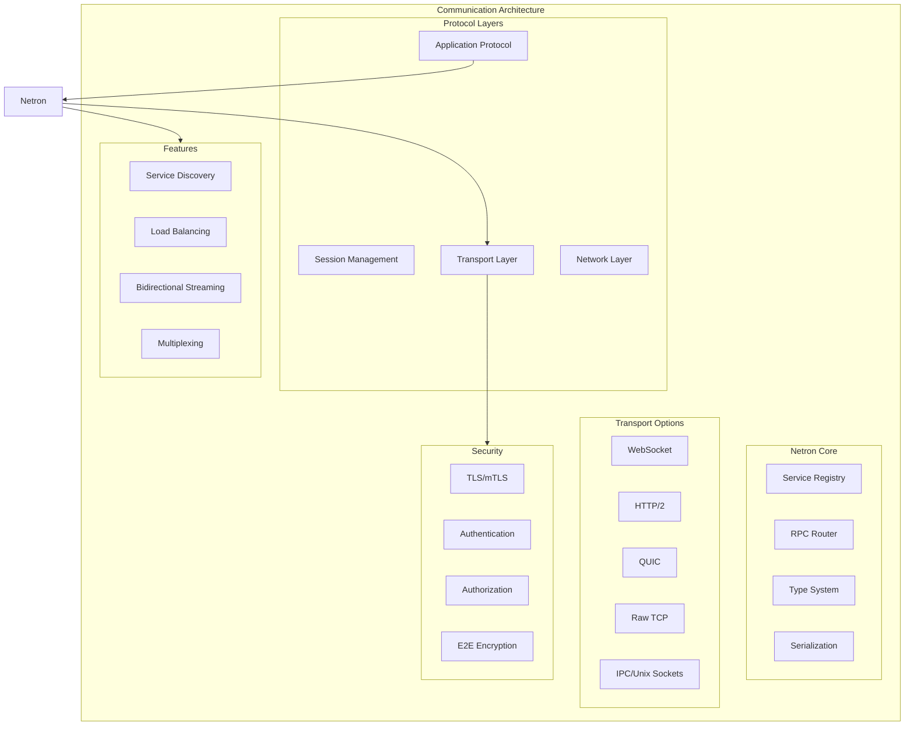

# Omnitron Communication Protocols
**Netron RPC & Distributed Communication Architecture**

Version: 1.0.0
Date: 2025-10-15
Status: Technical Specification

---

## Overview

Omnitron's communication architecture leverages Netron RPC to create a unified, type-safe, and efficient communication layer across all components. This isn't just message passing - it's a cognitive nervous system where every component can discover, communicate with, and adapt to every other component dynamically.



---

## Netron RPC Protocol

### 1. Protocol Definition

The core RPC protocol that powers all Omnitron communication.

```typescript
// Protocol version and capabilities negotiation
interface NetronProtocol {
  version: '2.0.0';
  capabilities: Capability[];

  // Message types
  messages: {
    // Request/Response
    Request: {
      id: string;
      service: string;
      method: string;
      params: any;
      metadata: Metadata;
      timeout?: number;
    };

    Response: {
      id: string;
      result?: any;
      error?: RpcError;
      metadata: Metadata;
    };

    // Streaming
    StreamInit: {
      id: string;
      service: string;
      method: string;
      direction: 'client' | 'server' | 'bidirectional';
    };

    StreamData: {
      streamId: string;
      sequence: number;
      data: any;
      complete?: boolean;
    };

    StreamEnd: {
      streamId: string;
      error?: RpcError;
    };

    // Events
    Event: {
      topic: string;
      data: any;
      metadata: Metadata;
    };

    Subscribe: {
      topics: string[];
      filter?: EventFilter;
    };

    // Control
    Ping: {
      timestamp: number;
    };

    Pong: {
      timestamp: number;
    };

    Handshake: {
      version: string;
      capabilities: Capability[];
      auth?: AuthToken;
    };
  };

  // Wire format
  encoding: 'msgpack' | 'protobuf' | 'json';
  compression: 'none' | 'gzip' | 'brotli' | 'zstd';
}

// Implementation
export class NetronProtocolHandler {
  private readonly version = '2.0.0';
  private readonly encoder = new MessagePackEncoder();
  private readonly compressor = new ZstdCompressor();

  // Encode message for wire transmission
  encode(message: NetronMessage): Buffer {
    // Add protocol envelope
    const envelope = {
      version: this.version,
      type: message.type,
      timestamp: Date.now(),
      payload: message
    };

    // Serialize
    const serialized = this.encoder.encode(envelope);

    // Compress if beneficial
    if (serialized.length > 1024) {
      return this.compressor.compress(serialized);
    }

    return serialized;
  }

  // Decode wire message
  decode(buffer: Buffer): NetronMessage {
    // Decompress if needed
    const decompressed = this.isCompressed(buffer)
      ? this.compressor.decompress(buffer)
      : buffer;

    // Deserialize
    const envelope = this.encoder.decode(decompressed);

    // Validate version
    if (envelope.version !== this.version) {
      throw new VersionMismatchError(envelope.version, this.version);
    }

    return envelope.payload;
  }

  // Protocol negotiation
  async negotiate(
    client: NetronClient,
    server: NetronServer
  ): Promise<NegotiationResult> {
    // Exchange capabilities
    const clientCaps = client.getCapabilities();
    const serverCaps = server.getCapabilities();

    // Find common ground
    const common = this.findCommonCapabilities(clientCaps, serverCaps);

    // Select optimal settings
    return {
      version: this.selectVersion(common.versions),
      encoding: this.selectEncoding(common.encodings),
      compression: this.selectCompression(common.compressions),
      features: common.features
    };
  }
}
```

### 2. Service Definition Language

Type-safe service definitions using TypeScript decorators.

```typescript
// Service definition with decorators
@Service({
  name: 'FlowExecutor',
  version: '1.0.0',
  namespace: 'omnitron.core'
})
export class FlowExecutorService {
  @Method({
    cache: { ttl: 60, key: (args) => `flow:${args[0]}` },
    rateLimit: { max: 100, window: 60000 },
    timeout: 30000
  })
  async executeFlow(
    @Param('flowId') flowId: string,
    @Param('input') input: any,
    @Context() ctx: ExecutionContext
  ): Promise<ExecutionResult> {
    // Implementation
  }

  @Stream({
    direction: 'server',
    maxConcurrent: 10
  })
  async *streamResults(
    @Param('flowId') flowId: string
  ): AsyncIterator<Result> {
    // Stream implementation
  }

  @Stream({
    direction: 'bidirectional'
  })
  async processStream(
    input: AsyncIterator<Command>
  ): AsyncIterator<Response> {
    // Bidirectional stream
  }

  @Event('flow.executed')
  async onFlowExecuted(
    @EventData() data: ExecutionEvent
  ): Promise<void> {
    // Event handler
  }

  @Protected({ roles: ['admin'] })
  @Audit({ level: 'critical' })
  async deployFlow(
    @Param('definition') definition: FlowDefinition,
    @User() user: UserInfo
  ): Promise<string> {
    // Protected method
  }
}

// Client generation from service definition
export class FlowExecutorClient {
  constructor(private readonly transport: NetronTransport) {}

  // Generated type-safe methods
  async executeFlow(
    flowId: string,
    input: any,
    options?: CallOptions
  ): Promise<ExecutionResult> {
    return this.transport.call('FlowExecutor.executeFlow', {
      flowId,
      input
    }, options);
  }

  streamResults(
    flowId: string,
    options?: StreamOptions
  ): AsyncIterator<Result> {
    return this.transport.stream('FlowExecutor.streamResults', {
      flowId
    }, options);
  }

  // Event subscription
  onFlowExecuted(
    handler: (event: ExecutionEvent) => void
  ): Unsubscribe {
    return this.transport.subscribe('flow.executed', handler);
  }
}

// Service registry for discovery
@Injectable()
export class ServiceRegistry {
  private readonly services = new Map<string, ServiceDefinition>();
  private readonly instances = new Map<string, ServiceInstance[]>();

  // Register service definition
  registerService(definition: ServiceDefinition): void {
    const key = `${definition.namespace}.${definition.name}@${definition.version}`;
    this.services.set(key, definition);

    // Generate OpenAPI/AsyncAPI specs
    this.generateSpecs(definition);

    // Register with discovery backend
    this.publishToDiscovery(definition);
  }

  // Register service instance
  registerInstance(
    service: string,
    instance: ServiceInstance
  ): void {
    const instances = this.instances.get(service) || [];
    instances.push(instance);
    this.instances.set(service, instances);

    // Health check registration
    this.registerHealthCheck(instance);
  }

  // Service discovery
  async discover(
    pattern: string,
    options?: DiscoveryOptions
  ): Promise<ServiceInfo[]> {
    const services = Array.from(this.services.values())
      .filter(s => this.matchesPattern(s, pattern));

    return Promise.all(
      services.map(async s => ({
        definition: s,
        instances: await this.getHealthyInstances(s.key),
        metrics: await this.getServiceMetrics(s.key)
      }))
    );
  }
}
```

### 3. Transport Layer

Multiple transport options for different scenarios.

```typescript
// Transport abstraction
interface NetronTransport {
  connect(url: string, options?: ConnectOptions): Promise<void>;
  disconnect(): Promise<void>;

  call<T>(method: string, params: any, options?: CallOptions): Promise<T>;
  stream<T>(method: string, params: any): AsyncIterator<T>;
  subscribe(topic: string, handler: EventHandler): Unsubscribe;

  onConnect(handler: () => void): void;
  onDisconnect(handler: () => void): void;
  onError(handler: (error: Error) => void): void;
}

// WebSocket transport for browsers and real-time
export class WebSocketTransport implements NetronTransport {
  private ws: WebSocket;
  private readonly pending = new Map<string, PendingCall>();
  private readonly streams = new Map<string, Stream>();
  private readonly subscriptions = new Map<string, Set<EventHandler>>();

  async connect(url: string, options?: ConnectOptions): Promise<void> {
    return new Promise((resolve, reject) => {
      this.ws = new WebSocket(url, ['netron-v2']);

      this.ws.onopen = async () => {
        // Handshake
        await this.handshake(options);
        resolve();
      };

      this.ws.onerror = (error) => {
        reject(error);
      };

      this.ws.onmessage = (event) => {
        this.handleMessage(event.data);
      };

      // Setup heartbeat
      this.setupHeartbeat();

      // Setup reconnection
      if (options?.reconnect) {
        this.setupReconnection(options.reconnect);
      }
    });
  }

  async call<T>(
    method: string,
    params: any,
    options?: CallOptions
  ): Promise<T> {
    const id = generateId();

    return new Promise((resolve, reject) => {
      // Setup timeout
      const timeout = setTimeout(() => {
        this.pending.delete(id);
        reject(new TimeoutError(`Call to ${method} timed out`));
      }, options?.timeout || 30000);

      // Store pending call
      this.pending.set(id, {
        resolve,
        reject,
        timeout,
        method
      });

      // Send request
      this.send({
        type: 'Request',
        id,
        method,
        params,
        metadata: options?.metadata || {}
      });
    });
  }

  async *stream<T>(
    method: string,
    params: any
  ): AsyncIterator<T> {
    const streamId = generateId();
    const buffer: T[] = [];
    let resolver: ((value: IteratorResult<T>) => void) | null = null;
    let done = false;

    // Create stream
    const stream: Stream = {
      id: streamId,
      buffer,
      resolver,
      done
    };

    this.streams.set(streamId, stream);

    // Initialize stream
    this.send({
      type: 'StreamInit',
      id: streamId,
      method,
      params
    });

    // Return async iterator
    return {
      async next(): Promise<IteratorResult<T>> {
        if (buffer.length > 0) {
          return { value: buffer.shift()!, done: false };
        }

        if (done) {
          return { done: true, value: undefined };
        }

        return new Promise((resolve) => {
          stream.resolver = resolve;
        });
      },

      async return(): Promise<IteratorResult<T>> {
        // Close stream
        this.send({
          type: 'StreamEnd',
          streamId
        });

        this.streams.delete(streamId);
        return { done: true, value: undefined };
      }
    };
  }

  private handleMessage(data: any): void {
    const message = this.protocol.decode(data);

    switch (message.type) {
      case 'Response':
        this.handleResponse(message);
        break;

      case 'StreamData':
        this.handleStreamData(message);
        break;

      case 'StreamEnd':
        this.handleStreamEnd(message);
        break;

      case 'Event':
        this.handleEvent(message);
        break;

      case 'Pong':
        this.handlePong(message);
        break;
    }
  }

  private setupHeartbeat(): void {
    setInterval(() => {
      if (this.ws.readyState === WebSocket.OPEN) {
        this.send({
          type: 'Ping',
          timestamp: Date.now()
        });
      }
    }, 30000);
  }

  private setupReconnection(options: ReconnectOptions): void {
    this.ws.onclose = () => {
      const backoff = new ExponentialBackoff({
        initial: options.initialDelay || 1000,
        max: options.maxDelay || 30000,
        factor: options.factor || 2
      });

      const reconnect = async () => {
        try {
          await this.connect(this.url, this.options);
        } catch (error) {
          setTimeout(reconnect, backoff.next());
        }
      };

      setTimeout(reconnect, backoff.next());
    };
  }
}

// HTTP/2 transport for high throughput
export class HTTP2Transport implements NetronTransport {
  private session: http2.ClientHttp2Session;

  async connect(url: string, options?: ConnectOptions): Promise<void> {
    this.session = http2.connect(url, {
      peerMaxConcurrentStreams: 100,
      ...options?.http2
    });

    return new Promise((resolve, reject) => {
      this.session.on('connect', resolve);
      this.session.on('error', reject);
    });
  }

  async call<T>(
    method: string,
    params: any,
    options?: CallOptions
  ): Promise<T> {
    const stream = this.session.request({
      ':path': `/rpc/${method}`,
      ':method': 'POST',
      'content-type': 'application/msgpack',
      ...this.buildHeaders(options)
    });

    return new Promise((resolve, reject) => {
      const chunks: Buffer[] = [];

      stream.on('response', (headers) => {
        if (headers[':status'] !== 200) {
          reject(new Error(`RPC failed: ${headers[':status']}`));
        }
      });

      stream.on('data', (chunk) => {
        chunks.push(chunk);
      });

      stream.on('end', () => {
        const response = this.protocol.decode(
          Buffer.concat(chunks)
        );
        resolve(response);
      });

      stream.on('error', reject);

      // Send request
      stream.write(this.protocol.encode({
        method,
        params,
        metadata: options?.metadata
      }));

      stream.end();
    });
  }
}

// QUIC transport for unreliable networks
export class QUICTransport implements NetronTransport {
  private connection: QuicConnection;

  async connect(url: string, options?: ConnectOptions): Promise<void> {
    this.connection = await QuicConnection.connect({
      address: url,
      alpn: 'netron-v2',
      congestionControl: options?.quic?.congestionControl || 'bbr',
      ...options?.quic
    });

    // 0-RTT support
    if (options?.quic?.zeroRtt && this.connection.hasSessionTicket()) {
      await this.connection.sendEarly(this.handshakeData());
    }
  }

  async call<T>(
    method: string,
    params: any,
    options?: CallOptions
  ): Promise<T> {
    const stream = await this.connection.openStream();

    return new Promise((resolve, reject) => {
      // Send request
      stream.write(this.protocol.encode({
        type: 'Request',
        method,
        params
      }));

      // Read response
      stream.on('data', (data) => {
        const response = this.protocol.decode(data);
        resolve(response.result);
      });

      stream.on('error', reject);
    });
  }
}

// IPC transport for local communication
export class IPCTransport implements NetronTransport {
  private socket: net.Socket;

  async connect(path: string, options?: ConnectOptions): Promise<void> {
    return new Promise((resolve, reject) => {
      this.socket = net.createConnection(path);

      this.socket.on('connect', resolve);
      this.socket.on('error', reject);

      // Message framing
      this.socket.pipe(new MessageFramer()).on('message', (message) => {
        this.handleMessage(message);
      });
    });
  }
}
```

---

## Service Mesh

### 1. Service Discovery

Dynamic service discovery and registration.

```typescript
interface ServiceDiscovery {
  // Registration
  register(service: ServiceDefinition): Promise<void>;
  unregister(serviceId: string): Promise<void>;

  // Discovery
  discover(query: DiscoveryQuery): Promise<ServiceInstance[]>;
  watch(query: DiscoveryQuery): AsyncIterator<ServiceChange>;

  // Health
  reportHealth(serviceId: string, health: HealthStatus): Promise<void>;
  checkHealth(serviceId: string): Promise<HealthStatus>;
}

@Injectable()
export class DistributedServiceDiscovery implements ServiceDiscovery {
  constructor(
    private readonly consul: ConsulClient,
    private readonly etcd: EtcdClient,
    private readonly cache: DiscoveryCache
  ) {}

  // Multi-backend registration
  async register(service: ServiceDefinition): Promise<void> {
    // Register with Consul
    await this.consul.agent.service.register({
      ID: service.id,
      Name: service.name,
      Tags: service.tags,
      Address: service.address,
      Port: service.port,
      Check: {
        HTTP: `http://${service.address}:${service.port}/health`,
        Interval: '10s',
        Timeout: '5s'
      },
      Meta: {
        version: service.version,
        protocol: 'netron-v2'
      }
    });

    // Register with etcd
    await this.etcd.put(
      `/services/${service.namespace}/${service.name}/${service.id}`,
      JSON.stringify(service),
      { lease: service.lease }
    );

    // Update local cache
    this.cache.add(service);

    // Broadcast registration event
    await this.broadcastEvent({
      type: 'service.registered',
      service
    });
  }

  // Smart service discovery
  async discover(query: DiscoveryQuery): Promise<ServiceInstance[]> {
    // Try cache first
    const cached = this.cache.find(query);
    if (cached.length > 0 && !query.fresh) {
      return cached;
    }

    // Query backends in parallel
    const [consulServices, etcdServices] = await Promise.all([
      this.discoverConsul(query),
      this.discoverEtcd(query)
    ]);

    // Merge and deduplicate
    const services = this.mergeServices(consulServices, etcdServices);

    // Apply filters
    const filtered = this.applyFilters(services, query.filters);

    // Update cache
    this.cache.update(query, filtered);

    return filtered;
  }

  // Watch for service changes
  async *watch(query: DiscoveryQuery): AsyncIterator<ServiceChange> {
    // Setup watchers
    const consulWatch = this.consul.watch({
      method: this.consul.health.service,
      options: { service: query.name }
    });

    const etcdWatch = await this.etcd.watch()
      .prefix(`/services/${query.namespace}`)
      .create();

    // Merge change streams
    while (true) {
      const change = await Promise.race([
        this.nextConsulChange(consulWatch),
        this.nextEtcdChange(etcdWatch)
      ]);

      if (this.matchesQuery(change.service, query)) {
        yield change;
      }
    }
  }

  // Circuit breaker integration
  private applyCircuitBreaker(
    services: ServiceInstance[]
  ): ServiceInstance[] {
    return services.filter(service => {
      const breaker = this.circuitBreakers.get(service.id);
      return !breaker || breaker.state !== 'open';
    });
  }

  // Intelligent routing
  async selectInstance(
    service: string,
    strategy: RoutingStrategy = 'round-robin'
  ): Promise<ServiceInstance> {
    const instances = await this.discover({
      name: service,
      healthy: true
    });

    switch (strategy) {
      case 'round-robin':
        return this.roundRobin(instances);

      case 'least-connections':
        return this.leastConnections(instances);

      case 'weighted':
        return this.weighted(instances);

      case 'latency':
        return this.lowestLatency(instances);

      case 'adaptive':
        return this.adaptive(instances);

      default:
        return instances[0];
    }
  }
}
```

### 2. Load Balancing

Intelligent load distribution across services.

```typescript
interface LoadBalancer {
  selectEndpoint(endpoints: Endpoint[]): Endpoint;
  updateMetrics(endpoint: Endpoint, metrics: Metrics): void;
  markUnhealthy(endpoint: Endpoint): void;
  reset(): void;
}

@Injectable()
export class AdaptiveLoadBalancer implements LoadBalancer {
  private readonly metrics = new Map<string, EndpointMetrics>();
  private readonly p2c = new PowerOfTwoChoices();
  private readonly ewma = new EWMA(0.5); // Decay factor

  // Adaptive selection based on multiple signals
  selectEndpoint(endpoints: Endpoint[]): Endpoint {
    if (endpoints.length === 0) {
      throw new Error('No endpoints available');
    }

    if (endpoints.length === 1) {
      return endpoints[0];
    }

    // Power of two choices with EWMA latency
    const choices = this.p2c.select(endpoints, 2);

    const scores = choices.map(endpoint => {
      const metrics = this.metrics.get(endpoint.id) || {
        latency: 0,
        errorRate: 0,
        activeRequests: 0
      };

      // Calculate score (lower is better)
      return {
        endpoint,
        score: this.calculateScore(metrics)
      };
    });

    // Select endpoint with best score
    return scores.sort((a, b) => a.score - b.score)[0].endpoint;
  }

  private calculateScore(metrics: EndpointMetrics): number {
    // Weighted scoring formula
    const latencyScore = metrics.latency * 1.0;
    const errorScore = metrics.errorRate * 100.0;
    const loadScore = metrics.activeRequests * 10.0;

    // Add penalty for recent errors
    const errorPenalty = metrics.recentErrors * 50.0;

    return latencyScore + errorScore + loadScore + errorPenalty;
  }

  // Update endpoint metrics
  updateMetrics(endpoint: Endpoint, metrics: Metrics): void {
    const current = this.metrics.get(endpoint.id) || {
      latency: 0,
      errorRate: 0,
      activeRequests: 0,
      recentErrors: 0
    };

    // Update with EWMA
    this.metrics.set(endpoint.id, {
      latency: this.ewma.update(current.latency, metrics.latency),
      errorRate: this.ewma.update(current.errorRate, metrics.errorRate),
      activeRequests: metrics.activeRequests,
      recentErrors: metrics.error ? current.recentErrors + 1 : 0
    });
  }

  // Consistent hashing for sticky sessions
  consistentHash(key: string, endpoints: Endpoint[]): Endpoint {
    const ring = new HashRing(endpoints.map(e => e.id));
    const endpointId = ring.get(key);
    return endpoints.find(e => e.id === endpointId)!;
  }

  // Least connections algorithm
  leastConnections(endpoints: Endpoint[]): Endpoint {
    return endpoints.reduce((min, endpoint) => {
      const minConns = this.metrics.get(min.id)?.activeRequests || 0;
      const endpointConns = this.metrics.get(endpoint.id)?.activeRequests || 0;
      return endpointConns < minConns ? endpoint : min;
    });
  }

  // Weighted round-robin
  weightedRoundRobin(endpoints: WeightedEndpoint[]): Endpoint {
    const totalWeight = endpoints.reduce((sum, e) => sum + e.weight, 0);
    let random = Math.random() * totalWeight;

    for (const endpoint of endpoints) {
      random -= endpoint.weight;
      if (random <= 0) {
        return endpoint;
      }
    }

    return endpoints[endpoints.length - 1];
  }
}
```

### 3. Circuit Breaker

Fault isolation and recovery.

```typescript
interface CircuitBreaker {
  call<T>(fn: () => Promise<T>): Promise<T>;
  getState(): 'closed' | 'open' | 'half-open';
  reset(): void;
}

export class NetronCircuitBreaker implements CircuitBreaker {
  private state: 'closed' | 'open' | 'half-open' = 'closed';
  private failures = 0;
  private successes = 0;
  private lastFailureTime?: number;
  private nextAttempt?: number;

  constructor(
    private readonly options: {
      threshold: number;      // Failure threshold
      timeout: number;        // Open timeout
      resetTimeout: number;   // Time before retry
      bucketSize: number;     // Time window
    }
  ) {}

  async call<T>(fn: () => Promise<T>): Promise<T> {
    if (this.state === 'open') {
      if (Date.now() < this.nextAttempt!) {
        throw new CircuitOpenError('Circuit breaker is open');
      }
      this.state = 'half-open';
    }

    try {
      const result = await fn();
      this.onSuccess();
      return result;
    } catch (error) {
      this.onFailure();
      throw error;
    }
  }

  private onSuccess(): void {
    this.failures = 0;

    switch (this.state) {
      case 'half-open':
        this.successes++;
        if (this.successes >= this.options.threshold) {
          this.state = 'closed';
        }
        break;
    }
  }

  private onFailure(): void {
    this.failures++;
    this.lastFailureTime = Date.now();

    switch (this.state) {
      case 'closed':
        if (this.failures >= this.options.threshold) {
          this.state = 'open';
          this.nextAttempt = Date.now() + this.options.resetTimeout;
        }
        break;

      case 'half-open':
        this.state = 'open';
        this.nextAttempt = Date.now() + this.options.resetTimeout;
        break;
    }
  }

  getState(): 'closed' | 'open' | 'half-open' {
    return this.state;
  }

  reset(): void {
    this.state = 'closed';
    this.failures = 0;
    this.successes = 0;
    this.lastFailureTime = undefined;
    this.nextAttempt = undefined;
  }
}

// Bulkhead pattern for resource isolation
export class Bulkhead {
  private readonly semaphore: Semaphore;
  private readonly queue: Queue<Task>;

  constructor(
    private readonly options: {
      maxConcurrent: number;
      maxQueued: number;
      timeout: number;
    }
  ) {
    this.semaphore = new Semaphore(options.maxConcurrent);
    this.queue = new Queue(options.maxQueued);
  }

  async execute<T>(fn: () => Promise<T>): Promise<T> {
    if (this.queue.size() >= this.options.maxQueued) {
      throw new BulkheadRejectedError('Bulkhead queue is full');
    }

    return this.queue.enqueue(async () => {
      const release = await this.semaphore.acquire();

      try {
        return await withTimeout(fn(), this.options.timeout);
      } finally {
        release();
      }
    });
  }
}
```

---

## Event System

### 1. Event Bus

Distributed event propagation.

```typescript
interface EventBus {
  // Publishing
  publish(topic: string, event: any): Promise<void>;
  publishBatch(events: Event[]): Promise<void>;

  // Subscription
  subscribe(topic: string, handler: EventHandler): Subscription;
  subscribePattern(pattern: string, handler: EventHandler): Subscription;

  // Stream processing
  stream(topic: string): EventStream;
  pipe(source: string, destination: string, transform?: Transform): void;
}

@Injectable()
export class DistributedEventBus implements EventBus {
  constructor(
    private readonly kafka: KafkaClient,
    private readonly redis: RedisClient,
    private readonly local: LocalEventBus
  ) {}

  // Publish with guaranteed delivery
  async publish(topic: string, event: any): Promise<void> {
    // Add metadata
    const enriched = {
      ...event,
      id: generateId(),
      timestamp: Date.now(),
      source: this.nodeId,
      correlationId: event.correlationId || generateId()
    };

    // Local subscribers (fast path)
    await this.local.publish(topic, enriched);

    // Remote subscribers (async)
    await Promise.all([
      this.publishToKafka(topic, enriched),
      this.publishToRedis(topic, enriched)
    ]);

    // Record metric
    this.metrics.increment('events.published', { topic });
  }

  // Pattern-based subscription
  subscribePattern(
    pattern: string,
    handler: EventHandler
  ): Subscription {
    const regex = this.patternToRegex(pattern);

    // Subscribe to all matching topics
    const subscriptions: Subscription[] = [];

    // Kafka subscription
    const kafkaConsumer = this.kafka.consumer({
      groupId: `pattern-${generateId()}`
    });

    kafkaConsumer.subscribe({
      topics: [regex],
      fromBeginning: false
    });

    kafkaConsumer.run({
      eachMessage: async ({ topic, message }) => {
        if (regex.test(topic)) {
          const event = JSON.parse(message.value.toString());
          await handler(event);
        }
      }
    });

    // Redis pattern subscription
    const redisSubscriber = this.redis.duplicate();
    redisSubscriber.psubscribe(pattern);
    redisSubscriber.on('pmessage', async (pattern, channel, message) => {
      const event = JSON.parse(message);
      await handler(event);
    });

    return {
      unsubscribe: async () => {
        await kafkaConsumer.disconnect();
        await redisSubscriber.punsubscribe(pattern);
        await redisSubscriber.quit();
      }
    };
  }

  // Event streaming with backpressure
  stream(topic: string): EventStream {
    const buffer = new RingBuffer<Event>(1000);
    let paused = false;

    // Start consuming
    const consumer = this.kafka.consumer({
      groupId: `stream-${generateId()}`
    });

    consumer.subscribe({ topic, fromBeginning: false });

    consumer.run({
      eachMessage: async ({ message }) => {
        const event = JSON.parse(message.value.toString());

        // Handle backpressure
        while (buffer.isFull() && !paused) {
          await new Promise(resolve => setTimeout(resolve, 100));
        }

        if (!paused) {
          buffer.push(event);
        }
      }
    });

    return {
      async *[Symbol.asyncIterator]() {
        while (true) {
          if (buffer.isEmpty()) {
            await new Promise(resolve => setTimeout(resolve, 100));
            continue;
          }

          yield buffer.shift()!;
        }
      },

      pause: () => { paused = true; },
      resume: () => { paused = false; },
      close: () => consumer.disconnect()
    };
  }

  // Event sourcing support
  async replay(
    topic: string,
    from: Date,
    to: Date
  ): AsyncIterator<Event> {
    const consumer = this.kafka.consumer({
      groupId: `replay-${generateId()}`
    });

    await consumer.subscribe({
      topic,
      fromBeginning: true
    });

    const events: Event[] = [];

    await consumer.run({
      eachMessage: async ({ message }) => {
        const event = JSON.parse(message.value.toString());

        if (event.timestamp >= from.getTime() &&
            event.timestamp <= to.getTime()) {
          events.push(event);
        }
      }
    });

    // Return iterator
    let index = 0;
    return {
      async next() {
        if (index < events.length) {
          return { value: events[index++], done: false };
        }
        return { done: true, value: undefined };
      }
    };
  }
}
```

### 2. Message Patterns

Common messaging patterns implementation.

```typescript
// Request-Reply pattern
export class RequestReply {
  private readonly pending = new Map<string, PendingReply>();

  async request<T>(
    topic: string,
    request: any,
    timeout = 30000
  ): Promise<T> {
    const correlationId = generateId();
    const replyTo = `reply.${correlationId}`;

    return new Promise((resolve, reject) => {
      // Setup timeout
      const timer = setTimeout(() => {
        this.pending.delete(correlationId);
        reject(new TimeoutError('Request timed out'));
      }, timeout);

      // Store pending reply
      this.pending.set(correlationId, {
        resolve,
        reject,
        timer
      });

      // Subscribe to reply topic
      this.bus.subscribe(replyTo, (reply) => {
        const pending = this.pending.get(correlationId);
        if (pending) {
          clearTimeout(pending.timer);
          this.pending.delete(correlationId);
          pending.resolve(reply);
        }
      });

      // Send request
      this.bus.publish(topic, {
        ...request,
        correlationId,
        replyTo
      });
    });
  }
}

// Saga pattern for distributed transactions
export class Saga {
  private readonly steps: SagaStep[] = [];
  private readonly compensations: CompensationStep[] = [];

  addStep(
    step: SagaStep,
    compensation?: CompensationStep
  ): this {
    this.steps.push(step);
    if (compensation) {
      this.compensations.push(compensation);
    }
    return this;
  }

  async execute(context: SagaContext): Promise<SagaResult> {
    const executed: number[] = [];

    try {
      // Execute steps
      for (let i = 0; i < this.steps.length; i++) {
        await this.steps[i](context);
        executed.push(i);

        // Publish step completed event
        await this.bus.publish('saga.step.completed', {
          sagaId: context.sagaId,
          step: i,
          timestamp: Date.now()
        });
      }

      return {
        success: true,
        context
      };
    } catch (error) {
      // Compensate in reverse order
      for (let i = executed.length - 1; i >= 0; i--) {
        if (this.compensations[i]) {
          try {
            await this.compensations[i](context);
          } catch (compError) {
            // Log compensation failure
            console.error('Compensation failed:', compError);
          }
        }
      }

      return {
        success: false,
        error,
        context
      };
    }
  }
}

// Choreography pattern
export class Choreography {
  private readonly participants = new Map<string, Participant>();

  registerParticipant(
    name: string,
    participant: Participant
  ): void {
    this.participants.set(name, participant);

    // Setup event handlers
    participant.subscribes.forEach(event => {
      this.bus.subscribe(event, async (data) => {
        const result = await participant.handle(event, data);

        if (result.publishes) {
          for (const publish of result.publishes) {
            await this.bus.publish(publish.event, publish.data);
          }
        }
      });
    });
  }

  async start(initialEvent: Event): Promise<void> {
    await this.bus.publish(initialEvent.type, initialEvent.data);
  }
}
```

---

## Real-time Communication

### 1. WebRTC Integration

Peer-to-peer communication for collaboration.

```typescript
interface WebRTCManager {
  // Connection management
  createPeer(peerId: string): RTCPeerConnection;
  connectPeers(peer1: string, peer2: string): Promise<void>;

  // Data channels
  createDataChannel(peer: string, label: string): RTCDataChannel;
  onDataChannel(handler: (channel: RTCDataChannel) => void): void;

  // Media streams
  addStream(peer: string, stream: MediaStream): void;
  onStream(handler: (stream: MediaStream) => void): void;
}

@Injectable()
export class P2PCommunication {
  private readonly peers = new Map<string, RTCPeerConnection>();
  private readonly signaling = new SignalingServer();

  // Establish P2P connection
  async connect(remotePeerId: string): Promise<RTCPeerConnection> {
    const peer = new RTCPeerConnection({
      iceServers: [
        { urls: 'stun:stun.l.google.com:19302' },
        {
          urls: 'turn:turnserver.com:3478',
          username: 'user',
          credential: 'pass'
        }
      ]
    });

    this.peers.set(remotePeerId, peer);

    // Handle ICE candidates
    peer.onicecandidate = (event) => {
      if (event.candidate) {
        this.signaling.send(remotePeerId, {
          type: 'ice-candidate',
          candidate: event.candidate
        });
      }
    };

    // Create offer
    const offer = await peer.createOffer();
    await peer.setLocalDescription(offer);

    // Send offer through signaling server
    await this.signaling.send(remotePeerId, {
      type: 'offer',
      offer
    });

    // Wait for answer
    const answer = await this.signaling.waitFor(remotePeerId, 'answer');
    await peer.setRemoteDescription(answer);

    return peer;
  }

  // Create collaborative data channel
  createCollaborationChannel(
    peer: RTCPeerConnection
  ): RTCDataChannel {
    const channel = peer.createDataChannel('collaboration', {
      ordered: true,
      maxRetransmits: 3
    });

    // Setup CRDT synchronization
    channel.onopen = () => {
      this.syncCRDT(channel);
    };

    channel.onmessage = (event) => {
      this.handleCollaborativeEdit(event.data);
    };

    return channel;
  }

  // Screen sharing
  async shareScreen(peer: RTCPeerConnection): Promise<void> {
    const stream = await navigator.mediaDevices.getDisplayMedia({
      video: true,
      audio: false
    });

    stream.getTracks().forEach(track => {
      peer.addTrack(track, stream);
    });
  }
}
```

### 2. Server-Sent Events

Efficient server-to-client streaming.

```typescript
export class SSEManager {
  private readonly connections = new Map<string, SSEConnection>();

  // Create SSE endpoint
  createEndpoint(
    path: string,
    auth?: AuthMiddleware
  ): void {
    this.app.get(path, auth, (req, res) => {
      // Setup SSE headers
      res.writeHead(200, {
        'Content-Type': 'text/event-stream',
        'Cache-Control': 'no-cache',
        'Connection': 'keep-alive',
        'Access-Control-Allow-Origin': '*'
      });

      const connectionId = generateId();
      const connection: SSEConnection = {
        id: connectionId,
        response: res,
        userId: req.user?.id
      };

      this.connections.set(connectionId, connection);

      // Send initial connection event
      this.send(connectionId, {
        type: 'connected',
        connectionId
      });

      // Heartbeat
      const heartbeat = setInterval(() => {
        res.write(':heartbeat\n\n');
      }, 30000);

      // Cleanup on disconnect
      req.on('close', () => {
        clearInterval(heartbeat);
        this.connections.delete(connectionId);
      });
    });
  }

  // Send event to specific connection
  send(connectionId: string, data: any): void {
    const connection = this.connections.get(connectionId);
    if (connection) {
      connection.response.write(
        `data: ${JSON.stringify(data)}\n\n`
      );
    }
  }

  // Broadcast to all connections
  broadcast(data: any): void {
    for (const connection of this.connections.values()) {
      connection.response.write(
        `data: ${JSON.stringify(data)}\n\n`
      );
    }
  }

  // Send to specific users
  sendToUsers(userIds: string[], data: any): void {
    for (const connection of this.connections.values()) {
      if (userIds.includes(connection.userId)) {
        connection.response.write(
          `data: ${JSON.stringify(data)}\n\n`
        );
      }
    }
  }
}
```

---

## Security Protocols

### 1. Authentication

Multi-method authentication support.

```typescript
interface AuthenticationProvider {
  authenticate(credentials: Credentials): Promise<AuthResult>;
  refresh(token: RefreshToken): Promise<AuthResult>;
  revoke(token: string): Promise<void>;
}

@Injectable()
export class NetronAuth {
  private readonly providers = new Map<string, AuthenticationProvider>();

  constructor() {
    // Register providers
    this.registerProvider('jwt', new JWTAuthProvider());
    this.registerProvider('oauth2', new OAuth2Provider());
    this.registerProvider('mtls', new MutualTLSProvider());
    this.registerProvider('apikey', new APIKeyProvider());
  }

  // Authenticate request
  async authenticate(
    request: NetronRequest
  ): Promise<AuthContext> {
    // Try authentication methods in order
    const methods = ['mtls', 'jwt', 'oauth2', 'apikey'];

    for (const method of methods) {
      const provider = this.providers.get(method);
      if (provider && this.hasCredentials(request, method)) {
        try {
          const result = await provider.authenticate(
            this.extractCredentials(request, method)
          );

          if (result.success) {
            return {
              authenticated: true,
              principal: result.principal,
              method,
              permissions: result.permissions
            };
          }
        } catch (error) {
          // Continue to next method
        }
      }
    }

    throw new AuthenticationError('Authentication failed');
  }

  // JWT with refresh tokens
  private jwtAuth(): AuthenticationProvider {
    return {
      async authenticate(credentials: JWTCredentials) {
        const decoded = jwt.verify(
          credentials.token,
          this.publicKey,
          { algorithms: ['RS256'] }
        );

        return {
          success: true,
          principal: decoded.sub,
          permissions: decoded.permissions
        };
      },

      async refresh(refreshToken: string) {
        const decoded = jwt.verify(
          refreshToken,
          this.refreshSecret
        );

        const newToken = jwt.sign(
          {
            sub: decoded.sub,
            permissions: decoded.permissions
          },
          this.privateKey,
          {
            algorithm: 'RS256',
            expiresIn: '1h'
          }
        );

        return {
          success: true,
          token: newToken,
          refreshToken: this.generateRefreshToken(decoded.sub)
        };
      }
    };
  }

  // Mutual TLS
  private mtlsAuth(): AuthenticationProvider {
    return {
      async authenticate(credentials: TLSCredentials) {
        const cert = credentials.peerCertificate;

        // Verify certificate
        if (!this.verifyCertificate(cert)) {
          throw new Error('Invalid certificate');
        }

        // Extract principal from certificate
        const principal = cert.subject.CN;

        // Load permissions from certificate extensions
        const permissions = this.extractPermissions(cert);

        return {
          success: true,
          principal,
          permissions
        };
      }
    };
  }
}
```

### 2. Authorization

Fine-grained permission control.

```typescript
interface AuthorizationPolicy {
  evaluate(context: AuthContext, resource: Resource, action: Action): boolean;
}

@Injectable()
export class NetronAuthorization {
  private readonly policies = new Map<string, AuthorizationPolicy>();

  // Register authorization policies
  constructor() {
    this.registerPolicy('rbac', new RBACPolicy());
    this.registerPolicy('abac', new ABACPolicy());
    this.registerPolicy('capability', new CapabilityPolicy());
  }

  // Check authorization
  async authorize(
    context: AuthContext,
    resource: string,
    action: string
  ): Promise<boolean> {
    // Evaluate all policies
    for (const [name, policy] of this.policies) {
      if (!policy.evaluate(context, resource, action)) {
        // Log denial
        await this.audit.log({
          type: 'authorization.denied',
          principal: context.principal,
          resource,
          action,
          policy: name,
          timestamp: new Date()
        });

        return false;
      }
    }

    return true;
  }

  // Role-based access control
  private rbacPolicy(): AuthorizationPolicy {
    return {
      evaluate(context, resource, action) {
        const role = context.roles?.[0];
        if (!role) return false;

        const permissions = this.rolePermissions.get(role);
        if (!permissions) return false;

        return permissions.some(p =>
          p.resource === resource && p.action === action
        );
      }
    };
  }

  // Attribute-based access control
  private abacPolicy(): AuthorizationPolicy {
    return {
      evaluate(context, resource, action) {
        // Evaluate rules
        for (const rule of this.rules) {
          if (this.matchesRule(rule, context, resource, action)) {
            return rule.effect === 'allow';
          }
        }

        return false; // Deny by default
      }
    };
  }

  // Capability-based security
  private capabilityPolicy(): AuthorizationPolicy {
    return {
      evaluate(context, resource, action) {
        const capability = context.capabilities?.find(c =>
          c.resource === resource && c.actions.includes(action)
        );

        if (!capability) return false;

        // Check capability constraints
        if (capability.constraints) {
          return this.evaluateConstraints(
            capability.constraints,
            context
          );
        }

        return true;
      }
    };
  }
}
```

### 3. Encryption

End-to-end encryption for sensitive data.

```typescript
interface EncryptionProvider {
  encrypt(data: Buffer, key: CryptoKey): Promise<EncryptedData>;
  decrypt(data: EncryptedData, key: CryptoKey): Promise<Buffer>;
}

@Injectable()
export class E2EEncryption {
  // Encrypt RPC calls
  async encryptCall(
    request: NetronRequest,
    publicKey: CryptoKey
  ): Promise<EncryptedRequest> {
    // Generate session key
    const sessionKey = await crypto.subtle.generateKey(
      {
        name: 'AES-GCM',
        length: 256
      },
      true,
      ['encrypt', 'decrypt']
    );

    // Encrypt request with session key
    const iv = crypto.getRandomValues(new Uint8Array(12));
    const encrypted = await crypto.subtle.encrypt(
      {
        name: 'AES-GCM',
        iv
      },
      sessionKey,
      new TextEncoder().encode(JSON.stringify(request))
    );

    // Encrypt session key with public key
    const encryptedKey = await crypto.subtle.encrypt(
      {
        name: 'RSA-OAEP'
      },
      publicKey,
      await crypto.subtle.exportKey('raw', sessionKey)
    );

    return {
      encryptedData: encrypted,
      encryptedKey,
      iv,
      algorithm: 'AES-GCM'
    };
  }

  // Perfect forward secrecy
  async establishSecureChannel(
    remotePublicKey: CryptoKey
  ): Promise<SecureChannel> {
    // Generate ephemeral key pair
    const ephemeralKeyPair = await crypto.subtle.generateKey(
      {
        name: 'ECDH',
        namedCurve: 'P-256'
      },
      true,
      ['deriveBits']
    );

    // Perform ECDH
    const sharedSecret = await crypto.subtle.deriveBits(
      {
        name: 'ECDH',
        public: remotePublicKey
      },
      ephemeralKeyPair.privateKey,
      256
    );

    // Derive encryption keys
    const keys = await this.deriveKeys(sharedSecret);

    return {
      sendKey: keys.send,
      receiveKey: keys.receive,
      ephemeralPublicKey: ephemeralKeyPair.publicKey
    };
  }
}
```

---

## Performance Optimizations

### 1. Protocol Optimizations

Optimizations for low latency and high throughput.

```typescript
export class ProtocolOptimizer {
  // Message batching
  private readonly batcher = new MessageBatcher({
    maxBatchSize: 100,
    maxLatency: 10, // ms
    maxBytes: 65536
  });

  // Send messages with batching
  async send(message: NetronMessage): Promise<void> {
    if (this.shouldBatch(message)) {
      return this.batcher.add(message);
    }

    // Send immediately for time-sensitive messages
    return this.transport.send(message);
  }

  // Connection multiplexing
  private readonly multiplexer = new StreamMultiplexer();

  createStream(): Stream {
    return this.multiplexer.createStream();
  }

  // Zero-copy serialization
  serializeZeroCopy(message: NetronMessage): Buffer {
    // Use flatbuffers for zero-copy
    const builder = new flatbuffers.Builder(1024);

    const data = NetronMessage.createNetronMessage(
      builder,
      message.type,
      builder.createString(message.service),
      builder.createString(message.method),
      // ... other fields
    );

    builder.finish(data);
    return builder.asUint8Array();
  }

  // Header compression (HPACK-like)
  private readonly headerCompressor = new HeaderCompressor();

  compressHeaders(headers: Headers): Buffer {
    return this.headerCompressor.compress(headers);
  }

  // TCP optimizations
  optimizeTCP(socket: net.Socket): void {
    // Disable Nagle's algorithm for low latency
    socket.setNoDelay(true);

    // Keep-alive for long connections
    socket.setKeepAlive(true, 60000);

    // Increase buffer sizes
    socket.setRecvBufferSize(1048576); // 1MB
    socket.setSendBufferSize(1048576); // 1MB
  }

  // HTTP/3 with QUIC
  async createQUICConnection(
    endpoint: string
  ): Promise<QUICConnection> {
    return QUICConnection.connect({
      address: endpoint,
      alpn: ['h3', 'netron-v2'],
      maxDatagramFrameSize: 1200,
      initialMaxData: 10485760, // 10MB
      initialMaxStreamDataBidiLocal: 1048576, // 1MB
      initialMaxStreamDataBidiRemote: 1048576,
      initialMaxStreamsBidi: 100,
      congestionControl: 'bbr'
    });
  }
}
```

### 2. Caching Strategies

Multi-level caching for optimal performance.

```typescript
export class NetronCache {
  // Method result caching
  private readonly methodCache = new LRUCache<string, CachedResult>({
    max: 10000,
    ttl: 60000, // 1 minute
    updateAgeOnGet: true
  });

  async callWithCache<T>(
    method: string,
    params: any,
    options?: CacheOptions
  ): Promise<T> {
    const key = this.getCacheKey(method, params);

    // Check cache
    const cached = this.methodCache.get(key);
    if (cached && !this.isStale(cached, options)) {
      return cached.result as T;
    }

    // Call method
    const result = await this.transport.call<T>(method, params);

    // Cache result
    if (this.shouldCache(method, result, options)) {
      this.methodCache.set(key, {
        result,
        timestamp: Date.now(),
        etag: this.generateETag(result)
      });
    }

    return result;
  }

  // Connection pooling
  private readonly connectionPool = new ConnectionPool({
    min: 5,
    max: 100,
    idleTimeout: 300000, // 5 minutes
    factory: () => this.createConnection()
  });

  async getConnection(): Promise<NetronConnection> {
    return this.connectionPool.acquire();
  }

  // Prefetching
  async prefetch(patterns: PrefetchPattern[]): Promise<void> {
    const tasks = patterns.map(pattern =>
      this.prefetchPattern(pattern)
    );

    await Promise.all(tasks);
  }

  private async prefetchPattern(pattern: PrefetchPattern): Promise<void> {
    const methods = this.matchMethods(pattern.method);

    for (const method of methods) {
      if (pattern.params) {
        for (const params of pattern.params) {
          await this.callWithCache(method, params, {
            prefetch: true
          });
        }
      }
    }
  }
}
```

---

## Monitoring & Observability

### 1. Protocol Metrics

Detailed metrics for protocol performance.

```typescript
export class NetronMetrics {
  private readonly prometheus = new PrometheusClient();

  // Request metrics
  private readonly requestDuration = new Histogram({
    name: 'netron_request_duration_seconds',
    help: 'Request duration in seconds',
    labelNames: ['service', 'method', 'status'],
    buckets: [0.001, 0.005, 0.01, 0.05, 0.1, 0.5, 1, 5]
  });

  private readonly requestSize = new Histogram({
    name: 'netron_request_size_bytes',
    help: 'Request size in bytes',
    labelNames: ['service', 'method'],
    buckets: [10, 100, 1000, 10000, 100000, 1000000]
  });

  private readonly activeConnections = new Gauge({
    name: 'netron_active_connections',
    help: 'Number of active connections',
    labelNames: ['transport']
  });

  // Record request
  recordRequest(
    service: string,
    method: string,
    duration: number,
    size: number,
    status: 'success' | 'error'
  ): void {
    this.requestDuration
      .labels(service, method, status)
      .observe(duration / 1000);

    this.requestSize
      .labels(service, method)
      .observe(size);
  }

  // Stream metrics
  private readonly streamMessages = new Counter({
    name: 'netron_stream_messages_total',
    help: 'Total stream messages',
    labelNames: ['direction', 'stream']
  });

  recordStreamMessage(
    streamId: string,
    direction: 'sent' | 'received'
  ): void {
    this.streamMessages
      .labels(direction, streamId)
      .inc();
  }

  // Export metrics
  getMetrics(): string {
    return this.prometheus.register.metrics();
  }
}
```

### 2. Distributed Tracing

End-to-end request tracing.

```typescript
export class NetronTracing {
  private readonly tracer = new JaegerTracer('netron');

  // Trace RPC call
  traceCall(
    method: string,
    params: any,
    parentSpan?: Span
  ): Span {
    const span = this.tracer.startSpan(method, {
      childOf: parentSpan,
      tags: {
        'rpc.service': this.parseService(method),
        'rpc.method': this.parseMethod(method),
        'span.kind': 'client'
      }
    });

    // Add parameters as tags (sanitized)
    const sanitized = this.sanitizeParams(params);
    span.setTag('rpc.params', JSON.stringify(sanitized));

    return span;
  }

  // Inject trace context
  injectTraceContext(
    span: Span,
    carrier: any
  ): void {
    this.tracer.inject(
      span,
      opentracing.FORMAT_TEXT_MAP,
      carrier
    );
  }

  // Extract trace context
  extractTraceContext(carrier: any): SpanContext {
    return this.tracer.extract(
      opentracing.FORMAT_TEXT_MAP,
      carrier
    );
  }

  // Trace stream
  traceStream(
    streamId: string,
    parentSpan?: Span
  ): StreamTracer {
    const span = this.tracer.startSpan(`stream:${streamId}`, {
      childOf: parentSpan
    });

    return {
      recordMessage: (message: any, direction: 'sent' | 'received') => {
        span.log({
          event: `message.${direction}`,
          size: JSON.stringify(message).length
        });
      },

      recordError: (error: Error) => {
        span.setTag('error', true);
        span.log({
          event: 'error',
          message: error.message,
          stack: error.stack
        });
      },

      finish: () => {
        span.finish();
      }
    };
  }
}
```

---

## Next Steps

This communication protocol specification provides:
1. **Netron RPC Protocol** - Type-safe, efficient RPC communication
2. **Service Mesh** - Discovery, load balancing, and fault tolerance
3. **Event System** - Distributed event propagation and patterns
4. **Real-time Communication** - WebRTC, SSE for collaboration
5. **Security Protocols** - Authentication, authorization, encryption
6. **Performance Optimizations** - Batching, caching, multiplexing

The final specification will detail the implementation roadmap.