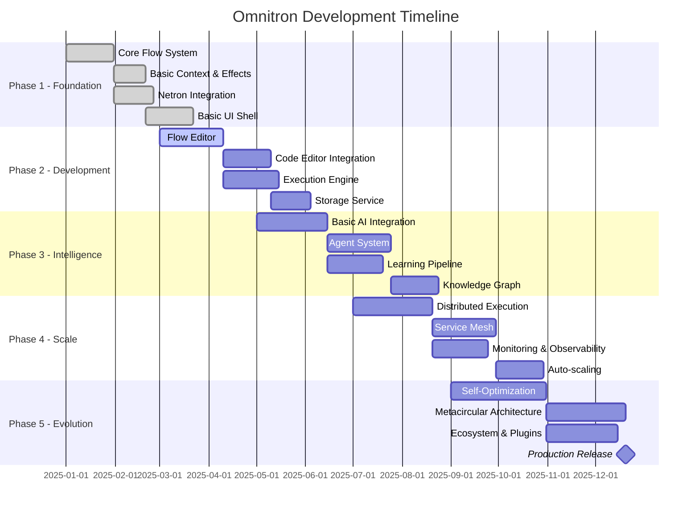

# Omnitron Implementation Roadmap
**Phased Development Plan**

Version: 1.0.0
Date: 2025-10-15
Status: Strategic Plan

---

## Executive Summary

This roadmap outlines the phased implementation of Omnitron, designed to deliver immediate value while building toward the complete vision. Each phase is self-contained and functional, providing a working system that can be used in production while laying the foundation for subsequent phases.



---

## Phase 1: Foundation (Months 1-2)

**Goal**: Establish core architecture and basic functionality

### 1.1 Core Flow System

Build the fundamental Flow execution engine.

```typescript
// Deliverables
interface Phase1Flow {
  // Basic Flow definition
  - Flow type system
  - Flow factory functions
  - Basic composition (pipe, compose)
  - Synchronous execution

  // Context system
  - Immutable context
  - Context propagation
  - Basic context providers

  // Effect system
  - Effect types definition
  - Effect tracking
  - Basic effect handlers
}

// Implementation tasks
const flowSystemTasks = [
  // Week 1-2: Core types and interfaces
  {
    task: "Define Flow interfaces",
    files: [
      "packages/holon/src/types.ts",
      "packages/holon/src/flow.ts"
    ],
    tests: [
      "packages/holon/test/flow.spec.ts"
    ]
  },

  // Week 3-4: Factory and composition
  {
    task: "Implement Flow factories",
    files: [
      "packages/holon/src/factories.ts",
      "packages/holon/src/composition.ts"
    ],
    tests: [
      "packages/holon/test/factories.spec.ts",
      "packages/holon/test/composition.spec.ts"
    ]
  }
];

// Success criteria
const phase1Criteria = {
  functionalTests: "100% pass rate",
  performance: "< 1ms for simple Flow execution",
  documentation: "Complete API reference",
  examples: "10+ working examples"
};
```

### 1.2 Netron RPC Integration

Integrate existing Netron for communication.

```typescript
// Integration points
const netronIntegration = {
  // Service definition
  services: [
    "FlowExecutorService",
    "FlowRegistryService"
  ],

  // Transport setup
  transports: [
    "WebSocketTransport",
    "HTTPTransport"
  ],

  // Basic security
  auth: [
    "APIKeyAuth",
    "JWTAuth"
  ]
};

// Milestone: First RPC call
const milestone1 = {
  demo: "Execute Flow via Netron RPC",
  endpoint: "FlowExecutor.execute",
  verification: "Round-trip < 10ms locally"
};
```

### 1.3 Basic UI Shell

Create minimal Aether-based UI.

```typescript
// UI Components
const phase1UI = {
  shell: {
    - Header with navigation
    - Sidebar with tools
    - Main content area
    - Status bar
  },

  pages: {
    - Dashboard (static)
    - Flow list
    - Simple Flow viewer
    - Settings
  },

  interactions: {
    - Navigation
    - Theme switching
    - Basic Flow selection
  }
};

// Tech stack
const uiStack = {
  framework: "@omnitron-dev/aether",
  styling: "CSS-in-JS with theme system",
  routing: "File-based routing",
  state: "Signal-based reactivity"
};
```

### Phase 1 Deliverables

- ✅ Working Flow execution engine
- ✅ Basic client-server communication
- ✅ Minimal functional UI
- ✅ Development environment setup
- ✅ Initial documentation
- ✅ CI/CD pipeline

---

## Phase 2: Development Environment (Months 3-4)

**Goal**: Create a functional development environment for Flow creation

### 2.1 Visual Flow Editor

Build the canvas-based Flow editor.

```typescript
// Flow Canvas Features
const flowCanvas = {
  rendering: {
    - Node rendering with ports
    - Connection drawing
    - Grid and snapping
    - Zoom and pan
    - Minimap
  },

  interactions: {
    - Drag and drop nodes
    - Connect ports
    - Select and multi-select
    - Copy/paste/delete
    - Undo/redo
  },

  nodeTypes: {
    - Input/Output nodes
    - Transform nodes
    - Control flow nodes
    - Custom nodes
  }
};

// Implementation milestones
const canvasMillestones = [
  "Render static Flow",
  "Interactive node manipulation",
  "Port connections",
  "Flow execution visualization",
  "Save/load Flows"
];
```

### 2.2 Code Editor Integration

Integrate Monaco for code editing.

```typescript
// Editor features
const codeEditor = {
  basic: {
    - Syntax highlighting
    - Auto-completion
    - Error markers
    - Code folding
  },

  flowSpecific: {
    - Flow type definitions
    - Inline documentation
    - Flow preview
    - Quick actions
  },

  integration: {
    - Sync with visual editor
    - Bidirectional updates
    - Git integration
    - File management
  }
};
```

### 2.3 Execution Engine

Build robust Flow execution system.

```typescript
// Execution features
const executionEngine = {
  modes: {
    - Synchronous execution
    - Asynchronous execution
    - Streaming execution
    - Batch execution
  },

  features: {
    - Progress tracking
    - Cancellation
    - Error handling
    - Result caching
  },

  debugging: {
    - Breakpoints
    - Step execution
    - Variable inspection
    - Execution trace
  }
};

// Performance targets
const performanceTargets = {
  latency: "< 10ms startup",
  throughput: "> 1000 ops/sec",
  memory: "< 100MB for 1000 Flows"
};
```

### 2.4 Storage Service

Implement persistence layer.

```typescript
// Storage implementation
const storageService = {
  backends: {
    - PostgreSQL for metadata
    - S3 for Flow definitions
    - Redis for caching
  },

  features: {
    - CRUD operations
    - Versioning
    - Search and filtering
    - Import/export
  },

  api: {
    - RESTful endpoints
    - GraphQL queries
    - Real-time subscriptions
  }
};
```

### Phase 2 Deliverables

- ✅ Functional Flow editor (visual & code)
- ✅ Flow execution with debugging
- ✅ Persistent storage
- ✅ Basic project management
- ✅ User authentication
- ✅ Collaboration features (view-only)

---

## Phase 3: Intelligence Integration (Months 5-6)

**Goal**: Add AI capabilities to enhance development experience

### 3.1 AI Model Integration

Integrate language models for assistance.

```typescript
// AI Integration
const aiIntegration = {
  models: {
    - OpenAI GPT-4
    - Anthropic Claude
    - Local models (Ollama)
  },

  features: {
    - Code completion
    - Flow generation from text
    - Error explanation
    - Documentation generation
  },

  apis: {
    - Completion API
    - Chat API
    - Embedding API
  }
};

// First AI feature
const firstAIFeature = {
  name: "Flow generation from description",
  input: "Natural language description",
  output: "Working Flow definition",
  demo: "Create CRUD Flow from description"
};
```

### 3.2 Agent System

Build autonomous agent framework.

```typescript
// Agent capabilities
const agentSystem = {
  agentTypes: {
    - Code review agent
    - Test generation agent
    - Optimization agent
    - Documentation agent
  },

  features: {
    - Task planning
    - Tool usage
    - Memory management
    - Learning from feedback
  },

  coordination: {
    - Multi-agent collaboration
    - Task delegation
    - Result aggregation
  }
};
```

### 3.3 Learning Pipeline

Implement continuous learning.

```typescript
// Learning features
const learningPipeline = {
  collection: {
    - User interaction tracking
    - Execution metrics
    - Error patterns
    - Success patterns
  },

  processing: {
    - Feature extraction
    - Pattern recognition
    - Anomaly detection
  },

  application: {
    - Improved suggestions
    - Automatic optimization
    - Personalization
  }
};
```

### 3.4 Knowledge Graph

Build knowledge management system.

```typescript
// Knowledge system
const knowledgeGraph = {
  storage: {
    - Graph database (Neo4j)
    - Vector database (Pinecone)
    - Document store
  },

  features: {
    - Semantic search
    - Relationship mapping
    - Pattern library
    - Best practices
  },

  integration: {
    - IDE suggestions
    - Documentation links
    - Example retrieval
  }
};
```

### Phase 3 Deliverables

- ✅ AI-powered code completion
- ✅ Natural language Flow creation
- ✅ Intelligent error assistance
- ✅ Basic agent system
- ✅ Knowledge base with search
- ✅ Learning from user patterns

---

## Phase 4: Scale & Distribution (Months 7-8)

**Goal**: Enable distributed execution and enterprise features

### 4.1 Distributed Execution

Build distributed Flow execution.

```typescript
// Distribution features
const distributedExecution = {
  architecture: {
    - Worker nodes
    - Coordinator nodes
    - Queue system
  },

  capabilities: {
    - Parallel execution
    - Load distribution
    - Fault tolerance
    - Result aggregation
  },

  deployment: {
    - Kubernetes operators
    - Auto-scaling
    - Rolling updates
  }
};
```

### 4.2 Service Mesh

Implement complete service mesh.

```typescript
// Service mesh
const serviceMesh = {
  features: {
    - Service discovery
    - Load balancing
    - Circuit breaking
    - Retry logic
  },

  observability: {
    - Distributed tracing
    - Metrics collection
    - Log aggregation
  },

  security: {
    - mTLS
    - Service authentication
    - Rate limiting
  }
};
```

### 4.3 Monitoring & Observability

Complete monitoring solution.

```typescript
// Monitoring stack
const monitoring = {
  metrics: {
    - Prometheus integration
    - Custom metrics
    - Real-time dashboards
  },

  tracing: {
    - Jaeger integration
    - Flow execution traces
    - Performance profiling
  },

  alerting: {
    - Alert rules
    - Notification channels
    - Incident management
  }
};
```

### Phase 4 Deliverables

- ✅ Distributed Flow execution
- ✅ Horizontal scaling
- ✅ Complete observability
- ✅ Enterprise authentication
- ✅ Multi-tenancy support
- ✅ Production-ready deployment

---

## Phase 5: Evolution & Ecosystem (Months 9-12)

**Goal**: Achieve self-evolution and build ecosystem

### 5.1 Self-Optimization

Implement self-improving capabilities.

```typescript
// Self-optimization
const selfOptimization = {
  capabilities: {
    - Automatic performance tuning
    - Resource optimization
    - Code improvement suggestions
    - Architecture evolution
  },

  learning: {
    - Performance patterns
    - Usage patterns
    - Error patterns
    - Success metrics
  },

  application: {
    - Auto-scaling policies
    - Query optimization
    - Caching strategies
    - Code refactoring
  }
};
```

### 5.2 Metacircular Architecture

Omnitron building itself.

```typescript
// Metacircular features
const metacircular = {
  capabilities: {
    - Omnitron-in-Omnitron
    - Self-modification
    - Self-compilation
    - Self-deployment
  },

  demonstrations: {
    - Build Omnitron with Omnitron
    - Extend Omnitron using itself
    - Deploy new versions
  }
};
```

### 5.3 Ecosystem Development

Build community and extensions.

```typescript
// Ecosystem features
const ecosystem = {
  marketplace: {
    - Flow marketplace
    - Component library
    - Template gallery
    - Agent marketplace
  },

  extensibility: {
    - Plugin system
    - Custom node types
    - Custom agents
    - Custom tools
  },

  community: {
    - Documentation
    - Tutorials
    - Forums
    - Contribution guide
  }
};
```

### Phase 5 Deliverables

- ✅ Self-optimizing system
- ✅ Metacircular capabilities
- ✅ Plugin ecosystem
- ✅ Marketplace
- ✅ Community platform
- ✅ Production release

---

## Implementation Strategy

### Development Methodology

```typescript
const methodology = {
  approach: "Iterative with continuous delivery",
  sprints: "2-week sprints",

  practices: {
    - Test-driven development
    - Continuous integration
    - Code review
    - Pair programming
  },

  quality: {
    - Automated testing (>90% coverage)
    - Performance benchmarking
    - Security scanning
    - Documentation generation
  }
};
```

### Team Structure

```typescript
const teamStructure = {
  coreTeam: {
    - Technical lead
    - Backend engineers (2)
    - Frontend engineers (2)
    - AI/ML engineer
    - DevOps engineer
  },

  supportTeam: {
    - UX designer
    - Technical writer
    - QA engineer
  },

  scaling: "Add 2-3 engineers per phase"
};
```

### Technology Decisions

```typescript
const techStack = {
  // Backend
  backend: {
    framework: "@omnitron-dev/titan",
    language: "TypeScript",
    runtime: "Node.js 22 / Bun",
    database: "PostgreSQL + Redis",
    queue: "BullMQ"
  },

  // Frontend
  frontend: {
    framework: "@omnitron-dev/aether",
    language: "TypeScript",
    bundler: "Vite",
    styling: "CSS-in-JS"
  },

  // Infrastructure
  infrastructure: {
    container: "Docker",
    orchestration: "Kubernetes",
    ci: "GitHub Actions",
    monitoring: "Prometheus + Grafana"
  },

  // AI/ML
  ai: {
    frameworks: "LangChain, Transformers",
    models: "GPT-4, Claude, Llama",
    vector: "Pinecone",
    training: "PyTorch"
  }
};
```

### Risk Mitigation

```typescript
const riskMitigation = {
  technical: {
    risk: "Complexity overwhelming",
    mitigation: "Incremental phases, each valuable standalone"
  },

  performance: {
    risk: "System too slow",
    mitigation: "Performance targets per phase, continuous optimization"
  },

  adoption: {
    risk: "Low user adoption",
    mitigation: "Early user feedback, iterate on UX"
  },

  ai: {
    risk: "AI integration challenges",
    mitigation: "Multiple model providers, fallback options"
  }
};
```

---

## Success Metrics

### Phase-wise Metrics

```typescript
const successMetrics = {
  phase1: {
    functionality: "Core Flow system working",
    performance: "< 10ms Flow execution",
    stability: "< 1% error rate"
  },

  phase2: {
    usability: "Create and execute Flows via UI",
    productivity: "10x faster than coding",
    satisfaction: "NPS > 50"
  },

  phase3: {
    intelligence: "50% tasks automated",
    accuracy: "> 90% AI suggestions accepted",
    learning: "Measurable improvement over time"
  },

  phase4: {
    scale: "Handle 10,000 concurrent Flows",
    reliability: "99.9% uptime",
    performance: "< 100ms p99 latency"
  },

  phase5: {
    ecosystem: "100+ community plugins",
    adoption: "1000+ active users",
    evolution: "System self-improves monthly"
  }
};
```

### Long-term Vision Metrics

```typescript
const visionMetrics = {
  year1: {
    users: 1000,
    flows: 10000,
    executions: "1M daily"
  },

  year2: {
    users: 10000,
    flows: 100000,
    executions: "10M daily",
    revenue: "$1M ARR"
  },

  year3: {
    users: 100000,
    flows: "1M",
    executions: "100M daily",
    revenue: "$10M ARR"
  }
};
```

---

## Migration Path

### From Existing Systems

```typescript
const migrationPath = {
  fromVSCode: {
    - Import existing projects
    - Preserve Git history
    - Convert to Flows gradually
    - Maintain compatibility
  },

  fromN8N: {
    - Import workflow definitions
    - Convert to Flow format
    - Enhance with code capabilities
  },

  fromCustom: {
    - API compatibility layer
    - Gradual migration tools
    - Parallel operation
  }
};
```

---

## Launch Strategy

### Beta Program

```typescript
const betaProgram = {
  phase1Beta: {
    participants: 10,
    focus: "Core developers",
    duration: "1 month",
    feedback: "Weekly sessions"
  },

  phase2Beta: {
    participants: 50,
    focus: "Power users",
    duration: "2 months",
    feedback: "Bi-weekly surveys"
  },

  publicBeta: {
    participants: 500,
    focus: "General developers",
    duration: "3 months",
    feedback: "Community forum"
  }
};
```

### Documentation & Training

```typescript
const documentation = {
  types: {
    - Getting started guide
    - API reference
    - Architecture overview
    - Best practices
    - Video tutorials
  },

  training: {
    - Online course
    - Workshop materials
    - Certification program
  },

  support: {
    - Community forum
    - Discord server
    - Office hours
    - Premium support
  }
};
```

---

## Conclusion

This roadmap provides a clear path from concept to production-ready platform. Each phase builds on the previous, delivering immediate value while progressing toward the ultimate vision of a self-evolving, intelligent development platform.

### Key Success Factors

1. **Iterative Development**: Each phase is usable and valuable
2. **User-Centric**: Continuous feedback and iteration
3. **Performance Focus**: Metrics and optimization throughout
4. **Community Building**: Early engagement and ecosystem development
5. **Technical Excellence**: Quality, testing, and documentation

### Next Steps

1. Finalize Phase 1 technical specifications
2. Set up development environment
3. Begin core Flow system implementation
4. Establish CI/CD pipeline
5. Recruit initial beta users

The journey to create Omnitron begins with a single Flow. Let's start building the future of development platforms.

---

**"In Omnitron, we don't just write software—we grow computational organisms that evolve with our needs."**