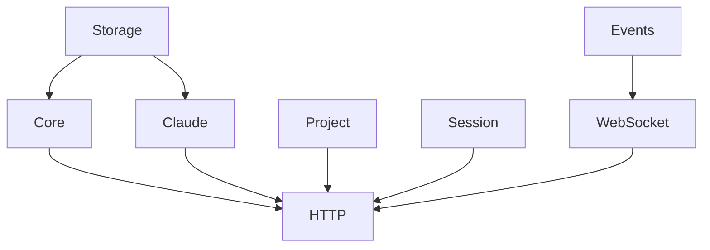

# Orchestron Application Architecture

## Overview

The Orchestron application has been refactored from a standalone implementation to a modular, Titan-based architecture. This provides better separation of concerns, dependency injection, and lifecycle management.

## Architecture

### Core Application (`src/orchestron/main.ts`)

The main entry point that bootstraps the Titan application with all necessary modules.

### Module Structure

```
src/orchestron/modules/
├── storage/        # SQLite storage layer
├── core/           # Core orchestration engine (tasks, sprints, analytics)
├── claude/         # Claude Code integration
├── http/           # HTTP server and API
├── mcp/            # Model Context Protocol implementation
├── session/        # Session management
├── project/        # Project management
├── checkpoint/     # Checkpoint and restoration
└── agents/         # AI agent coordination
```

### Key Modules

#### 1. Storage Module
- Provides SQLite database connection
- Shared across all modules requiring persistence
- Global singleton scope

#### 2. Core Module
- `OrchestronEngine`: Main orchestration engine
- `TaskManager`: Task tracking and management
- `SprintManager`: Sprint planning and tracking
- `Analytics`: Project analytics and metrics
- `MLPredictor`: Machine learning predictions
- `UnifiedOrchestron`: Unified interface for all operations

#### 3. Claude Module
- `ClaudeService`: Main Claude Code interaction service
- `ClaudeBinaryService`: Finds and manages Claude executable
- `ClaudeProcessManager`: Manages running Claude processes
- Handles sessions, projects, and real-time output streaming

#### 4. HTTP Module
- `HttpService`: Fastify-based HTTP server
- `ApiRouter`: REST API endpoint logic
- `WebSocketService`: Real-time WebSocket communication
- Serves dashboard and provides API at port 3001
- WebSocket server at port 3002

## Running the Application

### Development Mode

```bash
# Run the Orchestron server in development mode
yarn orchestron:dev

# Or using npm
npm run orchestron:dev
```

### Production Mode

```bash
# Build and run
yarn orchestron

# Or using npm
npm run orchestron
```

### Environment Variables

```bash
# Core Configuration
NODE_ENV=development|production
DEBUG=true|false
LOG_LEVEL=debug|info|warn|error

# Orchestron Configuration
ORCHESTRON_CONFIG=./orchestron.config.json
ORCHESTRON_PORT=3001
ORCHESTRON_HOST=0.0.0.0
ORCHESTRON_STORAGE_PATH=.orchestron

# Redis (optional)
ORCHESTRON_REDIS_ENABLED=true
REDIS_HOST=localhost
REDIS_PORT=6379
REDIS_PASSWORD=
```

## API Endpoints

### Dashboard & Statistics
- `GET /api/dashboard` - Complete dashboard data
- `GET /api/stats` - Project statistics
- `GET /health` - Health check

### Tasks
- `GET /api/tasks` - List tasks (with filters)
- `GET /api/tasks/:id` - Get specific task
- `PATCH /api/tasks/:id/status` - Update task status

### Sprints
- `GET /api/sprints` - List all sprints
- `GET /api/sprints/active` - Get active sprint
- `GET /api/sprints/:id/burndown` - Sprint burndown data

### Claude Integration
- `GET /api/claude/projects` - List Claude projects
- `GET /api/claude/projects/:id/sessions` - Get project sessions
- `GET /api/claude/sessions/:projectId/:sessionId` - Session history
- `POST /api/claude/execute` - Execute Claude Code
- `POST /api/claude/cancel` - Cancel execution
- `GET /api/claude/running` - Running sessions
- `GET /api/claude/version` - Check Claude version

### Settings
- `GET /api/settings` - Get settings
- `POST /api/settings` - Save settings
- `GET /api/system-prompt` - Get CLAUDE.md
- `POST /api/system-prompt` - Save CLAUDE.md

## WebSocket Events

The WebSocket server broadcasts real-time events:

### Task Events
- `task:created`
- `task:updated`
- `task:completed`

### Sprint Events
- `sprint:started`
- `sprint:ended`

### Claude Events
- `claude:output` - Streaming output from Claude
- `claude:error` - Error messages
- `claude:complete` - Execution complete

### Other Events
- `timer:started/stopped`
- `workflow:triggered`

## Module Dependencies



## Benefits of Titan Architecture

1. **Dependency Injection**: Automatic service resolution and injection
2. **Lifecycle Management**: Proper startup/shutdown sequences
3. **Module Isolation**: Each module is self-contained
4. **Configuration Management**: Centralized config with defaults
5. **Logging**: Structured logging with Pino
6. **Event System**: Built-in event bus for inter-module communication
7. **Graceful Shutdown**: Proper cleanup on application termination
8. **Health Checks**: Built-in health monitoring
9. **Extensibility**: Easy to add new modules
10. **Testing**: Better testability with DI

## Next Steps

1. **Complete MCP Module**: Implement full Model Context Protocol
2. **Agent Coordination**: Build out multi-agent system
3. **Session Persistence**: Enhanced session management
4. **Checkpoint System**: Full checkpoint/restore functionality
5. **Dashboard UI**: Complete web dashboard implementation
6. **Authentication**: Add user authentication and authorization
7. **Metrics Collection**: Add Prometheus metrics
8. **Distributed Mode**: Support for distributed deployment
9. **Plugin System**: Support for external plugins
10. **CLI Integration**: Full CLI command integration

## Migration from Old Architecture

The existing CLI (`src/cli.ts`) and dashboard server (`src/dashboard/server.ts`) continue to work independently. The new Orchestron application can run alongside them during the transition period.

To fully migrate:
1. Move CLI commands to use the Orchestron API
2. Replace dashboard server with Orchestron's HTTP module
3. Migrate existing storage to new module structure
4. Update tests for new architecture

## Testing

```bash
# Run tests
yarn test

# With coverage
yarn test:coverage

# UI mode
yarn test:ui
```

## Building

```bash
# Build everything
yarn build

# Build backend only
yarn build:backend

# Build web dashboard
yarn build:web
```

## Docker Support (Future)

```dockerfile
FROM node:22-alpine
WORKDIR /app
COPY . .
RUN yarn install --frozen-lockfile
RUN yarn build
CMD ["node", "dist/orchestron/main.js"]
```

## Performance Considerations

- SQLite for local storage (single-writer, multiple-reader)
- Event-driven architecture for real-time updates
- WebSocket for efficient client communication
- Process pooling for Claude executions
- Lazy module loading where appropriate
- Connection pooling for future Redis/PostgreSQL

## Security

- Input validation with Zod
- CORS configuration
- Process isolation for Claude execution
- Sanitized error messages
- Future: JWT authentication, rate limiting

## Monitoring

- Structured logging with Pino
- Health check endpoint
- Process metrics via `/api/stats`
- Future: OpenTelemetry integration

This architecture provides a solid foundation for the Orchestron development orchestration system, with clear separation of concerns and excellent extensibility.