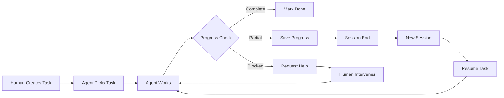
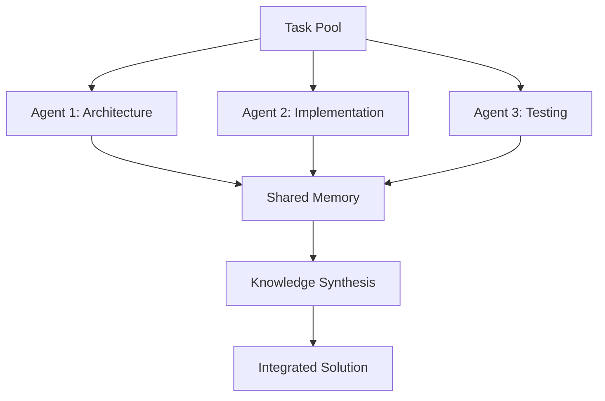
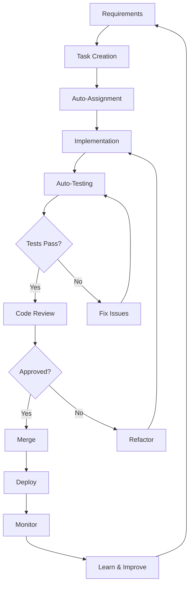

# Orchestron User Guide - Continuous Development Orchestration System

## Table of Contents

1. [Introduction](#introduction)
2. [Core Concepts](#core-concepts)
3. [Development Workflow Models](#development-workflow-models)
4. [Practical Implementation with Claude Code](#practical-implementation-with-claude-code)
5. [Human-AI Collaboration Patterns](#human-ai-collaboration-patterns)
6. [Setting Up Orchestron](#setting-up-orchestron)
7. [Task Management Workflow](#task-management-workflow)
8. [Multi-Agent Coordination](#multi-agent-coordination)
9. [Continuous Development Cycles](#continuous-development-cycles)
10. [Human Intervention Points](#human-intervention-points)
11. [Best Practices](#best-practices)
12. [Troubleshooting](#troubleshooting)

## 1. Introduction

Orchestron is a comprehensive development orchestration system designed to enable continuous, automated development workflows with Claude Code and other AI agents. It provides persistent state management, task tracking, and coordination mechanisms for both single-agent and multi-agent development scenarios.

### What Orchestron Actually Does

**Implemented Features:**
- ✅ Persistent task and sprint management
- ✅ DAG-based cognitive state tracking
- ✅ ML-powered predictive analytics
- ✅ CLI interface for all operations
- ✅ SQLite-based persistent storage
- ✅ Multi-agent memory architecture
- ✅ Real-time analytics and bottleneck detection

**Integration Points:**
- Claude Code CLI sessions
- File system monitoring
- Git integration
- Test runner hooks
- Custom workflow automation

## 2. Core Concepts

### 2.1 Cognitive State Management

Orchestron maintains a directed acyclic graph (DAG) of all development activities:

```
┌─────────────┐     ┌─────────────┐     ┌─────────────┐
│   EPIC      │────>│   STORY     │────>│   TASK      │
└─────────────┘     └─────────────┘     └─────────────┘
                            │                    │
                            ▼                    ▼
                    ┌─────────────┐     ┌─────────────┐
                    │   SUBTASK   │────>│    TODO     │
                    └─────────────┘     └─────────────┘
```

### 2.2 Task Lifecycle

```
BACKLOG → TODO → IN_PROGRESS → IN_REVIEW → TESTING → DONE
           ↓                       ↓           ↓
        BLOCKED ←──────────────────────────────┘
```

### 2.3 Agent Sessions

Each Claude Code session is treated as an agent session with:
- Unique session ID
- Task context
- Working memory
- Progress tracking
- Knowledge generation

## 3. Development Workflow Models

### 3.1 Single Agent Continuous Development



### 3.2 Multi-Agent Parallel Development



## 4. Practical Implementation with Claude Code

### 4.1 Session Initialization

When a Claude Code session starts, it should:

1. **Check for existing context:**
```bash
orchestron context
```

2. **Resume or create task:**
```bash
# Check current tasks
orchestron task list --status IN_PROGRESS --assignee me

# Or pick new task from backlog
orchestron task list --status TODO --limit 5
orchestron task update TASK-123 --status IN_PROGRESS
```

3. **Load relevant context:**
```bash
orchestron goto task:123
```

### 4.2 During Development

Claude Code can automatically:

1. **Track progress:**
```bash
# After implementing a feature
orchestron task update TASK-123 --progress 60

# Complete checkpoint
orchestron task checkpoint TASK-123 "API endpoints completed"
```

2. **Log decisions:**
```bash
orchestron decide "Use WebSocket for real-time updates" \
  --rationale "Lower latency than polling" \
  --alternatives "HTTP polling,SSE"
```

3. **Track time:**
```bash
orchestron timer start TASK-123
# ... work ...
orchestron timer stop TASK-123
```

### 4.3 Session Handoff

Before ending a session:

```bash
# Save current context
orchestron context save

# Document blockers
orchestron task update TASK-123 \
  --status BLOCKED \
  --notes "Need clarification on authentication flow"

# Create TODOs for next session
orchestron todo "Implement JWT refresh logic"
orchestron todo "Add rate limiting to API"
```

## 5. Human-AI Collaboration Patterns

### 5.1 Continuous Feedback Loop

```
Human                     Orchestron                    Claude
  │                           │                           │
  ├─Create Epic──────────────>│                           │
  │                           ├─Decompose to Tasks────────>│
  │                           │<─Task Breakdown────────────┤
  │<─Review Tasks──────────────┤                           │
  ├─Approve/Modify───────────>│                           │
  │                           ├─Assign Task───────────────>│
  │                           │                           ├─Work
  │                           │<─Progress Update───────────┤
  │<─Status Notification───────┤                           │
  │                           │                           ├─Complete
  │                           │<─Mark Complete─────────────┤
  │<─Ready for Review──────────┤                           │
  ├─Review & Feedback─────────>│                           │
  │                           ├─Next Task─────────────────>│
```

### 5.2 Intervention Points

**Automatic Pause Points:**
1. Task blocked by dependency
2. Test failures above threshold
3. Unclear requirements detected
4. Major architectural decisions
5. Security-sensitive changes

**Human Can Always:**
- View real-time progress
- Modify task priorities
- Add clarifications
- Override decisions
- Pause/resume work

## 6. Setting Up Orchestron

### 6.1 Initial Installation

```bash
# Install Orchestron globally
npm install -g orchestron

# Initialize in project
cd your-project
orchestron init

# This creates:
# - .orchestron/orchestron.db (SQLite database)
# - .orchestron/config.json (Configuration)
```

### 6.2 Configuration

Create `.orchestron/config.json`:

```json
{
  "agent": {
    "id": "claude-main",
    "model": "claude-opus-4.1",
    "specialization": ["full-stack"]
  },
  "workflow": {
    "autoProgress": true,
    "autoCommit": false,
    "testBeforeComplete": true
  },
  "notifications": {
    "onBlocked": true,
    "onComplete": true,
    "dailySummary": true
  }
}
```

### 6.3 Claude Code Integration

Add to your Claude Code session initialization:

```bash
# .claude/startup.sh
#!/bin/bash

# Initialize Orchestron context
orchestron context load

# Show current status
orchestron status

# List active tasks
orchestron task list --mine --status IN_PROGRESS
```

## 7. Task Management Workflow

### 7.1 Creating and Planning Work

```bash
# Create an epic for a major feature
orchestron task create "Implement real-time chat" \
  --type EPIC \
  --priority HIGH

# Break down into stories
orchestron task create "Design chat architecture" \
  --type STORY \
  --parent EPIC-001

orchestron task create "Implement WebSocket server" \
  --type STORY \
  --parent EPIC-001

# Create specific tasks
orchestron task create "Set up Socket.io server" \
  --type TASK \
  --parent STORY-001 \
  --estimate 4 \
  --assignee claude
```

### 7.2 Sprint Management

```bash
# Create sprint
orchestron sprint create "Sprint 15" \
  --goal "Complete chat MVP" \
  --duration 14

# Add tasks to sprint
orchestron sprint add TASK-101 TASK-102 TASK-103

# Start sprint
orchestron sprint start SPRINT-15

# Track progress
orchestron sprint burndown
orchestron sprint velocity
```

### 7.3 Progress Tracking

```bash
# Update task status
orchestron task update TASK-101 --status IN_PROGRESS

# Log progress
orchestron task progress TASK-101 --percent 30

# Add checkpoint
orchestron task checkpoint TASK-101 \
  "Database schema created"

# Log time
orchestron timer log TASK-101 --hours 2.5
```

## 8. Multi-Agent Coordination

### 8.1 Task Distribution Strategy

```typescript
// Expertise-based distribution
interface TaskAssignment {
  "claude-architect": ["Design API", "Create schemas"],
  "claude-frontend": ["Build UI components", "Style pages"],
  "claude-backend": ["Implement endpoints", "Database logic"],
  "claude-testing": ["Write tests", "Performance testing"]
}
```

### 8.2 Shared Memory Pattern

```bash
# Agent 1 discovers solution
orchestron memory add solution "auth-flow" \
  --description "JWT with refresh token rotation" \
  --confidence 0.9

# Agent 2 can access it
orchestron memory get solution "auth-flow"

# Agent 3 improves it
orchestron memory update solution "auth-flow" \
  --add-detail "Use Redis for token blacklist"
```

### 8.3 Handoff Protocol

```bash
# Agent 1 prepares handoff
orchestron handoff prepare TASK-101 \
  --to claude-backend \
  --context "Frontend API client ready" \
  --next-steps "Implement server endpoints"

# Agent 2 accepts handoff
orchestron handoff accept TASK-101
orchestron context load TASK-101
```

## 9. Continuous Development Cycles

### 9.1 Automated Development Loop



### 9.2 Implementation Example

```bash
#!/bin/bash
# continuous-dev.sh

while true; do
  # Pick next task
  TASK=$(orchestron task next --auto-assign)

  if [ -z "$TASK" ]; then
    echo "No tasks available"
    sleep 60
    continue
  fi

  # Start work
  orchestron task start $TASK

  # Implementation phase
  while [ "$(orchestron task status $TASK)" = "IN_PROGRESS" ]; do
    # Work on task (Claude implements here)
    orchestron task work $TASK

    # Check for human input
    if orchestron task has-feedback $TASK; then
      orchestron task apply-feedback $TASK
    fi

    # Update progress
    PROGRESS=$(calculate_progress)
    orchestron task progress $TASK --percent $PROGRESS

    # Run tests
    if [ "$PROGRESS" -gt 80 ]; then
      if run_tests; then
        orchestron task update $TASK --status IN_REVIEW
      else
        orchestron task log $TASK "Tests failing, continuing work"
      fi
    fi
  done

  # Task complete or blocked
  orchestron task complete $TASK
done
```

## 10. Human Intervention Points

### 10.1 Synchronous Intervention

**Via CLI During Session:**
```bash
# Human checks status
$ orchestron status
Current Task: TASK-101 (60% complete)
Status: IN_PROGRESS
Blockers: None

# Human adds clarification
$ orchestron task clarify TASK-101 \
  "Use PostgreSQL for user data, Redis for sessions"

# Claude immediately sees update
$ orchestron task get-clarifications TASK-101
```

### 10.2 Asynchronous Intervention

**Via Web Dashboard or Separate Terminal:**
```bash
# Human reviews progress
$ orchestron dashboard

# Add feedback for next session
$ orchestron feedback add TASK-101 \
  "Good progress. Focus on error handling next"

# Modify priority
$ orchestron task priority TASK-102 --set CRITICAL

# Add dependency
$ orchestron task depend TASK-103 --on TASK-101
```

### 10.3 Checkpoint Reviews

```bash
# Define review points
orchestron workflow create review-points.yaml
```

```yaml
# review-points.yaml
name: checkpoint-review
triggers:
  - type: progress
    threshold: 50
    action: notify-human
  - type: milestone
    name: "API Complete"
    action: request-review
  - type: decision
    severity: high
    action: pause-for-approval
```

## 11. Best Practices

### 11.1 Task Granularity

- **EPICs**: 1-3 months of work
- **STORYs**: 1-2 weeks of work
- **TASKs**: 1-3 days of work
- **SUBTASKs**: 2-8 hours of work
- **TODOs**: < 2 hours of work

### 11.2 Context Management

```bash
# Save context before major changes
orchestron context snapshot "Before refactoring auth"

# Load specific context
orchestron context load --snapshot "Before refactoring auth"

# Prune old context
orchestron context prune --older-than 30d
```

### 11.3 Knowledge Accumulation

```bash
# Document patterns
orchestron knowledge add pattern "error-handling" \
  --description "Use Result<T,E> pattern" \
  --example "code/patterns/result.ts"

# Record decisions
orchestron decide "Use microservices" \
  --pros "Scalability,Independent deployment" \
  --cons "Complexity,Network overhead"

# Learn from errors
orchestron error analyze --last 7d \
  --generate-prevention-rules
```

### 11.4 Progress Tracking

```bash
# Regular progress updates
*/30 * * * * orchestron task sync-progress

# Daily summaries
0 18 * * * orchestron report daily --email team@example.com

# Sprint reviews
0 10 * * FRI orchestron sprint review --generate-retro
```

## 12. Troubleshooting

### 12.1 Common Issues

**Task Stuck in IN_PROGRESS:**
```bash
# Check for blockers
orchestron task analyze TASK-101

# Force status update
orchestron task update TASK-101 --status BLOCKED \
  --reason "Waiting for API design approval"

# Reassign if needed
orchestron task assign TASK-101 --to claude-backend
```

**Context Lost Between Sessions:**
```bash
# Recover from backup
orchestron context recover --latest

# Rebuild from git history
orchestron context rebuild --from-git

# Manual context load
orchestron context import context-backup.json
```

**Conflicting Changes:**
```bash
# Detect conflicts
orchestron conflict detect

# Resolve with strategy
orchestron conflict resolve --strategy last-write-wins

# Manual resolution
orchestron conflict show CONFLICT-001
orchestron conflict resolve CONFLICT-001 --manual
```

### 12.2 Performance Optimization

```bash
# Analyze bottlenecks
orchestron analyze bottlenecks

# Optimize database
orchestron db optimize

# Clean old data
orchestron cleanup --before 2024-01-01

# Reindex for performance
orchestron db reindex
```

## Appendix A: Complete Workflow Example

### A.1 Project Initialization

```bash
# 1. Initialize Orchestron
orchestron init --project "E-commerce Platform"

# 2. Create project structure
orchestron task create "Build E-commerce Platform" --type EPIC

# 3. Define stories
orchestron task create "User Authentication" --type STORY --parent EPIC-001
orchestron task create "Product Catalog" --type STORY --parent EPIC-001
orchestron task create "Shopping Cart" --type STORY --parent EPIC-001
orchestron task create "Payment Integration" --type STORY --parent EPIC-001

# 4. Create first sprint
orchestron sprint create "Sprint 1" \
  --goal "Complete authentication and catalog" \
  --duration 14

# 5. Break down first story to tasks
orchestron task create "Design auth database schema" \
  --type TASK --parent STORY-001 --estimate 4

orchestron task create "Implement JWT authentication" \
  --type TASK --parent STORY-001 --estimate 8

orchestron task create "Create login/signup UI" \
  --type TASK --parent STORY-001 --estimate 6

# 6. Add tasks to sprint
orchestron sprint add TASK-001 TASK-002 TASK-003
```

### A.2 Development Session

```bash
#!/bin/bash
# claude-session.sh

# Start session
SESSION_ID=$(orchestron session start --agent claude-main)

# Get assigned task
TASK=$(orchestron task next --assignee me)
echo "Working on: $TASK"

# Load context
orchestron context load $TASK

# Start timer
orchestron timer start $TASK

# Update status
orchestron task update $TASK --status IN_PROGRESS

# Development loop
while working; do
  # Implement feature
  # ... (actual code writing happens here)

  # Check for updates
  if orchestron task has-updates $TASK; then
    UPDATES=$(orchestron task get-updates $TASK)
    echo "New information: $UPDATES"
    # Adjust implementation based on updates
  fi

  # Save progress
  orchestron task checkpoint $TASK "Implemented user model"

  # Run tests
  if npm test; then
    orchestron task progress $TASK --percent 70
  else
    orchestron task log $TASK "Tests failing: $(npm test 2>&1)"
  fi
done

# Complete task
orchestron task update $TASK --status IN_REVIEW
orchestron timer stop $TASK

# End session
orchestron session end $SESSION_ID
```

### A.3 Human Review Process

```bash
# Check completed tasks
orchestron task list --status IN_REVIEW

# Review specific task
orchestron task review TASK-002

# Add feedback
orchestron task feedback TASK-002 \
  "Good implementation, but need better error handling"

# Request changes
orchestron task update TASK-002 \
  --status IN_PROGRESS \
  --notes "Add try-catch blocks and user-friendly error messages"

# Or approve
orchestron task approve TASK-002
orchestron task update TASK-002 --status DONE
```

## Appendix B: Architecture Diagrams

### B.1 System Architecture

```
┌──────────────────────────────────────────────────────┐
│                    Orchestron Core                    │
├────────────┬────────────┬──────────────┬────────────┤
│   Engine   │    Task    │   Analytics  │    ML      │
│    (DAG)   │  Manager   │              │ Predictor  │
└────────────┴────────────┴──────────────┴────────────┘
        │                          │
        ▼                          ▼
┌──────────────────┐      ┌──────────────────┐
│  SQLite Storage  │      │   Multi-Agent    │
│                  │      │     Memory       │
└──────────────────┘      └──────────────────┘
        │                          │
        └──────────┬───────────────┘
                   ▼
         ┌──────────────────┐
         │   CLI Interface  │
         └──────────────────┘
                   │
        ┌──────────┴──────────┐
        ▼                     ▼
┌──────────────┐      ┌──────────────┐
│ Claude Code  │      │   Human UI   │
└──────────────┘      └──────────────┘
```

### B.2 Data Flow

```
User Input → Task Creation → Task Queue → Agent Assignment
                                ↓
                          Agent Picks Task
                                ↓
                          Implementation
                                ↓
                          Progress Update ←─── Human Feedback
                                ↓
                            Testing
                                ↓
                        Review & Approval
                                ↓
                           Completion
                                ↓
                        Knowledge Storage
                                ↓
                    Next Task Selection
```

## Appendix C: Configuration Reference

### C.1 Complete Configuration Example

```json
{
  "project": {
    "name": "My Project",
    "description": "Project description",
    "version": "1.0.0"
  },
  "agent": {
    "id": "claude-main",
    "model": "claude-opus-4.1",
    "specialization": ["full-stack", "architecture"],
    "preferences": {
      "codeStyle": "functional",
      "testingFramework": "jest",
      "language": "typescript"
    }
  },
  "workflow": {
    "autoProgress": true,
    "autoCommit": false,
    "testBeforeComplete": true,
    "requireReview": true,
    "parallelTasks": 3
  },
  "storage": {
    "type": "sqlite",
    "path": ".orchestron/orchestron.db",
    "backup": {
      "enabled": true,
      "frequency": "daily",
      "retention": 30
    }
  },
  "ml": {
    "enablePredictions": true,
    "anomalyDetection": true,
    "confidenceThreshold": 0.8
  },
  "notifications": {
    "onBlocked": true,
    "onComplete": true,
    "onError": true,
    "dailySummary": true,
    "channels": {
      "email": "team@example.com",
      "slack": "#dev-updates"
    }
  },
  "quality": {
    "minTestCoverage": 80,
    "maxComplexity": 10,
    "lintOnCommit": true,
    "formatOnSave": true
  }
}
```

---

## Conclusion

Orchestron provides a practical framework for continuous AI-assisted development with clear human intervention points. By maintaining persistent state, tracking progress, and enabling seamless handoffs between sessions, it enables truly continuous development workflows that leverage AI capabilities while maintaining human oversight and control.

The system is designed to work with Claude Code's actual capabilities, avoiding speculation about unavailable features while maximizing the effectiveness of what is available today. As Claude Code evolves, Orchestron can adapt to leverage new capabilities while maintaining backward compatibility.

For questions and support, please refer to the [Orchestron documentation](https://github.com/orchestron/orchestron) or file an issue in the repository.