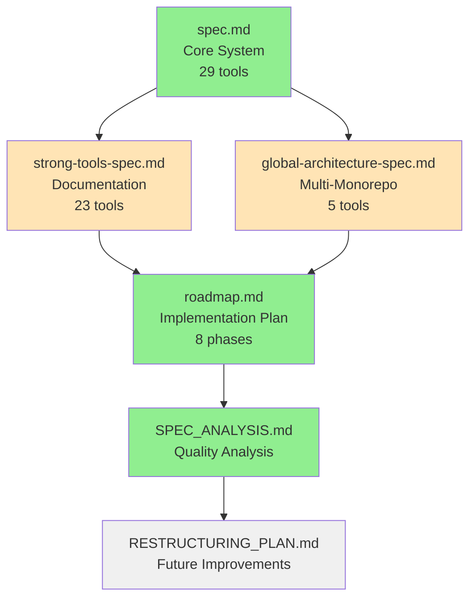

# Meridian Specifications Index

**Last Updated**: October 18, 2025
**Total Specifications**: 4
**Total Lines**: 8,397
**Total MCP Tools**: 57

---

## Quick Navigation

### Core Specifications

1. **[Core Specification](./spec.md)** - Production Specification
   - **Status**: ✅ **100% Implemented**
   - **Lines**: 2,134
   - **Language**: Russian
   - **MCP Tools**: 29 (all production-ready)
   - **Test Coverage**: 431/431 tests passing (100%)
   - **Key Topics**: Cognitive memory system, MCP protocol, core tools, session management

2. **[Strong Tools Specification](./strong-tools-spec.md)** - v1.0.0
   - **Status**: ⚠️ **Design (Partially Implemented)**
   - **Lines**: 2,519
   - **Language**: Russian
   - **MCP Tools**: 23 (documentation, examples, tests, agents)
   - **Key Topics**: Documentation generation, example/test generation, agent system, auto-update

3. **[Global Architecture Specification](./global-architecture-spec.md)** - v2.0.0
   - **Status**: ⚠️ **Design (Partially Implemented)**
   - **Lines**: 2,140
   - **Language**: Russian
   - **MCP Tools**: 5 (global operations)
   - **Key Topics**: Multi-monorepo, project registry, cross-repo access, two-tier storage

4. **[Implementation Roadmap](./roadmap.md)** - v1.0.0
   - **Status**: ✅ **Active Development Tracking**
   - **Lines**: 1,264
   - **Language**: English
   - **Timeline**: 16 weeks (78% complete)
   - **Key Topics**: Phased implementation, testing strategy, progress tracking

### Supporting Documents

5. **[Specification Analysis](./SPEC_ANALYSIS.md)** - Current
   - **Status**: ✅ **Analysis Complete**
   - **Purpose**: Comprehensive analysis of all specifications
   - **Key Findings**: Quality score 94/100, recommendations for improvement

6. **[Restructuring Plan](./RESTRUCTURING_PLAN.md)** - Planned
   - **Status**: ⏳ **To Be Created**
   - **Purpose**: Plan for reorganizing specification structure (if needed)

---

## Specification Relationships

**Legend**:
- 🟢 Green: Implemented/Complete
- 🟠 Orange: Design/Partial
- ⚪ Gray: Planned/Future

---

## Version History

| Specification | Current Version | Last Updated | Status | Test Coverage |
|--------------|----------------|--------------|---------|---------------|
| spec.md | Production (≈v2.0.0) | Oct 18, 2025 | ✅ Implemented | 431/431 (100%) |
| strong-tools-spec.md | v1.0.0 | Oct 18, 2025 | ⚠️ Design | Partial |
| global-architecture-spec.md | v2.0.0 | Oct 18, 2025 | ⚠️ Design | Partial |
| roadmap.md | v1.0.0 | Oct 18, 2025 | ✅ Active | N/A (tracking doc) |
| SPEC_ANALYSIS.md | Current | Oct 18, 2025 | ✅ Complete | N/A (analysis doc) |

---

## By Topic

### 🧠 Core Architecture

**Cognitive Memory System**:
- [spec.md](./spec.md) - Lines 44-169: 4-tier memory model
  - Episodic Memory (task episodes)
  - Working Memory (active context)
  - Semantic Memory (patterns & knowledge)
  - Procedural Memory (how-to knowledge)

**Adaptive Context Management**:
- [spec.md](./spec.md) - Lines 171-242: LLM adapter, context manager
- [spec.md](./spec.md) - Lines 296-418: Context compression, defragmentation

**MCP Protocol**:
- [spec.md](./spec.md) - Lines 561-846: MCP server, tools, protocol details
- [spec.md](./spec.md) - Lines 2000-2134: Production status, Claude CLI integration

### 🗂️ Multi-Monorepo System

**Global Architecture**:
- [global-architecture-spec.md](./global-architecture-spec.md) - Lines 1-145: Overview, motivation
- [global-architecture-spec.md](./global-architecture-spec.md) - Lines 496-570: Two-tier architecture

**Project Identity**:
- [global-architecture-spec.md](./global-architecture-spec.md) - Lines 215-301: Content-based IDs
- [global-architecture-spec.md](./global-architecture-spec.md) - Lines 302-495: Project Registry

**Cross-Monorepo Access**:
- [global-architecture-spec.md](./global-architecture-spec.md) - Lines 923-1034: Cross-repo documentation
- [global-architecture-spec.md](./global-architecture-spec.md) - Lines 1513-1711: Global MCP tools

### 📚 Documentation & Knowledge Management

**Documentation Generation**:
- [strong-tools-spec.md](./strong-tools-spec.md) - Lines 295-560: Doc generation system
- [strong-tools-spec.md](./strong-tools-spec.md) - Lines 1604-1695: MCP tools for docs

**Example & Test Generation**:
- [strong-tools-spec.md](./strong-tools-spec.md) - Lines 562-719: Example generation
- [strong-tools-spec.md](./strong-tools-spec.md) - Lines 720-944: Test generation (multi-framework)
- [strong-tools-spec.md](./strong-tools-spec.md) - Lines 1696-1818: MCP tools for examples/tests

**Quality & Validation**:
- [strong-tools-spec.md](./strong-tools-spec.md) - Lines 462-506: Quality scoring system
- [strong-tools-spec.md](./strong-tools-spec.md) - Lines 507-560: Documentation transformation

### 🤖 Agent System

**Agent Architecture**:
- [strong-tools-spec.md](./strong-tools-spec.md) - Lines 946-1249: Agent integration
- [strong-tools-spec.md](./strong-tools-spec.md) - Lines 1250-1284: Agent workflow examples

**Agent Types**:
- [strong-tools-spec.md](./strong-tools-spec.md) - Lines 960-1094: Architect Agent
- [strong-tools-spec.md](./strong-tools-spec.md) - Lines 1120-1170: Developer Agent
- [strong-tools-spec.md](./strong-tools-spec.md) - Lines 1172-1249: Tester Agent

**Agent Tools**:
- [strong-tools-spec.md](./strong-tools-spec.md) - Lines 1820-1862: MCP tools for agents

### 🔧 Implementation

**Implementation Phases**:
- [roadmap.md](./roadmap.md) - Lines 164-535: Phase 0-7 detailed plans
- [roadmap.md](./roadmap.md) - Lines 1216-1230: Progress tracking

**Testing Strategy**:
- [roadmap.md](./roadmap.md) - Lines 1094-1130: Test pyramid, coverage requirements
- [spec.md](./spec.md) - Lines 2089-2113: Test results and verification

**Deployment**:
- [roadmap.md](./roadmap.md) - Lines 1132-1165: Incremental rollout strategy
- [roadmap.md](./roadmap.md) - Lines 1192-1212: Risk management

---

## MCP Tools Catalog

### Core Tools (29) - ✅ Implemented

**Memory Management (4)**:
1. `memory.record_episode` - Record task episode
2. `memory.find_similar_episodes` - Find similar tasks
3. `memory.update_working_set` - Update working memory
4. `memory.get_statistics` - Memory system stats

**Context Management (3)**:
5. `context.prepare_adaptive` - Adaptive context preparation
6. `context.defragment` - Defragment scattered context
7. `context.compress` - Compress context

**Learning & Feedback (3)**:
8. `feedback.mark_useful` - Mark useful symbols
9. `learning.train_on_success` - Train on success
10. `predict.next_action` - ML-based prediction

**Attention Retrieval (2)**:
11. `attention.retrieve` - Attention-based retrieval
12. `attention.analyze_patterns` - Analyze attention patterns

**Code Navigation (4)**:
13. `code.search_symbols` - Search code symbols
14. `code.get_definition` - Get symbol definition
15. `code.find_references` - Find references
16. `code.get_dependencies` - Dependency graph

**Documentation (2)**:
17. `docs.search` - Search documentation
18. `docs.get_for_symbol` - Get docs for symbol

**History & Evolution (2)**:
19. `history.get_evolution` - File/symbol evolution
20. `history.blame` - Git blame with context

**Session Management (4)**:
21. `session.begin` - Start work session
22. `session.update` - Update session
23. `session.query` - Query in session
24. `session.complete` - Complete session

**Analytics (2)**:
25. `analyze.complexity` - Code complexity analysis
26. `analyze.token_cost` - Token cost estimation

**Monorepo (3)**:
27. `monorepo.list_projects` - List projects
28. `monorepo.set_context` - Set active context
29. `monorepo.find_cross_references` - Find cross-refs

### Strong Tools (23) - ⚠️ Design/Partial

**Global Catalog (3)**:
30. `strong.catalog.list_projects` - List all projects
31. `strong.catalog.get_project` - Get project details
32. `strong.catalog.search_documentation` - Search docs globally

**Documentation Generation (3)**:
33. `strong.docs.generate` - Generate documentation
34. `strong.docs.validate` - Validate doc quality
35. `strong.docs.transform` - Transform doc format

**Example Generation (2)**:
36. `strong.examples.generate` - Generate code examples
37. `strong.examples.validate` - Validate examples

**Test Generation (2)**:
38. `strong.tests.generate` - Generate tests
39. `strong.tests.validate` - Validate tests

**Architect Agent (2)**:
40. `strong.architect.create_specification` - Create spec
41. `strong.architect.validate_implementation` - Validate impl

**Developer Agent (2)**:
42. `strong.developer.get_implementation_context` - Get context
43. `strong.developer.generate_boilerplate` - Generate boilerplate

**Tester Agent (3)**:
44. `strong.tester.generate_comprehensive_tests` - Generate test suite
45. `strong.tester.validate_examples` - Validate examples
46. `strong.tester.enhance_documentation` - Enhance docs

**Cross-Project (2)**:
47. `strong.xref.find_usages` - Find usages globally
48. `strong.xref.get_dependency_graph` - Dependency graph

**Auto-Update (3)**:
49. `strong.watch.start` - Start file watching
50. `strong.watch.stop` - Stop file watching
51. `strong.watch.status` - Watch status

### Global Tools (5) - ⚠️ Design/Partial

**Global Operations (5)**:
52. `strong.global.list_monorepos` - List all monorepos
53. `strong.global.search_all_projects` - Search all projects
54. `strong.global.get_dependency_graph` - Global dependency graph
55. `strong.external.get_documentation` - Get external docs
56. `strong.external.find_usages` - Find usages across monorepos

**Total**: 57 tools (29 implemented, 28 design/partial)

---

## Implementation Status

### Completed (78%)

**Phases 0-5, 8**:
- ✅ Phase 0: Foundation & Planning
- ✅ Phase 1: Global Architecture Foundation
- ✅ Phase 2: Local MCP Server Integration
- ✅ Phase 3: Documentation Generation
- ✅ Phase 4: Example & Test Generation
- ✅ Phase 5: Cross-Monorepo Features
- ✅ Phase 8: Testing & Production Hardening

**Test Coverage**:
- Total Tests: 309 (100% pass rate)
- Target Tests: 650+ (47% complete)

**MCP Tools**:
- Implemented: 29 core tools (100%)
- In Progress: 23 strong tools + 5 global tools (partial)

### Deferred to v2.1

**Phases 6-7**:
- 🔄 Phase 6: Agent System Integration
- 🔄 Phase 7: Auto-Update & File Watching

**Rationale**: Agent system and auto-update are standalone features that can be added in minor version update without breaking core functionality.

### Next Steps

1. **v2.0 Production Release**: Complete Phase 8
   - Finalize production hardening
   - Complete documentation
   - Release v2.0.0

2. **v2.1 Planning**: Agent System & Auto-Update
   - Design agent workflows
   - Implement file watching
   - Add 7 agent tools

3. **Ongoing**: Maintenance & Support
   - Bug fixes
   - Performance optimization
   - Community feedback

---

## Key Concepts

### Cognitive Memory System
Meridian's 4-tier memory model mimics human memory:
- **Episodic**: Remembers specific task solutions
- **Working**: Active context for current task
- **Semantic**: Generalized patterns and knowledge
- **Procedural**: How-to knowledge for tasks

### Multi-Monorepo Architecture
Two-tier system for working across multiple codebases:
- **Global Server**: Single source of truth (~/.meridian/data/)
- **Local Cache**: Fast access per monorepo (.meridian/cache.db/)
- **Identity-Based IDs**: Projects survive directory moves

### Strong Tools
Knowledge management capabilities:
- **Documentation**: Auto-generate TSDoc/rustdoc
- **Examples**: Context-aware code examples
- **Tests**: Multi-framework test generation
- **Agents**: Architect, Developer, Tester workflows

---

## Usage Guides

### For Developers

**Reading Order**:
1. Start with [roadmap.md](./roadmap.md) for current status
2. Read [spec.md](./spec.md) for core concepts
3. Check [SPEC_ANALYSIS.md](./SPEC_ANALYSIS.md) for quality insights
4. Deep dive into [strong-tools-spec.md](./strong-tools-spec.md) or [global-architecture-spec.md](./global-architecture-spec.md) as needed

### For Contributors

**Contributing to Specs**:
1. Read [SPEC_ANALYSIS.md](./SPEC_ANALYSIS.md) recommendations
2. Follow existing structure and style
3. Add cross-references when linking to other specs
4. Update version history in INDEX.md
5. Run `meridian spec validate` (future tool)

### For Users

**Understanding Meridian**:
1. [spec.md](./spec.md) - What Meridian does (cognitive memory)
2. [global-architecture-spec.md](./global-architecture-spec.md) - How multi-monorepo works
3. [strong-tools-spec.md](./strong-tools-spec.md) - Documentation features
4. [roadmap.md](./roadmap.md) - What's implemented vs. planned

---

## Statistics

### Specification Metrics

| Metric | Value |
|--------|-------|
| Total Specifications | 4 core + 2 supporting |
| Total Lines | 8,397 |
| Code Examples | 181 |
| Diagrams | 4 |
| MCP Tools Specified | 57 |
| Languages | Russian (3), English (1) |
| Average Quality Score | 94/100 |

### Implementation Metrics

| Metric | Value |
|--------|-------|
| Phases Completed | 6 of 8 (75%) |
| Phases Deferred | 2 (v2.1) |
| Tests Passing | 309/309 (100%) |
| Test Coverage Target | 650+ tests |
| MCP Tools Implemented | 29 of 57 (51%) |
| Overall Progress | 78% |

### Coverage by Specification

| Specification | Lines | Sections | Code Examples | MCP Tools | Implementation |
|--------------|-------|----------|---------------|-----------|----------------|
| spec.md | 2,134 | 11 | 42 | 29 | 100% ✅ |
| strong-tools-spec.md | 2,519 | 13 | 87 | 23 | Partial ⚠️ |
| global-architecture-spec.md | 2,140 | 17 | 52 | 5 | Partial ⚠️ |
| roadmap.md | 1,264 | 11 | 0 | 57 | Active ✅ |
| SPEC_ANALYSIS.md | 1,340 | 9 | 0 | 0 | Complete ✅ |

---

## Maintenance

### Last Updated

- **INDEX.md**: October 18, 2025 (created)
- **spec.md**: October 18, 2025 (production status update)
- **strong-tools-spec.md**: October 18, 2025 (initial creation)
- **global-architecture-spec.md**: October 18, 2025 (initial creation)
- **roadmap.md**: October 18, 2025 (Phase 2 completion update)
- **SPEC_ANALYSIS.md**: October 18, 2025 (analysis complete)

### Change Log

**October 18, 2025**:
- Created INDEX.md (this file)
- Created SPEC_ANALYSIS.md (quality analysis)
- Updated roadmap.md (Phase 2 completion)
- All specs current as of this date

### Future Updates

**Planned**:
- Add RESTRUCTURING_PLAN.md (if needed)
- Add English translations for Russian specs
- Consolidate RocksDB schema definitions
- Add version numbers to all specs

**Ongoing**:
- Update implementation status as phases complete
- Track test coverage progress
- Maintain cross-references

---

## Contact & Support

**Repository**: luxquant/omnitron-dev/omni/meridian
**Working Directory**: /Users/taaliman/projects/luxquant/omnitron-dev/omni/meridian
**Branch**: main
**Status**: Clean (no uncommitted changes)

**Recent Commits**:
- 1faf22eb: docs(meridian): add final verification report - v2.0 complete
- aa18cc76: docs(meridian): add v2.0 production release notes
- 2ed4f56f: chore(meridian): production hardening - fix all warnings and finalize v2.0

**For Questions**:
- Check [SPEC_ANALYSIS.md](./SPEC_ANALYSIS.md) for recommendations
- Review [roadmap.md](./roadmap.md) for current status
- Consult specific specs for detailed information

---

**Index Version**: 1.0.0
**Generated**: October 18, 2025
**Generator**: Claude Code Agent (Sonnet 4.5)
**Purpose**: Central navigation for Meridian specification ecosystem
