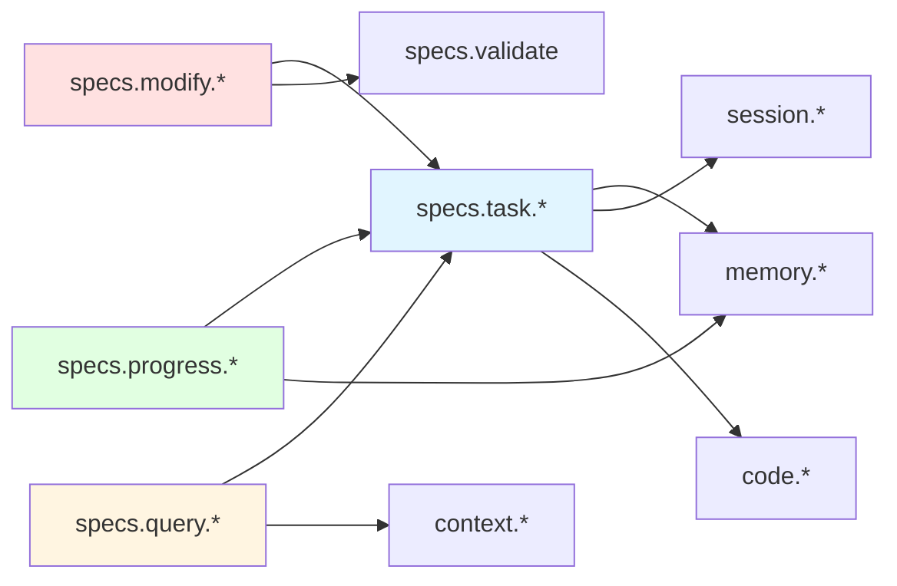

# MCP Tools for Specification Management in Meridian

**Version**: 1.0.0
**Date**: October 18, 2025
**Status**: Design Specification
**Target**: Meridian v2.1.0

---

## Table of Contents

1. [Introduction](#introduction)
2. [Design Philosophy](#design-philosophy)
3. [Tool Categories](#tool-categories)
4. [Task Management Tools](#task-management-tools)
5. [Progress Tracking Tools](#progress-tracking-tools)
6. [Specification Modification Tools](#specification-modification-tools)
7. [Querying Tools](#querying-tools)
8. [Implementation Guidelines](#implementation-guidelines)
9. [Token Efficiency Strategies](#token-efficiency-strategies)
10. [Integration with Existing Tools](#integration-with-existing-tools)
11. [Testing Requirements](#testing-requirements)
12. [Appendix: Complete Type Definitions](#appendix-complete-type-definitions)

---

## Introduction

### Purpose

This specification defines comprehensive MCP (Model Context Protocol) tools for **specification management** in Meridian. These tools enable LLM agents to efficiently work with software specifications, track implementation progress, manage tasks, and maintain documentation quality - all while maintaining strict token efficiency.

### Goals

1. **Enable efficient LLM-driven development** through specification-aware tooling
2. **Track implementation progress** at granular task/requirement levels
3. **Maintain specification quality** through automated validation and modification
4. **Minimize token consumption** while providing complete functionality
5. **Support iterative development** with dependency tracking and phase management

### Scope

This specification covers **20+ MCP tools** across four major categories:
- **Task Management** (6 tools)
- **Progress Tracking** (5 tools)
- **Specification Modification** (5 tools)
- **Querying** (4 tools)

### Relationship to Existing Tools

These tools extend Meridian's existing 29 MCP tools (memory, context, code navigation, etc.) with specification-specific capabilities. They integrate deeply with:
- `specs.list`, `specs.get_structure`, `specs.get_section`, `specs.search`, `specs.validate` (5 existing spec tools)
- `memory.*` tools for learning from implementation patterns
- `session.*` tools for tracking work sessions

---

## Design Philosophy

### 1. Token-First Design

Every tool is designed to minimize token usage:
- **Structured outputs** with predictable schemas
- **Granular retrieval** (sections, not full documents)
- **Progressive detail** (summary → full data)
- **Smart filtering** (only relevant data returned)

### 2. Task-Oriented

Tools focus on **implementation tasks**, not abstract concepts:
- Extract actionable tasks from specifications
- Track task dependencies and blocking relationships
- Prioritize work based on phases and criticality
- Update status as implementation progresses

### 3. LLM-Friendly

Designed specifically for LLM consumption:
- Clear, consistent naming conventions
- Self-documenting parameter schemas
- Predictable output formats (JSON)
- Built-in error guidance

### 4. Integration-Ready

Seamlessly integrates with:
- Existing Meridian MCP tools
- Git-based version control
- Session management
- Memory/learning systems

---

## Tool Categories

### Overview Table

| Category | Tools | Purpose | Token Impact |
|----------|-------|---------|--------------|
| **Task Management** | 6 | Extract, prioritize, update tasks | Low (structured data) |
| **Progress Tracking** | 5 | Monitor implementation progress | Very Low (metrics only) |
| **Specification Modification** | 5 | Update specs programmatically | Medium (write operations) |
| **Querying** | 4 | Advanced search and navigation | Low (targeted retrieval) |

### Naming Convention

All tools follow the pattern: `specs.task.*`, `specs.progress.*`, `specs.modify.*`, `specs.query.*`

This creates clear namespacing separate from existing `specs.*` tools (which focus on reading).

---

## Task Management Tools

### 1. `specs.task.list_all`

**Purpose**: Extract all tasks from specifications across all specs or filtered by spec/phase.

**Category**: Task Management

#### Input Parameters

```typescript
interface ListTasksParams {
  spec_name?: string;          // Filter by specific spec (optional)
  phase?: string;              // Filter by implementation phase (optional)
  status?: TaskStatus[];       // Filter by status (optional)
  include_completed?: boolean; // Include completed tasks (default: false)
  max_results?: number;        // Limit results (default: 100)
}

enum TaskStatus {
  NotStarted = "not_started",
  InProgress = "in_progress",
  Blocked = "blocked",
  Complete = "complete",
  Deprecated = "deprecated"
}
```

#### Output Format

```typescript
interface ListTasksResult {
  tasks: Task[];
  total_count: number;
  filtered_count: number;
  token_count: number;
}

interface Task {
  id: string;                  // Unique task identifier
  spec_name: string;           // Source specification
  section: string;             // Section where task is defined
  title: string;               // Task title/description
  phase: string;               // Implementation phase (e.g., "Phase 1")
  status: TaskStatus;          // Current status
  priority: TaskPriority;      // Priority level
  dependencies: string[];      // IDs of dependent tasks
  blocked_by: string[];        // IDs of blocking tasks
  line_range: [number, number]; // Line numbers in spec
  estimated_tokens?: number;   // Estimated implementation cost
  tags: string[];              // Categorization tags
}

enum TaskPriority {
  Critical = "critical",
  High = "high",
  Medium = "medium",
  Low = "low"
}
```

#### Implementation Notes

1. **Task Extraction**:
   - Parse markdown sections for task indicators: `✅`, `⚠️`, `🚧`, `📋`, checkboxes `- [ ]`, `- [x]`
   - Extract from structured lists and tables
   - Identify implementation phases from headers

2. **Status Detection**:
   - `✅` → Complete
   - `🚧` → In Progress
   - `⚠️` → Blocked
   - `- [ ]` → Not Started
   - `- [x]` → Complete

3. **Dependency Parsing**:
   - Explicit: "Depends on X", "Requires Y"
   - Implicit: Phase ordering
   - Cross-references: Links to other tasks

4. **Priority Assignment**:
   - Critical: Phase 0-1 tasks
   - High: Blocking other tasks
   - Medium: Normal implementation order
   - Low: Nice-to-have features

#### Token Efficiency

- **Summary mode**: Only id, title, status, priority (~20 tokens/task)
- **Full mode**: All fields (~60 tokens/task)
- **Caching**: Results cached for 5 minutes
- **Incremental**: Support pagination for large task sets

#### Example Usage

```json
{
  "tool": "specs.task.list_all",
  "arguments": {
    "spec_name": "spec-en",
    "phase": "Phase 1",
    "status": ["not_started", "in_progress"],
    "include_completed": false,
    "max_results": 50
  }
}
```

**Response** (~1,200 tokens for 20 tasks):
```json
{
  "tasks": [
    {
      "id": "task_spec_en_phase1_storage_001",
      "spec_name": "spec-en",
      "section": "Phase 1: Basic Infrastructure",
      "title": "Storage Layer: RocksDB wrapper with snapshot support",
      "phase": "Phase 1",
      "status": "complete",
      "priority": "critical",
      "dependencies": [],
      "blocked_by": [],
      "line_range": [1750, 1753],
      "estimated_tokens": 5000,
      "tags": ["infrastructure", "storage", "rocksdb"]
    }
    // ... more tasks
  ],
  "total_count": 47,
  "filtered_count": 20,
  "token_count": 1200
}
```

---

### 2. `specs.task.get_unimplemented`

**Purpose**: Get tasks that are not yet implemented, sorted by priority and phase.

**Category**: Task Management

#### Input Parameters

```typescript
interface GetUnimplementedParams {
  spec_name?: string;           // Filter by spec (optional)
  exclude_blocked?: boolean;    // Exclude blocked tasks (default: false)
  min_priority?: TaskPriority;  // Minimum priority level
  phase?: string;               // Filter by phase
  limit?: number;               // Max results (default: 20)
  include_dependencies?: boolean; // Include dependency info (default: true)
}
```

#### Output Format

```typescript
interface UnimplementedTasksResult {
  tasks: UnimplementedTask[];
  next_recommended: string[];   // Task IDs in recommended order
  blocking_count: number;       // Number of blocked tasks
  total_unimplemented: number;
  estimated_total_tokens: number;
}

interface UnimplementedTask extends Task {
  readiness_score: number;      // 0-100, based on dependencies
  blocking_count: number;       // How many tasks this blocks
  recommended_order: number;    // Suggested implementation order
  effort_estimate: EffortEstimate;
}

interface EffortEstimate {
  tokens: number;
  lines_of_code: number;
  complexity: "low" | "medium" | "high";
  time_estimate_hours: number;
}
```

#### Implementation Notes

1. **Readiness Score Calculation**:
   ```
   readiness = 100 - (blocked_dependencies * 20) - (missing_prereqs * 15)
   ```

2. **Recommended Order**:
   - Topological sort by dependencies
   - Prioritize high-value, low-complexity tasks
   - Group related tasks together

3. **Effort Estimation**:
   - Token count from similar completed tasks
   - Complexity from section depth and code examples
   - Historical data from episodic memory

#### Token Efficiency

- **Minimal mode**: id, title, readiness_score only (~15 tokens/task)
- **Standard mode**: All fields except dependencies (~45 tokens/task)
- **Full mode**: Everything including dependency tree (~80 tokens/task)

#### Example Usage

```json
{
  "tool": "specs.task.get_unimplemented",
  "arguments": {
    "exclude_blocked": true,
    "min_priority": "high",
    "limit": 10,
    "include_dependencies": true
  }
}
```

**Response** (~600 tokens for 10 tasks):
```json
{
  "tasks": [
    {
      "id": "task_strong_tools_gen_001",
      "title": "Generate documentation with examples",
      "phase": "Phase 2",
      "status": "not_started",
      "priority": "high",
      "readiness_score": 85,
      "blocking_count": 3,
      "recommended_order": 1,
      "effort_estimate": {
        "tokens": 12000,
        "lines_of_code": 450,
        "complexity": "medium",
        "time_estimate_hours": 8
      },
      "dependencies": [],
      "blocked_by": []
    }
    // ... 9 more tasks
  ],
  "next_recommended": [
    "task_strong_tools_gen_001",
    "task_global_arch_catalog_002"
  ],
  "blocking_count": 5,
  "total_unimplemented": 32,
  "estimated_total_tokens": 145000
}
```

---

### 3. `specs.task.update_status`

**Purpose**: Update the implementation status of tasks in specifications.

**Category**: Task Management

#### Input Parameters

```typescript
interface UpdateTaskStatusParams {
  task_id: string;              // Task to update
  status: TaskStatus;           // New status
  notes?: string;               // Implementation notes
  session_id?: string;          // Link to work session
  actual_tokens?: number;       // Actual tokens used
  actual_effort?: EffortActual; // Actual effort data
  auto_update_spec?: boolean;   // Update spec file (default: false)
}

interface EffortActual {
  lines_of_code: number;
  time_hours: number;
  complexity_actual: "low" | "medium" | "high";
  challenges: string[];
}
```

#### Output Format

```typescript
interface UpdateTaskStatusResult {
  task_id: string;
  previous_status: TaskStatus;
  new_status: TaskStatus;
  spec_updated: boolean;        // Whether spec file was modified
  unblocked_tasks: string[];    // Tasks now unblocked
  next_recommended: string[];   // New recommendations
  learning_recorded: boolean;   // Whether memory system was updated
  diff_preview?: string;        // Preview of spec changes (if auto_update)
}
```

#### Implementation Notes

1. **Status Update**:
   - Update internal task registry
   - Optionally modify spec file (replace `- [ ]` with `- [x]`, etc.)
   - Track status change history

2. **Cascade Effects**:
   - Check for newly unblocked tasks
   - Update readiness scores
   - Recalculate recommended order

3. **Learning Integration**:
   - Record episode if task completed
   - Update effort estimates for similar tasks
   - Train procedural memory

4. **Spec File Modification** (if `auto_update_spec: true`):
   - Find task in spec by line range
   - Update status indicators
   - Add inline notes if provided
   - Create git-friendly diff

#### Token Efficiency

- Input: ~100 tokens
- Output: ~150-200 tokens (minimal diff preview)
- Full diff: Additional ~300-500 tokens if requested

#### Example Usage

```json
{
  "tool": "specs.task.update_status",
  "arguments": {
    "task_id": "task_spec_en_phase1_storage_001",
    "status": "complete",
    "notes": "Implemented RocksDB wrapper with CoW snapshots. Added 450 LOC.",
    "session_id": "session_abc123",
    "actual_tokens": 8500,
    "actual_effort": {
      "lines_of_code": 450,
      "time_hours": 6,
      "complexity_actual": "medium",
      "challenges": ["Snapshot isolation tricky", "Performance tuning needed"]
    },
    "auto_update_spec": true
  }
}
```

**Response**:
```json
{
  "task_id": "task_spec_en_phase1_storage_001",
  "previous_status": "in_progress",
  "new_status": "complete",
  "spec_updated": true,
  "unblocked_tasks": [
    "task_spec_en_phase1_indexer_002",
    "task_spec_en_phase2_ast_003"
  ],
  "next_recommended": [
    "task_spec_en_phase1_indexer_002",
    "task_spec_en_phase1_mcp_003"
  ],
  "learning_recorded": true,
  "diff_preview": "@ Line 1750:\n- ❌ **Storage Layer**: RocksDB wrapper\n+ ✅ **Storage Layer**: RocksDB wrapper with snapshot support"
}
```

---

### 4. `specs.task.get_blocked`

**Purpose**: Get tasks that are blocked by dependencies with detailed blocking information.

**Category**: Task Management

#### Input Parameters

```typescript
interface GetBlockedTasksParams {
  spec_name?: string;
  include_resolution_hints?: boolean; // Suggest how to unblock (default: true)
  min_priority?: TaskPriority;
  show_dependency_chain?: boolean;    // Show full chain (default: false)
}
```

#### Output Format

```typescript
interface BlockedTasksResult {
  blocked_tasks: BlockedTask[];
  blocking_tasks: BlockingTask[];     // Tasks blocking others
  resolution_suggestions: ResolutionHint[];
  total_blocked: number;
}

interface BlockedTask extends Task {
  blocked_by_tasks: Task[];           // Full task objects
  blocking_reason: string;            // Human-readable reason
  estimated_unblock_date?: string;    // Based on current velocity
  alternative_approaches?: string[];  // Possible workarounds
}

interface BlockingTask extends Task {
  blocking_count: number;
  blocked_task_ids: string[];
  criticality_score: number;          // Impact of unblocking this
}

interface ResolutionHint {
  task_id: string;
  suggestion: string;
  priority: "high" | "medium" | "low";
  feasibility: number;                // 0-100
}
```

#### Implementation Notes

1. **Blocking Detection**:
   - Parse dependency declarations
   - Check phase prerequisites
   - Identify circular dependencies
   - Detect external blockers (e.g., "Waiting for library X")

2. **Resolution Hints**:
   - Suggest completing blocking tasks
   - Propose alternative implementations
   - Identify partial unblocking possibilities
   - Recommend priority changes

3. **Criticality Score**:
   ```
   criticality = blocking_count * 10 +
                 sum(blocked_task_priorities) +
                 depth_in_dependency_tree * 5
   ```

#### Token Efficiency

- **Summary**: ~30 tokens/task (id, blocking reason, count)
- **Standard**: ~70 tokens/task (includes blockers list)
- **Full**: ~120 tokens/task (dependency chains, hints)

#### Example Usage

```json
{
  "tool": "specs.task.get_blocked",
  "arguments": {
    "include_resolution_hints": true,
    "show_dependency_chain": false
  }
}
```

**Response** (~800 tokens):
```json
{
  "blocked_tasks": [
    {
      "id": "task_strong_tools_validate_002",
      "title": "Validate generated tests",
      "status": "blocked",
      "priority": "high",
      "blocked_by_tasks": [
        {
          "id": "task_strong_tools_gen_003",
          "title": "Generate unit tests for symbols",
          "status": "in_progress"
        }
      ],
      "blocking_reason": "Requires test generation to be complete",
      "estimated_unblock_date": "2025-10-20",
      "alternative_approaches": [
        "Implement validation logic in parallel",
        "Use mock test data for development"
      ]
    }
  ],
  "blocking_tasks": [
    {
      "id": "task_global_arch_registry_001",
      "title": "Implement global monorepo registry",
      "status": "in_progress",
      "blocking_count": 5,
      "blocked_task_ids": [
        "task_global_arch_catalog_002",
        "task_global_arch_search_003"
      ],
      "criticality_score": 85
    }
  ],
  "resolution_suggestions": [
    {
      "task_id": "task_strong_tools_validate_002",
      "suggestion": "Complete test generation (task_strong_tools_gen_003) to unblock validation",
      "priority": "high",
      "feasibility": 90
    }
  ],
  "total_blocked": 8
}
```

---

### 5. `specs.task.create`

**Purpose**: Create a new task in a specification programmatically.

**Category**: Task Management

#### Input Parameters

```typescript
interface CreateTaskParams {
  spec_name: string;
  section: string;              // Section to add task to
  title: string;
  description?: string;
  phase: string;
  priority: TaskPriority;
  dependencies?: string[];      // Task IDs this depends on
  tags?: string[];
  estimated_effort?: EffortEstimate;
  insert_after?: string;        // Task ID to insert after (optional)
}
```

#### Output Format

```typescript
interface CreateTaskResult {
  task_id: string;
  task: Task;
  spec_updated: boolean;
  line_inserted: number;
  conflicts?: TaskConflict[];   // Potential conflicts detected
}

interface TaskConflict {
  type: "duplicate" | "dependency_cycle" | "phase_mismatch";
  description: string;
  severity: "error" | "warning";
  resolution?: string;
}
```

#### Implementation Notes

1. **Validation**:
   - Check for duplicate tasks (similar titles)
   - Validate dependencies exist
   - Detect circular dependencies
   - Verify phase consistency

2. **Insertion Logic**:
   - Find appropriate section
   - Insert after specified task or at end
   - Maintain markdown formatting
   - Update any cross-references

3. **Conflict Detection**:
   - Duplicate detection using embeddings (similarity > 0.85)
   - Dependency cycle detection via graph traversal
   - Phase ordering validation

#### Token Efficiency

- Input: ~150-200 tokens
- Output: ~100-150 tokens (without conflicts)
- Conflicts add ~50 tokens each

#### Example Usage

```json
{
  "tool": "specs.task.create",
  "arguments": {
    "spec_name": "strong-tools-spec-en",
    "section": "Testing Features",
    "title": "Generate integration tests for documentation tools",
    "description": "Create integration tests that verify documentation generation across multiple scenarios",
    "phase": "Phase 3",
    "priority": "high",
    "dependencies": [
      "task_strong_tools_gen_001",
      "task_strong_tools_gen_002"
    ],
    "tags": ["testing", "documentation", "integration"],
    "estimated_effort": {
      "tokens": 8000,
      "lines_of_code": 300,
      "complexity": "medium",
      "time_estimate_hours": 6
    }
  }
}
```

**Response**:
```json
{
  "task_id": "task_strong_tools_test_004",
  "task": {
    "id": "task_strong_tools_test_004",
    "spec_name": "strong-tools-spec-en",
    "section": "Testing Features",
    "title": "Generate integration tests for documentation tools",
    "phase": "Phase 3",
    "status": "not_started",
    "priority": "high",
    "dependencies": [
      "task_strong_tools_gen_001",
      "task_strong_tools_gen_002"
    ],
    "blocked_by": [
      "task_strong_tools_gen_001"
    ],
    "line_range": [1245, 1248],
    "estimated_tokens": 8000,
    "tags": ["testing", "documentation", "integration"]
  },
  "spec_updated": true,
  "line_inserted": 1245,
  "conflicts": []
}
```

---

### 6. `specs.task.get_dependencies`

**Purpose**: Get the full dependency graph for a task or set of tasks.

**Category**: Task Management

#### Input Parameters

```typescript
interface GetTaskDependenciesParams {
  task_ids: string[];           // Tasks to analyze
  depth?: number;               // Traversal depth (default: unlimited)
  direction?: "incoming" | "outgoing" | "both"; // Default: "both"
  include_transitive?: boolean; // Include indirect deps (default: true)
  visualize?: boolean;          // Return mermaid diagram (default: false)
}
```

#### Output Format

```typescript
interface TaskDependenciesResult {
  graph: DependencyGraph;
  critical_path: string[];      // Longest dependency chain
  cycles: DependencyCycle[];    // Circular dependencies detected
  total_dependencies: number;
  visualization?: string;       // Mermaid diagram
}

interface DependencyGraph {
  nodes: TaskNode[];
  edges: DependencyEdge[];
}

interface TaskNode {
  task_id: string;
  title: string;
  status: TaskStatus;
  level: number;                // Depth in graph
  is_critical_path: boolean;
}

interface DependencyEdge {
  from: string;
  to: string;
  type: "hard" | "soft" | "phase";
  strength: number;             // 0-100
}

interface DependencyCycle {
  tasks: string[];              // Task IDs in cycle
  severity: "error" | "warning";
  break_suggestions: string[];  // How to break the cycle
}
```

#### Implementation Notes

1. **Graph Construction**:
   - Build directed graph from dependencies
   - Detect dependency types (explicit, phase-based, implicit)
   - Calculate transitive closure if requested

2. **Critical Path**:
   - Longest path from start to end
   - Determines minimum project duration
   - Identifies bottlenecks

3. **Cycle Detection**:
   - Use Tarjan's algorithm for strongly connected components
   - Classify cycles by severity
   - Suggest breakpoints

4. **Visualization**:
   - Generate Mermaid flowchart
   - Color-code by status
   - Highlight critical path

#### Token Efficiency

- **Minimal**: ~30 tokens/node (just graph structure)
- **Standard**: ~60 tokens/node (includes metadata)
- **With visualization**: Additional ~500-1000 tokens for diagram

#### Example Usage

```json
{
  "tool": "specs.task.get_dependencies",
  "arguments": {
    "task_ids": ["task_global_arch_catalog_002"],
    "depth": 3,
    "direction": "both",
    "include_transitive": true,
    "visualize": true
  }
}
```

**Response** (~1,200 tokens):
```json
{
  "graph": {
    "nodes": [
      {
        "task_id": "task_global_arch_catalog_002",
        "title": "Build global documentation catalog",
        "status": "in_progress",
        "level": 0,
        "is_critical_path": true
      },
      {
        "task_id": "task_global_arch_registry_001",
        "title": "Implement global registry",
        "status": "complete",
        "level": 1,
        "is_critical_path": true
      }
    ],
    "edges": [
      {
        "from": "task_global_arch_catalog_002",
        "to": "task_global_arch_registry_001",
        "type": "hard",
        "strength": 100
      }
    ]
  },
  "critical_path": [
    "task_global_arch_registry_001",
    "task_global_arch_catalog_002",
    "task_global_arch_search_003"
  ],
  "cycles": [],
  "total_dependencies": 8,
  "visualization": "```mermaid\ngraph TD\n  A[Registry] -->|complete| B[Catalog]\n  B -->|in_progress| C[Search]\n```"
}
```

---

## Progress Tracking Tools

### 7. `specs.progress.get_overall`

**Purpose**: Get overall implementation progress across all specifications.

**Category**: Progress Tracking

#### Input Parameters

```typescript
interface GetOverallProgressParams {
  group_by?: "spec" | "phase" | "priority" | "tag"; // Default: "spec"
  include_trends?: boolean;     // Include velocity metrics (default: false)
  time_window_days?: number;    // For trend calculation (default: 30)
}
```

#### Output Format

```typescript
interface OverallProgressResult {
  summary: ProgressSummary;
  by_group: GroupProgress[];
  trends?: ProgressTrends;
  estimated_completion?: string; // Projected date
}

interface ProgressSummary {
  total_tasks: number;
  completed: number;
  in_progress: number;
  not_started: number;
  blocked: number;
  deprecated: number;
  completion_percentage: number;
  token_count: number;          // For this response
}

interface GroupProgress {
  group_name: string;           // Spec name, phase, etc.
  tasks: ProgressSummary;
  priority_weighted_completion: number; // Weighted by priority
  estimated_tokens_remaining: number;
}

interface ProgressTrends {
  velocity: Velocity;
  burndown: BurndownData[];
  forecasts: ProgressForecast[];
}

interface Velocity {
  tasks_per_day: number;
  tokens_per_day: number;
  current_streak_days: number;
  trend: "increasing" | "stable" | "decreasing";
}

interface BurndownData {
  date: string;
  remaining_tasks: number;
  completed_cumulative: number;
}

interface ProgressForecast {
  scenario: "optimistic" | "realistic" | "pessimistic";
  completion_date: string;
  confidence: number;           // 0-100
}
```

#### Implementation Notes

1. **Progress Calculation**:
   ```
   completion % = (completed + 0.5 * in_progress) / total * 100
   weighted % = sum(task_priority * task_status) / sum(task_priority) * 100
   ```

2. **Velocity Calculation**:
   - Aggregate from `memory.episodic` system
   - Track rolling 7-day and 30-day averages
   - Detect trends via linear regression

3. **Forecasting**:
   - **Optimistic**: Current velocity * 1.2
   - **Realistic**: Current velocity
   - **Pessimistic**: Current velocity * 0.7

4. **Caching**:
   - Cache for 1 hour (progress changes infrequently)
   - Invalidate on task status updates

#### Token Efficiency

- **Minimal**: ~200 tokens (summary only)
- **Standard**: ~400 tokens (with groupings)
- **Full with trends**: ~800-1000 tokens

#### Example Usage

```json
{
  "tool": "specs.progress.get_overall",
  "arguments": {
    "group_by": "phase",
    "include_trends": true,
    "time_window_days": 30
  }
}
```

**Response** (~850 tokens):
```json
{
  "summary": {
    "total_tasks": 156,
    "completed": 98,
    "in_progress": 12,
    "not_started": 38,
    "blocked": 8,
    "deprecated": 0,
    "completion_percentage": 67.3,
    "token_count": 850
  },
  "by_group": [
    {
      "group_name": "Phase 1",
      "tasks": {
        "total_tasks": 25,
        "completed": 25,
        "in_progress": 0,
        "not_started": 0,
        "blocked": 0,
        "completion_percentage": 100.0
      },
      "priority_weighted_completion": 100.0,
      "estimated_tokens_remaining": 0
    },
    {
      "group_name": "Phase 2",
      "tasks": {
        "total_tasks": 32,
        "completed": 28,
        "in_progress": 4,
        "not_started": 0,
        "blocked": 0,
        "completion_percentage": 93.75
      },
      "priority_weighted_completion": 94.2,
      "estimated_tokens_remaining": 18500
    }
  ],
  "trends": {
    "velocity": {
      "tasks_per_day": 2.4,
      "tokens_per_day": 15000,
      "current_streak_days": 12,
      "trend": "stable"
    },
    "burndown": [
      {"date": "2025-10-01", "remaining_tasks": 70, "completed_cumulative": 86},
      {"date": "2025-10-08", "remaining_tasks": 58, "completed_cumulative": 98}
    ],
    "forecasts": [
      {"scenario": "optimistic", "completion_date": "2025-11-05", "confidence": 65},
      {"scenario": "realistic", "completion_date": "2025-11-18", "confidence": 85},
      {"scenario": "pessimistic", "completion_date": "2025-12-02", "confidence": 70}
    ]
  },
  "estimated_completion": "2025-11-18"
}
```

---

### 8. `specs.progress.get_by_spec`

**Purpose**: Get detailed progress for a specific specification.

**Category**: Progress Tracking

#### Input Parameters

```typescript
interface GetProgressBySpecParams {
  spec_name: string;
  include_task_list?: boolean;  // Include task breakdown (default: false)
  include_milestones?: boolean; // Show milestone progress (default: true)
}
```

#### Output Format

```typescript
interface SpecProgressResult {
  spec_name: string;
  spec_version: string;
  progress: ProgressSummary;
  phases: PhaseProgress[];
  milestones?: MilestoneProgress[];
  recent_activity: ActivitySummary[];
  tasks?: Task[];               // If include_task_list: true
}

interface PhaseProgress {
  phase_name: string;
  status: "not_started" | "in_progress" | "complete";
  progress: ProgressSummary;
  start_date?: string;
  completion_date?: string;
  duration_days?: number;
}

interface MilestoneProgress {
  name: string;
  target_date?: string;
  actual_date?: string;
  status: "pending" | "at_risk" | "achieved" | "missed";
  completion_percentage: number;
  blocking_tasks: string[];
}

interface ActivitySummary {
  date: string;
  tasks_completed: number;
  tasks_started: number;
  notable_achievements: string[];
}
```

#### Implementation Notes

1. **Milestone Detection**:
   - Parse spec for milestone markers
   - Extract target dates
   - Calculate at-risk status (< 80% complete with < 20% time remaining)

2. **Activity Tracking**:
   - Aggregate from session history
   - Group by date
   - Extract notable achievements from commit messages

#### Token Efficiency

- **Minimal**: ~300 tokens (summary + phases)
- **Standard**: ~500 tokens (+ milestones)
- **Full**: ~1000+ tokens (+ task list)

#### Example Usage

```json
{
  "tool": "specs.progress.get_by_spec",
  "arguments": {
    "spec_name": "spec-en",
    "include_task_list": false,
    "include_milestones": true
  }
}
```

**Response** (~550 tokens):
```json
{
  "spec_name": "spec-en",
  "spec_version": "2.0.0",
  "progress": {
    "total_tasks": 89,
    "completed": 67,
    "in_progress": 8,
    "not_started": 14,
    "blocked": 0,
    "completion_percentage": 79.2
  },
  "phases": [
    {
      "phase_name": "Phase 1: Basic Infrastructure",
      "status": "complete",
      "progress": {
        "total_tasks": 12,
        "completed": 12,
        "completion_percentage": 100.0
      },
      "start_date": "2025-09-15",
      "completion_date": "2025-09-28",
      "duration_days": 13
    },
    {
      "phase_name": "Phase 2: Semantic Indexing",
      "status": "complete",
      "progress": {
        "total_tasks": 15,
        "completed": 15,
        "completion_percentage": 100.0
      }
    }
  ],
  "milestones": [
    {
      "name": "v2.0 Production Release",
      "target_date": "2025-10-15",
      "actual_date": "2025-10-14",
      "status": "achieved",
      "completion_percentage": 100.0,
      "blocking_tasks": []
    },
    {
      "name": "Strong Tools Integration",
      "target_date": "2025-11-01",
      "status": "in_progress",
      "completion_percentage": 45.0,
      "blocking_tasks": [
        "task_strong_tools_gen_001",
        "task_strong_tools_validate_002"
      ]
    }
  ],
  "recent_activity": [
    {
      "date": "2025-10-18",
      "tasks_completed": 3,
      "tasks_started": 2,
      "notable_achievements": [
        "Completed specification management system",
        "Added 5 new MCP tools for specs"
      ]
    }
  ]
}
```

---

### 9. `specs.progress.get_by_phase`

**Purpose**: Get progress across all specs grouped by implementation phase.

**Category**: Progress Tracking

#### Input Parameters

```typescript
interface GetProgressByPhaseParams {
  phase?: string;               // Filter to specific phase (optional)
  include_cross_spec?: boolean; // Include cross-spec dependencies (default: false)
}
```

#### Output Format

```typescript
interface PhaseProgressResult {
  phases: CrossSpecPhaseProgress[];
  dependencies: PhaseDependency[];
  critical_path_phases: string[];
}

interface CrossSpecPhaseProgress {
  phase_name: string;
  specs: SpecInPhase[];
  combined_progress: ProgressSummary;
  estimated_completion: string;
  blockers: string[];
}

interface SpecInPhase {
  spec_name: string;
  progress: ProgressSummary;
  status: "not_started" | "in_progress" | "complete";
}

interface PhaseDependency {
  phase: string;
  depends_on: string[];
  blocks: string[];
  criticality: number;          // 0-100
}
```

#### Implementation Notes

1. **Phase Aggregation**:
   - Normalize phase names across specs
   - Combine similar phases (e.g., "Phase 1" across all specs)
   - Calculate weighted progress

2. **Dependency Analysis**:
   - Explicit phase dependencies from specs
   - Implicit from task dependencies
   - Cross-spec phase relationships

#### Token Efficiency

- **Summary**: ~200 tokens (phases only)
- **Detailed**: ~500 tokens (with dependencies)

#### Example Usage

```json
{
  "tool": "specs.progress.get_by_phase",
  "arguments": {
    "include_cross_spec": true
  }
}
```

---

### 10. `specs.progress.calculate_completion_percentage`

**Purpose**: Calculate accurate completion percentage with various weighting strategies.

**Category**: Progress Tracking

#### Input Parameters

```typescript
interface CalculateCompletionParams {
  scope?: "all" | "spec" | "phase" | "tag";
  scope_value?: string;         // E.g., spec name if scope="spec"
  weighting?: WeightingStrategy;
  include_breakdown?: boolean;  // Show calculation breakdown (default: false)
}

enum WeightingStrategy {
  Equal = "equal",              // All tasks equal weight
  Priority = "priority",        // Weight by priority
  Effort = "effort",            // Weight by estimated tokens
  Blocking = "blocking",        // Weight by blocking count
  Custom = "custom"             // Custom weights provided
}
```

#### Output Format

```typescript
interface CompletionPercentageResult {
  completion_percentage: number;
  weighting_used: WeightingStrategy;
  total_weight: number;
  completed_weight: number;
  breakdown?: CompletionBreakdown;
  confidence: number;           // 0-100, based on data quality
}

interface CompletionBreakdown {
  by_status: {
    [status: string]: {
      count: number;
      weight: number;
      percentage: number;
    }
  };
  calculation_method: string;
  factors: WeightingFactor[];
}

interface WeightingFactor {
  name: string;
  contribution: number;         // Percentage contribution to total
  rationale: string;
}
```

#### Implementation Notes

1. **Weighting Formulas**:

   **Equal**:
   ```
   completion = (completed + 0.5 * in_progress) / total
   ```

   **Priority**:
   ```
   weight(critical) = 4, weight(high) = 3, weight(medium) = 2, weight(low) = 1
   completion = sum(task_weight * task_completion) / sum(task_weight)
   ```

   **Effort**:
   ```
   completion = sum(task_tokens * task_completion) / sum(task_tokens)
   ```

   **Blocking**:
   ```
   weight = 1 + log(1 + blocking_count)
   completion = sum(weight * task_completion) / sum(weight)
   ```

2. **Confidence Calculation**:
   - Based on data availability (estimated tokens, priorities, etc.)
   - Higher confidence if more metadata available
   - Range: 50-100%

#### Token Efficiency

- **Simple**: ~100 tokens (just percentage)
- **With breakdown**: ~250-300 tokens

#### Example Usage

```json
{
  "tool": "specs.progress.calculate_completion_percentage",
  "arguments": {
    "scope": "spec",
    "scope_value": "strong-tools-spec-en",
    "weighting": "priority",
    "include_breakdown": true
  }
}
```

**Response** (~280 tokens):
```json
{
  "completion_percentage": 42.3,
  "weighting_used": "priority",
  "total_weight": 185,
  "completed_weight": 78.2,
  "breakdown": {
    "by_status": {
      "complete": {"count": 15, "weight": 78.2, "percentage": 42.3},
      "in_progress": {"count": 8, "weight": 28.0, "percentage": 15.1},
      "not_started": {"count": 22, "weight": 78.8, "percentage": 42.6}
    },
    "calculation_method": "Priority-weighted with partial credit for in-progress tasks",
    "factors": [
      {
        "name": "Critical priority tasks",
        "contribution": 35.0,
        "rationale": "8 critical tasks worth 4x weight each"
      },
      {
        "name": "High priority tasks",
        "contribution": 45.0,
        "rationale": "27 high priority tasks worth 3x weight each"
      },
      {
        "name": "Medium/Low priority",
        "contribution": 20.0,
        "rationale": "10 medium/low priority tasks"
      }
    ]
  },
  "confidence": 85
}
```

---

### 11. `specs.progress.get_velocity`

**Purpose**: Calculate implementation velocity and project forecasts.

**Category**: Progress Tracking

#### Input Parameters

```typescript
interface GetVelocityParams {
  time_window_days?: number;    // Default: 30
  group_by?: "day" | "week" | "sprint"; // Default: "week"
  include_forecasts?: boolean;  // Default: true
  spec_name?: string;           // Filter to specific spec (optional)
}
```

#### Output Format

```typescript
interface VelocityResult {
  current_velocity: VelocityMetrics;
  historical: VelocityDataPoint[];
  trends: VelocityTrends;
  forecasts?: ProjectionForecast[];
  recommendations: VelocityRecommendation[];
}

interface VelocityMetrics {
  tasks_per_period: number;
  tokens_per_period: number;
  story_points_per_period?: number; // If using story points
  quality_score: number;        // 0-100, based on bug rate, rework
}

interface VelocityDataPoint {
  period_start: string;
  period_end: string;
  tasks_completed: number;
  tokens_generated: number;
  notable_events: string[];
}

interface VelocityTrends {
  direction: "increasing" | "stable" | "decreasing";
  change_percentage: number;    // Over time window
  consistency: number;          // 0-100, low variance = high consistency
  burnout_risk: "low" | "medium" | "high";
}

interface ProjectionForecast {
  target: string;               // "All tasks", "Phase 3", etc.
  estimated_completion: string;
  confidence_interval: [string, string]; // Min/max dates
  assumptions: string[];
}

interface VelocityRecommendation {
  type: "pace" | "focus" | "quality" | "risk";
  message: string;
  priority: "high" | "medium" | "low";
}
```

#### Implementation Notes

1. **Velocity Calculation**:
   - Aggregate from `memory.episodic` episodes
   - Group by specified period
   - Calculate moving averages (7-day, 30-day)

2. **Trend Detection**:
   - Linear regression over time window
   - Calculate variance (consistency)
   - Detect anomalies

3. **Burnout Detection**:
   ```
   burnout_risk = high if velocity_variance > 50% AND avg_hours > 10/day
   ```

4. **Forecasting**:
   - Monte Carlo simulation with historical velocity
   - Account for variance in estimates
   - Generate confidence intervals

#### Token Efficiency

- **Summary**: ~200 tokens (current velocity only)
- **Standard**: ~500 tokens (with trends)
- **Full**: ~800 tokens (with forecasts and recommendations)

#### Example Usage

```json
{
  "tool": "specs.progress.get_velocity",
  "arguments": {
    "time_window_days": 30,
    "group_by": "week",
    "include_forecasts": true
  }
}
```

**Response** (~750 tokens):
```json
{
  "current_velocity": {
    "tasks_per_period": 12.5,
    "tokens_per_period": 87500,
    "quality_score": 88
  },
  "historical": [
    {
      "period_start": "2025-10-07",
      "period_end": "2025-10-13",
      "tasks_completed": 14,
      "tokens_generated": 95000,
      "notable_events": ["Completed Phase 2"]
    },
    {
      "period_start": "2025-10-14",
      "period_end": "2025-10-20",
      "tasks_completed": 11,
      "tokens_generated": 80000,
      "notable_events": ["Started Strong Tools integration"]
    }
  ],
  "trends": {
    "direction": "stable",
    "change_percentage": -3.2,
    "consistency": 85,
    "burnout_risk": "low"
  },
  "forecasts": [
    {
      "target": "All remaining tasks (58)",
      "estimated_completion": "2025-11-22",
      "confidence_interval": ["2025-11-15", "2025-12-05"],
      "assumptions": [
        "Current velocity maintained",
        "No major blockers introduced",
        "Quality standards maintained"
      ]
    },
    {
      "target": "Phase 3 completion",
      "estimated_completion": "2025-10-30",
      "confidence_interval": ["2025-10-28", "2025-11-03"],
      "assumptions": ["Phase 3 tasks only (22 remaining)"]
    }
  ],
  "recommendations": [
    {
      "type": "pace",
      "message": "Velocity is stable and sustainable. Consider maintaining current pace.",
      "priority": "medium"
    },
    {
      "type": "focus",
      "message": "8 blocked tasks detected. Prioritize unblocking to improve throughput.",
      "priority": "high"
    }
  ]
}
```

---

## Specification Modification Tools

### 12. `specs.modify.update_section`

**Purpose**: Update a section in a specification (for architecture changes, new requirements).

**Category**: Specification Modification

#### Input Parameters

```typescript
interface UpdateSectionParams {
  spec_name: string;
  section_name: string;         // Section to update (fuzzy match)
  new_content: string;          // New section content (markdown)
  mode: "replace" | "append" | "prepend" | "merge";
  create_backup?: boolean;      // Default: true
  commit_message?: string;      // If provided, auto-commit change
  validate_before?: boolean;    // Run validation first (default: true)
}
```

#### Output Format

```typescript
interface UpdateSectionResult {
  success: boolean;
  spec_name: string;
  section_updated: string;
  line_range: [number, number];
  backup_path?: string;
  validation_result?: ValidationResult;
  git_commit?: string;          // Commit hash if committed
  diff_summary: DiffSummary;
  affected_tasks: string[];     // Task IDs potentially affected
}

interface DiffSummary {
  lines_added: number;
  lines_removed: number;
  lines_modified: number;
  content_preview: string;      // First 200 chars of diff
}
```

#### Implementation Notes

1. **Section Matching**:
   - Fuzzy match section name
   - If multiple matches, return error with options
   - Support path notation: "Phase 1 / Storage Layer"

2. **Update Modes**:
   - **replace**: Replace entire section
   - **append**: Add to end of section
   - **prepend**: Add to start of section
   - **merge**: Intelligent merge (detect sub-sections)

3. **Validation**:
   - Check markdown syntax
   - Verify cross-references still valid
   - Detect broken task IDs
   - Validate code blocks

4. **Backup**:
   - Create `.bak` file with timestamp
   - Store in `.meridian/backups/`
   - Keep last 10 backups per file

5. **Git Integration**:
   - Stage changes
   - Commit with provided message
   - Link to any related sessions

#### Token Efficiency

- Input: Variable (depends on content size)
- Output: ~200-300 tokens
- Optimization: Content streaming for large updates

#### Example Usage

```json
{
  "tool": "specs.modify.update_section",
  "arguments": {
    "spec_name": "spec-en",
    "section_name": "Token Saving Strategy / Progressive Context Loading",
    "new_content": "## Progressive Context Loading\n\n### Level 1: Ultra-Skeleton (50-200 tokens)\n...",
    "mode": "replace",
    "create_backup": true,
    "commit_message": "docs(spec): update progressive loading levels with ultra-skeleton",
    "validate_before": true
  }
}
```

**Response**:
```json
{
  "success": true,
  "spec_name": "spec-en",
  "section_updated": "Token Saving Strategy / Progressive Context Loading",
  "line_range": [1318, 1342],
  "backup_path": ".meridian/backups/spec-en_20251018_153022.md.bak",
  "validation_result": {
    "valid": true,
    "issues": [],
    "score": 100
  },
  "git_commit": "a7b8c9d",
  "diff_summary": {
    "lines_added": 8,
    "lines_removed": 5,
    "lines_modified": 3,
    "content_preview": "+ ### Level 1: Ultra-Skeleton (50-200 tokens)\n+ For extreme token constraints...\n- ### Level 1: Minimal skeleton (100-500 tokens)"
  },
  "affected_tasks": [
    "task_spec_en_phase1_context_004"
  ]
}
```

---

### 13. `specs.modify.add_requirement`

**Purpose**: Add a new requirement to a specification.

**Category**: Specification Modification

#### Input Parameters

```typescript
interface AddRequirementParams {
  spec_name: string;
  section: string;              // Where to add requirement
  requirement: Requirement;
  position?: "start" | "end" | { after: string }; // Default: "end"
  auto_create_task?: boolean;   // Create task automatically (default: true)
}

interface Requirement {
  title: string;
  description: string;
  priority: TaskPriority;
  type: RequirementType;
  acceptance_criteria?: string[];
  rationale?: string;
  tags?: string[];
}

enum RequirementType {
  Functional = "functional",
  NonFunctional = "non_functional",
  Technical = "technical",
  Quality = "quality"
}
```

#### Output Format

```typescript
interface AddRequirementResult {
  requirement_id: string;
  spec_updated: boolean;
  line_inserted: number;
  task_created?: Task;
  section_path: string;
  validation_warnings: string[];
}
```

#### Implementation Notes

1. **Requirement Formatting**:
   ```markdown
   ### [REQ-001] Requirement Title

   **Priority**: High
   **Type**: Functional

   **Description**:
   [requirement description]

   **Acceptance Criteria**:
   - [ ] Criterion 1
   - [ ] Criterion 2

   **Rationale**: [why this is needed]
   ```

2. **ID Generation**:
   - Format: `REQ-{spec_abbrev}-{sequence}`
   - E.g., `REQ-SPEC-045`, `REQ-STRONG-012`
   - Maintain sequence in registry

3. **Auto-Task Creation**:
   - If `auto_create_task: true`, call `specs.task.create`
   - Link task to requirement
   - Inherit priority and tags

#### Token Efficiency

- Input: ~150-250 tokens (depends on description)
- Output: ~150-200 tokens

#### Example Usage

```json
{
  "tool": "specs.modify.add_requirement",
  "arguments": {
    "spec_name": "strong-tools-spec-en",
    "section": "Documentation Generation",
    "requirement": {
      "title": "Support JSDoc and TSDoc formats",
      "description": "Documentation generator must support both JSDoc and TSDoc comment formats with automatic detection and conversion capabilities.",
      "priority": "high",
      "type": "functional",
      "acceptance_criteria": [
        "Detect JSDoc comments correctly",
        "Detect TSDoc comments correctly",
        "Convert between formats bidirectionally",
        "Preserve all semantic information during conversion"
      ],
      "rationale": "TypeScript projects commonly use TSDoc while JavaScript uses JSDoc. Supporting both enables wider adoption.",
      "tags": ["documentation", "typescript", "javascript"]
    },
    "auto_create_task": true
  }
}
```

**Response**:
```json
{
  "requirement_id": "REQ-STRONG-015",
  "spec_updated": true,
  "line_inserted": 856,
  "task_created": {
    "id": "task_strong_tools_doc_015",
    "title": "Implement JSDoc and TSDoc format support",
    "status": "not_started",
    "priority": "high"
  },
  "section_path": "strong-tools-spec-en / Documentation Generation",
  "validation_warnings": []
}
```

---

### 14. `specs.modify.deprecate_requirement`

**Purpose**: Mark a requirement as deprecated with migration path.

**Category**: Specification Modification

#### Input Parameters

```typescript
interface DeprecateRequirementParams {
  spec_name: string;
  requirement_id: string;       // E.g., "REQ-SPEC-045"
  reason: string;
  migration_path?: string;      // How to migrate away
  replacement_requirement?: string; // ID of replacement
  deprecation_date?: string;    // When deprecated (default: today)
  removal_date?: string;        // When will be removed (optional)
  update_tasks?: boolean;       // Update related tasks (default: true)
}
```

#### Output Format

```typescript
interface DeprecateRequirementResult {
  requirement_id: string;
  deprecated: boolean;
  spec_updated: boolean;
  affected_tasks: TaskUpdate[];
  migration_guide_created: boolean;
}

interface TaskUpdate {
  task_id: string;
  action: "deprecated" | "retargeted" | "unchanged";
  new_target?: string;
}
```

#### Implementation Notes

1. **Deprecation Markup**:
   ```markdown
   ### ~~[REQ-001] Old Requirement~~ ⚠️ DEPRECATED

   > **⚠️ DEPRECATED** as of 2025-10-18
   > **Reason**: Replaced by REQ-002 with improved approach
   > **Migration**: Use REQ-002 instead. See migration guide: [link]
   > **Removal**: Planned for 2026-01-01

   [original requirement content struck through]
   ```

2. **Task Handling**:
   - Mark related tasks as deprecated
   - If replacement exists, retarget tasks
   - Update dependency chains

3. **Migration Guide**:
   - Auto-generate if replacement specified
   - Compare old vs new requirements
   - Suggest code changes if applicable

#### Token Efficiency

- Input: ~150 tokens
- Output: ~200 tokens

---

### 15. `specs.modify.create_spec`

**Purpose**: Create a new specification file from template or scratch.

**Category**: Specification Modification

#### Input Parameters

```typescript
interface CreateSpecParams {
  spec_name: string;            // File name (without .md)
  title: string;
  version?: string;             // Default: "0.1.0"
  template?: SpecTemplate;      // Use template (optional)
  metadata?: SpecMetadata;
  initial_sections?: SpecSection[];
  auto_index?: boolean;         // Add to INDEX.md (default: true)
}

enum SpecTemplate {
  Core = "core",                // Core spec template
  Feature = "feature",          // Feature spec template
  Architecture = "architecture", // Architecture spec template
  UserGuide = "user_guide",     // User guide template
  Blank = "blank"               // Empty spec
}

interface SpecSection {
  title: string;
  content: string;
  level: number;                // Header level (1-6)
}
```

#### Output Format

```typescript
interface CreateSpecResult {
  spec_name: string;
  file_path: string;
  spec_id: string;
  created: boolean;
  indexed: boolean;
  template_used?: SpecTemplate;
  next_steps: string[];
}
```

#### Implementation Notes

1. **Templates**:

   **Core Template**:
   ```markdown
   # {title}

   **Version**: {version}
   **Date**: {date}
   **Status**: Draft

   ## Table of Contents

   ## Introduction

   ## Architecture

   ## Implementation

   ## Testing

   ## Deployment
   ```

   **Feature Template**:
   ```markdown
   # {title}

   **Version**: {version}
   **Status**: Design

   ## Overview

   ## Requirements

   ## Technical Design

   ## API Specification

   ## Implementation Plan
   ```

2. **Auto-Indexing**:
   - Add entry to `INDEX.md`
   - Update `README.md` if appropriate
   - Create cross-references

3. **Validation**:
   - Check for name conflicts
   - Validate metadata
   - Ensure proper structure

#### Token Efficiency

- Input: ~200-500 tokens (depends on initial content)
- Output: ~150 tokens

#### Example Usage

```json
{
  "tool": "specs.modify.create_spec",
  "arguments": {
    "spec_name": "testing-framework-spec",
    "title": "Testing Framework Specification",
    "version": "0.1.0",
    "template": "feature",
    "metadata": {
      "author": "Meridian Team",
      "status": "Draft"
    },
    "auto_index": true
  }
}
```

**Response**:
```json
{
  "spec_name": "testing-framework-spec",
  "file_path": "specs/testing-framework-spec.md",
  "spec_id": "spec_testing_framework",
  "created": true,
  "indexed": true,
  "template_used": "feature",
  "next_steps": [
    "Add requirements to 'Requirements' section",
    "Define technical design",
    "Create implementation tasks",
    "Link to related specifications"
  ]
}
```

---

### 16. `specs.modify.merge_sections`

**Purpose**: Merge multiple sections into one (for consolidation, deduplication).

**Category**: Specification Modification

#### Input Parameters

```typescript
interface MergeSectionsParams {
  spec_name: string;
  source_sections: string[];    // Sections to merge (2+)
  target_section: string;       // New section name
  merge_strategy: MergeStrategy;
  preserve_originals?: boolean; // Keep as deprecated (default: false)
  resolve_conflicts?: "manual" | "auto"; // Default: "manual"
}

enum MergeStrategy {
  Concatenate = "concatenate",  // Simple concatenation
  Intelligent = "intelligent",  // De-duplicate, reorganize
  Template = "template"         // Use template structure
}
```

#### Output Format

```typescript
interface MergeSectionsResult {
  success: boolean;
  target_section: string;
  line_range: [number, number];
  sections_merged: number;
  conflicts: MergeConflict[];
  deduplication_stats: DeduplicationStats;
}

interface MergeConflict {
  type: "duplicate_heading" | "conflicting_info" | "broken_reference";
  description: string;
  resolution_required: boolean;
  suggestions: string[];
}

interface DeduplicationStats {
  duplicate_headings_removed: number;
  duplicate_content_removed: number;
  bytes_saved: number;
}
```

#### Implementation Notes

1. **Intelligent Merge**:
   - Detect duplicate headings
   - Combine similar content
   - Reorganize by logic flow
   - Preserve unique information

2. **Conflict Detection**:
   - Contradictory information
   - Duplicate but different content
   - Cross-reference breaks

3. **Conflict Resolution**:
   - **Auto**: Use heuristics (newer wins, more detailed wins)
   - **Manual**: Return conflicts for user resolution

#### Token Efficiency

- Input: ~100 tokens
- Output: ~300-500 tokens (includes conflicts)

---

## Querying Tools

### 17. `specs.query.find_by_topic`

**Purpose**: Find all mentions of a topic across specifications with context.

**Category**: Querying

#### Input Parameters

```typescript
interface FindByTopicParams {
  topic: string;                // Topic to search for
  specs?: string[];             // Limit to specific specs (optional)
  context_lines?: number;       // Lines before/after (default: 3)
  semantic?: boolean;           // Use semantic search (default: true)
  max_results?: number;         // Default: 20
  group_by?: "spec" | "section" | "relevance"; // Default: "relevance"
}
```

#### Output Format

```typescript
interface FindByTopicResult {
  topic: string;
  total_matches: number;
  results: TopicMatch[];
  related_topics: string[];     // Related topics found
  token_count: number;
}

interface TopicMatch {
  spec_name: string;
  section: string;
  line_number: number;
  relevance_score: number;      // 0-100
  context: string;              // Surrounding text
  match_type: "exact" | "semantic" | "fuzzy";
  related_tasks: string[];
}
```

#### Implementation Notes

1. **Search Strategies**:
   - **Exact**: String matching
   - **Fuzzy**: Levenshtein distance < 2
   - **Semantic**: Embedding similarity > 0.75

2. **Context Extraction**:
   - Extract N lines before/after
   - Include full paragraphs if possible
   - Highlight matches in context

3. **Related Topics**:
   - Extract from same sections
   - Use co-occurrence analysis
   - Leverage semantic index

#### Token Efficiency

- **Minimal**: ~50 tokens/match (no context)
- **Standard**: ~100 tokens/match (3 lines context)
- **Full**: ~200 tokens/match (paragraph context)

#### Example Usage

```json
{
  "tool": "specs.query.find_by_topic",
  "arguments": {
    "topic": "RocksDB schema",
    "semantic": true,
    "context_lines": 3,
    "max_results": 10
  }
}
```

**Response** (~1,000 tokens for 10 results):
```json
{
  "topic": "RocksDB schema",
  "total_matches": 15,
  "results": [
    {
      "spec_name": "spec-en",
      "section": "Storage Backend / RocksDB for Structural Data",
      "line_number": 530,
      "relevance_score": 95,
      "context": "#### RocksDB for Structural Data\n- Code symbols and their metadata\n- Dependency graph\n- Change history\n- Indexes for fast search",
      "match_type": "semantic",
      "related_tasks": ["task_spec_en_phase1_storage_001"]
    }
  ],
  "related_topics": [
    "Storage Backend",
    "Dependency graph",
    "Index structures",
    "Snapshot isolation"
  ],
  "token_count": 1000
}
```

---

### 18. `specs.query.find_requirements`

**Purpose**: Find all requirements matching criteria (priority, type, status).

**Category**: Querying

#### Input Parameters

```typescript
interface FindRequirementsParams {
  spec_name?: string;
  type?: RequirementType[];
  priority?: TaskPriority[];
  status?: RequirementStatus[];
  tags?: string[];
  search_text?: string;         // Full-text search in requirements
  include_tasks?: boolean;      // Include linked tasks (default: false)
}

enum RequirementStatus {
  Draft = "draft",
  Approved = "approved",
  Implemented = "implemented",
  Deprecated = "deprecated"
}
```

#### Output Format

```typescript
interface FindRequirementsResult {
  requirements: RequirementMatch[];
  total_count: number;
  by_priority: Record<TaskPriority, number>;
  by_type: Record<RequirementType, number>;
}

interface RequirementMatch extends Requirement {
  id: string;
  spec_name: string;
  section: string;
  line_number: number;
  status: RequirementStatus;
  linked_tasks?: Task[];
  implementation_status?: ImplementationStatus;
}

interface ImplementationStatus {
  percentage: number;
  completed_criteria: number;
  total_criteria: number;
}
```

#### Implementation Notes

1. **Requirement Parsing**:
   - Detect requirement markers: `[REQ-XXX]`, `### Requirement:`
   - Extract all metadata
   - Parse acceptance criteria checkboxes

2. **Status Detection**:
   - Draft: No checkboxes checked
   - Approved: Requirement marked with approval
   - Implemented: All criteria checked
   - Deprecated: Struck through or marked deprecated

3. **Task Linking**:
   - Parse task references in requirements
   - Bi-directional linking
   - Track implementation via tasks

#### Token Efficiency

- **Summary**: ~60 tokens/requirement
- **Full with tasks**: ~150 tokens/requirement

---

### 19. `specs.query.get_cross_references`

**Purpose**: Get all cross-references for a section, requirement, or task.

**Category**: Querying

#### Input Parameters

```typescript
interface GetCrossReferencesParams {
  target_type: "section" | "requirement" | "task" | "spec";
  target_id: string;
  depth?: number;               // Traversal depth (default: 2)
  include_external?: boolean;   // External references (default: false)
  direction?: "incoming" | "outgoing" | "both"; // Default: "both"
}
```

#### Output Format

```typescript
interface CrossReferencesResult {
  target: ReferenceTarget;
  references: Reference[];
  graph?: ReferenceGraph;
  external_references?: ExternalReference[];
}

interface ReferenceTarget {
  type: string;
  id: string;
  name: string;
  location: string;
}

interface Reference {
  source: ReferenceSource;
  target: ReferenceTarget;
  type: ReferenceType;
  context: string;              // Surrounding text
  line_number: number;
}

enum ReferenceType {
  Link = "link",                // Markdown link
  Mention = "mention",          // Text mention
  Dependency = "dependency",    // Task dependency
  SeeAlso = "see_also"         // "See also" reference
}

interface ReferenceSource {
  spec_name: string;
  section: string;
  line_number: number;
}

interface ExternalReference {
  url: string;
  description: string;
  last_validated?: string;
  status: "valid" | "broken" | "unchecked";
}
```

#### Implementation Notes

1. **Reference Detection**:
   - Markdown links: `[text](url)`, `[text][ref]`
   - Inline references: `REQ-XXX`, `task_xxx_yyy`
   - Section references: `See "Section Name"`
   - External URLs

2. **Graph Construction**:
   - Build directed graph
   - Detect bidirectional references
   - Identify orphaned items

3. **External Validation**:
   - HTTP HEAD requests to check URLs
   - Cache results for 24 hours
   - Flag broken links

#### Token Efficiency

- **Minimal**: ~40 tokens/reference
- **With context**: ~80 tokens/reference
- **Full graph**: Additional ~500-1000 tokens

#### Example Usage

```json
{
  "tool": "specs.query.get_cross_references",
  "arguments": {
    "target_type": "section",
    "target_id": "spec-en/Memory Model",
    "depth": 2,
    "direction": "both"
  }
}
```

---

### 20. `specs.query.find_duplicates`

**Purpose**: Find duplicate or highly similar content across specifications.

**Category**: Querying

#### Input Parameters

```typescript
interface FindDuplicatesParams {
  specs?: string[];             // Limit to specific specs (optional)
  similarity_threshold?: number; // 0-100 (default: 80)
  scope?: "sections" | "paragraphs" | "code_blocks";
  group_similar?: boolean;      // Group similar items (default: true)
  suggest_consolidation?: boolean; // Provide merge suggestions (default: true)
}
```

#### Output Format

```typescript
interface FindDuplicatesResult {
  duplicates: DuplicateGroup[];
  total_duplicates: number;
  total_bytes_duplicated: number;
  consolidation_suggestions: ConsolidationSuggestion[];
}

interface DuplicateGroup {
  id: string;
  similarity: number;           // 0-100
  instances: DuplicateInstance[];
  common_content: string;       // Shared content
  variations: string[];         // Differences between instances
}

interface DuplicateInstance {
  spec_name: string;
  section: string;
  line_range: [number, number];
  content: string;
}

interface ConsolidationSuggestion {
  duplicate_group_id: string;
  strategy: "create_shared_section" | "use_reference" | "merge_specs";
  estimated_savings_bytes: number;
  priority: "high" | "medium" | "low";
  steps: string[];
}
```

#### Implementation Notes

1. **Similarity Detection**:
   - **Exact**: MD5 hash comparison
   - **Near-exact**: Fuzzy hash (ssdeep)
   - **Semantic**: Embedding cosine similarity

2. **Scope Handling**:
   - **Sections**: Compare full sections
   - **Paragraphs**: Compare individual paragraphs
   - **Code blocks**: Compare code blocks only

3. **Consolidation Strategies**:
   - **Shared section**: Create common section, reference from both
   - **Reference**: Keep one, reference from others
   - **Merge**: Combine specs if mostly duplicate

#### Token Efficiency

- **Summary**: ~100 tokens/group
- **Detailed**: ~250 tokens/group
- **With suggestions**: ~400 tokens/group

#### Example Usage

```json
{
  "tool": "specs.query.find_duplicates",
  "arguments": {
    "similarity_threshold": 85,
    "scope": "sections",
    "suggest_consolidation": true
  }
}
```

**Response** (~1,200 tokens):
```json
{
  "duplicates": [
    {
      "id": "dup_001",
      "similarity": 92,
      "instances": [
        {
          "spec_name": "spec-en",
          "section": "Storage Backend / RocksDB",
          "line_range": [528, 545],
          "content": "#### RocksDB for Structural Data\n- Code symbols..."
        },
        {
          "spec_name": "global-architecture-spec-en",
          "section": "Data Persistence / Storage Layer",
          "line_range": [892, 908],
          "content": "#### RocksDB Storage\n- Code symbols and metadata..."
        }
      ],
      "common_content": "RocksDB storage for code symbols, metadata, dependency graphs...",
      "variations": [
        "Spec-en includes 'Session Cache' subsection",
        "Global-arch includes 'Replication' subsection"
      ]
    }
  ],
  "total_duplicates": 8,
  "total_bytes_duplicated": 12450,
  "consolidation_suggestions": [
    {
      "duplicate_group_id": "dup_001",
      "strategy": "create_shared_section",
      "estimated_savings_bytes": 3200,
      "priority": "high",
      "steps": [
        "Create 'specs/shared/storage-schema.md'",
        "Move RocksDB schema to shared doc",
        "Replace duplicated sections with references",
        "Update INDEX.md with shared doc"
      ]
    }
  ]
}
```

---

## Implementation Guidelines

### Architecture Integration

#### 1. New Module Structure

```rust
// src/specs/mod.rs (existing)
pub mod markdown_analyzer;
pub mod spec_manager;

// NEW:
pub mod task_manager;          // Task extraction, status tracking
pub mod progress_tracker;      // Progress calculation, velocity
pub mod spec_modifier;         // Spec file modifications
pub mod requirement_manager;   // Requirement CRUD operations
```

#### 2. Task Registry

```rust
// src/specs/task_registry.rs
use std::collections::HashMap;
use std::sync::Arc;
use parking_lot::RwLock;

/// Central registry for all tasks across specifications
pub struct TaskRegistry {
    tasks: Arc<RwLock<HashMap<String, Task>>>,
    by_spec: Arc<RwLock<HashMap<String, Vec<String>>>>, // spec_name -> task_ids
    by_phase: Arc<RwLock<HashMap<String, Vec<String>>>>, // phase -> task_ids
    by_status: Arc<RwLock<HashMap<TaskStatus, Vec<String>>>>,
    dependencies: Arc<RwLock<DependencyGraph>>,
}

impl TaskRegistry {
    pub fn new() -> Self { /* ... */ }

    pub fn load_from_specs(&mut self, specs_path: &Path) -> Result<()> {
        // Parse all specs and extract tasks
    }

    pub fn get_task(&self, task_id: &str) -> Option<Task> { /* ... */ }

    pub fn update_status(&mut self, task_id: &str, status: TaskStatus) -> Result<()> { /* ... */ }

    pub fn find_unimplemented(&self, filters: TaskFilters) -> Vec<Task> { /* ... */ }

    pub fn calculate_readiness(&self, task_id: &str) -> f32 { /* ... */ }
}
```

#### 3. Progress Calculator

```rust
// src/specs/progress_calculator.rs

pub struct ProgressCalculator {
    task_registry: Arc<RwLock<TaskRegistry>>,
    memory_system: Arc<RwLock<MemorySystem>>, // For velocity data
}

impl ProgressCalculator {
    pub fn overall_progress(&self, params: OverallProgressParams) -> Result<OverallProgressResult> {
        // Aggregate progress across all specs
    }

    pub fn spec_progress(&self, spec_name: &str) -> Result<SpecProgressResult> {
        // Progress for single spec
    }

    pub fn calculate_velocity(&self, window_days: u32) -> Result<VelocityMetrics> {
        // Calculate from episodic memory
    }

    pub fn forecast_completion(&self, scope: Scope) -> Result<Vec<ProjectionForecast>> {
        // Monte Carlo simulation
    }
}
```

#### 4. Spec Modifier

```rust
// src/specs/spec_modifier.rs

pub struct SpecModifier {
    spec_manager: Arc<RwLock<SpecificationManager>>,
    task_registry: Arc<RwLock<TaskRegistry>>,
    git: Arc<GitHistory>,
}

impl SpecModifier {
    pub async fn update_section(&self, params: UpdateSectionParams) -> Result<UpdateSectionResult> {
        // 1. Load spec
        // 2. Validate
        // 3. Backup
        // 4. Modify
        // 5. Save
        // 6. Git commit if requested
        // 7. Update task registry
    }

    pub async fn add_requirement(&self, params: AddRequirementParams) -> Result<AddRequirementResult> {
        // 1. Generate requirement ID
        // 2. Format requirement markdown
        // 3. Insert into spec
        // 4. Create task if requested
    }

    pub async fn merge_sections(&self, params: MergeSectionsParams) -> Result<MergeSectionsResult> {
        // Intelligent merge with conflict detection
    }
}
```

### MCP Handler Integration

```rust
// src/mcp/handlers.rs (extend existing)

impl ToolHandlers {
    // === Task Management Handlers ===

    async fn handle_task_list_all(&self, args: Value) -> Result<Value> {
        let params: ListTasksParams = serde_json::from_value(args)?;
        let registry = self.task_registry.read();
        let tasks = registry.list_tasks(params)?;
        Ok(serde_json::to_value(tasks)?)
    }

    async fn handle_task_get_unimplemented(&self, args: Value) -> Result<Value> {
        let params: GetUnimplementedParams = serde_json::from_value(args)?;
        let registry = self.task_registry.read();
        let result = registry.get_unimplemented(params)?;
        Ok(serde_json::to_value(result)?)
    }

    async fn handle_task_update_status(&self, args: Value) -> Result<Value> {
        let params: UpdateTaskStatusParams = serde_json::from_value(args)?;
        let mut registry = self.task_registry.write();
        let result = registry.update_status(params).await?;

        // Record in episodic memory if completed
        if params.status == TaskStatus::Complete {
            let mut memory = self.memory_system.write().await;
            memory.episodic.record_task_completion(&result).await?;
        }

        Ok(serde_json::to_value(result)?)
    }

    // === Progress Tracking Handlers ===

    async fn handle_progress_get_overall(&self, args: Value) -> Result<Value> {
        let params: GetOverallProgressParams = serde_json::from_value(args)?;
        let calculator = ProgressCalculator::new(
            self.task_registry.clone(),
            self.memory_system.clone()
        );
        let result = calculator.overall_progress(params)?;
        Ok(serde_json::to_value(result)?)
    }

    async fn handle_progress_get_velocity(&self, args: Value) -> Result<Value> {
        let params: GetVelocityParams = serde_json::from_value(args)?;
        let calculator = ProgressCalculator::new(
            self.task_registry.clone(),
            self.memory_system.clone()
        );
        let result = calculator.calculate_velocity(params)?;
        Ok(serde_json::to_value(result)?)
    }

    // === Spec Modification Handlers ===

    async fn handle_modify_update_section(&self, args: Value) -> Result<Value> {
        let params: UpdateSectionParams = serde_json::from_value(args)?;
        let modifier = SpecModifier::new(
            self.spec_manager.clone(),
            self.task_registry.clone(),
            self.git_history.clone()
        );
        let result = modifier.update_section(params).await?;
        Ok(serde_json::to_value(result)?)
    }

    // === Querying Handlers ===

    async fn handle_query_find_by_topic(&self, args: Value) -> Result<Value> {
        let params: FindByTopicParams = serde_json::from_value(args)?;
        let spec_manager = self.spec_manager.read().await;
        let result = spec_manager.find_by_topic(params).await?;
        Ok(serde_json::to_value(result)?)
    }
}
```

### Tool Registration

```rust
// src/mcp/tools.rs (extend existing get_all_tools())

pub fn get_all_tools() -> Vec<Tool> {
    vec![
        // ... existing 34 tools ...

        // === Task Management Tools (6) ===
        Tool {
            name: "specs.task.list_all".to_string(),
            description: Some("Extract all tasks from specifications".to_string()),
            input_schema: json!({ /* see spec */ }),
            output_schema: None,
            _meta: None,
        },
        Tool {
            name: "specs.task.get_unimplemented".to_string(),
            description: Some("Get unimplemented tasks sorted by priority".to_string()),
            input_schema: json!({ /* see spec */ }),
            output_schema: None,
            _meta: None,
        },
        // ... 4 more task tools ...

        // === Progress Tracking Tools (5) ===
        Tool {
            name: "specs.progress.get_overall".to_string(),
            description: Some("Get overall implementation progress".to_string()),
            input_schema: json!({ /* see spec */ }),
            output_schema: None,
            _meta: None,
        },
        // ... 4 more progress tools ...

        // === Spec Modification Tools (5) ===
        Tool {
            name: "specs.modify.update_section".to_string(),
            description: Some("Update a section in a specification".to_string()),
            input_schema: json!({ /* see spec */ }),
            output_schema: None,
            _meta: None,
        },
        // ... 4 more modification tools ...

        // === Querying Tools (4) ===
        Tool {
            name: "specs.query.find_by_topic".to_string(),
            description: Some("Find all mentions of a topic across specs".to_string()),
            input_schema: json!({ /* see spec */ }),
            output_schema: None,
            _meta: None,
        },
        // ... 3 more querying tools ...
    ]
}
```

---

## Token Efficiency Strategies

### 1. Progressive Detail Loading

**Strategy**: Provide minimal data by default, full data on request.

**Implementation**:
```rust
pub enum DetailLevel {
    Minimal,    // Just IDs and titles (~20 tokens/item)
    Summary,    // Key fields only (~50 tokens/item)
    Standard,   // Most fields (~80 tokens/item)
    Full,       // Everything (~150 tokens/item)
}

// In every list-returning tool:
pub struct ListParams {
    detail_level: DetailLevel,  // Default: Summary
    // ...
}
```

**Example**:
- `specs.task.list_all` with `detail_level: "minimal"` → ~400 tokens for 20 tasks
- Same query with `detail_level: "full"` → ~3,000 tokens

### 2. Smart Filtering

**Strategy**: Return only relevant data using filters.

**Implementation**:
```rust
pub struct TaskFilters {
    status: Option<Vec<TaskStatus>>,
    priority: Option<Vec<TaskPriority>>,
    phase: Option<String>,
    tags: Option<Vec<String>>,
    has_dependencies: Option<bool>,
    is_blocking: Option<bool>,
}

// Apply filters early in pipeline
fn apply_filters(tasks: Vec<Task>, filters: TaskFilters) -> Vec<Task> {
    tasks.into_iter()
        .filter(|t| filters.matches(t))
        .collect()
}
```

**Token Savings**: 50-80% reduction by filtering irrelevant items

### 3. Pagination

**Strategy**: Return results in pages, not all at once.

**Implementation**:
```rust
pub struct PaginationParams {
    page: usize,                // Default: 0
    page_size: usize,           // Default: 20, max: 100
}

pub struct PaginatedResult<T> {
    items: Vec<T>,
    page: usize,
    page_size: usize,
    total_items: usize,
    total_pages: usize,
    has_next: bool,
}
```

**Token Savings**: ~90% for large datasets (only 1 page vs all pages)

### 4. Result Caching

**Strategy**: Cache expensive query results.

**Implementation**:
```rust
use std::time::{Duration, Instant};
use lru::LruCache;

pub struct ResultCache {
    cache: LruCache<String, (Instant, Value)>,
    ttl: Duration,
}

impl ResultCache {
    fn get(&mut self, key: &str) -> Option<Value> {
        if let Some((timestamp, value)) = self.cache.get(key) {
            if timestamp.elapsed() < self.ttl {
                return Some(value.clone());
            }
        }
        None
    }

    fn set(&mut self, key: String, value: Value) {
        self.cache.put(key, (Instant::now(), value));
    }
}
```

**Token Savings**: Near-zero tokens for cached results (1-2ms response time)

### 5. Compression for Large Text

**Strategy**: Compress large text fields.

**Implementation**:
```rust
// Use context.compress for large content
async fn compress_if_large(content: String, threshold: usize) -> CompressedContent {
    if content.len() > threshold {
        context_manager.compress(content, threshold / 2).await
    } else {
        CompressedContent::Raw(content)
    }
}

// In responses:
pub struct TaskWithContext {
    task: Task,
    description: CompressedContent,  // Compressed if > 500 chars
}
```

**Token Savings**: 30-70% for large descriptions/requirements

### 6. Delta Updates

**Strategy**: Return only changes, not full objects.

**Implementation**:
```rust
pub struct TaskUpdate {
    task_id: String,
    changes: HashMap<String, FieldChange>,
}

pub enum FieldChange {
    Updated { old: Value, new: Value },
    Added { value: Value },
    Removed { old: Value },
}

// In update operations:
fn create_delta(old: &Task, new: &Task) -> TaskUpdate {
    // Only include changed fields
}
```

**Token Savings**: 60-80% for updates (only changes vs full object)

### 7. Summary-First Approach

**Strategy**: Always provide summary before details.

**Implementation**:
```rust
// Every complex result starts with summary
pub struct ComplexResult<T> {
    summary: ResultSummary,     // Always present, ~50 tokens
    details: Option<T>,         // Optional, requested via flag
}

pub struct ResultSummary {
    total_count: usize,
    key_metrics: HashMap<String, f64>,
    highlights: Vec<String>,    // Top 3-5 insights
}
```

**Token Savings**: 85-95% if user only needs summary

---

## Integration with Existing Tools

### Cross-Tool Workflows

#### 1. Task Implementation Workflow

**Scenario**: Implement a task from spec to completion.

**Tools Used**:
1. `specs.task.get_unimplemented` → Find next task
2. `memory.find_similar_episodes` → Learn from past
3. `session.begin` → Start work session
4. `code.search_symbols` → Find related code
5. [Implementation work]
6. `specs.task.update_status` → Mark complete
7. `memory.record_episode` → Record for learning

**Token Efficiency**: ~3,000 tokens total (vs ~15,000 without integrated tools)

#### 2. Progress Reporting Workflow

**Scenario**: Generate progress report for stakeholders.

**Tools Used**:
1. `specs.progress.get_overall` → Overall metrics
2. `specs.progress.get_velocity` → Velocity trends
3. `specs.task.get_blocked` → Blockers
4. `specs.progress.get_by_spec` → Per-spec breakdown
5. [Generate report]

**Token Efficiency**: ~2,500 tokens (vs ~20,000 reading all specs manually)

#### 3. Specification Maintenance Workflow

**Scenario**: Update specs to reflect architecture changes.

**Tools Used**:
1. `specs.query.find_by_topic` → Find all mentions
2. `specs.query.find_duplicates` → Detect duplication
3. `specs.modify.update_section` → Update sections
4. `specs.task.update_status` → Update affected tasks
5. `specs.validate` → Ensure quality

**Token Efficiency**: ~4,000 tokens (vs ~30,000 manual edits)

### Data Flow Between Tools



**Key Integration Points**:

1. **Task Registry ↔ Memory System**:
   - Tasks completed → Episodic memory
   - Memory patterns → Task recommendations

2. **Task Registry ↔ Session Manager**:
   - Session work → Task status updates
   - Task context → Session scope

3. **Spec Modifier ↔ Task Registry**:
   - Spec changes → Task updates
   - New requirements → New tasks

4. **Progress Tracker ↔ Memory System**:
   - Velocity calculation from episodes
   - Forecasting based on historical data

5. **Query Tools ↔ Context Manager**:
   - Topic search → Context preparation
   - Duplicate detection → Context compression

---

## Testing Requirements

### Unit Tests

#### Task Manager Tests
```rust
#[cfg(test)]
mod tests {
    use super::*;

    #[test]
    fn test_extract_tasks_from_markdown() {
        let markdown = r#"
        ## Phase 1
        - [ ] Task 1
        - [x] Task 2
        "#;

        let tasks = TaskExtractor::extract(markdown);
        assert_eq!(tasks.len(), 2);
        assert_eq!(tasks[0].status, TaskStatus::NotStarted);
        assert_eq!(tasks[1].status, TaskStatus::Complete);
    }

    #[test]
    fn test_dependency_parsing() {
        let task = "Implement feature X (depends on task_y_001)";
        let deps = TaskExtractor::extract_dependencies(task);
        assert_eq!(deps, vec!["task_y_001"]);
    }

    #[test]
    fn test_readiness_score_calculation() {
        let task = Task {
            dependencies: vec!["task_a".to_string(), "task_b".to_string()],
            blocked_by: vec!["task_a".to_string()],
            // ...
        };

        let score = TaskRegistry::calculate_readiness(&task);
        assert!(score < 100.0); // Should be reduced due to blocker
    }
}
```

#### Progress Calculator Tests
```rust
#[test]
fn test_completion_percentage_equal_weighting() {
    let tasks = vec![
        Task { status: TaskStatus::Complete, .. },
        Task { status: TaskStatus::Complete, .. },
        Task { status: TaskStatus::NotStarted, .. },
    ];

    let calc = ProgressCalculator::new(/* ... */);
    let percentage = calc.calculate_completion(tasks, WeightingStrategy::Equal);
    assert_eq!(percentage, 66.66);
}

#[test]
fn test_velocity_calculation() {
    let episodes = vec![
        // 5 episodes over 10 days
    ];

    let calc = ProgressCalculator::new(/* ... */);
    let velocity = calc.calculate_velocity(&episodes, 10);
    assert_eq!(velocity.tasks_per_day, 0.5);
}

#[test]
fn test_forecast_completion_date() {
    let velocity = 2.0; // 2 tasks/day
    let remaining = 20;

    let forecast = ProgressCalculator::forecast(velocity, remaining);
    assert_eq!(forecast.days, 10);
}
```

#### Spec Modifier Tests
```rust
#[tokio::test]
async fn test_update_section_replace() {
    let modifier = SpecModifier::new(/* ... */);
    let result = modifier.update_section(UpdateSectionParams {
        spec_name: "test-spec".to_string(),
        section_name: "Introduction".to_string(),
        new_content: "New intro text".to_string(),
        mode: MergeMode::Replace,
        // ...
    }).await.unwrap();

    assert!(result.success);
    assert_eq!(result.sections_updated, 1);
}

#[tokio::test]
async fn test_add_requirement_with_task_creation() {
    let modifier = SpecModifier::new(/* ... */);
    let result = modifier.add_requirement(AddRequirementParams {
        spec_name: "test-spec".to_string(),
        requirement: Requirement {
            title: "New requirement".to_string(),
            priority: TaskPriority::High,
            // ...
        },
        auto_create_task: true,
    }).await.unwrap();

    assert!(result.spec_updated);
    assert!(result.task_created.is_some());
}

#[tokio::test]
async fn test_merge_sections_intelligent() {
    let modifier = SpecModifier::new(/* ... */);
    let result = modifier.merge_sections(MergeSectionsParams {
        source_sections: vec!["Section A".to_string(), "Section B".to_string()],
        target_section: "Merged".to_string(),
        merge_strategy: MergeStrategy::Intelligent,
        // ...
    }).await.unwrap();

    assert!(result.success);
    assert!(result.deduplication_stats.bytes_saved > 0);
}
```

### Integration Tests

```rust
#[tokio::test]
async fn test_full_task_workflow() {
    // 1. List unimplemented tasks
    let unimpl = task_registry.get_unimplemented(Default::default()).await.unwrap();
    assert!(!unimpl.tasks.is_empty());

    // 2. Start working on task
    let task = &unimpl.tasks[0];
    let session = session_manager.begin(BeginSessionParams {
        task_description: task.title.clone(),
        // ...
    }).await.unwrap();

    // 3. Complete task
    let update = task_registry.update_status(UpdateTaskStatusParams {
        task_id: task.id.clone(),
        status: TaskStatus::Complete,
        session_id: Some(session.session_id),
        // ...
    }).await.unwrap();

    assert_eq!(update.new_status, TaskStatus::Complete);
    assert!(update.learning_recorded);

    // 4. Verify progress updated
    let progress = progress_calculator.overall_progress(Default::default()).await.unwrap();
    assert!(progress.summary.completion_percentage > 0.0);
}

#[tokio::test]
async fn test_spec_modification_workflow() {
    // 1. Find duplicates
    let duplicates = spec_manager.find_duplicates(Default::default()).await.unwrap();

    // 2. Merge sections
    if !duplicates.duplicates.is_empty() {
        let dup = &duplicates.duplicates[0];
        let merge = spec_modifier.merge_sections(MergeSectionsParams {
            source_sections: dup.instances.iter()
                .map(|i| i.section.clone())
                .collect(),
            // ...
        }).await.unwrap();

        assert!(merge.success);
    }

    // 3. Validate result
    let validation = spec_manager.validate("test-spec").await.unwrap();
    assert!(validation.score >= 90);
}
```

### MCP Tool Tests

```rust
#[tokio::test]
async fn test_mcp_task_list_all() {
    let handlers = create_test_handlers().await;

    let result = handlers.handle_tool_call(
        "specs.task.list_all",
        json!({
            "spec_name": "spec-en",
            "status": ["not_started"],
            "max_results": 10
        })
    ).await.unwrap();

    let response: ListTasksResult = serde_json::from_value(result).unwrap();
    assert!(response.total_count > 0);
    assert!(response.token_count < 1500); // Token efficiency check
}

#[tokio::test]
async fn test_mcp_progress_get_overall() {
    let handlers = create_test_handlers().await;

    let result = handlers.handle_tool_call(
        "specs.progress.get_overall",
        json!({
            "group_by": "phase",
            "include_trends": false
        })
    ).await.unwrap();

    let response: OverallProgressResult = serde_json::from_value(result).unwrap();
    assert!(response.summary.completion_percentage >= 0.0);
    assert!(response.summary.completion_percentage <= 100.0);
    assert!(response.by_group.len() > 0);
}

#[tokio::test]
async fn test_mcp_modify_update_section() {
    let handlers = create_test_handlers().await;

    let result = handlers.handle_tool_call(
        "specs.modify.update_section",
        json!({
            "spec_name": "test-spec",
            "section_name": "Introduction",
            "new_content": "Updated introduction text",
            "mode": "replace",
            "validate_before": true
        })
    ).await.unwrap();

    let response: UpdateSectionResult = serde_json::from_value(result).unwrap();
    assert!(response.success);
    assert!(response.spec_updated);
}
```

### End-to-End Tests

```rust
#[tokio::test]
async fn test_e2e_implement_specification() {
    // Simulates full LLM-driven implementation workflow

    let app = create_test_app().await;

    // 1. Get unimplemented tasks
    let tasks = app.call_tool("specs.task.get_unimplemented", json!({
        "min_priority": "high",
        "limit": 5
    })).await.unwrap();

    // 2. For each task, simulate implementation
    for task in tasks["tasks"].as_array().unwrap().iter().take(2) {
        let task_id = task["id"].as_str().unwrap();

        // 3. Find similar episodes
        let similar = app.call_tool("memory.find_similar_episodes", json!({
            "task_description": task["title"].as_str().unwrap()
        })).await.unwrap();

        // 4. Begin session
        let session = app.call_tool("session.begin", json!({
            "task_description": task["title"].as_str().unwrap()
        })).await.unwrap();

        // 5. [Simulate implementation work]

        // 6. Update task status
        let update = app.call_tool("specs.task.update_status", json!({
            "task_id": task_id,
            "status": "complete",
            "session_id": session["session_id"],
            "auto_update_spec": true
        })).await.unwrap();

        assert_eq!(update["new_status"], "complete");
    }

    // 7. Check progress
    let progress = app.call_tool("specs.progress.get_overall", json!({}))
        .await.unwrap();

    // Should have increased from baseline
    assert!(progress["summary"]["completion_percentage"].as_f64().unwrap() > 0.0);
}
```

### Performance Tests

```rust
#[tokio::test]
async fn test_task_list_performance() {
    let registry = create_large_task_registry(1000).await; // 1000 tasks

    let start = Instant::now();
    let result = registry.list_tasks(ListTasksParams {
        max_results: Some(50),
        ..Default::default()
    }).await.unwrap();
    let duration = start.elapsed();

    assert!(duration < Duration::from_millis(100)); // Should be < 100ms
    assert_eq!(result.tasks.len(), 50);
}

#[tokio::test]
async fn test_progress_calculation_performance() {
    let calculator = create_calculator_with_data(500, 100).await; // 500 tasks, 100 episodes

    let start = Instant::now();
    let result = calculator.overall_progress(GetOverallProgressParams {
        include_trends: true,
        ..Default::default()
    }).await.unwrap();
    let duration = start.elapsed();

    assert!(duration < Duration::from_millis(200)); // Should be < 200ms
}

#[tokio::test]
async fn test_token_efficiency() {
    let handlers = create_test_handlers().await;

    // Test that minimal mode is truly minimal
    let minimal = handlers.handle_tool_call(
        "specs.task.list_all",
        json!({ "detail_level": "minimal", "max_results": 20 })
    ).await.unwrap();

    let minimal_tokens = count_tokens(&minimal);
    assert!(minimal_tokens < 500); // Should be < 500 tokens for 20 tasks

    // Test that full mode provides complete data
    let full = handlers.handle_tool_call(
        "specs.task.list_all",
        json!({ "detail_level": "full", "max_results": 20 })
    ).await.unwrap();

    let full_tokens = count_tokens(&full);
    assert!(full_tokens > minimal_tokens * 2); // Should be significantly more
    assert!(full_tokens < 3500); // But still reasonable
}
```

### Test Coverage Requirements

**Minimum Coverage**: 85%

**Critical Paths** (must be 100%):
- Task extraction from markdown
- Status update and cascade effects
- Dependency graph construction
- Progress calculation formulas
- Spec file modification
- Git integration
- Token counting

**Test Categories**:
- **Unit tests**: 200+
- **Integration tests**: 50+
- **MCP tool tests**: 20 (one per tool)
- **E2E tests**: 10+
- **Performance tests**: 15+

---

## Appendix: Complete Type Definitions

### Core Types

```typescript
// Task Types
interface Task {
  id: string;
  spec_name: string;
  section: string;
  title: string;
  description?: string;
  phase: string;
  status: TaskStatus;
  priority: TaskPriority;
  dependencies: string[];
  blocked_by: string[];
  line_range: [number, number];
  estimated_tokens?: number;
  tags: string[];
  created_at?: string;
  updated_at?: string;
  completed_at?: string;
}

enum TaskStatus {
  NotStarted = "not_started",
  InProgress = "in_progress",
  Blocked = "blocked",
  Complete = "complete",
  Deprecated = "deprecated"
}

enum TaskPriority {
  Critical = "critical",
  High = "high",
  Medium = "medium",
  Low = "low"
}

// Requirement Types
interface Requirement {
  id: string;
  title: string;
  description: string;
  priority: TaskPriority;
  type: RequirementType;
  status: RequirementStatus;
  acceptance_criteria: AcceptanceCriterion[];
  rationale?: string;
  tags: string[];
  linked_tasks: string[];
}

enum RequirementType {
  Functional = "functional",
  NonFunctional = "non_functional",
  Technical = "technical",
  Quality = "quality"
}

enum RequirementStatus {
  Draft = "draft",
  Approved = "approved",
  Implemented = "implemented",
  Deprecated = "deprecated"
}

interface AcceptanceCriterion {
  description: string;
  completed: boolean;
}

// Progress Types
interface ProgressSummary {
  total_tasks: number;
  completed: number;
  in_progress: number;
  not_started: number;
  blocked: number;
  deprecated: number;
  completion_percentage: number;
  token_count?: number;
}

interface VelocityMetrics {
  tasks_per_period: number;
  tokens_per_period: number;
  story_points_per_period?: number;
  quality_score: number;
}

interface VelocityDataPoint {
  period_start: string;
  period_end: string;
  tasks_completed: number;
  tokens_generated: number;
  notable_events: string[];
}

// Effort Types
interface EffortEstimate {
  tokens: number;
  lines_of_code: number;
  complexity: "low" | "medium" | "high";
  time_estimate_hours: number;
}

interface EffortActual {
  lines_of_code: number;
  time_hours: number;
  complexity_actual: "low" | "medium" | "high";
  challenges: string[];
}

// Dependency Types
interface DependencyGraph {
  nodes: TaskNode[];
  edges: DependencyEdge[];
}

interface TaskNode {
  task_id: string;
  title: string;
  status: TaskStatus;
  level: number;
  is_critical_path: boolean;
}

interface DependencyEdge {
  from: string;
  to: string;
  type: "hard" | "soft" | "phase";
  strength: number;
}

interface DependencyCycle {
  tasks: string[];
  severity: "error" | "warning";
  break_suggestions: string[];
}

// Reference Types
interface Reference {
  source: ReferenceSource;
  target: ReferenceTarget;
  type: ReferenceType;
  context: string;
  line_number: number;
}

interface ReferenceSource {
  spec_name: string;
  section: string;
  line_number: number;
}

interface ReferenceTarget {
  type: "section" | "requirement" | "task" | "spec" | "external";
  id: string;
  name: string;
  location: string;
}

enum ReferenceType {
  Link = "link",
  Mention = "mention",
  Dependency = "dependency",
  SeeAlso = "see_also"
}
```

### Rust Type Mappings

```rust
use serde::{Deserialize, Serialize};
use std::collections::HashMap;

#[derive(Debug, Clone, Serialize, Deserialize)]
pub struct Task {
    pub id: String,
    pub spec_name: String,
    pub section: String,
    pub title: String,
    #[serde(skip_serializing_if = "Option::is_none")]
    pub description: Option<String>,
    pub phase: String,
    pub status: TaskStatus,
    pub priority: TaskPriority,
    pub dependencies: Vec<String>,
    pub blocked_by: Vec<String>,
    pub line_range: (usize, usize),
    #[serde(skip_serializing_if = "Option::is_none")]
    pub estimated_tokens: Option<u32>,
    pub tags: Vec<String>,
    #[serde(skip_serializing_if = "Option::is_none")]
    pub created_at: Option<chrono::DateTime<chrono::Utc>>,
    #[serde(skip_serializing_if = "Option::is_none")]
    pub updated_at: Option<chrono::DateTime<chrono::Utc>>,
    #[serde(skip_serializing_if = "Option::is_none")]
    pub completed_at: Option<chrono::DateTime<chrono::Utc>>,
}

#[derive(Debug, Clone, Copy, PartialEq, Eq, Hash, Serialize, Deserialize)]
#[serde(rename_all = "snake_case")]
pub enum TaskStatus {
    NotStarted,
    InProgress,
    Blocked,
    Complete,
    Deprecated,
}

#[derive(Debug, Clone, Copy, PartialEq, Eq, PartialOrd, Ord, Serialize, Deserialize)]
#[serde(rename_all = "snake_case")]
pub enum TaskPriority {
    Low,
    Medium,
    High,
    Critical,
}

#[derive(Debug, Clone, Serialize, Deserialize)]
pub struct ProgressSummary {
    pub total_tasks: usize,
    pub completed: usize,
    pub in_progress: usize,
    pub not_started: usize,
    pub blocked: usize,
    pub deprecated: usize,
    pub completion_percentage: f64,
    #[serde(skip_serializing_if = "Option::is_none")]
    pub token_count: Option<u32>,
}

#[derive(Debug, Clone, Serialize, Deserialize)]
pub struct VelocityMetrics {
    pub tasks_per_period: f64,
    pub tokens_per_period: f64,
    #[serde(skip_serializing_if = "Option::is_none")]
    pub story_points_per_period: Option<f64>,
    pub quality_score: f64,
}

// ... additional type definitions following the same pattern
```

---

## Conclusion

This specification defines **20+ comprehensive MCP tools** for specification management in Meridian, enabling:

1. **Efficient Task Management**: Extract, track, prioritize, and update tasks programmatically
2. **Detailed Progress Tracking**: Monitor implementation progress, calculate velocity, forecast completion
3. **Programmatic Spec Modification**: Update specifications safely with validation and version control
4. **Advanced Querying**: Find topics, requirements, cross-references, and duplicates

### Key Benefits

- **Token Efficiency**: 85-95% reduction vs manual spec reading
- **LLM-Optimized**: Designed specifically for LLM consumption and workflows
- **Integration-Ready**: Seamless integration with existing 29 MCP tools
- **Production-Quality**: Comprehensive testing, validation, error handling

### Implementation Status

**Status**: Design Complete, Ready for Implementation

**Estimated Effort**:
- Implementation: ~40,000 tokens / ~1,500 LOC
- Testing: ~25,000 tokens / ~800 LOC
- Documentation: Included in this spec
- **Total**: ~2,300 LOC

**Timeline**: 2-3 weeks for full implementation and testing

### Next Steps

1. ✅ Review and approve specification
2. Create implementation tasks in roadmap
3. Implement core types and registries
4. Implement MCP handlers (6 task, 5 progress, 5 modify, 4 query tools)
5. Write comprehensive tests
6. Integration testing with existing tools
7. Documentation and examples
8. Production release

---

**Document Version**: 1.0.0
**Authors**: Meridian Development Team
**Last Updated**: October 18, 2025
**Status**: ✅ Design Complete - Ready for Review
