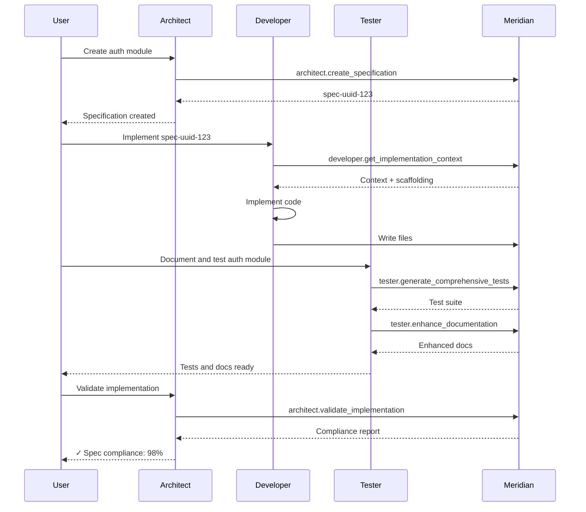

# Meridian Strong Tools Specification
# Structured Documentation & Knowledge Management System

**Версия**: 1.0.0
**Дата создания**: 18 октября 2025
**Статус**: Design Specification
**Совместимость**: Meridian MCP Server v1.0.0+

> **⚠️ ВАЖНО: Архитектурное Обновление**
>
> Эта спецификация описывает функциональность Strong Tools (генерация документации, примеров, тестов, agent integration).
>
> Для полной картины системы, **обязательно ознакомьтесь с [Global Architecture Specification](./global-architecture-spec.md)**, которая описывает:
> - Глобальную двухуровневую архитектуру (global server + local MCP servers)
> - Кросс-монорепозиторную документацию
> - Систему устойчивых к перемещению ID
> - Project Registry для всех монорепозиториев на машине разработчика
>
> **Strong Tools** (этот документ) работает **поверх** Global Architecture и использует ее возможности для генерации и управления документацией.

---

## Оглавление

1. [Обзор и Философия](#обзор-и-философия)
2. [Архитектурные Принципы](#архитектурные-принципы)
3. [Анализ Context7](#анализ-context7)
4. [Глобальный Каталог Документации](#глобальный-каталог-документации)
5. [Система Генерации Документации](#система-генерации-документации)
6. [Генерация Примеров Кода](#генерация-примеров-кода)
7. [Генерация Тестов](#генерация-тестов)
8. [Интеграция с Агентами](#интеграция-с-агентами)
9. [Система Авто-Обновления](#система-авто-обновления)
10. [MCP Tools Specification](#mcp-tools-specification)
11. [Структуры Данных](#структуры-данных)
12. [План Реализации](#план-реализации)
13. [Совместимость с spec.md](#совместимость-с-specmd)

---

## Обзор и Философия

### Видение

Meridian Strong Tools трансформирует Meridian из системы индексации кода в **полноценную систему управления знаниями** с возможностями:

1. **Автоматической генерации** структурированной документации высокого качества
2. **Создания практических примеров** на основе анализа типов и сигнатур
3. **Генерации тестов** (unit/integration/e2e) для TypeScript и Rust проектов
4. **Глобального каталога** документации для всех проектов в monorepo
5. **Кроссплатформенного доступа** к документации между проектами
6. **Автоматического обновления** при изменении кода
7. **Поддержки agent-архитектуры** (architect, developer, tester)

### Отличия от Context7

**Context7** - это **прокси-сервер** к внешнему API (context7.com):
- Ретранслирует запросы к централизованному сервису
- Не хранит документацию локально
- Не генерирует контент, только извлекает готовый
- Зависит от внешней инфраструктуры

**Meridian Strong Tools** - это **самодостаточная система**:
- Генерирует документацию из исходного кода локально
- Хранит все данные в RocksDB
- Создает примеры и тесты на основе анализа кода
- Работает полностью offline
- Интегрирована с tree-sitter для глубокого анализа

### Целевая Аудитория

1. **AI-агенты** (Architect, Developer, Tester) - основные потребители
2. **Разработчики** - через Claude Code и другие MCP-клиенты
3. **CI/CD системы** - автоматическая генерация документации
4. **Системы качества** - валидация документации и тестов

---

## Архитектурные Принципы

### 1. Local-First Architecture

Вся генерация и хранение происходит локально:
```
Source Code → Tree-sitter AST → Analysis → Generation → RocksDB Storage
```

### 2. Multi-Language Support

**TypeScript**:
- Runtimes: Node.js 22+, Bun 1.2+, Deno 2.0+
- Test frameworks: Jest, Vitest, Bun Test, Deno Test
- E2E frameworks: Playwright, Puppeteer, Cypress
- Doc format: TSDoc/JSDoc

**Rust**:
- Build tool: Cargo
- Test types: unit tests, integration tests, doc tests, e2e tests
- Doc format: rustdoc

### 3. Quality Standards

Вся генерируемая документация должна соответствовать:
- **TypeScript**: TSDoc/JSDoc standards, TypeScript ESLint rules
- **Rust**: rustdoc conventions, clippy documentation lints
- **Examples**: Компилируются и проходят type checking
- **Tests**: Выполняются успешно (или помечены как TODO)

### 4. Cross-Reference Graph

Документация образует граф знаний:
```
Project A (Package) → Exports Interface I
  ↓
Project B (Package) → Imports Interface I → Uses in Function F
  ↓
Documentation → Cross-references both locations
```

### 5. Incremental Updates

При изменении кода:
1. Обнаружение изменений через file watching
2. Инкрементальная переиндексация только измененных файлов
3. Обновление cross-references
4. Инвалидация кэша документации
5. Регенерация затронутых примеров и тестов

---

## Анализ Context7

### Архитектура Context7

**Компоненты**:
```typescript
// Две основные функции
searchLibraries(query, clientIp?, apiKey?) → SearchResponse
fetchLibraryDocumentation(libraryId, {tokens, topic}, clientIp?, apiKey?) → string

// Типы данных
interface SearchResult {
  id: string;              // "/mongodb/docs"
  title: string;           // "MongoDB Node.js Driver"
  description: string;     // Краткое описание
  totalSnippets: number;   // Количество примеров кода
  trustScore: number;      // 0-10, авторитетность
  versions: string[];      // Доступные версии
}
```

**MCP Tools**:
1. `resolve-library-id`: Поиск библиотеки → получение ID
2. `get-library-docs`: Получение документации по ID

**Transport**:
- STDIO: для локального использования (Claude Code)
- HTTP/SSE: для remote сервера (multi-client)

**Authentication**:
- API keys (формат: `ctx7sk*`)
- Header-based auth
- Client IP tracking для rate limiting

### Применимые Паттерны для Meridian

✅ **Использовать**:
1. Двухэтапный подход: resolve → fetch
2. Token-based chunking для больших документов
3. Topic filtering для фокусированной выдачи
4. Error handling (404, 429, 401)
5. Metadata в SearchResult (scores, versions, counts)

❌ **Не использовать**:
1. External API dependency
2. Centralized storage
3. Proxy architecture
4. Remote rate limiting (заменить на local quotas)

### Адаптация для Meridian

```
Context7                          Meridian Strong Tools
───────────────────────────────────────────────────────────
External API (context7.com)   →   Local RocksDB storage
Search remote libraries       →   Query local projects
Fetch pre-generated docs      →   Generate docs from AST
Return plain text             →   Return structured data
No versioning                 →   Git-based versioning
No auto-update                →   File watching + re-index
```

---

## Глобальный Каталог Документации

> **📖 Смотрите также:** [Global Architecture Specification](./global-architecture-spec.md) для детального описания глобальной архитектуры, кросс-монорепозиторной документации и Project Registry.

### Концепция

**В контексте Strong Tools:** Глобальный каталог предоставляет структурированный доступ к документации всех проектов.

**Два уровня:**
1. **Внутри монорепозитория** - быстрый доступ к документации проектов этого монорепозитория
2. **Кросс-монорепозиторный** - доступ к документации проектов из других монорепозиториев (см. [Global Architecture](./global-architecture-spec.md))

Эта секция описывает **структуру метаданных** и **API для доступа к документации**, независимо от того, локальный это проект или внешний.

### Структура Каталога

```typescript
interface GlobalCatalog {
  projects: Map<string, ProjectMetadata>;
  crossReferences: Map<string, CrossReference[]>;
  lastUpdated: Date;
}

interface ProjectMetadata {
  id: string;                    // "@omnitron-dev/titan"
  name: string;                  // "Titan"
  type: "typescript" | "rust";
  runtime?: "node" | "bun" | "deno" | "browser";
  version: string;               // "1.0.0"
  path: string;                  // "packages/titan"

  // Documentation stats
  totalModules: number;
  totalFunctions: number;
  totalClasses: number;
  totalInterfaces: number;
  totalTypes: number;

  // Quality metrics
  documentedSymbols: number;     // Символов с документацией
  documentationCoverage: number; // 0-100%
  examplesCount: number;
  testsCount: number;

  // Cross-references
  dependencies: string[];        // IDs других проектов
  dependents: string[];          // Кто зависит от этого проекта

  // Timestamps
  lastIndexed: Date;
  lastModified: Date;
}

interface CrossReference {
  sourceProject: string;         // "@omnitron-dev/titan"
  sourceSymbol: string;          // "Application"
  targetProject: string;         // "@omnitron-dev/common"
  targetSymbol: string;          // "Deferred"
  referenceType: "import" | "extends" | "implements" | "uses" | "calls";
  location: {
    file: string;
    line: number;
    column: number;
  };
}
```

### Storage Schema в RocksDB

```
Prefixes:
catalog:projects:{projectId} → ProjectMetadata (JSON)
catalog:xref:{sourceProject}:{targetProject} → CrossReference[] (JSON)
catalog:index:name:{projectName} → projectId
catalog:index:path:{projectPath} → projectId
catalog:metadata → GlobalCatalog metadata (JSON)

Examples:
catalog:projects:@omnitron-dev/titan → {...}
catalog:xref:@omnitron-dev/titan:@omnitron-dev/common → [...]
catalog:index:name:titan → "@omnitron-dev/titan"
catalog:index:path:packages/titan → "@omnitron-dev/titan"
```

### Индексация Проектов

**Автоматическое обнаружение**:
1. Сканирование workspace для поиска:
   - TypeScript: `package.json` с `name` field
   - Rust: `Cargo.toml` с `[package]` section
2. Извлечение метаданных из манифестов
3. Анализ dependency graph
4. Построение cross-reference map

**Поддержка Monorepo**:
- Обнаружение workspace root (наличие `pnpm-workspace.yaml`, `lerna.json`, или workspace в `Cargo.toml`)
- Рекурсивное сканирование packages/apps директорий
- Уважение `.gitignore` и custom ignore patterns

---

## Система Генерации Документации

### Анализ Кода

**TypeScript AST Analysis**:
```typescript
// Извлечение информации из tree-sitter AST
interface ExtractedSymbol {
  kind: "function" | "class" | "interface" | "type" | "variable" | "enum";
  name: string;
  location: SourceLocation;

  // Type information
  signature?: string;           // Полная сигнатура
  parameters?: Parameter[];
  returnType?: string;
  typeParameters?: string[];

  // Documentation
  jsDocComment?: string;        // Существующий JSDoc
  visibility: "public" | "private" | "protected";
  isExported: boolean;

  // Relationships
  extends?: string[];
  implements?: string[];
  decorators?: string[];

  // Source
  sourceCode: string;           // Полный исходный код символа
}
```

**Rust AST Analysis**:
```rust
// Аналогично для Rust
struct ExtractedSymbol {
    kind: SymbolKind,              // Fn, Struct, Trait, Enum, etc.
    name: String,
    location: SourceLocation,

    // Type information
    signature: Option<String>,
    parameters: Vec<Parameter>,
    return_type: Option<String>,
    generics: Vec<String>,

    // Documentation
    doc_comment: Option<String>,   // Существующий /// doc comment
    visibility: Visibility,        // pub, pub(crate), private

    // Traits
    traits: Vec<String>,           // implemented traits
    derives: Vec<String>,          // #[derive(...)]

    // Source
    source_code: String,
}
```

### Генерация Документации

**Процесс**:
1. **Extraction**: AST → ExtractedSymbol
2. **Analysis**: Анализ типов, отношений, паттернов
3. **Generation**: Создание структурированной документации
4. **Validation**: Проверка на соответствие стандартам
5. **Enhancement**: Дополнение примерами и cross-links

**TypeScript Doc Generation**:
```typescript
/**
 * Generates a Deferred promise that can be resolved or rejected externally.
 *
 * @typeParam T - The type of value the promise will resolve to
 * @returns A Deferred object containing promise, resolve, and reject functions
 *
 * @example
 * Basic usage with timeout
 * ```typescript
 * import { defer } from '@omnitron-dev/common';
 *
 * const deferred = defer<string>();
 *
 * setTimeout(() => {
 *   deferred.resolve('Hello!');
 * }, 1000);
 *
 * const result = await deferred.promise; // 'Hello!' after 1 second
 * ```
 *
 * @example
 * Error handling
 * ```typescript
 * const deferred = defer<number>();
 * deferred.reject(new Error('Failed'));
 *
 * try {
 *   await deferred.promise;
 * } catch (error) {
 *   console.error(error.message); // 'Failed'
 * }
 * ```
 *
 * @see {@link Deferred} for the return type interface
 * @see {@link delay} for simple promise delays
 *
 * @category Promise Utilities
 * @since 1.0.0
 */
export function defer<T>(): Deferred<T>
```

**Rust Doc Generation**:
```rust
/// Creates a new HTTP client with the specified configuration.
///
/// # Arguments
///
/// * `config` - Client configuration including timeout, proxy settings
///
/// # Returns
///
/// A configured `HttpClient` instance ready to make requests
///
/// # Examples
///
/// Basic usage:
/// ```rust
/// use mylib::HttpClient;
///
/// let client = HttpClient::new(Default::default());
/// let response = client.get("https://example.com").await?;
/// ```
///
/// With custom timeout:
/// ```rust
/// use mylib::{HttpClient, Config};
/// use std::time::Duration;
///
/// let config = Config {
///     timeout: Duration::from_secs(30),
///     ..Default::default()
/// };
/// let client = HttpClient::new(config);
/// ```
///
/// # Errors
///
/// Returns `Error::InvalidConfig` if configuration is invalid
///
/// # Panics
///
/// This function does not panic
///
/// # Safety
///
/// This function is safe to call from any context
///
/// # See Also
///
/// * [`Config`] - Configuration options
/// * [`Response`] - HTTP response type
pub fn new(config: Config) -> Result<Self, Error>
```

### Quality Validation

**Критерии качества**:
1. **Completeness**:
   - Description присутствует
   - Parameters documented
   - Return value documented
   - Errors/Exceptions documented
   - Examples provided

2. **Clarity**:
   - Описание начинается с глагола (TypeScript) или noun phrase (Rust)
   - Конкретные детали, не общие фразы
   - Правильная грамматика и пунктуация

3. **Accuracy**:
   - Type information совпадает с signature
   - Examples компилируются
   - Cross-references корректны

4. **Standards Compliance**:
   - TypeScript: TSDoc tags (@param, @returns, @example, etc.)
   - Rust: rustdoc sections (# Arguments, # Examples, # Errors, etc.)

**Scoring System**:
```typescript
interface DocumentationQuality {
  score: number;              // 0-100
  completeness: number;       // 0-100
  clarity: number;            // 0-100
  accuracy: number;           // 0-100
  compliance: number;         // 0-100

  issues: QualityIssue[];
  suggestions: string[];
}

interface QualityIssue {
  severity: "error" | "warning" | "info";
  category: "completeness" | "clarity" | "accuracy" | "compliance";
  message: string;
  location?: SourceLocation;
  suggestion?: string;
}
```

### Трансформация Документации

**Цель**: Преобразовать существующую неструктурированную документацию в стандартизированный формат.

**Процесс**:
1. **Parse existing docs**: Извлечь текущую документацию
2. **Analyze content**: Определить описание, параметры, примеры
3. **Restructure**: Распределить по стандартным секциям
4. **Enhance**: Добавить недостающие элементы
5. **Validate**: Проверить качество

**Example Transformation**:
```typescript
// BEFORE (unstructured)
/**
 * Creates a deferred promise. You can resolve it later.
 */
export function defer<T>(): Deferred<T>

// AFTER (structured, enhanced)
/**
 * Generates a Deferred promise that can be resolved or rejected externally.
 *
 * Unlike a standard Promise constructor, this allows you to control resolution
 * timing from outside the promise initialization, useful for event-driven
 * or callback-based APIs.
 *
 * @typeParam T - The type of value the promise will resolve to
 * @returns A Deferred object containing:
 *   - `promise`: The Promise instance
 *   - `resolve`: Function to resolve the promise with a value
 *   - `reject`: Function to reject the promise with an error
 *
 * @example
 * Basic deferred resolution
 * ```typescript
 * import { defer } from '@omnitron-dev/common';
 *
 * const deferred = defer<string>();
 *
 * // Resolve after some async operation
 * fetchData().then(data => deferred.resolve(data));
 *
 * // Wait for resolution
 * const result = await deferred.promise;
 * ```
 *
 * @category Promise Utilities
 * @since 1.0.0
 */
export function defer<T>(): Deferred<T>
```

---

## Генерация Примеров Кода

### Анализ Сигнатур

**TypeScript Example Generation**:
```typescript
interface ExampleGenerationInput {
  symbol: ExtractedSymbol;
  imports: ImportInfo[];
  types: TypeInfo[];
  relatedSymbols: ExtractedSymbol[];
}

interface GeneratedExample {
  title: string;                    // "Basic usage"
  description?: string;              // Optional context
  code: string;                      // Executable code
  language: "typescript" | "rust";

  // Validation
  compiles: boolean;                 // Can it compile?
  typeChecks: boolean;               // Type-safe?
  runnable: boolean;                 // Can be executed?

  // Metadata
  complexity: "basic" | "intermediate" | "advanced";
  runtime?: "node" | "bun" | "deno" | "browser";
  dependencies: string[];            // Required imports
}
```

**Generation Strategy**:

1. **Basic Example** (всегда генерируется):
   - Минимальный код для демонстрации основного use case
   - Все необходимые imports
   - Type-safe usage
   - Expected output в комментариях

2. **Advanced Examples** (опционально):
   - Error handling
   - Edge cases
   - Complex scenarios
   - Integration patterns

**TypeScript Example Templates**:

```typescript
// For simple functions
import { functionName } from 'package-name';

const result = functionName(arg1, arg2);
console.log(result); // Expected output

// For classes
import { ClassName } from 'package-name';

const instance = new ClassName(config);
await instance.method();

// For async functions
import { asyncFunction } from 'package-name';

try {
  const result = await asyncFunction(input);
  console.log('Success:', result);
} catch (error) {
  console.error('Error:', error);
}

// For React/UI components (if applicable)
import { Component } from 'package-name';

function App() {
  return (
    <Component
      prop1="value"
      prop2={42}
      onEvent={(data) => console.log(data)}
    />
  );
}
```

**Rust Example Templates**:

```rust
// For simple functions
use crate_name::function_name;

fn main() {
    let result = function_name(arg1, arg2);
    println!("{:?}", result); // Expected output
}

// For structs and methods
use crate_name::StructName;

fn main() -> Result<(), Box<dyn std::error::Error>> {
    let instance = StructName::new(config);
    let result = instance.method()?;
    Ok(())
}

// For async functions (tokio)
use crate_name::async_function;

#[tokio::main]
async fn main() -> Result<(), Box<dyn std::error::Error>> {
    let result = async_function(input).await?;
    println!("Success: {:?}", result);
    Ok(())
}

// For traits
use crate_name::MyTrait;

struct MyType;

impl MyTrait for MyType {
    fn method(&self) -> ReturnType {
        // Implementation
    }
}
```

### Context-Aware Generation

**Type-Based Example Creation**:
```typescript
// Analyze function signature
function defer<T>(): Deferred<T>

// Determine:
// - Generic type T → provide concrete example (T = string)
// - Return type Deferred<T> → show how to use promise, resolve, reject
// - No parameters → simple invocation

// Generate example:
const deferred = defer<string>();
setTimeout(() => deferred.resolve('Done'), 1000);
const result = await deferred.promise;
```

**Dependency Analysis**:
- Detect required imports from usage
- Include transitive type imports
- Handle re-exports correctly
- Minimize import footprint

**Runtime Detection**:
- Node.js: use node: protocol for built-ins
- Bun: can use both node: and bun: APIs
- Deno: use https://deno.land/ imports or npm: specifier
- Browser: use DOM APIs, no Node APIs

---

## Генерация Тестов

### TypeScript Test Generation

**Supported Frameworks**:
1. **Jest** (Node.js default)
2. **Vitest** (Modern alternative)
3. **Bun Test** (Native Bun testing)
4. **Deno Test** (Native Deno testing)

**Test Types**:

```typescript
interface TestGenerationInput {
  symbol: ExtractedSymbol;
  testType: "unit" | "integration" | "e2e";
  framework: "jest" | "vitest" | "bun" | "deno";
  runtime: "node" | "bun" | "deno" | "browser";
}

interface GeneratedTest {
  filePath: string;              // "src/__tests__/defer.test.ts"
  framework: string;
  content: string;               // Full test file content

  // Test coverage
  totalTests: number;
  scenarios: TestScenario[];

  // Validation
  compiles: boolean;
  passes: boolean;               // Does it pass when executed?
  coverage?: number;             // Code coverage %
}

interface TestScenario {
  description: string;           // "should resolve with value"
  type: "success" | "error" | "edge-case";
  code: string;
}
```

**Unit Test Template (Jest/Vitest)**:

```typescript
import { describe, it, expect } from '@jest/globals'; // or 'vitest'
import { functionName } from '../function-name';

describe('functionName', () => {
  it('should handle basic case', () => {
    const result = functionName(input);
    expect(result).toBe(expectedOutput);
  });

  it('should handle edge case', () => {
    const result = functionName(edgeInput);
    expect(result).toBe(edgeOutput);
  });

  it('should throw error for invalid input', () => {
    expect(() => functionName(invalidInput)).toThrow(ErrorType);
  });
});

describe('asyncFunction', () => {
  it('should resolve with value', async () => {
    const result = await asyncFunction(input);
    expect(result).toEqual(expectedValue);
  });

  it('should reject with error', async () => {
    await expect(asyncFunction(badInput)).rejects.toThrow(ErrorType);
  });
});
```

**Integration Test Template**:

```typescript
import { describe, it, expect, beforeAll, afterAll } from 'vitest';
import { Application } from '@omnitron-dev/titan';
import { MyModule } from '../my-module';

describe('MyModule Integration', () => {
  let app: Application;

  beforeAll(async () => {
    app = await Application.create(MyModule);
    await app.start();
  });

  afterAll(async () => {
    await app.stop();
  });

  it('should integrate with other modules', async () => {
    const service = app.get(MyService);
    const result = await service.doSomething();
    expect(result).toBeDefined();
  });
});
```

**E2E Test Template (Playwright)**:

```typescript
import { test, expect } from '@playwright/test';

test.describe('User Flow', () => {
  test('should complete user registration', async ({ page }) => {
    await page.goto('http://localhost:3000');
    await page.fill('#email', 'user@example.com');
    await page.fill('#password', 'secure-password');
    await page.click('button[type="submit"]');

    await expect(page.locator('.success-message')).toBeVisible();
  });
});
```

### Rust Test Generation

**Test Types**:

1. **Unit Tests** (in-module `#[cfg(test)]`)
2. **Integration Tests** (`tests/` directory)
3. **Doc Tests** (in `///` comments)
4. **Bench Tests** (`benches/` directory)

**Unit Test Template**:

```rust
#[cfg(test)]
mod tests {
    use super::*;

    #[test]
    fn test_basic_functionality() {
        let result = function_name(input);
        assert_eq!(result, expected_output);
    }

    #[test]
    fn test_error_handling() {
        let result = function_name(invalid_input);
        assert!(result.is_err());
    }

    #[test]
    #[should_panic(expected = "error message")]
    fn test_panic_case() {
        function_that_panics(bad_input);
    }
}
```

**Integration Test Template**:

```rust
// tests/integration_test.rs
use my_crate::{ModuleA, ModuleB};

#[test]
fn test_modules_integration() {
    let module_a = ModuleA::new();
    let module_b = ModuleB::new();

    let result = module_a.process(module_b.data());
    assert!(result.is_ok());
}

#[tokio::test]
async fn test_async_integration() {
    let service = Service::connect("localhost:8080").await.unwrap();
    let response = service.request().await.unwrap();
    assert_eq!(response.status, 200);
}
```

**Doc Test (automatically extracted)**:

```rust
/// Calculates the sum of two numbers.
///
/// # Examples
///
/// ```
/// use my_crate::add;
///
/// let result = add(2, 3);
/// assert_eq!(result, 5);
/// ```
pub fn add(a: i32, b: i32) -> i32 {
    a + b
}
```

### Test Generation Strategy

**Анализ кода для определения test cases**:

1. **Function signature analysis**:
   - Parameters → test different input combinations
   - Return type → verify expected outputs
   - Generic types → test with multiple concrete types
   - Option/Result → test Some/None, Ok/Err cases

2. **Branch coverage**:
   - if/else branches → test both paths
   - match arms → test each pattern
   - loops → test empty, single, multiple iterations

3. **Error paths**:
   - Functions returning Result → test error cases
   - Functions with panic! → test panic scenarios
   - Validation logic → test invalid inputs

4. **Edge cases**:
   - Boundary values (0, -1, MAX, MIN)
   - Empty collections
   - null/undefined/None values
   - Concurrent access (for async code)

---

## Интеграция с Агентами

### Agent Architecture

**Специализированные агенты** (определены в `.claude/agents/`):

1. **Architect Agent** - создает спецификации и архитектурные решения
2. **Developer Agent** - реализует функциональность по спецификациям
3. **Tester Agent** - пишет документацию, примеры и тесты

### Architect Agent Tools

**Цель**: Создание структурированных спецификаций для разработки.

**MCP Tool: `architect.create_specification`**

```typescript
{
  name: "architect.create_specification",
  description: "Creates a structured specification document for a feature or module",
  inputSchema: {
    title: string;                    // "User Authentication Module"
    scope: string;                     // "backend" | "frontend" | "fullstack"
    requirements: string[];            // List of functional requirements
    technicalContext: {
      language: "typescript" | "rust";
      framework?: string;              // "titan", "aether", etc.
      dependencies?: string[];         // Required packages
    };
    constraints?: string[];            // Technical/business constraints
  },
  output: {
    specificationId: string;
    filePath: string;                  // Where spec was saved
    sections: {
      overview: string;
      architecture: string;
      apiDesign: string;               // Function signatures, interfaces
      dataModels: string;              // Types, structs, schemas
      errorHandling: string;
      testing: string;                 // Test strategy
      implementation: string;          // Step-by-step plan
    };
    estimatedComplexity: "low" | "medium" | "high";
    suggestedTests: string[];          // Test scenarios to implement
  }
}
```

**Specification Format**:

```markdown
# Specification: [Title]

**ID**: spec-[uuid]
**Created**: [timestamp]
**Scope**: [backend/frontend/fullstack]
**Language**: [TypeScript/Rust]
**Status**: draft

## Overview

[High-level description of what needs to be built]

## Requirements

### Functional Requirements
1. [Requirement 1]
2. [Requirement 2]

### Non-Functional Requirements
1. [Performance, security, etc.]

## Architecture

### Components
- Component A: [description]
- Component B: [description]

### Data Flow
```
[ASCII diagram or description]
```

## API Design

### TypeScript Interfaces
```typescript
interface UserAuth {
  login(email: string, password: string): Promise<AuthToken>;
  logout(token: string): Promise<void>;
  verify(token: string): Promise<User>;
}
```

### Rust Traits
```rust
trait UserAuth {
    async fn login(email: &str, password: &str) -> Result<AuthToken, AuthError>;
    async fn logout(token: &str) -> Result<(), AuthError>;
}
```

## Error Handling

### Error Types
```typescript
enum AuthError {
  InvalidCredentials,
  TokenExpired,
  RateLimitExceeded,
}
```

## Testing Strategy

### Unit Tests
- Test login with valid credentials
- Test login with invalid credentials
- Test token expiration

### Integration Tests
- Test full authentication flow
- Test with database

### E2E Tests
- Test UI login flow (if frontend)

## Implementation Plan

1. **Phase 1**: Data models and types
2. **Phase 2**: Core authentication logic
3. **Phase 3**: Token management
4. **Phase 4**: Error handling
5. **Phase 5**: Testing
6. **Phase 6**: Documentation

## Dependencies

- @omnitron-dev/common
- jsonwebtoken
- bcrypt

## Estimated Effort

- Complexity: Medium
- Estimated time: 4-6 hours
```

**MCP Tool: `architect.validate_implementation`**

```typescript
{
  name: "architect.validate_implementation",
  description: "Validates that implementation matches specification",
  inputSchema: {
    specificationId: string;
    implementationPath: string;        // Path to implemented code
  },
  output: {
    isValid: boolean;
    compliance: number;                // 0-100%
    missingFeatures: string[];
    deviations: {
      section: string;
      expected: string;
      actual: string;
      severity: "critical" | "major" | "minor";
    }[];
    recommendations: string[];
  }
}
```

### Developer Agent Tools

**Цель**: Реализация функциональности согласно спецификациям.

**MCP Tool: `developer.get_implementation_context`**

```typescript
{
  name: "developer.get_implementation_context",
  description: "Retrieves all context needed to implement a specification",
  inputSchema: {
    specificationId: string;
  },
  output: {
    specification: SpecificationDocument;
    relatedCode: {
      interfaces: ExtractedSymbol[];   // Existing interfaces to implement
      examples: GeneratedExample[];    // Similar implementations
      dependencies: ProjectMetadata[]; // Required packages
    };
    scaffolding: {
      files: {
        path: string;
        content: string;               // Pre-generated template
      }[];
    };
    checklist: string[];               // Implementation checklist
  }
}
```

**MCP Tool: `developer.generate_boilerplate`**

```typescript
{
  name: "developer.generate_boilerplate",
  description: "Generates boilerplate code from specification",
  inputSchema: {
    specificationId: string;
    language: "typescript" | "rust";
    style: "class" | "functional" | "trait";
  },
  output: {
    files: {
      path: string;
      content: string;
    }[];
    nextSteps: string[];
  }
}
```

### Tester Agent Tools

**Цель**: Создание документации, примеров и тестов.

**MCP Tool: `tester.generate_comprehensive_tests`**

```typescript
{
  name: "tester.generate_comprehensive_tests",
  description: "Generates complete test suite for a symbol or module",
  inputSchema: {
    targetPath: string;                // File or directory to test
    testTypes: ("unit" | "integration" | "e2e")[];
    framework: "jest" | "vitest" | "bun" | "deno" | "cargo";
    coverageTarget?: number;           // Desired coverage % (default: 80)
  },
  output: {
    tests: GeneratedTest[];
    coverage: {
      lines: number;
      branches: number;
      functions: number;
      statements: number;
    };
    recommendations: string[];
  }
}
```

**MCP Tool: `tester.validate_examples`**

```typescript
{
  name: "tester.validate_examples",
  description: "Validates that all code examples compile and run",
  inputSchema: {
    documentationPath: string;         // Path to doc file or symbol
  },
  output: {
    totalExamples: number;
    validExamples: number;
    invalidExamples: {
      exampleCode: string;
      error: string;
      suggestion: string;
    }[];
    coverage: number;                  // % of symbols with valid examples
  }
}
```

**MCP Tool: `tester.enhance_documentation`**

```typescript
{
  name: "tester.enhance_documentation",
  description: "Enhances existing documentation with examples and better descriptions",
  inputSchema: {
    symbolPath: string;                // Path to symbol (file:line:column)
    addExamples: boolean;
    improveDescription: boolean;
    addCrossReferences: boolean;
  },
  output: {
    originalDoc: string;
    enhancedDoc: string;
    changes: {
      type: "added_example" | "improved_description" | "added_xref";
      content: string;
    }[];
    qualityScore: {
      before: number;
      after: number;
    };
  }
}
```

### Agent Workflow Example

**Сценарий: Создание нового модуля**


```mermaid
sequenceDiagram
    participant User
    participant Architect
    participant Developer
    participant Tester
    participant Meridian

    User->>Architect: Create auth module
    Architect->>Meridian: architect.create_specification
    Meridian-->>Architect: spec-uuid-123
    Architect-->>User: Specification created

    User->>Developer: Implement spec-uuid-123
    Developer->>Meridian: developer.get_implementation_context
    Meridian-->>Developer: Context + scaffolding
    Developer->>Developer: Implement code
    Developer->>Meridian: Write files

    User->>Tester: Document and test auth module
    Tester->>Meridian: tester.generate_comprehensive_tests
    Meridian-->>Tester: Test suite
    Tester->>Meridian: tester.enhance_documentation
    Meridian-->>Tester: Enhanced docs
    Tester-->>User: Tests and docs ready

    User->>Architect: Validate implementation
    Architect->>Meridian: architect.validate_implementation
    Meridian-->>Architect: Compliance report
    Architect-->>User: ✓ Spec compliance: 98%
```

---

## Система Авто-Обновления

### File Watching

**Механизм**:
```typescript
import { watch } from 'fs/promises';

interface FileWatcher {
  start(): Promise<void>;
  stop(): Promise<void>;
  on(event: 'change' | 'add' | 'delete', handler: FileChangeHandler): void;
}

interface FileChangeEvent {
  type: 'change' | 'add' | 'delete';
  path: string;
  timestamp: Date;
  affectedProjects: string[];          // Projects that contain this file
}

type FileChangeHandler = (event: FileChangeEvent) => Promise<void>;
```

**Watch Strategy**:
1. **Project-Level Watching**:
   - Watch all indexed projects
   - Respect `.gitignore` patterns
   - Ignore `node_modules/`, `target/`, `dist/`
   - Watch source files only (`.ts`, `.tsx`, `.rs`)

2. **Debouncing**:
   - Buffer changes for 500ms
   - Batch multiple changes to same file
   - Aggregate changes across files for bulk re-index

### Incremental Re-Indexing

**Process**:

```typescript
async function handleFileChange(event: FileChangeEvent) {
  // 1. Determine what needs re-indexing
  const affectedSymbols = await findAffectedSymbols(event.path);

  // 2. Re-parse changed file
  const newAST = await parseFile(event.path);
  const newSymbols = await extractSymbols(newAST);

  // 3. Compute diff
  const diff = computeSymbolDiff(affectedSymbols, newSymbols);

  // 4. Update RocksDB
  await updateSymbols(diff.added);
  await updateSymbols(diff.modified);
  await deleteSymbols(diff.removed);

  // 5. Update cross-references
  await updateCrossReferences(event.path, newSymbols);

  // 6. Invalidate affected documentation cache
  await invalidateDocCache(affectedSymbols);

  // 7. Re-generate affected examples and tests (optional, can be lazy)
  if (shouldRegenerateExamples(diff)) {
    await regenerateExamples(affectedSymbols);
  }
}
```

**Diff Algorithm**:

```typescript
interface SymbolDiff {
  added: ExtractedSymbol[];            // New symbols
  modified: {
    old: ExtractedSymbol;
    new: ExtractedSymbol;
    changes: SymbolChange[];
  }[];
  removed: ExtractedSymbol[];          // Deleted symbols
  unchanged: ExtractedSymbol[];        // No changes
}

interface SymbolChange {
  field: "signature" | "documentation" | "visibility" | "source";
  oldValue: any;
  newValue: any;
}

function computeSymbolDiff(
  oldSymbols: ExtractedSymbol[],
  newSymbols: ExtractedSymbol[]
): SymbolDiff {
  // Match symbols by name and location
  // Compare signatures, docs, etc.
  // Return structured diff
}
```

### Cross-Reference Updates

**Challenge**: Когда символ изменяется, нужно обновить все ссылки на него.

**Solution**:

```typescript
// 1. Find all cross-references TO this symbol
const incomingRefs = await findIncomingReferences(symbolId);

// 2. For each reference, check if it's still valid
for (const ref of incomingRefs) {
  const isStillValid = await validateReference(ref, newSymbol);
  if (!isStillValid) {
    await markReferenceStale(ref);
    // Optionally: notify dependent projects
  }
}

// 3. Find all cross-references FROM this file
const outgoingRefs = await extractReferences(newAST);

// 4. Update outgoing reference index
await updateReferenceIndex(filePath, outgoingRefs);
```

**Stale Reference Handling**:
- Mark as stale but don't delete immediately
- Background task to clean up stale refs after grace period
- Provide warnings in tools when using stale references

### Cache Invalidation

**Multi-Level Caching**:

```typescript
interface CacheManager {
  // L1: In-memory cache (LRU)
  memoryCache: LRUCache<string, CachedItem>;

  // L2: RocksDB cache (persistent)
  diskCache: RocksDB;

  // Invalidation
  invalidate(key: string): Promise<void>;
  invalidatePattern(pattern: string): Promise<void>;
  invalidateProject(projectId: string): Promise<void>;
}

// Cache keys:
// doc:{projectId}:{symbolId} → Generated documentation
// examples:{symbolId} → Generated examples
// tests:{symbolId} → Generated tests
// xref:{symbolId}:incoming → Incoming cross-references
// xref:{symbolId}:outgoing → Outgoing cross-references
```

**Invalidation Strategy**:

1. **On Symbol Change**:
   ```typescript
   await cache.invalidate(`doc:${projectId}:${symbolId}`);
   await cache.invalidate(`examples:${symbolId}`);
   await cache.invalidate(`tests:${symbolId}`);
   ```

2. **On Project Re-Index**:
   ```typescript
   await cache.invalidateProject(projectId);
   ```

3. **On Cross-Reference Change**:
   ```typescript
   await cache.invalidatePattern(`xref:${symbolId}:*`);
   ```

### Lazy Regeneration

**Strategy**: Не регенерировать все сразу, а по требованию.

```typescript
async function getDocumentation(symbolId: string): Promise<string> {
  // 1. Check cache
  const cached = await cache.get(`doc:${symbolId}`);
  if (cached && !cached.isStale) {
    return cached.value;
  }

  // 2. Cache miss or stale → regenerate
  const symbol = await getSymbol(symbolId);
  const doc = await generateDocumentation(symbol);

  // 3. Store in cache
  await cache.set(`doc:${symbolId}`, doc, { ttl: 3600 });

  return doc;
}
```

**Benefits**:
- Lower latency for file changes (don't regenerate everything)
- Regenerate only what's actually used
- Spread load over time

---

## MCP Tools Specification

### Global Catalog Tools

#### `strong.catalog.list_projects`

**Description**: Возвращает список всех проектов в global catalog.

**Input**: None

**Output**:
```typescript
{
  projects: ProjectMetadata[];
  totalProjects: number;
  totalDocumented: number;           // Projects with docs
  averageCoverage: number;           // Average doc coverage %
  lastUpdated: Date;
}
```

**Example**:
```json
{
  "projects": [
    {
      "id": "@omnitron-dev/titan",
      "name": "Titan",
      "type": "typescript",
      "runtime": "node",
      "version": "1.0.0",
      "documentationCoverage": 85.5,
      "lastIndexed": "2025-10-18T10:30:00Z"
    }
  ],
  "totalProjects": 12,
  "totalDocumented": 10,
  "averageCoverage": 72.3
}
```

---

#### `strong.catalog.get_project`

**Description**: Получает детальную информацию о проекте.

**Input**:
```typescript
{
  projectId: string;                 // "@omnitron-dev/titan" or "packages/titan"
}
```

**Output**:
```typescript
{
  project: ProjectMetadata;
  modules: {
    name: string;
    path: string;
    exports: number;
    documented: number;
  }[];
  dependencies: ProjectMetadata[];   // Resolved dependencies
  dependents: ProjectMetadata[];     // Projects depending on this
  recentChanges: {
    file: string;
    timestamp: Date;
    changeType: "added" | "modified" | "deleted";
  }[];
}
```

---

#### `strong.catalog.search_documentation`

**Description**: Поиск документации across all projects.

**Input**:
```typescript
{
  query: string;                     // Search query
  projectId?: string;                // Filter by project
  symbolType?: "function" | "class" | "interface" | "type";
  minQuality?: number;               // Minimum quality score (0-100)
  limit?: number;                    // Max results (default: 20)
}
```

**Output**:
```typescript
{
  results: {
    symbolId: string;
    projectId: string;
    name: string;
    type: "function" | "class" | "interface" | "type";
    documentation: string;           // First paragraph
    qualityScore: number;
    location: SourceLocation;
    relevance: number;               // Search relevance score
  }[];
  totalResults: number;
}
```

---

### Documentation Generation Tools

#### `strong.docs.generate`

**Description**: Генерирует документацию для символа или файла.

**Input**:
```typescript
{
  targetPath: string;                // File path or "file:line:col"
  symbolName?: string;               // Specific symbol in file
  format: "tsdoc" | "jsdoc" | "rustdoc";
  includeExamples: boolean;          // Add examples
  enhanceExisting: boolean;          // Improve existing docs
}
```

**Output**:
```typescript
{
  documentation: string;             // Generated doc comment
  quality: DocumentationQuality;
  examples: GeneratedExample[];
  changes: {
    type: "created" | "enhanced";
    before?: string;
    after: string;
  };
}
```

---

#### `strong.docs.validate`

**Description**: Валидирует качество документации.

**Input**:
```typescript
{
  targetPath: string;                // File or symbol path
  standards: "strict" | "recommended" | "minimal";
}
```

**Output**:
```typescript
{
  overallScore: number;              // 0-100
  symbolScores: {
    symbolId: string;
    score: number;
    issues: QualityIssue[];
    suggestions: string[];
  }[];
  compliance: {
    standard: string;
    percentage: number;
  };
}
```

---

#### `strong.docs.transform`

**Description**: Трансформирует неструктурированную документацию в стандартизированный формат.

**Input**:
```typescript
{
  targetPath: string;
  targetFormat: "tsdoc" | "jsdoc" | "rustdoc";
  preserveCustomSections: boolean;   // Keep non-standard sections
}
```

**Output**:
```typescript
{
  transformedDocs: {
    symbolId: string;
    before: string;
    after: string;
    improvements: string[];
  }[];
  totalTransformed: number;
  qualityImprovement: number;        // Delta in quality score
}
```

---

### Example Generation Tools

#### `strong.examples.generate`

**Description**: Генерирует примеры кода для символа.

**Input**:
```typescript
{
  symbolPath: string;                // Path to symbol
  exampleTypes: ("basic" | "advanced" | "error-handling" | "async")[];
  runtime?: "node" | "bun" | "deno" | "browser";
  validate: boolean;                 // Compile/type-check examples
}
```

**Output**:
```typescript
{
  examples: GeneratedExample[];
  validation: {
    totalExamples: number;
    validExamples: number;
    errors: {
      exampleCode: string;
      error: string;
    }[];
  };
}
```

---

#### `strong.examples.validate`

**Description**: Валидирует существующие примеры (компиляция, type-checking).

**Input**:
```typescript
{
  documentationPath: string;         // Path to file with examples
  runtime?: "node" | "bun" | "deno";
}
```

**Output**:
```typescript
{
  totalExamples: number;
  validExamples: number;
  invalidExamples: {
    location: SourceLocation;
    code: string;
    error: string;
    suggestion?: string;
  }[];
  coverage: number;                  // % of symbols with valid examples
}
```

---

### Test Generation Tools

#### `strong.tests.generate`

**Description**: Генерирует тесты для символа или модуля.

**Input**:
```typescript
{
  targetPath: string;                // File or directory
  testTypes: ("unit" | "integration" | "e2e")[];
  framework: "jest" | "vitest" | "bun" | "deno" | "cargo";
  coverageTarget?: number;           // Desired coverage % (default: 80)
  includeEdgeCases: boolean;
}
```

**Output**:
```typescript
{
  tests: GeneratedTest[];
  estimatedCoverage: number;
  recommendations: string[];         // Additional test scenarios
}
```

---

#### `strong.tests.validate`

**Description**: Запускает сгенерированные тесты и валидирует результаты.

**Input**:
```typescript
{
  testPath: string;                  // Path to test file
  framework: "jest" | "vitest" | "bun" | "deno" | "cargo";
}
```

**Output**:
```typescript
{
  passed: boolean;
  totalTests: number;
  passedTests: number;
  failedTests: {
    name: string;
    error: string;
    stack?: string;
  }[];
  coverage?: {
    lines: number;
    branches: number;
    functions: number;
  };
  duration: number;                  // Test run time in ms
}
```

---

### Agent Tools

#### `strong.architect.create_specification`

(Описан в разделе [Architect Agent Tools](#architect-agent-tools))

---

#### `strong.architect.validate_implementation`

(Описан в разделе [Architect Agent Tools](#architect-agent-tools))

---

#### `strong.developer.get_implementation_context`

(Описан в разделе [Developer Agent Tools](#developer-agent-tools))

---

#### `strong.developer.generate_boilerplate`

(Описан в разделе [Developer Agent Tools](#developer-agent-tools))

---

#### `strong.tester.generate_comprehensive_tests`

(Описан в разделе [Tester Agent Tools](#tester-agent-tools))

---

#### `strong.tester.validate_examples`

(Описан в разделе [Tester Agent Tools](#tester-agent-tools))

---

#### `strong.tester.enhance_documentation`

(Описан в разделе [Tester Agent Tools](#tester-agent-tools))

---

### Cross-Project Tools

#### `strong.xref.find_usages`

**Description**: Находит все использования символа across all projects.

**Input**:
```typescript
{
  symbolId: string;                  // Symbol to find usages of
  includeTests: boolean;             // Include test files
  includeExamples: boolean;          // Include example code
}
```

**Output**:
```typescript
{
  totalUsages: number;
  usages: {
    projectId: string;
    file: string;
    line: number;
    column: number;
    context: string;                 // Surrounding code
    usageType: "import" | "call" | "extend" | "implement";
  }[];
  dependentProjects: string[];       // Projects that depend on this symbol
}
```

---

#### `strong.xref.get_dependency_graph`

**Description**: Возвращает граф зависимостей для проекта или символа.

**Input**:
```typescript
{
  targetId: string;                  // Project ID or symbol ID
  depth?: number;                    // Max depth (default: 3)
  direction: "incoming" | "outgoing" | "both";
}
```

**Output**:
```typescript
{
  graph: {
    nodes: {
      id: string;
      type: "project" | "module" | "symbol";
      label: string;
    }[];
    edges: {
      from: string;
      to: string;
      type: "depends" | "imports" | "uses";
    }[];
  };
  visualization: string;             // Mermaid diagram
}
```

---

### Auto-Update Tools

#### `strong.watch.start`

**Description**: Запускает file watching для проекта.

**Input**:
```typescript
{
  projectId?: string;                // Watch specific project (or all)
  autoReindex: boolean;              // Auto re-index on changes
  autoRegenerate: boolean;           // Auto regenerate docs/examples
}
```

**Output**:
```typescript
{
  watchId: string;
  watching: string[];                // Paths being watched
  status: "active";
}
```

---

#### `strong.watch.stop`

**Description**: Останавливает file watching.

**Input**:
```typescript
{
  watchId: string;
}
```

**Output**:
```typescript
{
  stopped: boolean;
  statistics: {
    filesWatched: number;
    changesDetected: number;
    reindexCount: number;
  };
}
```

---

#### `strong.watch.status`

**Description**: Получает статус file watching.

**Input**: None

**Output**:
```typescript
{
  active: boolean;
  watchers: {
    watchId: string;
    projectId?: string;
    startedAt: Date;
    changesDetected: number;
  }[];
}
```

---

## Структуры Данных

### RocksDB Schema

**Prefixes Summary**:

```
# Global Catalog
catalog:projects:{projectId}              → ProjectMetadata
catalog:xref:{sourceProject}:{targetProject} → CrossReference[]
catalog:index:name:{projectName}          → projectId
catalog:index:path:{projectPath}          → projectId
catalog:metadata                          → GlobalCatalog

# Documentation
docs:{projectId}:{symbolId}               → GeneratedDocumentation
docs:quality:{symbolId}                   → DocumentationQuality
docs:cache:{symbolId}                     → CachedDocumentation

# Examples
examples:{symbolId}                       → GeneratedExample[]
examples:validation:{symbolId}            → ExampleValidation

# Tests
tests:{symbolId}                          → GeneratedTest[]
tests:validation:{symbolId}               → TestValidation

# Cross-References (extended)
xref:{symbolId}:incoming                  → IncomingReference[]
xref:{symbolId}:outgoing                  → OutgoingReference[]
xref:stale:{symbolId}                     → StaleReference[]

# Specifications (for Architect Agent)
spec:{specId}                             → SpecificationDocument
spec:index:project:{projectId}            → specId[]
spec:validation:{specId}                  → ValidationReport

# Watch State
watch:active                              → WatchState
watch:changes:{projectId}                 → FileChange[]
```

### TypeScript Type Definitions

**Full type definitions** (для использования в коде):

```typescript
// meridian/src/strong-tools/types.ts

export interface ProjectMetadata {
  id: string;
  name: string;
  type: "typescript" | "rust";
  runtime?: "node" | "bun" | "deno" | "browser";
  version: string;
  path: string;

  totalModules: number;
  totalFunctions: number;
  totalClasses: number;
  totalInterfaces: number;
  totalTypes: number;

  documentedSymbols: number;
  documentationCoverage: number;
  examplesCount: number;
  testsCount: number;

  dependencies: string[];
  dependents: string[];

  lastIndexed: Date;
  lastModified: Date;
}

export interface ExtractedSymbol {
  kind: SymbolKind;
  name: string;
  location: SourceLocation;
  signature?: string;
  parameters?: Parameter[];
  returnType?: string;
  typeParameters?: string[];
  jsDocComment?: string;
  visibility: Visibility;
  isExported: boolean;
  extends?: string[];
  implements?: string[];
  decorators?: string[];
  sourceCode: string;
}

export type SymbolKind =
  | "function"
  | "class"
  | "interface"
  | "type"
  | "variable"
  | "enum"
  | "module"
  | "namespace";

export interface SourceLocation {
  file: string;
  startLine: number;
  startColumn: number;
  endLine: number;
  endColumn: number;
}

export interface Parameter {
  name: string;
  type: string;
  optional: boolean;
  defaultValue?: string;
  description?: string;
}

export type Visibility = "public" | "private" | "protected";

export interface DocumentationQuality {
  score: number;
  completeness: number;
  clarity: number;
  accuracy: number;
  compliance: number;
  issues: QualityIssue[];
  suggestions: string[];
}

export interface QualityIssue {
  severity: "error" | "warning" | "info";
  category: "completeness" | "clarity" | "accuracy" | "compliance";
  message: string;
  location?: SourceLocation;
  suggestion?: string;
}

export interface GeneratedExample {
  title: string;
  description?: string;
  code: string;
  language: "typescript" | "rust";
  compiles: boolean;
  typeChecks: boolean;
  runnable: boolean;
  complexity: "basic" | "intermediate" | "advanced";
  runtime?: "node" | "bun" | "deno" | "browser";
  dependencies: string[];
}

export interface GeneratedTest {
  filePath: string;
  framework: "jest" | "vitest" | "bun" | "deno" | "cargo";
  content: string;
  totalTests: number;
  scenarios: TestScenario[];
  compiles: boolean;
  passes: boolean;
  coverage?: number;
}

export interface TestScenario {
  description: string;
  type: "success" | "error" | "edge-case";
  code: string;
}

export interface CrossReference {
  sourceProject: string;
  sourceSymbol: string;
  targetProject: string;
  targetSymbol: string;
  referenceType: "import" | "extends" | "implements" | "uses" | "calls";
  location: SourceLocation;
}

export interface SpecificationDocument {
  id: string;
  title: string;
  scope: "backend" | "frontend" | "fullstack";
  language: "typescript" | "rust";
  status: "draft" | "approved" | "implemented";

  sections: {
    overview: string;
    requirements: string[];
    architecture: string;
    apiDesign: string;
    dataModels: string;
    errorHandling: string;
    testing: string;
    implementation: string;
  };

  estimatedComplexity: "low" | "medium" | "high";
  suggestedTests: string[];

  createdAt: Date;
  updatedAt: Date;
}

export interface FileChangeEvent {
  type: "change" | "add" | "delete";
  path: string;
  timestamp: Date;
  affectedProjects: string[];
}
```

---

## План Реализации

### Phase 1: Infrastructure (Week 1-2)

**Tasks**:
1. ✅ **RocksDB Schema Design** (Done in this spec)
2. **Storage Layer Implementation**:
   - Implement catalog storage operations
   - Implement docs/examples/tests storage
   - Implement cross-reference storage
3. **Project Discovery**:
   - Monorepo scanner (package.json, Cargo.toml)
   - Dependency graph builder
   - Metadata extraction
4. **Basic MCP Tools**:
   - `strong.catalog.list_projects`
   - `strong.catalog.get_project`
   - `strong.catalog.search_documentation`

**Deliverables**:
- Global catalog functional
- Can list and query projects
- Basic cross-project documentation access

---

### Phase 2: Documentation Generation (Week 3-4)

**Tasks**:
1. **Documentation Generator**:
   - Extend tree-sitter extractors for richer symbol info
   - Implement TSDoc/JSDoc generator
   - Implement rustdoc generator
   - Quality validation engine
2. **Documentation Transformer**:
   - Parse existing docs
   - Restructure to standard format
   - Enhancement logic
3. **MCP Tools**:
   - `strong.docs.generate`
   - `strong.docs.validate`
   - `strong.docs.transform`

**Deliverables**:
- Can generate high-quality documentation
- Can transform existing docs
- Quality scoring functional

---

### Phase 3: Example & Test Generation (Week 5-6)

**Tasks**:
1. **Example Generator**:
   - Type analysis for smart examples
   - Context-aware code generation
   - Compilation validation
2. **Test Generator**:
   - Test template system
   - Framework adapters (Jest/Vitest/Bun/Cargo)
   - Coverage estimation
3. **MCP Tools**:
   - `strong.examples.generate`
   - `strong.examples.validate`
   - `strong.tests.generate`
   - `strong.tests.validate`

**Deliverables**:
- Can generate working examples
- Can generate passing tests
- Multi-framework support

---

### Phase 4: Agent Integration (Week 7-8)

**Tasks**:
1. **Architect Agent**:
   - Specification template system
   - Validation engine
   - Implementation compliance checker
2. **Developer Agent**:
   - Context retrieval
   - Boilerplate generation
3. **Tester Agent**:
   - Comprehensive test generation
   - Documentation enhancement
4. **MCP Tools**:
   - All agent tools (7 tools total)

**Deliverables**:
- Agent workflows functional
- Specification-driven development enabled
- Complete agent toolchain

---

### Phase 5: Auto-Update System (Week 9-10)

**Tasks**:
1. **File Watching**:
   - Watch implementation
   - Debouncing and batching
   - Project-level watching
2. **Incremental Re-Indexing**:
   - Symbol diff algorithm
   - Selective re-parsing
   - Cross-reference updates
3. **Cache Management**:
   - Multi-level caching
   - Invalidation strategies
   - Lazy regeneration
4. **MCP Tools**:
   - `strong.watch.start`
   - `strong.watch.stop`
   - `strong.watch.status`

**Deliverables**:
- Auto-update functional
- Documentation stays fresh
- Low-latency updates

---

### Phase 6: Cross-Project Features (Week 11-12)

**Tasks**:
1. **Cross-Reference Engine**:
   - Enhanced reference tracking
   - Usage analysis
   - Dependency graphing
2. **Global Search**:
   - Cross-project search
   - Relevance ranking
   - Filtering and facets
3. **MCP Tools**:
   - `strong.xref.find_usages`
   - `strong.xref.get_dependency_graph`
4. **Integration Testing**:
   - End-to-end workflows
   - Multi-project scenarios
   - Performance testing

**Deliverables**:
- Full cross-project functionality
- Complete MCP tool suite (23 tools total)
- Production-ready system

---

### Phase 7: Testing & Documentation (Week 13-14)

**Tasks**:
1. **Comprehensive Testing**:
   - Unit tests for all components
   - Integration tests for workflows
   - MCP tool tests (all 23 tools)
   - Performance benchmarks
2. **Documentation**:
   - User guide for MCP tools
   - Agent workflow examples
   - Best practices guide
   - API documentation
3. **Examples**:
   - Example projects using strong tools
   - Agent workflow demonstrations
   - Common scenarios

**Deliverables**:
- 100% test coverage for core features
- Complete documentation
- Ready for production use

---

## Совместимость с spec.md

### Интеграция с Существующей Архитектурой

**Meridian Strong Tools** является **расширением** существующей системы Meridian, а не заменой.

### Использование Существующих Компонентов

1. **Tree-sitter Integration** (spec.md: lines 308-409):
   - ✅ Используем существующие parsers (TypeScript, Rust, Go, Python, Java)
   - ✅ Расширяем extractors для более детального анализа
   - ✅ Добавляем extraction documentation comments

2. **RocksDB Storage** (spec.md: lines 169-237):
   - ✅ Используем существующую RocksDB инфраструктуру
   - ✅ Добавляем новые prefixes для strong tools
   - ✅ Сохраняем совместимость с существующими prefixes

3. **Code Navigation Tools** (spec.md: lines 986-1055):
   - ✅ `code.search_symbols` → используется в strong tools для поиска
   - ✅ `code.get_definition` → используется для извлечения символов
   - ✅ `code.find_references` → основа для cross-reference tracking
   - ✅ `code.get_dependencies` → используется для dependency graph

4. **Documentation Tools** (spec.md: lines 1056-1091):
   - ✅ Существующие `docs.search` и `docs.get_for_symbol` остаются
   - ✅ Strong tools **расширяют** их возможностями генерации
   - ✅ Обратная совместимость полностью сохранена

5. **Session Management** (spec.md: lines 1130-1215):
   - ✅ Strong tools используют session isolation
   - ✅ Copy-on-write semantics для безопасности
   - ✅ Регенерация документации в рамках сессии

6. **Monorepo Support** (spec.md: lines 1253-1335):
   - ✅ `monorepo.list_projects` → основа для global catalog
   - ✅ `monorepo.set_context` → используется strong tools
   - ✅ `monorepo.find_cross_references` → расширен в strong tools

### Новые Компоненты

**Strong Tools добавляет**:

1. **Global Documentation Catalog**:
   - Надстройка над `monorepo.list_projects`
   - Добавляет documentation metadata
   - Добавляет quality metrics

2. **Generation Engines**:
   - Documentation generator
   - Example generator
   - Test generator
   - Полностью новый функционал

3. **Agent Integration**:
   - Architect/Developer/Tester workflows
   - Specification management
   - Полностью новый функционал

4. **Auto-Update System**:
   - File watching
   - Incremental re-indexing
   - Cache invalidation
   - Расширение существующего session management

### Mapping: Existing Tools → Strong Tools

| Existing Tool | Strong Tool Enhancement |
|--------------|-------------------------|
| `code.search_symbols` | Used internally by `strong.catalog.search_documentation` |
| `code.get_definition` | Enhanced with `strong.docs.generate` |
| `docs.search` | Extended by `strong.catalog.search_documentation` (cross-project) |
| `docs.get_for_symbol` | Enhanced by `strong.docs.generate` (with generation) |
| `monorepo.list_projects` | Foundation for `strong.catalog.list_projects` |
| `monorepo.find_cross_references` | Extended by `strong.xref.*` tools |

### Версионирование

**MCP Protocol Version**: 2025-03-26 (совместимость с spec.md)

**Strong Tools Version**: 1.0.0

**Compatibility Matrix**:
```
Meridian Core: v1.0.0+
Strong Tools: v1.0.0+
MCP Protocol: 2025-03-26 (with 2024-11-05 backward compat)
Claude CLI: ✅ Compatible
MCP Clients: ✅ Compatible (all supporting MCP 2025-03-26)
```

### Migration Path

**Existing installations** обновляются безболезненно:

1. **Phase 1**: Установка strong tools (дополнительные 23 MCP tools)
2. **Phase 2**: Индексация проектов (background task)
3. **Phase 3**: Генерация документации (lazy, on-demand)
4. **Phase 4**: Enable auto-update (optional)

**Нет Breaking Changes**:
- Существующие 29 MCP tools работают как прежде
- Новые 23 strong tools добавляются без конфликтов
- RocksDB schema расширяется, не ломается
- Обратная совместимость гарантирована

---

## Заключение

**Meridian Strong Tools** трансформирует Meridian в полноценную **систему управления знаниями**:

✅ **Генерация документации** высокого качества
✅ **Создание практических примеров** на основе анализа кода
✅ **Генерация тестов** для TypeScript и Rust
✅ **Глобальный каталог** для всех проектов monorepo
✅ **Кроссплатформенный доступ** к документации
✅ **Автоматическое обновление** при изменениях кода
✅ **Интеграция с agent-архитектурой** (architect, developer, tester)
✅ **Полная совместимость** с существующей спецификацией

**Total MCP Tools**: 29 (existing) + 23 (strong tools) = **52 tools**

**Готово к реализации**: Спецификация полная, детальная, внутренне согласованная.

---

**Next Steps**: Начать реализацию согласно [плану](#план-реализации) →
