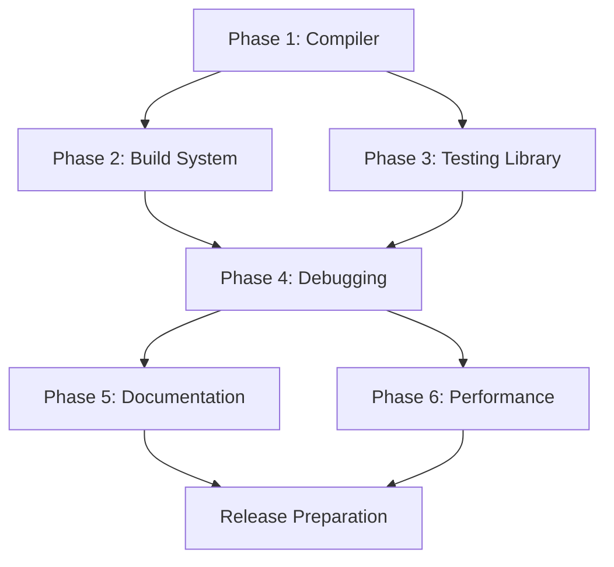

# Aether Framework Implementation Plan

> **Created**: 2025-10-14
> **Version**: 1.0.0
> **Status**: Active Planning Phase

## Executive Summary

This document outlines the comprehensive implementation plan for completing the Aether framework based on analysis of documentation (files 21-24) and current codebase state. The plan follows the philosophy outlined in `01-PHILOSOPHY.md` emphasizing core simplicity, performance, and developer experience.

## Current Implementation Status

### ✅ Fully Implemented
- **Core Reactivity**: Signals, computed, effects, batching
- **Router**: Complete with loaders, actions, guards, prefetching (413 tests passing)
- **DevTools**: Full implementation with 14 modules (inspector, profiler, time-travel, etc.)
- **SSR/SSG**: Server rendering, static generation, islands architecture
- **Forms**: Form component with validation and submission handling
- **Data Layer**: Stores, resources, async state management
- **Reconciler**: Virtual DOM diffing, JSX integration, fine-grained updates

### 🚧 Partially Implemented
- **Build System**: Vite plugin exists, but needs enhancements
- **Compiler**: JSX runtime exists, but optimization compiler missing
- **Testing Utilities**: Basic utilities exist, needs comprehensive API
- **CLI**: Basic commands exist, needs full implementation

### ❌ Not Implemented
- **Standalone Compiler**: Advanced optimizations (signal inlining, dead code elimination)
- **Build System Enhancements**: Module federation, worker bundling
- **Testing Library API**: Full render, fireEvent, userEvent implementations
- **Performance Monitoring**: Runtime metrics collection and reporting

## Implementation Phases

### Phase 1: Compiler Infrastructure (Priority: HIGH)
**Timeline**: 2 weeks
**Goal**: Implement the optimization compiler described in `22-COMPILER.md`

#### 1.1 Create Compiler Core
```bash
packages/aether/src/compiler/
├── index.ts                 # Main compiler API
├── parser.ts                # JSX/TS parser integration
├── analyzer.ts              # Static analysis
├── transformer.ts           # AST transformations
├── optimizer.ts             # Optimization passes
└── codegen.ts              # Code generation
```

**Tasks**:
- [ ] Set up TypeScript compiler API integration
- [ ] Implement JSX transform pipeline
- [ ] Create signal optimization pass
- [ ] Implement effect batching analysis
- [ ] Add component hoisting optimization
- [ ] Create tree-shaking analyzer
- [ ] Implement dead code elimination
- [ ] Add minification pass
- [ ] Create source map generation

#### 1.2 Vite Plugin Integration
**Tasks**:
- [ ] Enhance existing vite-plugin.ts with compiler
- [ ] Add development mode with HMR support
- [ ] Implement production optimizations
- [ ] Add build caching layer
- [ ] Create plugin configuration API

#### 1.3 Standalone CLI Compiler
**Tasks**:
- [ ] Create standalone compiler CLI
- [ ] Add watch mode support
- [ ] Implement incremental compilation
- [ ] Add configuration file support
- [ ] Create performance benchmarks

**Success Criteria**:
- Compilation reduces bundle size by >30%
- Signal optimizations reduce runtime overhead by >20%
- All existing tests pass with compiled output
- Source maps work correctly in DevTools

### Phase 2: Build System Enhancements (Priority: HIGH)
**Timeline**: 1 week
**Goal**: Complete the build system as described in `21-BUILD-SYSTEM.md`

#### 2.1 Advanced Build Features
**Tasks**:
- [ ] Implement module federation support
- [ ] Add worker bundling capabilities
- [ ] Create shared chunks optimization
- [ ] Implement dynamic imports handling
- [ ] Add CSS module support
- [ ] Create asset optimization pipeline
- [ ] Implement critical CSS extraction
- [ ] Add PWA manifest generation

#### 2.2 Build Performance
**Tasks**:
- [ ] Implement parallel compilation
- [ ] Add persistent caching
- [ ] Create dependency graph optimization
- [ ] Implement lazy compilation for development
- [ ] Add build profiling and reporting

**Success Criteria**:
- Build times <5s for medium projects
- HMR updates <100ms
- Bundle sizes optimized (target: ~6KB core runtime)
- All asset types properly handled

### Phase 3: Comprehensive Testing Library (Priority: MEDIUM)
**Timeline**: 1 week
**Goal**: Implement full testing utilities as described in `23-TESTING.md`

#### 3.1 Testing Library API
```bash
packages/aether/src/testing/
├── index.ts                 # Main testing API
├── render.ts               # Component rendering
├── events.ts               # Event simulation
├── async.ts                # Async utilities
├── queries.ts              # DOM queries
├── matchers.ts             # Custom matchers
└── hooks.ts                # Hook testing
```

**Tasks**:
- [ ] Implement full render() API with options
- [ ] Create fireEvent with all event types
- [ ] Implement userEvent for realistic interactions
- [ ] Add comprehensive query utilities (getBy*, queryBy*, findBy*)
- [ ] Create renderHook utility
- [ ] Implement act() for async updates
- [ ] Add custom Jest/Vitest matchers
- [ ] Create testing playground tool

#### 3.2 Testing Infrastructure
**Tasks**:
- [ ] Set up MSW for API mocking
- [ ] Create test data factories
- [ ] Implement snapshot testing support
- [ ] Add code coverage reporting
- [ ] Create test performance utilities
- [ ] Implement visual regression testing

**Success Criteria**:
- All testing patterns from docs work
- Tests run fast (<1s for component tests)
- Coverage reporting accurate
- Developer experience smooth

### Phase 4: Enhanced Debugging & Monitoring (Priority: MEDIUM)
**Timeline**: 1 week
**Goal**: Complete debugging features from `24-DEBUGGING.md`

#### 4.1 Runtime Performance Monitoring
**Tasks**:
- [ ] Implement performance marks API
- [ ] Add component render tracking
- [ ] Create memory profiling
- [ ] Implement signal update tracking
- [ ] Add network request monitoring
- [ ] Create performance dashboard

#### 4.2 Error Tracking Enhancement
**Tasks**:
- [ ] Enhance error boundaries with recovery
- [ ] Add error reporting integration (Sentry)
- [ ] Implement error replay functionality
- [ ] Create error analytics dashboard
- [ ] Add production error monitoring

#### 4.3 DevTools Enhancements
**Tasks**:
- [ ] Add component performance overlay
- [ ] Implement state diff viewer
- [ ] Create action replay system
- [ ] Add network request inspector
- [ ] Implement console integration

**Success Criteria**:
- Performance issues easily identifiable
- Errors tracked with full context
- DevTools provide actionable insights
- Production monitoring available

### Phase 5: Documentation & Examples (Priority: LOW)
**Timeline**: 3 days
**Goal**: Comprehensive documentation and examples

**Tasks**:
- [ ] Create Getting Started guide
- [ ] Write API reference documentation
- [ ] Create migration guides
- [ ] Build example applications
- [ ] Write performance optimization guide
- [ ] Create troubleshooting guide
- [ ] Add interactive tutorials
- [ ] Create video tutorials

### Phase 6: Performance Optimization (Priority: LOW)
**Timeline**: 3 days
**Goal**: Achieve performance targets from philosophy

**Tasks**:
- [ ] Optimize signal subscription management
- [ ] Implement render batching improvements
- [ ] Add lazy loading optimizations
- [ ] Create memory pool for VNodes
- [ ] Optimize reconciliation algorithm
- [ ] Implement component recycling
- [ ] Add request deduplication
- [ ] Create performance regression tests

**Success Criteria**:
- 10k signal updates <100ms
- Initial render <16ms for complex components
- Memory usage <10MB for large apps
- Bundle size ~6KB gzipped (core)

## Implementation Order & Dependencies



## Risk Mitigation

### Technical Risks
1. **Compiler Complexity**: Start with basic optimizations, iterate
2. **Performance Targets**: Use benchmarking throughout development
3. **Breaking Changes**: Maintain backward compatibility where possible
4. **Bundle Size**: Monitor size continuously with size-limit

### Mitigation Strategies
- Incremental implementation with continuous testing
- Feature flags for experimental features
- Beta releases for early feedback
- Performance benchmarks in CI/CD
- Regular architecture reviews

## Success Metrics

### Quantitative Metrics
- **Bundle Size**: Core ~6KB, Full ~14KB (gzipped)
- **Performance**: 10k updates <100ms
- **Build Time**: <5s for medium projects
- **Test Coverage**: >95% for core modules
- **TypeScript Coverage**: 100%

### Qualitative Metrics
- Developer satisfaction through surveys
- Community adoption rate
- Issue resolution time
- Documentation completeness
- API consistency

## Resource Requirements

### Development Resources
- 2 senior developers for compiler work
- 1 developer for build system
- 1 developer for testing utilities
- 1 technical writer for documentation

### Infrastructure
- CI/CD pipeline enhancements
- Performance testing infrastructure
- Documentation hosting
- Package registry setup

## Timeline Summary

| Phase | Duration | Start Date | End Date | Priority |
|-------|----------|------------|----------|----------|
| Phase 1: Compiler | 2 weeks | Week 1 | Week 2 | HIGH |
| Phase 2: Build System | 1 week | Week 3 | Week 3 | HIGH |
| Phase 3: Testing Library | 1 week | Week 3 | Week 4 | MEDIUM |
| Phase 4: Debugging | 1 week | Week 4 | Week 4 | MEDIUM |
| Phase 5: Documentation | 3 days | Week 5 | Week 5 | LOW |
| Phase 6: Performance | 3 days | Week 5 | Week 5 | LOW |

**Total Duration**: ~5 weeks

## Next Steps

1. **Immediate Actions**:
   - Set up compiler development environment
   - Create benchmark suite
   - Define API contracts
   - Set up CI/CD for new modules

2. **Week 1 Goals**:
   - Complete compiler parser and analyzer
   - Implement basic JSX transform
   - Create initial optimization passes
   - Set up test infrastructure

3. **Communication**:
   - Weekly progress updates
   - Architecture decision records (ADRs)
   - Public roadmap updates
   - Community feedback sessions

## Alignment with Philosophy

This plan strictly adheres to the principles in `01-PHILOSOPHY.md`:

1. **Core simplicity**: Compiler and build system are optional
2. **Performance-obsessed**: Every feature measured against benchmarks
3. **Type-safe**: Full TypeScript implementation
4. **Amazing DX**: Focus on debugging and testing tools
5. **Composition over configuration**: Modular architecture
6. **Explicit over implicit**: Clear APIs, no magic
7. **Conventions that scale**: Consistent patterns throughout
8. **Utilities over abstractions**: Practical helper functions
9. **Control flow clarity**: Predictable execution
10. **Full-stack coherence**: Unified mental model
11. **Dependency injection optional**: Works without DI
12. **Modules optional**: Core usable standalone
13. **Self-contained SSR**: No external dependencies
14. **Built to evolve**: Extensible architecture

## Conclusion

This implementation plan provides a structured approach to completing the Aether framework while maintaining its core philosophy of simplicity, performance, and developer experience. The phased approach allows for incremental delivery of value while ensuring quality and maintaining backward compatibility.

The plan prioritizes compiler and build system enhancements as these provide the most immediate value to developers through improved performance and smaller bundle sizes. Testing and debugging improvements follow to ensure a robust development experience.

Success will be measured through both quantitative metrics (performance, bundle size) and qualitative feedback from the developer community. Regular reviews and adjustments will ensure the plan remains aligned with project goals and user needs.