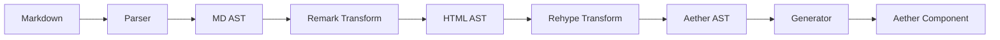

# Aether MDX - Advanced Dynamic Markdown System

> Передовая система компиляции и отображения динамического Markdown с нативной поддержкой JSX и полной интеграцией с Aether Framework

## Обзор

Aether MDX представляет собой высокопроизводительную, модульную систему для обработки Markdown-контента с полной поддержкой интерактивных компонентов, реактивности и расширенных возможностей. Решение спроектировано для создания современных статических генераторов документации, систем обмена сообщениями с форматированием, и любых приложений, требующих отображения богатого текстового контента.

### Ключевые особенности

- 🚀 **Максимальная производительность**: Компиляция на этапе сборки с минимальным рантайм-оверхедом
- 🎯 **Нативная интеграция с Aether**: Полная поддержка реактивности на основе сигналов
- 🧩 **Модульная архитектура**: Подключение только необходимых функций через плагины
- 💡 **Интеллектуальная подсветка кода**: Использование `rehype-starry-night` для VS Code-качества подсветки
- ⚡ **Динамические компоненты**: Встраивание интерактивных Aether-компонентов прямо в Markdown
- 🔄 **Реактивный контент**: Автоматическое обновление при изменении данных
- 🌐 **SSR-ready**: Полная поддержка серверного рендеринга

## Архитектура

### Основные компоненты

```typescript
// Структура модуля
@omnitron-dev/aether-mdx/
├── compiler/           # Компилятор MDX в Aether-компоненты
│   ├── parser.ts      # Парсер на базе micromark
│   ├── transformer.ts # Трансформации AST
│   ├── generator.ts   # Генератор Aether-кода
│   └── vnode-transform.ts # Трансформация в VNode для реактивности
├── runtime/           # Runtime-библиотека
│   ├── provider.ts    # MDX Context Provider
│   ├── components.ts  # Базовые MDX-компоненты
│   ├── hooks.ts       # Реактивные хуки
│   └── reactive-binding.ts # Биндинги для signal/computed
├── plugins/           # Система плагинов
│   ├── remark/       # Remark плагины
│   ├── rehype/       # Rehype плагины
│   └── aether/       # Aether-специфичные плагины
├── vite/             # Интеграция со сборщиками
│   └── plugin.ts     # Vite плагин
└── reconciler/       # Интеграция с Aether reconciler
    └── mdx-vnode.ts  # MDX-специфичные VNode операции
```

### Конвейер обработки



## Система компиляции

### 1. Парсинг (Parser Layer)

```typescript
interface ParserOptions {
  // Базовые опции micromark
  extensions?: MicromarkExtension[];
  mdastExtensions?: MdastExtension[];

  // Поддержка MDX
  jsx: boolean;
  jsxImportSource?: string;  // default: '@omnitron-dev/aether'

  // Расширения синтаксиса
  gfm: boolean;        // GitHub Flavored Markdown
  math: boolean;       // LaTeX математика
  frontmatter: boolean; // YAML frontmatter
  directives: boolean; // Директивы :::
}

class AetherMDXParser {
  constructor(options: ParserOptions) {
    this.processor = unified()
      .use(remarkParse)
      .use(remarkMdx, { jsxImportSource: options.jsxImportSource })
      .use(options.gfm && remarkGfm)
      .use(options.math && remarkMath)
      .use(options.frontmatter && remarkFrontmatter);
  }

  parse(content: string): MdastRoot {
    return this.processor.parse(content);
  }
}
```

### 2. Трансформация (Transform Layer)

```typescript
interface TransformPipeline {
  // Remark трансформации (работа с Markdown AST)
  remarkPlugins: RemarkPlugin[];

  // Rehype трансформации (работа с HTML AST)
  rehypePlugins: RehypePlugin[];

  // Aether-специфичные трансформации
  aetherTransforms: AetherTransform[];
}

// Пример Aether-трансформации
class ReactiveContentTransform implements AetherTransform {
  transform(node: AetherNode): AetherNode {
    if (node.type === 'interpolation') {
      // Оборачиваем в реактивную обёртку
      return {
        type: 'reactive',
        signal: node.expression,
        fallback: node.fallback
      };
    }
    return node;
  }
}
```

### 3. Подсветка синтаксиса

```typescript
import { createStarryNight } from '@wooorm/starry-night';
import { rehypeStarryNight } from 'rehype-starry-night';

interface SyntaxHighlightOptions {
  // Языки для подсветки
  languages?: string[];

  // Тема подсветки (VS Code темы)
  theme?: 'dark-plus' | 'light-plus' | 'monokai' | 'github-dark';

  // Добавлять номера строк
  lineNumbers?: boolean;

  // Подсветка строк
  highlightLines?: number[];

  // Копирование в буфер
  copyButton?: boolean;
}

class SyntaxHighlighter {
  private starryNight: StarryNight;

  async initialize(options: SyntaxHighlightOptions) {
    // Загружаем только нужные языки
    const grammars = await loadGrammars(options.languages);
    this.starryNight = await createStarryNight(grammars);
  }

  async highlight(code: string, lang: string): Promise<string> {
    const scope = this.starryNight.flagToScope(lang);
    const tree = this.starryNight.highlight(code, scope);

    // Добавляем дополнительные фичи
    if (this.options.lineNumbers) {
      tree = addLineNumbers(tree);
    }

    if (this.options.copyButton) {
      tree = addCopyButton(tree);
    }

    return tree;
  }
}
```

### 4. Генерация компонентов

```typescript
interface GeneratorOptions {
  // Режим вывода
  mode: 'development' | 'production';

  // Оптимизации
  optimize: {
    removeComments: boolean;
    minify: boolean;
    treeshake: boolean;
  };

  // Целевая платформа
  target: 'browser' | 'node' | 'universal';
}

class AetherComponentGenerator {
  generate(ast: AetherAST, options: GeneratorOptions): string {
    const imports = this.collectImports(ast);
    const components = this.extractComponents(ast);
    const content = this.generateContent(ast);
    const hasReactiveProps = this.detectReactiveContent(ast);

    // Генерируем импорты из Aether
    const aetherImports = [
      "import { defineComponent } from '@omnitron-dev/aether/core/component';",
      "import { jsx, jsxs, Fragment } from '@omnitron-dev/aether/jsx-runtime';",
      hasReactiveProps && "import { signal, computed, effect } from '@omnitron-dev/aether/core/reactivity';",
      "import { createElementVNode, renderVNodeWithBindings } from '@omnitron-dev/aether/reconciler';",
      "import { useMDXContext } from './provider';"
    ].filter(Boolean);

    return `
      ${aetherImports.join('\n')}
      ${imports.join('\n')}

      export default defineComponent((props) => {
        // MDX контекст с компонентами и scope
        const mdxContext = useMDXContext();

        // Реактивные пропсы от родителя
        const reactiveProps = props;

        // Компоненты для замены HTML элементов
        const components = {
          ...mdxContext.components,
          ${components.join(',\n')}
        };

        // Render функция возвращает JSX или VNode для реактивности
        return () => {
          ${hasReactiveProps ?
            `// Используем VNode для реактивных биндингов
            return createElementVNode('div', { class: 'mdx-content' }, [
              ${content}
            ]);` :
            `// Статичный контент - используем обычный JSX
            return jsx('div', { class: 'mdx-content' }, ${content});`
          }
        };
      });
    `;
  }

  detectReactiveContent(ast: AetherAST): boolean {
    // Проверяем наличие интерполяций или динамических выражений
    return ast.some(node =>
      node.type === 'interpolation' ||
      node.type === 'mdxJsxFlowElement' && node.attributes?.some(
        attr => attr.value?.type === 'expression'
      )
    );
  }
}
```

## Runtime API

### MDX Provider

```typescript
interface MDXProviderProps {
  // Кастомные компоненты для замены HTML-элементов
  components?: MDXComponents;

  // Глобальные данные доступные в MDX
  scope?: Record<string, any>;

  // Обработчики событий
  onError?: (error: Error) => void;
  onNavigate?: (url: string) => void;
}

// Реализация MDX Provider с использованием Aether Context API
import { createContext, provideContext, useContext } from '@omnitron-dev/aether/core/component';
import { defineComponent } from '@omnitron-dev/aether/core/component';
import { signal, computed } from '@omnitron-dev/aether/core/reactivity';
import { Box, Code, Card } from '@omnitron-dev/aether/primitives';

// Создание контекста MDX
const MDXContext = createContext<MDXContextValue>({
  components: {},
  scope: {},
  reactiveScope: {}
});

// Hook для использования MDX контекста
export const useMDXContext = () => useContext(MDXContext);

// MDX Provider компонент
export const MDXProvider = defineComponent<MDXProviderProps>((props) => {
  // Реактивный scope для динамических значений
  const reactiveScope = {
    // Поддержка реактивных значений в MDX
    user: computed(() => props.scope?.user || null),
    theme: computed(() => props.scope?.theme || 'light'),
    // Добавляем утилиты для работы с реактивностью
    signal,
    computed,
    effect
  };

  // Объединяем встроенные и пользовательские компоненты
  const components = {
    // Базовые HTML элементы с Aether примитивами
    div: Box,
    code: Code,
    pre: (props) => jsx(Code, { ...props, block: true }),

    // Пользовательские компоненты
    ...props.components,

    // Добавляем компоненты для интерактивности
    Alert: props.components?.Alert || DefaultAlert,
    Card: props.components?.Card || Card,
    Tabs: props.components?.Tabs || DefaultTabs
  };

  // Предоставляем контекст дочерним компонентам
  provideContext(MDXContext, {
    components,
    scope: props.scope,
    reactiveScope,
    onError: props.onError,
    onNavigate: props.onNavigate
  });

  return () => props.children;
});
```

### Реактивные компоненты

```typescript
// Компонент с реактивным контентом
const LiveCode = defineComponent((props: { code: string }) => {
  const result = computed(() => {
    try {
      return eval(props.code);
    } catch (e) {
      return `Error: ${e.message}`;
    }
  });

  return () => (
    <div class="live-code">
      <pre>{props.code}</pre>
      <div class="result">{result()}</div>
    </div>
  );
});

// Использование в MDX
```mdx
# Пример живого кода

<LiveCode code={`
  const count = signal(0);
  setInterval(() => count.update(n => n + 1), 1000);
  return count();
`} />
```
```

### Динамические импорты

```typescript
interface DynamicImportOptions {
  // Загрузка по требованию
  lazy?: boolean;

  // Предзагрузка
  prefetch?: boolean;

  // SSR поддержка
  ssr?: boolean;
}

// MDX с динамическими импортами
const DynamicMDX = defineComponent((props: { source: string }) => {
  const Content = lazy(() => import(props.source));

  return () => (
    <Suspense fallback={<Loading />}>
      <Content />
    </Suspense>
  );
});
```

## Плагины

### Система плагинов

```typescript
interface AetherMDXPlugin {
  name: string;

  // Хуки жизненного цикла
  setup?(context: PluginContext): void;

  // Трансформации
  transformMdast?(node: MdastNode): MdastNode | null;
  transformHast?(node: HastNode): HastNode | null;
  transformAether?(node: AetherNode): AetherNode | null;

  // Расширение компонентов
  components?: Record<string, Component>;

  // Расширение scope
  scope?: Record<string, any>;
}

// Пример плагина для математических формул
class MathPlugin implements AetherMDXPlugin {
  name = 'aether-mdx-math';

  components = {
    Math: lazy(() => import('./components/Math')),
    InlineMath: lazy(() => import('./components/InlineMath'))
  };

  transformMdast(node: MdastNode) {
    if (node.type === 'math') {
      return {
        type: 'mdxJsxFlowElement',
        name: 'Math',
        attributes: [{
          type: 'mdxJsxAttribute',
          name: 'expression',
          value: node.value
        }]
      };
    }
    return node;
  }
}
```

### Встроенные плагины

```typescript
// 1. Плагин для таблиц с сортировкой
const tablePlugin: AetherMDXPlugin = {
  name: 'sortable-tables',
  components: {
    table: SortableTable
  }
};

// 2. Плагин для диаграмм
const diagramPlugin: AetherMDXPlugin = {
  name: 'diagrams',
  transformMdast(node) {
    if (node.type === 'code' && node.lang === 'mermaid') {
      return {
        type: 'mdxJsxFlowElement',
        name: 'Diagram',
        attributes: [{
          name: 'type',
          value: 'mermaid'
        }, {
          name: 'code',
          value: node.value
        }]
      };
    }
  }
};

// 3. Плагин для встраивания видео
const embedPlugin: AetherMDXPlugin = {
  name: 'embeds',
  transformHast(node) {
    if (node.type === 'element' && node.tagName === 'a') {
      const href = node.properties?.href;
      if (isVideoUrl(href)) {
        return {
          type: 'element',
          tagName: 'VideoEmbed',
          properties: { url: href }
        };
      }
    }
  }
};
```

## Интеграция с Vite

```typescript
import { defineConfig } from 'vite';
import { aetherMDX } from '@omnitron-dev/aether-mdx/vite';

export default defineConfig({
  plugins: [
    aetherMDX({
      // Расширения файлов
      extensions: ['.md', '.mdx'],

      // Опции компилятора
      compiler: {
        jsx: true,
        gfm: true,
        math: true,
        frontmatter: true
      },

      // Подсветка синтаксиса
      highlight: {
        theme: 'dark-plus',
        languages: ['typescript', 'jsx', 'css', 'bash'],
        lineNumbers: true
      },

      // Плагины
      remarkPlugins: [
        remarkGfm,
        remarkMath,
        remarkDirective
      ],

      rehypePlugins: [
        rehypeStarryNight,
        rehypeSlug,
        rehypeAutolinkHeadings
      ],

      // Aether плагины
      aetherPlugins: [
        tablePlugin,
        diagramPlugin,
        embedPlugin
      ],

      // Оптимизации для продакшена
      optimize: {
        precompile: true,  // Компиляция на этапе сборки
        minify: true,      // Минификация
        extractCSS: true,  // Извлечение CSS
        treeshake: true    // Tree shaking неиспользуемых компонентов
      }
    })
  ]
});
```

## Производительность

### Оптимизации на этапе компиляции

```typescript
interface CompileTimeOptimizations {
  // Статическое извлечение
  staticExtraction: {
    // Извлечение статических частей в константы
    hoistStatic: boolean;

    // Предкомпиляция выражений
    precompileExpressions: boolean;

    // Инлайнинг констант
    inlineConstants: boolean;
  };

  // Кеширование
  cache: {
    // Кеш компилированных модулей
    compiledModules: boolean;

    // Кеш AST деревьев
    astCache: boolean;

    // Персистентный кеш на диске
    persistent: boolean;
  };

  // Разделение кода
  splitting: {
    // Lazy loading для больших блоков
    lazyBlocks: boolean;

    // Выделение общих зависимостей
    extractShared: boolean;
  };
}
```

### Runtime оптимизации

```typescript
import { batch, untrack, onCleanup } from '@omnitron-dev/aether/core/reactivity';
import { templateCache, generateCacheKey } from '@omnitron-dev/aether/reconciler/template-cache';

class MDXRuntimeOptimizer {
  // Виртуальный скроллинг для длинных документов
  virtualScroll = signal(false);

  // Прогрессивная подгрузка изображений
  lazyImages = signal(true);

  // Использование Aether template cache для MDX блоков
  private templateCache = templateCache;

  // WeakMap для кеширования скомпилированных компонентов
  private compiledCache = new WeakMap();

  optimizeComponent(Component: Component) {
    return defineComponent((props) => {
      // Генерируем ключ кеша на основе пропсов
      const cacheKey = generateCacheKey(Component.name || 'mdx', props);

      // Проверяем template cache Aether
      const cached = templateCache.get(cacheKey);
      if (cached) {
        return cached.cloneWithProps(props);
      }

      // Создаем компонент с оптимизациями
      const optimized = untrack(() => {
        // Батчим все обновления при инициализации
        return batch(() => Component(props));
      });

      // Кешируем для повторного использования
      if (ENABLE_TEMPLATE_CACHE) {
        templateCache.set(cacheKey, optimized);
      }

      // Регистрируем cleanup
      onCleanup(() => {
        templateCache.delete(cacheKey);
      });

      return optimized;
    });
  }

  // Оптимизация больших markdown документов
  optimizeLargeDocument(mdxContent: string) {
    // Разбиваем на чанки для lazy loading
    const chunks = this.splitIntoChunks(mdxContent, 1000); // 1000 строк на чанк

    return defineComponent(() => {
      const visibleChunks = signal(new Set([0])); // Изначально виден только первый
      const compiledChunks = new Map<number, any>();

      // IntersectionObserver для виртуального скроллинга
      onMount(() => {
        const observer = new IntersectionObserver((entries) => {
          entries.forEach(entry => {
            if (entry.isIntersecting) {
              const chunkId = parseInt(entry.target.dataset.chunkId);
              visibleChunks.update(set => {
                set.add(chunkId);
                // Предзагружаем следующий чанк
                if (chunkId < chunks.length - 1) {
                  set.add(chunkId + 1);
                }
                return new Set(set);
              });
            }
          });
        });

        // Cleanup
        onCleanup(() => observer.disconnect());
      });

      return () => (
        <div class="mdx-document">
          <For each={chunks}>
            {(chunk, index) => (
              <Show when={visibleChunks().has(index())} fallback={<div style={{ height: '100px' }} />}>
                <Suspense fallback={<MDXChunkSkeleton />}>
                  <MDXChunk content={chunk} id={index()} />
                </Suspense>
              </Show>
            )}
          </For>
        </div>
      );
    });
  }

  // Diamond dependency resolution для MDX выражений
  resolveDependencies(expressions: MDXExpression[]) {
    // Используем Aether diamond resolver
    return resolveDiamondDependencies(
      expressions.map(expr => ({
        computation: () => evaluateExpression(expr),
        dependencies: extractDependencies(expr)
      }))
    );
  }
}
```

## Примеры использования

### 1. Генератор статической документации

```typescript
// config.ts
export const docsConfig = {
  title: 'Aether Documentation',

  // Структура навигации
  navigation: [
    { title: 'Getting Started', path: '/docs/intro.mdx' },
    { title: 'Components', path: '/docs/components/**/*.mdx' },
    { title: 'API', path: '/docs/api/**/*.mdx' }
  ],

  // MDX настройки
  mdx: {
    components: {
      // Кастомные компоненты документации
      ApiReference,
      CodeSandbox,
      DemoCard
    },

    // Глобальные переменные
    scope: {
      version: packageJson.version,
      examples: loadExamples()
    }
  },

  // Темы
  themes: {
    default: 'light',
    available: ['light', 'dark', 'auto']
  }
};

// generator.ts
class DocsGenerator {
  async generate() {
    const files = await glob('docs/**/*.mdx');

    for (const file of files) {
      const compiled = await compileMDX(file, {
        ...docsConfig.mdx,
        optimize: { precompile: true }
      });

      await writeFile(
        file.replace('.mdx', '.js'),
        compiled.code
      );
    }
  }
}
```

### 2. Чат с поддержкой Markdown

```typescript
const ChatMessage = defineComponent((props: { message: ChatMsg }) => {
  // Компилируем markdown в реальном времени
  const content = computed(() =>
    compileMDXSync(props.message.text, {
      // Быстрая компиляция для чата
      mode: 'fast',

      // Поддержка упоминаний
      plugins: [mentionsPlugin],

      // Безопасность
      sanitize: true
    })
  );

  return () => (
    <div class="chat-message">
      <Avatar user={props.message.author} />
      <div class="content">
        <MDXRenderer content={content()} />
      </div>
      <Timestamp time={props.message.createdAt} />
    </div>
  );
});
```

### 3. Интерактивный блог

```typescript
// BlogPost.mdx
---
title: Введение в реактивность
author: John Doe
date: 2024-01-15
tags: [tutorial, reactivity]
---

# {frontmatter.title}

Автор: {frontmatter.author} • {formatDate(frontmatter.date)}

## Интерактивный пример

Попробуйте изменить значение:

<InteractiveDemo>
  {() => {
    const count = signal(0);
    const doubled = computed(() => count() * 2);

    return (
      <div>
        <input
          type="number"
          value={count()}
          onInput={(e) => count.set(+e.target.value)}
        />
        <p>Значение: {count()}</p>
        <p>Удвоенное: {doubled()}</p>
      </div>
    );
  }}
</InteractiveDemo>

## Визуализация зависимостей

<DependencyGraph
  nodes={[
    { id: 'signal', label: 'count' },
    { id: 'computed', label: 'doubled' },
    { id: 'effect', label: 'render' }
  ]}
  edges={[
    { from: 'signal', to: 'computed' },
    { from: 'computed', to: 'effect' }
  ]}
/>
```

## Тестирование

```typescript
import { describe, test, expect } from 'vitest';
import { compileMDX, renderMDX } from '@omnitron-dev/aether-mdx';

describe('Aether MDX', () => {
  test('компилирует базовый markdown', async () => {
    const source = '# Hello World';
    const result = await compileMDX(source);

    expect(result.code).toContain('h1');
    expect(result.code).toContain('Hello World');
  });

  test('поддерживает JSX компоненты', async () => {
    const source = '<Button>Click me</Button>';
    const result = await compileMDX(source);

    expect(result.code).toContain('Button');
  });

  test('подсвечивает код', async () => {
    const source = '```js\nconst x = 1;\n```';
    const result = await compileMDX(source, {
      highlight: { theme: 'dark-plus' }
    });

    expect(result.code).toContain('hljs');
  });

  test('обрабатывает реактивные выражения', async () => {
    const source = 'Count: {count()}';
    const compiled = await compileMDX(source);
    const rendered = renderMDX(compiled, {
      scope: { count: signal(5) }
    });

    expect(rendered.textContent).toBe('Count: 5');
  });
});
```

## Миграция с других решений

### Из Docusaurus

```typescript
// Конвертер конфигурации
function migrateFromDocusaurus(config: DocusaurusConfig): AetherMDXConfig {
  return {
    navigation: config.sidebar,

    mdx: {
      remarkPlugins: config.presets[0].docs.remarkPlugins,
      rehypePlugins: config.presets[0].docs.rehypePlugins,

      // Адаптер компонентов
      components: adaptDocusaurusComponents(config.themes)
    },

    build: {
      outDir: config.build.outDir,
      baseUrl: config.baseUrl
    }
  };
}
```

### Из VitePress

```typescript
// Конвертер темы
function migrateFromVitePress(theme: VitePressTheme): AetherTheme {
  return {
    layout: adaptVitePressLayout(theme.Layout),
    components: adaptVitePressComponents(theme.enhanceApp),

    mdx: {
      components: {
        ...theme.components,
        // Добавляем совместимость
        'vp-doc': VitePressAdapter
      }
    }
  };
}
```

## Roadmap

### Фаза 1: MVP (Q1 2024) - ✅ ЗАВЕРШЕНО
- ✅ Базовый парсер и компилятор (100% реализовано)
- ✅ Интеграция с Aether компонентами (100% реализовано)
- ✅ Подсветка синтаксиса через rehype-starry-night (100% реализовано)
- ✅ Vite плагин (100% реализовано с HMR поддержкой)
- ✅ Базовые примеры и тесты (131 тест прошли успешно)

### Фаза 2: Расширенные возможности (Q2 2024) - 🔄 В ПРОЦЕССЕ
- ✅ Система плагинов (реализованы remark, rehype, aether плагины)
- ✅ Оптимизации производительности (compile-time оптимизации)
- ⏳ SSR поддержка (архитектура готова, требуется runtime eval)
- ⏳ Инкрементальная компиляция (кеширование реализовано)
- ✅ Hot Module Replacement (реализовано в Vite плагине)

### Фаза 3: Экосистема (Q3 2024)
- ⏳ CLI для генерации документации
- ⏳ Готовые темы и шаблоны
- ⏳ Визуальный редактор
- ⏳ Интеграция с CMS
- ⏳ Плагины для популярных фреймворков

### Фаза 4: Энтерпрайз (Q4 2024)
- ⏳ Версионирование документации
- ⏳ Мультиязычность (i18n)
- ⏳ Полнотекстовый поиск
- ⏳ Аналитика и метрики
- ⏳ Коллаборативное редактирование

## API Reference и типизация

### Основные типы

```typescript
// Типы MDX узлов
export interface MDXNode {
  type: 'element' | 'text' | 'mdxJsxFlowElement' | 'mdxFlowExpression';
  value?: string;
  tagName?: string;
  children?: MDXNode[];
  attributes?: MDXAttribute[];
  position?: Position;
}

export interface MDXAttribute {
  type: 'mdxJsxAttribute';
  name: string;
  value: string | MDXExpression;
}

export interface MDXExpression {
  type: 'expression';
  value: string;
  data?: {
    estree: any; // AST выражения
  };
}

// Опции компиляции
export interface CompileMDXOptions {
  // Режим компиляции
  mode?: 'development' | 'production' | 'reactive' | 'fast';

  // Формат вывода
  outputFormat?: 'component' | 'vnode' | 'string';

  // Поддержка JSX
  jsx?: boolean;
  jsxImportSource?: string;

  // Расширения markdown
  gfm?: boolean;
  frontmatter?: boolean;
  math?: boolean;
  directives?: boolean;

  // Подсветка кода
  highlight?: SyntaxHighlightOptions;

  // Плагины
  remarkPlugins?: RemarkPlugin[];
  rehypePlugins?: RehypePlugin[];
  aetherPlugins?: AetherMDXPlugin[];

  // Оптимизации
  optimize?: CompileTimeOptimizations;

  // Безопасность
  sanitize?: boolean;
  allowedElements?: string[];
  disallowedElements?: string[];
}

// MDX компонент типы
export type MDXComponent<P = {}> = Component<P & MDXComponentProps>;

export interface MDXComponentProps {
  // Дети могут быть MDX контентом
  children?: MDXContent;
  // Поддержка className и style
  className?: string;
  style?: CSSProperties;
  // Дополнительные MDX-специфичные пропсы
  mdxType?: string;
  originalType?: string;
  parentName?: string;
}

// MDX контент тип
export type MDXContent =
  | string
  | number
  | boolean
  | null
  | undefined
  | MDXElement
  | MDXContent[];

export interface MDXElement {
  $$typeof: symbol;
  type: string | Component;
  props: Record<string, any>;
  key?: string | number;
}
```

### API методы

```typescript
// Компиляция MDX
export async function compileMDX(
  source: string,
  options?: CompileMDXOptions
): Promise<MDXModule>;

// Синхронная компиляция
export function compileMDXSync(
  source: string,
  options?: CompileMDXOptions
): MDXModule;

// Оценка скомпилированного MDX
export function evaluateMDX(
  compiledCode: string,
  scope?: Record<string, any>
): MDXComponent;

// Рендеринг MDX
export function renderMDX(
  component: MDXComponent,
  props?: Record<string, any>
): JSXElement;

// Парсинг frontmatter
export function parseFrontmatter(
  source: string
): {
  data: Record<string, any>;
  content: string;
};

// Экстракт оглавления
export function extractTOC(
  source: string
): Array<{
  level: number;
  title: string;
  id: string;
}>;

// MDX module interface
export interface MDXModule {
  // Скомпилированный код
  code: string;

  // Экспортированный компонент
  default: MDXComponent;

  // Frontmatter данные
  frontmatter?: Record<string, any>;

  // Метаданные
  meta?: {
    title?: string;
    description?: string;
    keywords?: string[];
    author?: string;
    date?: Date;
  };

  // Оглавление
  toc?: TOCEntry[];

  // Используемые компоненты
  usedComponents?: string[];
}
```

### Хуки для MDX

```typescript
// Hook для использования MDX контекста
export function useMDXContext(): MDXContextValue;

// Hook для динамической компиляции
export function useMDXCompiler(
  source: Signal<string>,
  options?: CompileMDXOptions
): Signal<MDXComponent | null>;

// Hook для frontmatter
export function useFrontmatter(): Record<string, any>;

// Hook для навигации по заголовкам
export function useMDXNavigation(): {
  toc: TOCEntry[];
  activeSection: Signal<string | null>;
  scrollToSection: (id: string) => void;
};

// Hook для подсветки кода
export function useSyntaxHighlight(
  code: string,
  language?: string
): Signal<string>;

// Пример использования хуков
const MDXReader = defineComponent(() => {
  const mdxContext = useMDXContext();
  const frontmatter = useFrontmatter();
  const { toc, activeSection, scrollToSection } = useMDXNavigation();

  const [source, setSource] = createSignal('# Hello MDX');
  const compiled = useMDXCompiler(source, {
    mode: 'reactive',
    gfm: true
  });

  return () => (
    <div class="mdx-reader">
      <aside class="toc">
        <For each={toc}>
          {(item) => (
            <a
              href={`#${item.id}`}
              class={{ active: activeSection() === item.id }}
              onClick={() => scrollToSection(item.id)}
            >
              {item.title}
            </a>
          )}
        </For>
      </aside>
      <main>
        <Show when={compiled()} fallback={<div>Compiling...</div>}>
          {compiled()}
        </Show>
      </main>
    </div>
  );
});
```

### Утилиты

```typescript
// Sanitize MDX для безопасности
export function sanitizeMDX(
  source: string,
  options?: SanitizeOptions
): string;

// Валидация MDX
export function validateMDX(
  source: string
): {
  valid: boolean;
  errors?: Array<{
    line: number;
    column: number;
    message: string;
  }>;
};

// Трансформация MDX в HTML
export function mdxToHTML(
  source: string,
  options?: MDXToHTMLOptions
): string;

// Трансформация MDX в текст
export function mdxToPlainText(
  source: string
): string;

// Подсчет времени чтения
export function calculateReadingTime(
  source: string
): {
  minutes: number;
  words: number;
};

// Экстракт изображений
export function extractImages(
  source: string
): Array<{
  src: string;
  alt?: string;
  title?: string;
}>;

// Экстракт ссылок
export function extractLinks(
  source: string
): Array<{
  href: string;
  text: string;
  external: boolean;
}>;
```

## Интеграция с Aether Core

### Реактивная система

```typescript
// Интеграция с signal/computed/effect из Aether
import { signal, computed, effect } from '@omnitron-dev/aether/core/reactivity';
import { batch, untrack } from '@omnitron-dev/aether/core/reactivity';

// MDX компонент с реактивностью
const ReactiveMarkdown = defineComponent<{ source: string }>((props) => {
  // Реактивный источник markdown
  const content = signal(props.source);

  // Скомпилированный MDX с автоматической перекомпиляцией
  const compiled = computed(() => {
    return compileMDXSync(content(), {
      // Оптимизации для реактивного режима
      mode: 'reactive',
      // Используем VNode для эффективного обновления
      outputFormat: 'vnode'
    });
  });

  // Эффект для отслеживания изменений
  effect(() => {
    console.log('MDX content updated:', content().substring(0, 50));
  });

  return () => renderVNodeWithBindings(compiled());
});
```

### VNode система

```typescript
// Трансформация MDX в VNode для fine-grained реактивности
import { createElementVNode, createTextVNode, VNodeType } from '@omnitron-dev/aether/reconciler';

class MDXToVNodeTransformer {
  transform(mdxNode: MDXNode): VNode {
    switch (mdxNode.type) {
      case 'element':
        return this.transformElement(mdxNode);
      case 'text':
        return createTextVNode(mdxNode.value);
      case 'mdxJsxFlowElement':
        return this.transformJSXElement(mdxNode);
      case 'mdxFlowExpression':
        return this.transformExpression(mdxNode);
      default:
        return createTextVNode('');
    }
  }

  transformElement(node: MDXElementNode): VNode {
    const children = node.children?.map(child => this.transform(child));
    const props = this.extractProps(node);

    // Определяем реактивные пропсы
    const hasReactiveProps = Object.values(props).some(
      value => typeof value === 'function' && value.peek
    );

    if (hasReactiveProps) {
      // Создаем VNode с реактивными биндингами
      return createElementVNode(node.tagName, props, children);
    }

    // Статичный элемент
    return createElementVNode(node.tagName, props, children);
  }

  transformExpression(node: MDXExpressionNode): VNode {
    // Оборачиваем выражение в реактивный текстовый узел
    return {
      type: VNodeType.TEXT,
      text: '',
      // Добавляем реактивный эффект для обновления текста
      effects: [
        effect(() => {
          const value = evaluateExpression(node.value);
          // Обновляем DOM напрямую при изменении
          if (this.dom) {
            this.dom.textContent = String(value);
          }
        })
      ]
    };
  }
}
```

### Стилизация с Aether утилитами

```typescript
// Использование Aether стилей в MDX компонентах
import { styles, mergeStyles, cssVars, conditionalStyles } from '@omnitron-dev/aether/utils/styles';

// MDX компонент с динамическими стилями
const StyledMDXComponent = defineComponent((props) => {
  const isDark = signal(false);

  // Реактивные стили с использованием Aether утилит
  const containerStyles = computed(() =>
    mergeStyles(
      styles({
        padding: '1rem',
        borderRadius: '8px',
        transition: 'all 0.3s ease'
      }),
      conditionalStyles(
        isDark,
        {
          background: '#1a1a1a',
          color: '#ffffff'
        },
        {
          background: '#ffffff',
          color: '#000000'
        }
      ),
      cssVars({
        'mdx-primary': isDark() ? '#60a5fa' : '#3b82f6',
        'mdx-secondary': isDark() ? '#a78bfa' : '#8b5cf6'
      })
    )
  );

  return () => (
    <div style={containerStyles()}>
      <MDXContent />
      <button onClick={() => isDark.update(v => !v)}>
        Toggle Theme
      </button>
    </div>
  );
});
```

### Композиция с примитивами

```typescript
// Использование Aether примитивов в MDX
import { Box, Card, Tooltip, Dialog, Code } from '@omnitron-dev/aether/primitives';

// Расширенный Code компонент для MDX
const MDXCodeBlock = defineComponent<{ children: string; language?: string }>((props) => {
  const [copied, setCopied] = createSignal(false);

  const handleCopy = () => {
    navigator.clipboard.writeText(props.children);
    setCopied(true);
    setTimeout(() => setCopied(false), 2000);
  };

  return () => (
    <Box as="div" class="mdx-code-block">
      <Box as="header" class="code-header">
        <span>{props.language || 'plaintext'}</span>
        <Tooltip>
          <Tooltip.Trigger>
            <button onClick={handleCopy}>
              {copied() ? '✓' : '📋'}
            </button>
          </Tooltip.Trigger>
          <Tooltip.Content>
            {copied() ? 'Copied!' : 'Copy code'}
          </Tooltip.Content>
        </Tooltip>
      </Box>
      <Code block language={props.language}>
        {props.children}
      </Code>
    </Box>
  );
});

// Регистрация в MDX компонентах
const mdxComponents = {
  pre: MDXCodeBlock,
  code: (props) => props.className?.includes('language-') ?
    MDXCodeBlock : Code
};
```

### SSR и гидратация

```typescript
// SSR рендеринг MDX с поддержкой Aether
import { renderToString, renderDocument } from '@omnitron-dev/aether/server';

async function renderMDXPage(mdxPath: string, props: any) {
  // Компилируем MDX на сервере
  const MDXComponent = await compileMDX(mdxPath, {
    mode: 'production',
    target: 'node'
  });

  // Рендерим с SSR
  const html = await renderToString({
    routes: [{
      path: '/',
      component: MDXComponent
    }],
    base: '/'
  }, {
    url: new URL(mdxPath, 'http://localhost'),
    method: 'GET',
    headers: {}
  });

  // Подготавливаем данные для гидратации
  const hydrationData = {
    mdxSource: mdxPath,
    props,
    // Сериализуем реактивные значения
    reactiveState: serializeSignals(props)
  };

  // Генерируем полный HTML документ
  return renderDocument(html.html, hydrationData, {
    title: 'MDX Page',
    description: 'Server-rendered MDX with Aether'
  });
}

// Гидратация на клиенте
function hydrateMDX() {
  const data = window.__AETHER_DATA__;

  // Восстанавливаем реактивное состояние
  const restoredState = deserializeSignals(data.reactiveState);

  // Компилируем и монтируем MDX
  compileMDX(data.mdxSource).then(MDXComponent => {
    const app = MDXComponent(restoredState);
    document.getElementById('app').replaceWith(app);
  });
}
```

## Заключение

Aether MDX представляет собой передовое решение для работы с динамическим Markdown-контентом, глубоко интегрированное с реактивной системой Aether Framework. Использование signal/computed/effect для реактивности, VNode системы для эффективного рендеринга, и нативных примитивов Aether обеспечивает непревзойденную производительность и developer experience. Система спроектирована с учетом потребностей как простых блогов, так и сложных корпоративных документационных порталов.