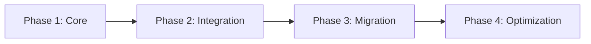

# Module Architecture Implementation Guide

> **Version**: 1.0.0
> **Status**: Implementation Guide
> **Created**: 2025-10-14

## Overview

This guide provides practical implementation steps for adapting Aether's existing codebase to the new module-centric architecture while preserving all current functionality.

---

## 1. Implementation Strategy

### 1.1 Principles

1. **Preserve existing API** - No breaking changes to public API
2. **Incremental migration** - Modules can coexist with current code
3. **Zero-config default** - Works without modules (backwards compatible)
4. **Progressive enhancement** - Add module features gradually
5. **Compile-time optimization** - Modules enable better optimization

### 1.2 Phases



---

## 2. Core Implementation (Phase 1)

### 2.1 Extend Module Definition

**File**: `src/di/types.ts`

```typescript
// Extend existing ModuleDefinition interface
export interface ModuleDefinition {
  // Existing (keep)
  id: string;
  imports?: Module[];
  providers?: Provider[];
  exports?: any[];
  exportProviders?: (Provider | Type)[];
  bootstrap?: any;

  // Remove (never implemented)
  // components?: any[];
  // directives?: any[];
  // pipes?: any[];

  // Add new
  version?: string;
  stores?: StoreFactory[];
  exportStores?: string[];
  routes?: RouteDefinition[];
  islands?: IslandDefinition[];
  styles?: string[] | (() => Promise<string[]>);
  assets?: AssetDefinition[];
  setup?: ModuleSetup;
  teardown?: ModuleTeardown;
  optimization?: OptimizationHints;
}

// New types
export type StoreFactory = () => Store<any> | Promise<Store<any>>;

export interface ModuleSetup {
  (context: SetupContext): ModuleContext | Promise<ModuleContext>;
}

export interface SetupContext {
  container: DIContainer;
  router?: Router;
  stores?: StoreManager;
  config?: Record<string, any>;
  parent?: ModuleContext;
}

export interface ModuleContext {
  [key: string]: any;
}
```

### 2.2 Create Module Manager

**File**: `src/modules/manager.ts`

```typescript
import { DIContainer } from '../di/container';
import { Module, ModuleDefinition, LoadedModule } from '../di/types';
import { Router } from '../router';
import { StoreManager } from '../store/manager';

export class ModuleManager {
  private modules = new Map<string, LoadedModule>();
  private loading = new Map<string, Promise<LoadedModule>>();
  private graph: ModuleGraph;

  constructor(
    private container: DIContainer,
    private router?: Router,
    private storeManager?: StoreManager
  ) {
    this.graph = new ModuleGraph();
  }

  async register(module: Module): Promise<void> {
    const definition = await this.resolveDefinition(module);
    this.graph.addNode(definition.id, definition);

    // Track dependencies
    if (definition.imports) {
      for (const dep of definition.imports) {
        const depDef = await this.resolveDefinition(dep);
        this.graph.addEdge(definition.id, depDef.id);
      }
    }
  }

  async load(moduleId: string): Promise<LoadedModule> {
    // Check if already loaded
    if (this.modules.has(moduleId)) {
      return this.modules.get(moduleId)!;
    }

    // Check if currently loading
    if (this.loading.has(moduleId)) {
      return this.loading.get(moduleId)!;
    }

    // Start loading
    const loadPromise = this.loadModule(moduleId);
    this.loading.set(moduleId, loadPromise);

    try {
      const loaded = await loadPromise;
      this.modules.set(moduleId, loaded);
      this.loading.delete(moduleId);
      return loaded;
    } catch (error) {
      this.loading.delete(moduleId);
      throw error;
    }
  }

  private async loadModule(moduleId: string): Promise<LoadedModule> {
    const node = this.graph.getNode(moduleId);
    if (!node) {
      throw new Error(`Module ${moduleId} not registered`);
    }

    const definition = node.data;

    // Load dependencies first
    if (definition.imports) {
      await Promise.all(
        definition.imports.map(async (dep) => {
          const depDef = await this.resolveDefinition(dep);
          await this.load(depDef.id);
        })
      );
    }

    // Create module container
    const moduleContainer = this.container.createChild(
      definition.providers || []
    );

    // Register stores
    if (definition.stores) {
      await this.registerStores(definition.stores, moduleContainer);
    }

    // Register routes
    if (definition.routes && this.router) {
      this.registerRoutes(definition.routes, moduleContainer);
    }

    // Register islands
    if (definition.islands) {
      this.registerIslands(definition.islands, moduleContainer);
    }

    // Setup module
    let context: ModuleContext = {};
    if (definition.setup) {
      context = await definition.setup({
        container: moduleContainer,
        router: this.router,
        stores: this.storeManager,
        config: definition.metadata,
        parent: this.getParentContext(definition)
      });
    }

    return {
      id: definition.id,
      definition,
      container: moduleContainer,
      context,
      status: 'loaded'
    };
  }

  private async registerStores(
    stores: StoreFactory[],
    container: DIContainer
  ): Promise<void> {
    if (!this.storeManager) return;

    for (const factory of stores) {
      const store = await factory();
      this.storeManager.register(store);

      // Make store available in DI
      container.register({
        provide: `STORE_${store.id}`,
        useValue: store
      });
    }
  }

  private registerRoutes(
    routes: RouteDefinition[],
    container: DIContainer
  ): void {
    if (!this.router) return;

    // Enhance routes with module container
    const enhancedRoutes = routes.map(route => ({
      ...route,
      // Inject container into loaders/actions
      loader: route.loader ? this.wrapLoader(route.loader, container) : undefined,
      action: route.action ? this.wrapAction(route.action, container) : undefined,
    }));

    this.router.addRoutes(enhancedRoutes);
  }

  private wrapLoader(loader: RouteLoader, container: DIContainer): RouteLoader {
    return (context) => {
      // Add container to loader context
      return loader({ ...context, container });
    };
  }

  private wrapAction(action: RouteAction, container: DIContainer): RouteAction {
    return (context) => {
      // Add container to action context
      return action({ ...context, container });
    };
  }

  private registerIslands(
    islands: IslandDefinition[],
    container: DIContainer
  ): void {
    // Register islands for hydration
    if (typeof window !== 'undefined') {
      window.__AETHER_ISLANDS__ = window.__AETHER_ISLANDS__ || [];
      window.__AETHER_ISLANDS__.push(...islands.map(island => ({
        ...island,
        container  // Attach container for DI in islands
      })));
    }
  }

  private async resolveDefinition(module: Module): Promise<ModuleDefinition> {
    if ('definition' in module) {
      return module.definition;
    }
    if ('factory' in module) {
      return await module.factory();
    }
    if ('load' in module) {
      const loaded = await module.load();
      return this.resolveDefinition(loaded);
    }
    if ('url' in module) {
      // Remote module
      const loaded = await this.loadRemoteModule(module.url);
      return this.resolveDefinition(loaded);
    }
    throw new Error('Invalid module type');
  }

  private getParentContext(definition: ModuleDefinition): ModuleContext | undefined {
    // Find parent module context
    // Implementation depends on module hierarchy
    return undefined;
  }
}
```

### 2.3 Module Graph

**File**: `src/modules/graph.ts`

```typescript
export class ModuleGraph {
  private nodes = new Map<string, ModuleNode>();
  private edges = new Map<string, Set<string>>();
  private reverseEdges = new Map<string, Set<string>>();

  addNode(id: string, data: ModuleDefinition): void {
    this.nodes.set(id, { id, data });
    if (!this.edges.has(id)) {
      this.edges.set(id, new Set());
    }
    if (!this.reverseEdges.has(id)) {
      this.reverseEdges.set(id, new Set());
    }
  }

  addEdge(from: string, to: string): void {
    this.edges.get(from)?.add(to);
    this.reverseEdges.get(to)?.add(from);
  }

  getNode(id: string): ModuleNode | undefined {
    return this.nodes.get(id);
  }

  findCircularDependencies(): string[][] {
    const cycles: string[][] = [];
    const visited = new Set<string>();
    const stack = new Set<string>();

    const dfs = (node: string, path: string[]): void => {
      if (stack.has(node)) {
        // Found cycle
        const cycleStart = path.indexOf(node);
        cycles.push(path.slice(cycleStart));
        return;
      }

      if (visited.has(node)) return;

      visited.add(node);
      stack.add(node);
      path.push(node);

      const deps = this.edges.get(node) || new Set();
      for (const dep of deps) {
        dfs(dep, [...path]);
      }

      stack.delete(node);
    };

    for (const node of this.nodes.keys()) {
      if (!visited.has(node)) {
        dfs(node, []);
      }
    }

    return cycles;
  }

  getLoadOrder(): string[] {
    const visited = new Set<string>();
    const order: string[] = [];

    const visit = (node: string): void => {
      if (visited.has(node)) return;
      visited.add(node);

      const deps = this.edges.get(node) || new Set();
      for (const dep of deps) {
        visit(dep);
      }

      order.push(node);
    };

    for (const node of this.nodes.keys()) {
      visit(node);
    }

    return order;
  }

  getSplitPoints(): SplitPoint[] {
    const points: SplitPoint[] = [];

    for (const [id, node] of this.nodes) {
      const definition = node.data;

      // Check if module is a split point
      if (
        definition.optimization?.lazyBoundary ||
        definition.optimization?.splitChunk ||
        this.isLazyModule(id)
      ) {
        points.push({
          module: id,
          strategy: this.getLoadStrategy(definition),
          size: this.estimateSize(id)
        });
      }
    }

    return points;
  }

  private isLazyModule(id: string): boolean {
    // Check if module is imported lazily
    for (const [_, deps] of this.edges) {
      if (deps.has(id)) {
        // Check import type
        // This requires tracking import types during registration
        return false;  // Placeholder
      }
    }
    return false;
  }

  private getLoadStrategy(definition: ModuleDefinition): LoadStrategy {
    if (definition.optimization?.preloadModules?.includes(definition.id)) {
      return 'preload';
    }
    if (definition.optimization?.prefetchModules?.includes(definition.id)) {
      return 'prefetch';
    }
    return 'lazy';
  }

  private estimateSize(id: string): number {
    // Estimate module size based on dependencies
    // This would be replaced with actual size from build
    return 50000;  // Placeholder
  }
}
```

---

## 3. Integration Implementation (Phase 2)

### 3.1 Store Integration

**File**: `src/store/module-integration.ts`

```typescript
import { Store, StoreFactory } from './types';
import { ModuleDefinition } from '../di/types';

// Extend store to support module scope
export interface ModuleStore<T = any> extends Store<T> {
  scope?: 'singleton' | 'module' | 'island';
  moduleId?: string;
}

// Store manager enhancement
export class StoreManager {
  private stores = new Map<string, Store>();
  private moduleStores = new Map<string, Map<string, Store>>();

  register(store: Store, moduleId?: string): void {
    if (moduleId && store.scope === 'module') {
      // Module-scoped store
      if (!this.moduleStores.has(moduleId)) {
        this.moduleStores.set(moduleId, new Map());
      }
      this.moduleStores.get(moduleId)!.set(store.id, store);
    } else {
      // Global store
      this.stores.set(store.id, store);
    }
  }

  get(storeId: string, moduleId?: string): Store | undefined {
    // Check module stores first
    if (moduleId) {
      const moduleStore = this.moduleStores.get(moduleId)?.get(storeId);
      if (moduleStore) return moduleStore;
    }

    // Fall back to global stores
    return this.stores.get(storeId);
  }

  // Create store factory with module scope
  createModuleStoreFactory<T>(
    storeId: string,
    factory: () => Store<T>
  ): StoreFactory {
    return () => {
      const store = factory();
      store.scope = 'module';
      return store;
    };
  }
}
```

### 3.2 Router Integration

**File**: `src/router/module-integration.ts`

```typescript
import { Router, RouteDefinition } from './types';
import { DIContainer } from '../di/container';

// Enhance router to support module containers
export class ModuleAwareRouter extends Router {
  private moduleContainers = new Map<string, DIContainer>();

  addModuleRoutes(
    routes: RouteDefinition[],
    moduleId: string,
    container: DIContainer
  ): void {
    // Store module container
    this.moduleContainers.set(moduleId, container);

    // Enhance routes with module context
    const enhancedRoutes = routes.map(route => ({
      ...route,
      meta: {
        ...route.meta,
        moduleId,
      },
      // Wrap loaders/actions with container
      loader: route.loader ? this.wrapWithContainer(route.loader, container) : undefined,
      action: route.action ? this.wrapWithContainer(route.action, container) : undefined,
    }));

    this.addRoutes(enhancedRoutes);
  }

  private wrapWithContainer(
    handler: Function,
    container: DIContainer
  ): Function {
    return (context: any) => {
      // Inject container into context
      return handler({
        ...context,
        container,
        inject: <T>(token: any) => container.get<T>(token)
      });
    };
  }

  // Get container for current route
  getCurrentContainer(): DIContainer | undefined {
    const currentRoute = this.getCurrentRoute();
    if (currentRoute?.meta?.moduleId) {
      return this.moduleContainers.get(currentRoute.meta.moduleId);
    }
    return undefined;
  }
}
```

### 3.3 Islands Integration

**File**: `src/islands/module-integration.ts`

```typescript
import { IslandDefinition } from './types';
import { DIContainer } from '../di/container';

// Enhance islands with DI support
export interface ModuleIsland extends IslandDefinition {
  container?: DIContainer;
  moduleId?: string;
}

export class ModuleIslandManager {
  private islands = new Map<string, ModuleIsland>();

  registerModuleIslands(
    islands: IslandDefinition[],
    moduleId: string,
    container: DIContainer
  ): void {
    for (const island of islands) {
      const moduleIsland: ModuleIsland = {
        ...island,
        moduleId,
        container
      };
      this.islands.set(island.id, moduleIsland);
    }
  }

  hydrateIsland(islandId: string): Promise<void> {
    const island = this.islands.get(islandId);
    if (!island) {
      throw new Error(`Island ${islandId} not found`);
    }

    // Provide DI context during hydration
    return this.hydrateWithDI(island);
  }

  private async hydrateWithDI(island: ModuleIsland): Promise<void> {
    // Set DI context for island
    if (island.container) {
      setInjectorContext(island.container);
    }

    try {
      // Load and hydrate component
      const Component = await island.component();
      await hydrate(Component, island.props, {
        container: island.container
      });
    } finally {
      // Clear DI context
      clearInjectorContext();
    }
  }
}
```

---

## 4. Compiler Integration (Phase 3)

### 4.1 Module Analysis Pass

**File**: `src/compiler/optimizations/module-analyzer.ts`

```typescript
import * as ts from 'typescript';
import { OptimizationPass } from '../types';

export class ModuleAnalyzer implements OptimizationPass {
  name = 'module-analyzer';
  priority = 50;  // Run early

  async transform(
    sourceFile: ts.SourceFile,
    context: TransformContext
  ): Promise<TransformResult> {
    const modules: ModuleInfo[] = [];
    const imports: ImportInfo[] = [];
    const exports: ExportInfo[] = [];

    // Visit AST
    ts.forEachChild(sourceFile, node => {
      if (this.isModuleDefinition(node)) {
        modules.push(this.extractModuleInfo(node));
      }
      if (ts.isImportDeclaration(node)) {
        imports.push(this.extractImportInfo(node));
      }
      if (ts.isExportDeclaration(node)) {
        exports.push(this.extractExportInfo(node));
      }
    });

    // Store analysis results
    context.metadata.modules = modules;
    context.metadata.imports = imports;
    context.metadata.exports = exports;

    // Determine optimization strategy
    const strategy = this.determineStrategy(modules, imports);
    context.metadata.optimizationStrategy = strategy;

    return {
      sourceFile,  // No transformation, just analysis
      metadata: context.metadata
    };
  }

  private isModuleDefinition(node: ts.Node): boolean {
    // Detect defineModule() calls
    if (ts.isCallExpression(node)) {
      const expression = node.expression;
      if (ts.isIdentifier(expression) && expression.text === 'defineModule') {
        return true;
      }
    }
    return false;
  }

  private extractModuleInfo(node: ts.CallExpression): ModuleInfo {
    const arg = node.arguments[0];
    if (!ts.isObjectLiteralExpression(arg)) {
      return { id: 'unknown', imports: [], exports: [] };
    }

    const info: ModuleInfo = {
      id: 'unknown',
      imports: [],
      exports: [],
      providers: [],
      stores: [],
      routes: [],
      optimization: {}
    };

    // Extract module properties
    arg.properties.forEach(prop => {
      if (ts.isPropertyAssignment(prop)) {
        const name = prop.name?.getText();
        switch (name) {
          case 'id':
            if (ts.isStringLiteral(prop.initializer)) {
              info.id = prop.initializer.text;
            }
            break;
          case 'imports':
            info.imports = this.extractImports(prop.initializer);
            break;
          case 'exports':
            info.exports = this.extractExports(prop.initializer);
            break;
          case 'optimization':
            info.optimization = this.extractOptimization(prop.initializer);
            break;
        }
      }
    });

    return info;
  }

  private determineStrategy(
    modules: ModuleInfo[],
    imports: ImportInfo[]
  ): OptimizationStrategy {
    // Determine if this is a lazy boundary
    const hasLazyImports = imports.some(imp => imp.isDynamic);
    const hasLazyBoundary = modules.some(m => m.optimization.lazyBoundary);

    if (hasLazyImports || hasLazyBoundary) {
      return 'split-chunk';
    }

    // Check if module should be inlined
    const isSmall = modules.every(m => !m.routes || m.routes.length === 0);
    if (isSmall) {
      return 'inline';
    }

    return 'default';
  }
}
```

### 4.2 Module Tree Shaking

**File**: `src/compiler/optimizations/module-tree-shaker.ts`

```typescript
export class ModuleTreeShaker implements OptimizationPass {
  name = 'module-tree-shaker';
  priority = 450;  // After regular tree shaking

  async transform(
    sourceFile: ts.SourceFile,
    context: TransformContext
  ): Promise<TransformResult> {
    const modules = context.metadata.modules || [];
    const usedExports = new Set<string>();

    // Analyze what's actually used from modules
    for (const module of modules) {
      // Check if module exports are used
      for (const exp of module.exports) {
        if (this.isExportUsed(exp, sourceFile)) {
          usedExports.add(exp);
        }
      }
    }

    // Remove unused module code
    const transformer: ts.TransformerFactory<ts.SourceFile> = (context) => {
      return (sourceFile) => {
        const visitor: ts.Visitor = (node) => {
          // Remove unused providers
          if (this.isUnusedProvider(node, usedExports)) {
            return undefined;
          }

          // Remove unused stores
          if (this.isUnusedStore(node, usedExports)) {
            return undefined;
          }

          return ts.visitEachChild(node, visitor, context);
        };

        return ts.visitNode(sourceFile, visitor) as ts.SourceFile;
      };
    };

    const result = ts.transform(sourceFile, [transformer]);
    const transformedFile = result.transformed[0];

    return {
      sourceFile: transformedFile,
      metadata: {
        ...context.metadata,
        removedExports: Array.from(context.metadata.exports || [])
          .filter(e => !usedExports.has(e))
      }
    };
  }

  private isExportUsed(exportName: string, sourceFile: ts.SourceFile): boolean {
    // Check if export is referenced anywhere
    let used = false;

    const visitor: ts.Visitor = (node) => {
      if (ts.isIdentifier(node) && node.text === exportName) {
        used = true;
      }
      return used ? node : ts.visitEachChild(node, visitor, ts.nullTransformationContext);
    };

    ts.visitNode(sourceFile, visitor);
    return used;
  }

  private isUnusedProvider(node: ts.Node, usedExports: Set<string>): boolean {
    // Check if provider is in unused exports
    // Implementation depends on provider detection
    return false;
  }

  private isUnusedStore(node: ts.Node, usedExports: Set<string>): boolean {
    // Check if store is in unused exports
    // Implementation depends on store detection
    return false;
  }
}
```

### 4.3 Module Bundle Optimization

**File**: `src/build/module-bundler.ts`

```typescript
import { ModuleGraph } from '../modules/graph';
import { BundleOptimizer } from './bundle-optimization';

export class ModuleBundler {
  constructor(
    private moduleGraph: ModuleGraph,
    private optimizer: BundleOptimizer
  ) {}

  async createBundles(): Promise<BundleMap> {
    const bundles = new Map<string, Bundle>();

    // Get optimal load order
    const loadOrder = this.moduleGraph.getLoadOrder();

    // Identify split points
    const splitPoints = this.moduleGraph.getSplitPoints();

    // Create main bundle
    const mainModules = loadOrder.filter(id =>
      !splitPoints.some(sp => sp.module === id)
    );
    bundles.set('main', {
      id: 'main',
      modules: mainModules,
      size: 0,
      strategy: 'initial'
    });

    // Create split bundles
    for (const splitPoint of splitPoints) {
      const dependencies = this.getTransitiveDependencies(splitPoint.module);

      bundles.set(splitPoint.module, {
        id: splitPoint.module,
        modules: [splitPoint.module, ...dependencies],
        size: splitPoint.size,
        strategy: splitPoint.strategy
      });
    }

    // Optimize bundles
    return this.optimizeBundles(bundles);
  }

  private optimizeBundles(bundles: Map<string, Bundle>): BundleMap {
    // Extract common chunks
    const common = this.findCommonModules(bundles);
    if (common.length > 2) {
      bundles.set('common', {
        id: 'common',
        modules: common,
        size: 0,
        strategy: 'preload'
      });

      // Remove common modules from other bundles
      for (const bundle of bundles.values()) {
        if (bundle.id !== 'common') {
          bundle.modules = bundle.modules.filter(m => !common.includes(m));
        }
      }
    }

    // Merge small bundles
    const threshold = 20000;  // 20KB
    const smallBundles = Array.from(bundles.values())
      .filter(b => b.size < threshold && b.strategy !== 'initial');

    if (smallBundles.length > 1) {
      const merged = {
        id: 'merged',
        modules: smallBundles.flatMap(b => b.modules),
        size: smallBundles.reduce((sum, b) => sum + b.size, 0),
        strategy: 'lazy' as const
      };

      // Remove small bundles
      smallBundles.forEach(b => bundles.delete(b.id));

      // Add merged bundle
      bundles.set('merged', merged);
    }

    return bundles;
  }

  private getTransitiveDependencies(moduleId: string): string[] {
    // Get all dependencies recursively
    const deps = new Set<string>();
    const visit = (id: string) => {
      const node = this.moduleGraph.getNode(id);
      if (!node) return;

      const imports = node.data.imports || [];
      for (const imp of imports) {
        const impId = this.getModuleId(imp);
        if (!deps.has(impId)) {
          deps.add(impId);
          visit(impId);
        }
      }
    };

    visit(moduleId);
    return Array.from(deps);
  }

  private findCommonModules(bundles: Map<string, Bundle>): string[] {
    const moduleCounts = new Map<string, number>();

    // Count module occurrences
    for (const bundle of bundles.values()) {
      for (const module of bundle.modules) {
        moduleCounts.set(module, (moduleCounts.get(module) || 0) + 1);
      }
    }

    // Find modules used in multiple bundles
    return Array.from(moduleCounts.entries())
      .filter(([_, count]) => count > 1)
      .map(([module]) => module);
  }
}
```

---

## 5. Migration Examples

### 5.1 Migrating a Simple Component

**Before** (standalone component):

```typescript
// components/TodoList.tsx
import { signal, computed } from '@aether/core';
import { useTodoStore } from '../stores/todo';

export function TodoList() {
  const store = useTodoStore();
  const todos = store.todos;
  const completed = computed(() =>
    todos().filter(t => t.completed).length
  );

  return (
    <div>
      <h2>Todos ({completed()}/{todos().length})</h2>
      <ul>
        {todos().map(todo => (
          <li key={todo.id}>{todo.text}</li>
        ))}
      </ul>
    </div>
  );
}
```

**After** (module-based):

```typescript
// modules/todo/index.ts
import { defineModule } from '@aether/core';
import { TodoService } from './services/todo.service';
import { defineTodoStore } from './stores/todo.store';

export const TodoModule = defineModule({
  id: 'todo',

  providers: [TodoService],

  stores: [
    () => defineTodoStore()
  ],

  routes: [
    {
      path: '/todos',
      component: () => import('./components/TodoList'),
      loader: ({ container }) => {
        const service = container.get(TodoService);
        return service.loadTodos();
      }
    }
  ],

  exports: {
    providers: [TodoService],
    stores: ['todo']
  }
});

// components/TodoList.tsx
import { useStore } from '@aether/core';

export function TodoList() {
  const store = useStore('todo');  // Module-scoped store
  const todos = store.todos;
  // ... rest unchanged
}
```

### 5.2 Migrating Routes

**Before** (standalone routes):

```typescript
// routes.ts
export const routes = [
  {
    path: '/',
    component: Home
  },
  {
    path: '/about',
    component: About
  },
  {
    path: '/dashboard',
    component: () => import('./Dashboard'),
    loader: async () => {
      const response = await fetch('/api/dashboard');
      return response.json();
    }
  }
];
```

**After** (module routes):

```typescript
// modules/core/index.ts
export const CoreModule = defineModule({
  id: 'core',

  routes: [
    { path: '/', component: Home },
    { path: '/about', component: About }
  ]
});

// modules/dashboard/index.ts
export const DashboardModule = defineModule({
  id: 'dashboard',

  providers: [DashboardService],

  routes: [
    {
      path: '/dashboard',
      component: () => import('./Dashboard'),
      loader: ({ container }) => {
        const service = container.get(DashboardService);
        return service.loadDashboardData();
      }
    }
  ]
});

// app.ts
const app = createApp({
  modules: [
    CoreModule,
    lazy(() => import('./modules/dashboard'))  // Lazy load
  ]
});
```

### 5.3 Migrating Islands

**Before** (manual islands):

```typescript
// islands.ts
export const islands = [
  {
    id: 'search',
    component: SearchBar,
    strategy: 'interaction'
  },
  {
    id: 'chat',
    component: ChatWidget,
    strategy: 'idle'
  }
];

// Setup islands manually
islands.forEach(island => {
  registerIsland(island);
});
```

**After** (module islands):

```typescript
// modules/interactive/index.ts
export const InteractiveModule = defineModule({
  id: 'interactive',

  islands: [
    {
      id: 'search',
      component: () => import('./SearchBar'),
      strategy: 'interaction'
    },
    {
      id: 'chat',
      component: () => import('./ChatWidget'),
      strategy: 'idle',
      timeout: 2000
    }
  ],

  // Islands get module DI context
  providers: [SearchService, ChatService]
});

// Islands automatically registered when module loads
```

---

## 6. Testing Modules

### 6.1 Unit Testing

```typescript
import { createTestModule } from '@aether/testing';
import { TodoModule } from './todo.module';
import { TodoService } from './todo.service';

describe('TodoModule', () => {
  let module: TestModule;

  beforeEach(() => {
    module = createTestModule({
      imports: [TodoModule],
      providers: [
        {
          provide: TodoService,
          useValue: {
            loadTodos: vi.fn().mockResolvedValue([
              { id: 1, text: 'Test', completed: false }
            ])
          }
        }
      ]
    });
  });

  it('should load todos on setup', async () => {
    await module.setup();

    const store = module.get('STORE_todo');
    expect(store.todos()).toHaveLength(1);
  });

  it('should register routes', () => {
    const routes = module.getRoutes();
    expect(routes).toContainEqual(
      expect.objectContaining({
        path: '/todos'
      })
    );
  });
});
```

### 6.2 Integration Testing

```typescript
describe('Module Integration', () => {
  it('should share services between modules', async () => {
    const app = await createTestApp({
      modules: [SharedModule, ConsumerModule]
    });

    const sharedService = app.getModule('shared')
      .get(SharedService);
    const consumerService = app.getModule('consumer')
      .get(SharedService);

    expect(sharedService).toBe(consumerService);
  });

  it('should handle lazy module loading', async () => {
    const app = await createTestApp({
      modules: [
        CoreModule,
        lazy(() => import('./lazy.module'))
      ]
    });

    // Lazy module not loaded initially
    expect(app.hasModule('lazy')).toBe(false);

    // Navigate to lazy route
    await app.router.navigate('/lazy');

    // Module loaded
    expect(app.hasModule('lazy')).toBe(true);
  });
});
```

---

## 7. Build Configuration

### 7.1 Vite Configuration

```typescript
// vite.config.ts
import { defineConfig } from 'vite';
import { aetherPlugin } from '@aether/vite-plugin';

export default defineConfig({
  plugins: [
    aetherPlugin({
      // Enable module optimization
      modules: {
        analyze: true,         // Analyze module graph
        optimize: true,        // Optimize bundles
        treeshake: true,       // Tree-shake unused exports
        report: true           // Generate bundle report
      },

      // Module-specific options
      compiler: {
        moduleAnalysis: true,  // Enable module analysis pass
        moduleTreeShaking: true // Enable module tree shaking
      },

      // Code splitting
      bundling: {
        strategy: 'module',    // Split by module boundaries
        maxSize: 250000,       // Max chunk size
        minSize: 20000         // Min chunk size
      }
    })
  ]
});
```

### 7.2 TypeScript Configuration

```typescript
// tsconfig.json
{
  "compilerOptions": {
    // Enable decorators for DI
    "experimentalDecorators": true,
    "emitDecoratorMetadata": true,

    // Module resolution
    "moduleResolution": "bundler",
    "resolveJsonModule": true,

    // Path mapping for modules
    "paths": {
      "@modules/*": ["./src/modules/*"],
      "@shared/*": ["./src/modules/shared/*"],
      "@core/*": ["./src/modules/core/*"]
    }
  }
}
```

---

## 8. Performance Monitoring

### 8.1 Module Metrics

```typescript
// Module performance tracking
export interface ModuleMetrics {
  id: string;
  loadTime: number;          // Time to load module
  setupTime: number;         // Time to setup module
  bundleSize: number;        // Module bundle size
  dependencies: number;      // Number of dependencies
  providers: number;         // Number of providers
  stores: number;           // Number of stores
  routes: number;           // Number of routes
  islands: number;          // Number of islands
}

// Collect metrics
export function collectModuleMetrics(
  module: LoadedModule
): ModuleMetrics {
  return {
    id: module.id,
    loadTime: module.loadTime,
    setupTime: module.setupTime,
    bundleSize: module.bundleSize || 0,
    dependencies: module.definition.imports?.length || 0,
    providers: module.definition.providers?.length || 0,
    stores: module.definition.stores?.length || 0,
    routes: module.definition.routes?.length || 0,
    islands: module.definition.islands?.length || 0
  };
}

// Report to monitoring
if (import.meta.env.DEV) {
  window.__AETHER_MODULE_METRICS__ = collectModuleMetrics(module);
}
```

### 8.2 DevTools Integration

```typescript
// DevTools extension for modules
export class ModuleDevTools {
  private modules = new Map<string, ModuleDebugInfo>();

  register(module: LoadedModule): void {
    this.modules.set(module.id, {
      definition: module.definition,
      container: module.container,
      context: module.context,
      metrics: collectModuleMetrics(module),
      graph: this.buildDependencyGraph(module)
    });

    // Send to DevTools
    this.sendToDevTools('module:registered', {
      id: module.id,
      metrics: module.metrics
    });
  }

  inspectModule(moduleId: string): ModuleDebugInfo {
    return this.modules.get(moduleId)!;
  }

  getDependencyGraph(): DependencyGraph {
    // Build complete dependency graph
    return this.buildFullGraph();
  }

  getOptimizationReport(): OptimizationReport {
    return {
      totalModules: this.modules.size,
      lazyModules: this.countLazyModules(),
      averageLoadTime: this.calculateAverageLoadTime(),
      totalBundleSize: this.calculateTotalSize(),
      recommendations: this.generateRecommendations()
    };
  }
}
```

---

## Conclusion

This implementation guide provides a practical path to adopt the module-centric architecture while:

1. **Preserving all existing functionality**
2. **Enabling incremental migration**
3. **Maintaining backwards compatibility**
4. **Unlocking optimization opportunities**
5. **Improving developer experience**

The modular architecture transforms Aether applications into well-structured, optimized, and maintainable systems while keeping the framework's minimalist philosophy intact.