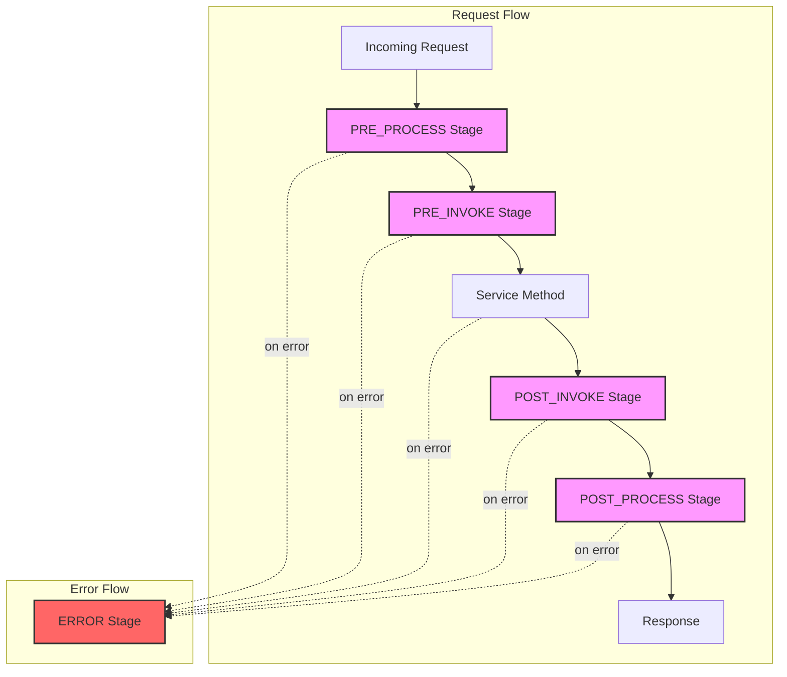

# Netron Middleware System

## Table of Contents

- [Overview](#overview)
- [Architecture](#architecture)
- [Middleware Stages](#middleware-stages)
- [Core Concepts](#core-concepts)
  - [Middleware Context](#middleware-context)
  - [Middleware Function](#middleware-function)
  - [Middleware Pipeline](#middleware-pipeline)
- [Built-in Middleware](#built-in-middleware)
- [Creating Custom Middleware](#creating-custom-middleware)
- [Registration and Configuration](#registration-and-configuration)
- [Transport-Specific Middleware](#transport-specific-middleware)
- [Advanced Features](#advanced-features)
  - [Conditional Execution](#conditional-execution)
  - [Priority and Ordering](#priority-and-ordering)
  - [Error Handling](#error-handling)
  - [Metrics and Monitoring](#metrics-and-monitoring)
- [Examples](#examples)
- [Best Practices](#best-practices)
- [Performance Considerations](#performance-considerations)

## Overview

The Netron Middleware System provides a powerful, flexible mechanism for intercepting and modifying RPC requests and responses. It enables cross-cutting concerns like authentication, logging, rate limiting, and monitoring to be implemented cleanly and reusably.

### Key Features

- **Multi-Stage Execution**: Different middleware stages for various processing points
- **Transport Agnostic**: Works across all transport types
- **Conditional Execution**: Run middleware based on conditions
- **Priority-Based Ordering**: Control middleware execution order
- **Service/Method Scoping**: Apply middleware to specific services or methods
- **Async Support**: Full support for asynchronous middleware
- **Error Recovery**: Robust error handling and recovery
- **Performance Optimized**: Minimal overhead design

## Architecture



## Middleware Stages

The middleware system executes in distinct stages:

### 1. PRE_PROCESS Stage

Executed immediately after receiving a request, before any processing:

```typescript
// Use cases: Rate limiting, request validation, authentication
pipeline.use(rateLimitMiddleware, {}, MiddlewareStage.PRE_PROCESS);
```

### 2. PRE_INVOKE Stage

Executed before invoking the service method:

```typescript
// Use cases: Authorization, input transformation, logging
pipeline.use(authorizationMiddleware, {}, MiddlewareStage.PRE_INVOKE);
```

### 3. POST_INVOKE Stage

Executed after the service method returns:

```typescript
// Use cases: Response transformation, caching, logging
pipeline.use(cacheMiddleware, {}, MiddlewareStage.POST_INVOKE);
```

### 4. POST_PROCESS Stage

Executed before sending the response:

```typescript
// Use cases: Response formatting, compression, metrics
pipeline.use(compressionMiddleware, {}, MiddlewareStage.POST_PROCESS);
```

### 5. ERROR Stage

Executed when an error occurs at any stage:

```typescript
// Use cases: Error logging, error transformation, recovery
pipeline.use(errorHandlerMiddleware, {}, MiddlewareStage.ERROR);
```

## Core Concepts

### Middleware Context

The context object passed through the middleware pipeline:

```typescript
interface NetronMiddlewareContext {
  // Core Netron entities
  peer: LocalPeer | RemotePeer;    // The peer handling the request
  task?: Task;                     // Current task being executed
  packet?: Packet;                  // Raw packet data

  // Service invocation details
  serviceName?: string;             // Name of the service
  methodName?: string;              // Name of the method
  input?: any;                      // Input parameters
  result?: any;                     // Method result (after invocation)
  error?: Error;                    // Error if any

  // Metadata and timing
  metadata: Map<string, any>;       // Custom metadata
  timing: {
    start: number;                  // Start timestamp
    middlewareTimes: Map<string, number>;  // Individual middleware times
  };

  // Control flow
  skipRemaining?: boolean;          // Skip remaining middleware
}
```

### Middleware Function

The signature for middleware functions:

```typescript
type MiddlewareFunction<T extends NetronMiddlewareContext = NetronMiddlewareContext> = (
  ctx: T,
  next: () => Promise<void>
) => Promise<void> | void;
```

Example middleware:

```typescript
const loggingMiddleware: MiddlewareFunction = async (ctx, next) => {
  console.log(`[${ctx.serviceName}.${ctx.methodName}] Start`);
  const start = Date.now();

  try {
    await next();  // Call next middleware
    console.log(`[${ctx.serviceName}.${ctx.methodName}] Success (${Date.now() - start}ms)`);
  } catch (error) {
    console.error(`[${ctx.serviceName}.${ctx.methodName}] Error:`, error);
    throw error;
  }
};
```

### Middleware Pipeline

The pipeline manages and executes middleware:

```typescript
class MiddlewarePipeline implements IMiddlewareManager {
  // Register global middleware
  use(
    middleware: MiddlewareFunction,
    config?: Partial<MiddlewareConfig>,
    stage?: MiddlewareStage
  ): void;

  // Register for specific service
  useForService(
    serviceName: string,
    middleware: MiddlewareFunction,
    config?: Partial<MiddlewareConfig>
  ): void;

  // Register for specific method
  useForMethod(
    serviceName: string,
    methodName: string,
    middleware: MiddlewareFunction,
    config?: Partial<MiddlewareConfig>
  ): void;

  // Execute pipeline
  execute(
    ctx: NetronMiddlewareContext,
    stage: MiddlewareStage
  ): Promise<void>;
}
```

## Built-in Middleware

### Authentication Middleware

Verify user identity:

```typescript
const authMiddleware: MiddlewareFunction = async (ctx, next) => {
  const token = ctx.metadata.get('authorization');

  if (!token) {
    throw new Error('Authentication required');
  }

  try {
    const user = await verifyToken(token);
    ctx.metadata.set('user', user);
    await next();
  } catch (error) {
    throw new Error('Invalid authentication');
  }
};
```

### Rate Limiting Middleware

Control request rate:

```typescript
const rateLimitMiddleware = createRateLimiter({
  windowMs: 60000,     // 1 minute
  maxRequests: 100,    // 100 requests per minute
  keyGenerator: (ctx) => ctx.metadata.get('ip'),
  onLimitReached: (ctx) => {
    throw new Error('Rate limit exceeded');
  }
});
```

### Caching Middleware

Cache method results:

```typescript
const cacheMiddleware = createCacheMiddleware({
  ttl: 300000,  // 5 minutes
  keyGenerator: (ctx) => `${ctx.serviceName}.${ctx.methodName}:${JSON.stringify(ctx.input)}`,
  condition: (ctx) => ctx.methodName?.startsWith('get'),
  storage: new Map()
});
```

### Logging Middleware

Log requests and responses:

```typescript
const loggingMiddleware: MiddlewareFunction = async (ctx, next) => {
  const requestId = generateRequestId();
  ctx.metadata.set('requestId', requestId);

  logger.info({
    requestId,
    service: ctx.serviceName,
    method: ctx.methodName,
    input: ctx.input
  }, 'Request received');

  const start = Date.now();

  try {
    await next();

    logger.info({
      requestId,
      duration: Date.now() - start,
      result: ctx.result
    }, 'Request completed');
  } catch (error) {
    logger.error({
      requestId,
      duration: Date.now() - start,
      error
    }, 'Request failed');
    throw error;
  }
};
```

### Validation Middleware

Validate input parameters:

```typescript
const validationMiddleware = createValidationMiddleware({
  schemas: {
    'users.createUser': Joi.object({
      name: Joi.string().required(),
      email: Joi.string().email().required(),
      age: Joi.number().min(0).max(150)
    })
  },
  onValidationError: (errors) => {
    throw new ValidationError('Invalid input', errors);
  }
});
```

### Retry Middleware

Retry failed requests:

```typescript
const retryMiddleware = createRetryMiddleware({
  maxAttempts: 3,
  delay: 1000,
  backoff: 'exponential',
  retryCondition: (error) => error.code === 'NETWORK_ERROR',
  onRetry: (attempt, error) => {
    logger.warn(`Retry attempt ${attempt} after error:`, error);
  }
});
```

### Circuit Breaker Middleware

Prevent cascading failures:

```typescript
const circuitBreakerMiddleware = createCircuitBreaker({
  threshold: 5,           // Open after 5 failures
  timeout: 60000,         // Try again after 60 seconds
  resetTimeout: 120000,   // Reset after 2 minutes of success
  onOpen: (ctx) => {
    logger.error(`Circuit breaker opened for ${ctx.serviceName}`);
  },
  onHalfOpen: (ctx) => {
    logger.info(`Circuit breaker half-open for ${ctx.serviceName}`);
  }
});
```

## Creating Custom Middleware

### Basic Middleware

Simple middleware example:

```typescript
const myMiddleware: MiddlewareFunction = async (ctx, next) => {
  // Pre-processing
  console.log('Before service call');

  // Call next middleware/service
  await next();

  // Post-processing
  console.log('After service call');
};
```

### Conditional Middleware

Execute based on conditions:

```typescript
const conditionalMiddleware: MiddlewareFunction = async (ctx, next) => {
  // Only apply to specific services
  if (ctx.serviceName === 'users') {
    // Apply middleware logic
    console.log('Processing user service request');
  }

  await next();
};
```

### Async Middleware

Handle asynchronous operations:

```typescript
const asyncMiddleware: MiddlewareFunction = async (ctx, next) => {
  // Async pre-processing
  const session = await loadSession(ctx.metadata.get('sessionId'));
  ctx.metadata.set('session', session);

  await next();

  // Async post-processing
  await saveSession(session);
};
```

### Error Handling Middleware

Handle and transform errors:

```typescript
const errorMiddleware: MiddlewareFunction = async (ctx, next) => {
  try {
    await next();
  } catch (error) {
    // Log error
    logger.error({
      service: ctx.serviceName,
      method: ctx.methodName,
      error
    });

    // Transform error
    if (error instanceof ValidationError) {
      throw new NetronError('VALIDATION_FAILED', error.message, error.details);
    }

    // Re-throw unknown errors
    throw error;
  }
};
```

### Middleware Factory

Create configurable middleware:

```typescript
function createTimingMiddleware(options: {
  slowThreshold?: number;
  onSlow?: (ctx: NetronMiddlewareContext, duration: number) => void;
} = {}): MiddlewareFunction {
  const { slowThreshold = 1000, onSlow } = options;

  return async (ctx, next) => {
    const start = Date.now();

    await next();

    const duration = Date.now() - start;
    ctx.metadata.set('duration', duration);

    if (duration > slowThreshold && onSlow) {
      onSlow(ctx, duration);
    }
  };
}

// Usage
pipeline.use(createTimingMiddleware({
  slowThreshold: 500,
  onSlow: (ctx, duration) => {
    logger.warn(`Slow request: ${ctx.serviceName}.${ctx.methodName} took ${duration}ms`);
  }
}));
```

## Registration and Configuration

### Global Registration

Apply middleware to all requests:

```typescript
// Create pipeline
const pipeline = new MiddlewarePipeline();

// Register global middleware
pipeline.use(loggingMiddleware);
pipeline.use(authMiddleware);
pipeline.use(rateLimitMiddleware);
```

### Service-Specific Registration

Apply to specific service:

```typescript
// Only for 'users' service
pipeline.useForService('users', validationMiddleware);
pipeline.useForService('users', authorizationMiddleware);
```

### Method-Specific Registration

Apply to specific method:

```typescript
// Only for 'users.deleteUser' method
pipeline.useForMethod('users', 'deleteUser', requireAdminMiddleware);
pipeline.useForMethod('users', 'deleteUser', auditLogMiddleware);
```

### Configuration Options

```typescript
interface MiddlewareConfig {
  name: string;                    // Middleware name for debugging
  priority?: number;               // Execution order (lower = earlier)
  condition?: (ctx) => boolean;   // Conditional execution
  onError?: (error, ctx) => void; // Error handler
  services?: string[] | RegExp;   // Apply to specific services
  methods?: string[] | RegExp;    // Apply to specific methods
}

// Example with configuration
pipeline.use(myMiddleware, {
  name: 'my-middleware',
  priority: 10,  // Execute early
  condition: (ctx) => ctx.metadata.get('authenticated'),
  services: ['users', 'orders'],
  methods: /^(create|update|delete)/
});
```

### Stage-Specific Registration

Register for specific stages:

```typescript
// Different middleware for different stages
pipeline.use(rateLimitMiddleware, {}, MiddlewareStage.PRE_PROCESS);
pipeline.use(authMiddleware, {}, MiddlewareStage.PRE_INVOKE);
pipeline.use(cacheMiddleware, {}, MiddlewareStage.POST_INVOKE);
pipeline.use(compressionMiddleware, {}, MiddlewareStage.POST_PROCESS);
pipeline.use(errorHandlerMiddleware, {}, MiddlewareStage.ERROR);
```

## Transport-Specific Middleware

### HTTP Middleware Adapter

Bridge HTTP-specific middleware:

```typescript
class HttpMiddlewareAdapter {
  toNetronContext(req: Request, res: Response): NetronMiddlewareContext {
    return {
      serviceName: this.extractService(req),
      methodName: this.extractMethod(req),
      input: req.body,
      metadata: new Map([
        ['headers', req.headers],
        ['ip', req.ip],
        ['method', req.method],
        ['path', req.path]
      ]),
      timing: {
        start: Date.now(),
        middlewareTimes: new Map()
      }
    };
  }

  fromNetronContext(ctx: NetronMiddlewareContext, res: Response): void {
    if (ctx.error) {
      res.status(500).json({ error: ctx.error.message });
    } else {
      res.json(ctx.result);
    }
  }
}
```

### WebSocket Middleware

WebSocket-specific concerns:

```typescript
const wsMiddleware: MiddlewareFunction = async (ctx, next) => {
  // Add WebSocket-specific metadata
  const ws = ctx.metadata.get('websocket');
  if (ws) {
    ctx.metadata.set('connectionId', ws.id);
    ctx.metadata.set('readyState', ws.readyState);
  }

  await next();
};
```

### Transport Selection Middleware

Route to different transports:

```typescript
const transportRoutingMiddleware: MiddlewareFunction = async (ctx, next) => {
  const preferredTransport = ctx.metadata.get('preferred-transport');

  if (preferredTransport === 'http') {
    // Route to HTTP transport
    ctx.metadata.set('transport', 'http');
  } else if (preferredTransport === 'websocket') {
    // Route to WebSocket transport
    ctx.metadata.set('transport', 'websocket');
  }

  await next();
};
```

## Advanced Features

### Conditional Execution

Execute middleware based on conditions:

```typescript
const conditionalMiddleware: MiddlewareFunction = async (ctx, next) => {
  // Skip for health checks
  if (ctx.methodName === 'health') {
    ctx.skipRemaining = true;
    return next();
  }

  // Only for authenticated requests
  if (!ctx.metadata.get('authenticated')) {
    throw new Error('Authentication required');
  }

  await next();
};
```

### Priority and Ordering

Control execution order:

```typescript
// Executed in priority order (lower number = higher priority)
pipeline.use(firstMiddleware, { priority: 10 });
pipeline.use(secondMiddleware, { priority: 20 });
pipeline.use(thirdMiddleware, { priority: 30 });

// Execution order: first -> second -> third
```

### Error Handling

Robust error recovery:

```typescript
const errorRecoveryMiddleware: MiddlewareFunction = async (ctx, next) => {
  try {
    await next();
  } catch (error) {
    // Try fallback
    if (error.code === 'SERVICE_UNAVAILABLE') {
      ctx.result = await getFallbackResult(ctx);
      return;  // Don't re-throw, recovery successful
    }

    // Log and re-throw
    logger.error('Unrecoverable error:', error);
    throw error;
  }
};
```

### Metrics and Monitoring

Track middleware performance:

```typescript
interface MiddlewareMetrics {
  executions: number;              // Total executions
  avgTime: number;                 // Average execution time
  errors: number;                  // Total errors
  skips: number;                   // Times skipped
  byMiddleware: Map<string, {      // Per-middleware metrics
    executions: number;
    avgTime: number;
    errors: number;
  }>;
}

// Access metrics
const metrics = pipeline.getMetrics();
console.log('Total executions:', metrics.executions);
console.log('Average time:', metrics.avgTime);
```

### Middleware Composition

Combine multiple middleware:

```typescript
function compose(...middlewares: MiddlewareFunction[]): MiddlewareFunction {
  return async (ctx, next) => {
    let index = -1;

    async function dispatch(i: number): Promise<void> {
      if (i <= index) {
        throw new Error('next() called multiple times');
      }
      index = i;

      if (i === middlewares.length) {
        return next();
      }

      const middleware = middlewares[i];
      return middleware(ctx, () => dispatch(i + 1));
    }

    return dispatch(0);
  };
}

// Usage
const combinedMiddleware = compose(
  loggingMiddleware,
  authMiddleware,
  validationMiddleware
);

pipeline.use(combinedMiddleware);
```

## Examples

### Complete Authentication Pipeline

```typescript
// 1. Rate limiting (PRE_PROCESS)
pipeline.use(createRateLimiter({
  windowMs: 60000,
  maxRequests: 100
}), {
  name: 'rate-limiter',
  priority: 10
}, MiddlewareStage.PRE_PROCESS);

// 2. Authentication (PRE_INVOKE)
pipeline.use(async (ctx, next) => {
  const token = ctx.metadata.get('authorization');
  if (!token) {
    throw new Error('No token provided');
  }

  const user = await verifyToken(token);
  ctx.metadata.set('user', user);
  await next();
}, {
  name: 'auth',
  priority: 20
}, MiddlewareStage.PRE_INVOKE);

// 3. Authorization (PRE_INVOKE)
pipeline.use(async (ctx, next) => {
  const user = ctx.metadata.get('user');
  const requiredRole = getRequiredRole(ctx.serviceName, ctx.methodName);

  if (requiredRole && !user.roles.includes(requiredRole)) {
    throw new Error('Insufficient permissions');
  }

  await next();
}, {
  name: 'authz',
  priority: 30
}, MiddlewareStage.PRE_INVOKE);

// 4. Audit logging (POST_INVOKE)
pipeline.use(async (ctx, next) => {
  const user = ctx.metadata.get('user');

  await next();

  await auditLog.record({
    user: user.id,
    service: ctx.serviceName,
    method: ctx.methodName,
    input: ctx.input,
    result: ctx.result,
    timestamp: Date.now()
  });
}, {
  name: 'audit',
  priority: 100
}, MiddlewareStage.POST_INVOKE);
```

### Performance Monitoring Pipeline

```typescript
// Track slow requests
pipeline.use(async (ctx, next) => {
  const start = Date.now();

  await next();

  const duration = Date.now() - start;

  // Record metrics
  metrics.histogram('request_duration', duration, {
    service: ctx.serviceName,
    method: ctx.methodName
  });

  // Alert on slow requests
  if (duration > 1000) {
    alerting.warn(`Slow request: ${ctx.serviceName}.${ctx.methodName} took ${duration}ms`);
  }
});

// Track errors
pipeline.use(async (ctx, next) => {
  try {
    await next();
  } catch (error) {
    metrics.increment('request_errors', {
      service: ctx.serviceName,
      method: ctx.methodName,
      error: error.code
    });
    throw error;
  }
}, {}, MiddlewareStage.ERROR);
```

### Service-Specific Middleware

```typescript
// Payment service requires extra security
pipeline.useForService('payments', async (ctx, next) => {
  // Verify 2FA
  const twoFactorCode = ctx.metadata.get('2fa-code');
  if (!twoFactorCode) {
    throw new Error('2FA required for payment operations');
  }

  const user = ctx.metadata.get('user');
  if (!await verify2FA(user, twoFactorCode)) {
    throw new Error('Invalid 2FA code');
  }

  await next();
});

// Cache read-only operations
pipeline.useForService('catalog', cacheMiddleware, {
  condition: (ctx) => ctx.methodName?.startsWith('get') || ctx.methodName?.startsWith('list')
});
```

## Best Practices

### 1. Keep Middleware Focused

Each middleware should have a single responsibility:

```typescript
// ✅ Good - Single responsibility
const authMiddleware = async (ctx, next) => {
  const user = await authenticate(ctx);
  ctx.metadata.set('user', user);
  await next();
};

// ❌ Bad - Multiple responsibilities
const everythingMiddleware = async (ctx, next) => {
  // Authentication
  const user = await authenticate(ctx);
  // Logging
  console.log('Request from', user);
  // Rate limiting
  await checkRateLimit(user);
  // Validation
  validateInput(ctx.input);
  await next();
};
```

### 2. Use Appropriate Stages

Choose the right stage for your middleware:

```typescript
// ✅ Good - Rate limiting in PRE_PROCESS
pipeline.use(rateLimitMiddleware, {}, MiddlewareStage.PRE_PROCESS);

// ❌ Bad - Rate limiting in POST_INVOKE
pipeline.use(rateLimitMiddleware, {}, MiddlewareStage.POST_INVOKE);
```

### 3. Handle Errors Properly

Always handle errors appropriately:

```typescript
const middleware: MiddlewareFunction = async (ctx, next) => {
  try {
    await next();
  } catch (error) {
    // Log error
    logger.error('Middleware error:', error);

    // Decide whether to recover or re-throw
    if (isRecoverable(error)) {
      ctx.result = getDefaultResult();
    } else {
      throw error;
    }
  }
};
```

### 4. Avoid Side Effects

Middleware should be predictable:

```typescript
// ✅ Good - No side effects
const middleware = async (ctx, next) => {
  const startTime = Date.now();
  await next();
  ctx.metadata.set('duration', Date.now() - startTime);
};

// ❌ Bad - Modifying global state
const middleware = async (ctx, next) => {
  globalCounter++;  // Side effect
  await next();
};
```

### 5. Use Middleware Configuration

Make middleware configurable:

```typescript
function createMiddleware(options = {}) {
  const { enabled = true, threshold = 1000 } = options;

  return async (ctx, next) => {
    if (!enabled) {
      return next();
    }

    // Middleware logic
    await next();
  };
}
```

### 6. Test Middleware Thoroughly

Write comprehensive tests:

```typescript
describe('AuthMiddleware', () => {
  it('should authenticate valid tokens', async () => {
    const ctx = createMockContext({
      metadata: new Map([['authorization', 'valid-token']])
    });

    await authMiddleware(ctx, () => Promise.resolve());

    expect(ctx.metadata.get('user')).toBeDefined();
  });

  it('should reject invalid tokens', async () => {
    const ctx = createMockContext({
      metadata: new Map([['authorization', 'invalid-token']])
    });

    await expect(authMiddleware(ctx, () => Promise.resolve()))
      .rejects.toThrow('Invalid authentication');
  });
});
```

## Performance Considerations

### Middleware Overhead

Minimize middleware overhead:

```typescript
// Cache expensive operations
const cache = new Map();

const middleware = async (ctx, next) => {
  const key = `${ctx.serviceName}.${ctx.methodName}`;

  // Use cached result if available
  if (cache.has(key)) {
    const config = cache.get(key);
    ctx.metadata.set('config', config);
  } else {
    const config = await loadConfig(key);  // Expensive
    cache.set(key, config);
    ctx.metadata.set('config', config);
  }

  await next();
};
```

### Async Operations

Handle async operations efficiently:

```typescript
// Parallel async operations
const middleware = async (ctx, next) => {
  const [user, permissions, settings] = await Promise.all([
    loadUser(ctx.metadata.get('userId')),
    loadPermissions(ctx.metadata.get('userId')),
    loadSettings(ctx.metadata.get('userId'))
  ]);

  ctx.metadata.set('user', user);
  ctx.metadata.set('permissions', permissions);
  ctx.metadata.set('settings', settings);

  await next();
};
```

### Short-Circuit Evaluation

Skip unnecessary processing:

```typescript
const middleware = async (ctx, next) => {
  // Skip for health checks
  if (ctx.methodName === 'health' || ctx.methodName === 'ping') {
    return next();
  }

  // Expensive operation only when needed
  await expensiveOperation(ctx);
  await next();
};
```

### Memory Management

Avoid memory leaks:

```typescript
const middleware = async (ctx, next) => {
  // Clean up after processing
  try {
    await next();
  } finally {
    // Clear large objects from context
    ctx.metadata.delete('largeData');
    ctx.metadata.delete('tempBuffer');
  }
};
```

## Troubleshooting

### Common Issues

#### Middleware Not Executing

Check registration and conditions:

```typescript
// Debug middleware registration
console.log('Registered middleware:', pipeline.getMiddleware());

// Add debug logging
const middleware = async (ctx, next) => {
  console.log('Middleware executing for:', ctx.serviceName, ctx.methodName);
  await next();
};
```

#### Execution Order Problems

Verify priority values:

```typescript
// List middleware in execution order
const middleware = pipeline.getMiddleware('service', 'method', stage);
middleware.forEach(m => {
  console.log(`${m.config.name}: priority ${m.config.priority}`);
});
```

#### Performance Issues

Profile middleware execution:

```typescript
const profilingMiddleware = async (ctx, next) => {
  const start = performance.now();
  const name = 'my-middleware';

  await next();

  const duration = performance.now() - start;
  ctx.timing.middlewareTimes.set(name, duration);

  if (duration > 100) {
    console.warn(`Slow middleware: ${name} took ${duration}ms`);
  }
};
```

## See Also

- [Netron Main Documentation](../README.md)
- [Transport Layer](../transport/README.md)
- [HTTP Transport](../transport/http/README.md)
- [Service Definition](../interface.ts)