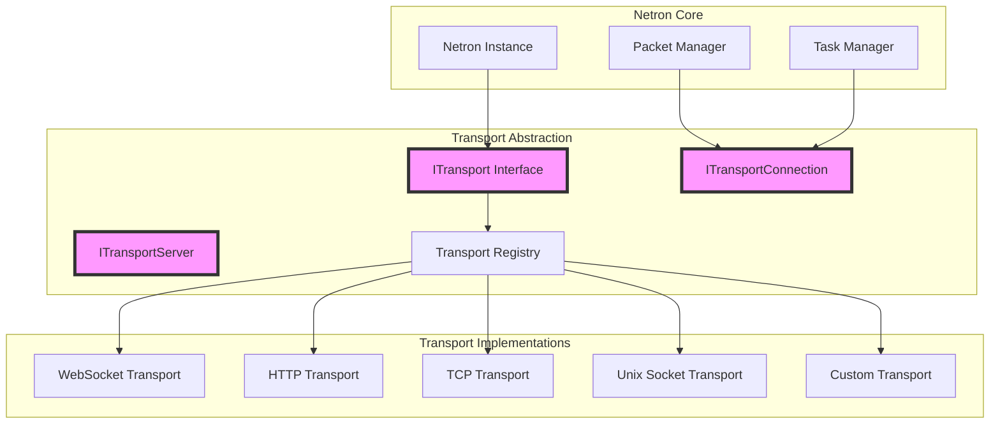
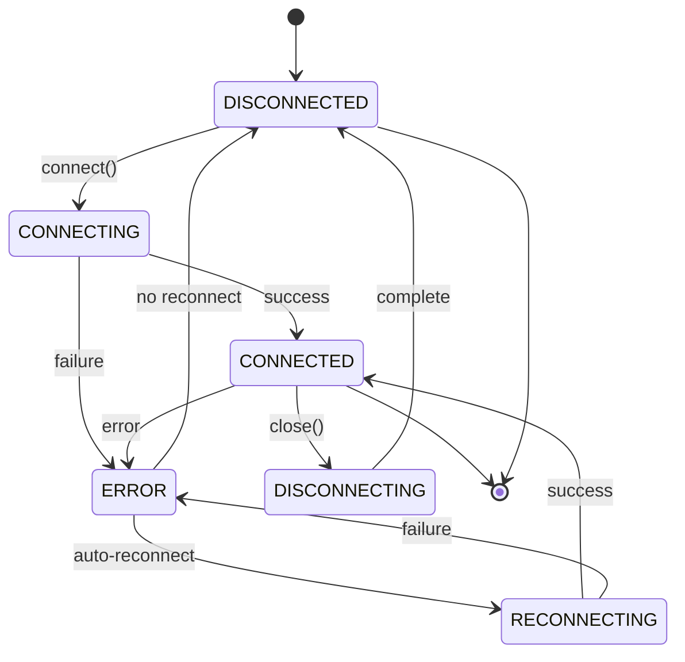

# Netron Transport Layer

## Table of Contents

- [Overview](#overview)
- [Architecture](#architecture)
- [Transport Interface](#transport-interface)
- [Available Transports](#available-transports)
  - [WebSocket Transport](#websocket-transport)
  - [HTTP Transport](#http-transport)
  - [TCP Transport](#tcp-transport)
  - [Unix Socket Transport](#unix-socket-transport)
- [Creating Custom Transports](#creating-custom-transports)
- [Transport Registry](#transport-registry)
- [Connection Management](#connection-management)
- [Performance Comparison](#performance-comparison)
- [Configuration](#configuration)
- [Best Practices](#best-practices)

## Overview

The Netron Transport Layer provides a pluggable, abstracted communication system that allows Netron to work over various network protocols. This abstraction enables seamless switching between transports without changing application code.

### Key Features

- **Protocol Agnostic**: Uniform API across all transport types
- **Pluggable Design**: Easy to add custom transports
- **Connection Management**: Automatic reconnection and pooling
- **Stream Support**: Native support for streaming data
- **Binary Safety**: All transports handle binary data correctly
- **Runtime Detection**: Automatic adaptation to Node.js, Bun, or Deno

## Architecture



## Transport Interface

### Core Interfaces

#### ITransport

The main transport interface that all implementations must follow:

```typescript
interface ITransport {
  // Identification
  readonly name: string;
  readonly capabilities: TransportCapabilities;

  // Client operations
  connect(address: string, options?: TransportOptions): Promise<ITransportConnection>;

  // Server operations
  createServer(options?: TransportOptions): Promise<ITransportServer>;

  // Address validation
  isValidAddress(address: string): boolean;
  parseAddress(address: string): TransportAddress;
}
```

#### ITransportConnection

Represents a single connection:

```typescript
interface ITransportConnection extends EventEmitter {
  // Properties
  readonly id: string;
  readonly state: ConnectionState;
  readonly remoteAddress?: string;
  readonly localAddress?: string;

  // Data transfer
  send(data: Buffer | ArrayBuffer | Uint8Array): Promise<void>;
  sendPacket(packet: Packet): Promise<void>;

  // Connection management
  close(code?: number, reason?: string): Promise<void>;
  ping?(): Promise<void>;

  // Metrics
  getMetrics?(): ConnectionMetrics;

  // Events
  on(event: 'connect', handler: () => void): this;
  on(event: 'disconnect', handler: (reason?: string) => void): this;
  on(event: 'error', handler: (error: Error) => void): this;
  on(event: 'data', handler: (data: Buffer | ArrayBuffer) => void): this;
  on(event: 'packet', handler: (packet: Packet) => void): this;
}
```

#### ITransportServer

Represents a server that accepts connections:

```typescript
interface ITransportServer extends EventEmitter {
  // Properties
  readonly address?: string;
  readonly port?: number;
  readonly connections: Map<string, ITransportConnection>;

  // Server operations
  listen(): Promise<void>;
  close(): Promise<void>;

  // Connection management
  getConnection(id: string): ITransportConnection | undefined;
  closeConnection(id: string): Promise<void>;

  // Events
  on(event: 'connection', handler: (connection: ITransportConnection) => void): this;
  on(event: 'error', handler: (error: Error) => void): this;
  on(event: 'listening', handler: () => void): this;
  on(event: 'close', handler: () => void): this;
}
```

#### TransportCapabilities

Describes what a transport can do:

```typescript
interface TransportCapabilities {
  streaming: boolean;      // Supports streaming data
  bidirectional: boolean;  // Supports two-way communication
  binary: boolean;         // Supports binary data
  reconnection: boolean;   // Supports auto-reconnection
  multiplexing: boolean;   // Supports multiple logical connections
  server: boolean;         // Can create servers
}
```

## Available Transports

### WebSocket Transport

Full-duplex, real-time communication over WebSocket protocol.

**Capabilities:**
- ✅ Streaming
- ✅ Bidirectional
- ✅ Binary support
- ✅ Auto-reconnection
- ✅ Multiplexing
- ✅ Server mode

**Use Cases:**
- Real-time applications
- Live updates and notifications
- Bidirectional streaming
- Low-latency communication

**Configuration:**
```typescript
const netron = new Netron({
  transport: 'websocket',
  listenHost: '0.0.0.0',
  listenPort: 8080,
  reconnect: {
    enabled: true,
    maxAttempts: 5,
    delay: 1000,
    maxDelay: 30000,
    factor: 2
  }
});
```

**Example:**
```typescript
// Server
const server = await transport.createServer({
  host: 'localhost',
  port: 8080
});
await server.listen();

// Client
const connection = await transport.connect('ws://localhost:8080');
```

### HTTP Transport

Request-response communication over HTTP/HTTPS.

**Capabilities:**
- ✅ Streaming (via SSE/chunked)
- ❌ Bidirectional (request-response only)
- ✅ Binary support
- ❌ Auto-reconnection (stateless)
- ✅ Multiplexing (HTTP/2)
- ✅ Server mode

**Use Cases:**
- REST API compatibility
- Firewall-friendly communication
- Stateless services
- HTTP infrastructure integration

**Configuration:**
```typescript
const netron = new Netron({
  transport: 'http',
  listenHost: '0.0.0.0',
  listenPort: 3000,
  cors: {
    origin: '*',
    credentials: true
  },
  headers: {
    'X-Service-Version': '1.0.0'
  }
});
```

**Special Features:**
- Automatic REST endpoint generation
- CORS support
- Custom headers
- HTTP method mapping

For detailed HTTP transport documentation, see [HTTP Transport Guide](./http/README.md).

### TCP Transport

Raw TCP socket communication for maximum performance.

**Capabilities:**
- ✅ Streaming
- ✅ Bidirectional
- ✅ Binary support
- ✅ Auto-reconnection
- ❌ Multiplexing
- ✅ Server mode

**Use Cases:**
- High-performance internal services
- Low-overhead communication
- Custom protocols
- Embedded systems

**Configuration:**
```typescript
const netron = new Netron({
  transport: 'tcp',
  listenHost: '0.0.0.0',
  listenPort: 9000,
  keepAlive: {
    enabled: true,
    initialDelay: 60000
  },
  noDelay: true  // Disable Nagle's algorithm
});
```

**Example:**
```typescript
// Server
const server = await transport.createServer({
  host: 'localhost',
  port: 9000,
  backlog: 511
});

// Client
const connection = await transport.connect('tcp://localhost:9000');
```

### Unix Socket Transport

Inter-process communication via Unix domain sockets.

**Capabilities:**
- ✅ Streaming
- ✅ Bidirectional
- ✅ Binary support
- ✅ Auto-reconnection
- ❌ Multiplexing
- ✅ Server mode

**Use Cases:**
- Local IPC
- High-performance local communication
- Secure local services
- Container communication

**Configuration:**
```typescript
const netron = new Netron({
  transport: 'unix',
  listenPath: '/tmp/netron.sock',
  permissions: '0660'
});
```

**Example:**
```typescript
// Server
const server = await transport.createServer({
  path: '/tmp/service.sock'
});

// Client
const connection = await transport.connect('unix:///tmp/service.sock');
```

## Creating Custom Transports

### Step 1: Implement ITransport

```typescript
import { ITransport, ITransportConnection, ITransportServer } from '@omnitron-dev/titan/netron';

export class CustomTransport implements ITransport {
  readonly name = 'custom';

  readonly capabilities = {
    streaming: true,
    bidirectional: true,
    binary: true,
    reconnection: false,
    multiplexing: false,
    server: true
  };

  async connect(address: string, options?: TransportOptions): Promise<ITransportConnection> {
    // Implement connection logic
    return new CustomConnection(address, options);
  }

  async createServer(options?: TransportOptions): Promise<ITransportServer> {
    // Implement server creation
    return new CustomServer(options);
  }

  isValidAddress(address: string): boolean {
    // Validate address format
    return address.startsWith('custom://');
  }

  parseAddress(address: string): TransportAddress {
    // Parse address into components
    const url = new URL(address);
    return {
      protocol: 'custom',
      host: url.hostname,
      port: parseInt(url.port),
      path: url.pathname
    };
  }
}
```

### Step 2: Implement Connection

```typescript
export class CustomConnection extends EventEmitter implements ITransportConnection {
  readonly id = randomUUID();
  state: ConnectionState = ConnectionState.DISCONNECTED;

  constructor(
    private address: string,
    private options?: TransportOptions
  ) {
    super();
    this.connect();
  }

  async send(data: Buffer | ArrayBuffer | Uint8Array): Promise<void> {
    // Send data over custom protocol
  }

  async sendPacket(packet: Packet): Promise<void> {
    const data = packet.serialize();
    await this.send(data);
  }

  async close(code?: number, reason?: string): Promise<void> {
    // Close connection
    this.state = ConnectionState.DISCONNECTED;
    this.emit('disconnect', reason);
  }

  private connect(): void {
    // Establish connection
    // Emit 'connect' when ready
    // Emit 'data' when data received
    // Emit 'error' on errors
  }
}
```

### Step 3: Register Transport

```typescript
import { TransportRegistry } from '@omnitron-dev/titan/netron';
import { CustomTransport } from './custom-transport';

// Register globally
TransportRegistry.register(new CustomTransport());

// Use in Netron
const netron = new Netron({
  transport: 'custom',
  // Custom transport options
});
```

## Transport Registry

The `TransportRegistry` manages available transports:

```typescript
class TransportRegistry {
  // Register a transport
  static register(transport: ITransport): void;

  // Get a transport by name
  static get(name: string): ITransport | undefined;

  // Check if transport exists
  static has(name: string): boolean;

  // List all transports
  static list(): string[];

  // Remove a transport
  static unregister(name: string): void;

  // Get transport for URL
  static getByProtocol(protocol: string): ITransport | undefined;
}
```

### Auto-Registration

Common transports are auto-registered:

```typescript
// Pre-registered transports
TransportRegistry.register(new WebSocketTransport());
TransportRegistry.register(new HttpTransport());
TransportRegistry.register(new TcpTransport());
TransportRegistry.register(new UnixTransport());
```

## Connection Management

### Connection States

```typescript
enum ConnectionState {
  CONNECTING = 'connecting',      // Initial connection attempt
  CONNECTED = 'connected',        // Successfully connected
  DISCONNECTING = 'disconnecting', // Graceful disconnection
  DISCONNECTED = 'disconnected',  // Not connected
  RECONNECTING = 'reconnecting',  // Attempting to reconnect
  ERROR = 'error'                // Connection error
}
```

### Connection Lifecycle



### Connection Pooling

```typescript
class ConnectionPool {
  constructor(
    private transport: ITransport,
    private options: PoolOptions
  ) {}

  // Acquire connection from pool
  async acquire(): Promise<ITransportConnection> {
    // Return existing or create new
  }

  // Release connection back to pool
  release(connection: ITransportConnection): void {
    // Return to pool or close if over limit
  }

  // Pool statistics
  getStats(): PoolStats {
    return {
      active: this.activeConnections,
      idle: this.idleConnections,
      total: this.totalConnections,
      waiting: this.waitingRequests
    };
  }
}
```

## Performance Comparison

### Latency Comparison (LAN)

| Transport | Round-trip Time | Overhead |
|-----------|-----------------|----------|
| Unix Socket | 0.1-0.5ms | Minimal |
| TCP | 0.5-2ms | Low |
| WebSocket | 1-5ms | Medium |
| HTTP | 5-20ms | High |

### Throughput Comparison

| Transport | Small Messages (<1KB) | Large Messages (>100KB) |
|-----------|----------------------|------------------------|
| Unix Socket | 50,000+ msg/s | 2,000+ msg/s |
| TCP | 30,000+ msg/s | 1,500+ msg/s |
| WebSocket | 10,000+ msg/s | 500+ msg/s |
| HTTP | 5,000+ msg/s | 200+ msg/s |

### Resource Usage

| Transport | Memory per Connection | CPU Usage |
|-----------|----------------------|-----------|
| Unix Socket | ~50KB | Low |
| TCP | ~100KB | Low |
| WebSocket | ~150KB | Medium |
| HTTP | ~200KB | Medium-High |

## Configuration

### Transport Selection

```typescript
// Automatic selection based on URL
const peer1 = await netron.connect('ws://server:8080');    // WebSocket
const peer2 = await netron.connect('http://server:3000');  // HTTP
const peer3 = await netron.connect('tcp://server:9000');   // TCP
const peer4 = await netron.connect('unix:///tmp/sock');    // Unix

// Explicit transport selection
const netron = new Netron({
  transport: 'websocket',  // Force WebSocket
  // Transport-specific options
});
```

### Common Options

All transports support these options:

```typescript
interface TransportOptions {
  // Reconnection
  reconnect?: {
    enabled?: boolean;
    maxAttempts?: number;
    delay?: number;
    maxDelay?: number;
    factor?: number;
  };

  // Timeouts
  connectTimeout?: number;
  requestTimeout?: number;

  // Keep-alive
  keepAlive?: {
    enabled?: boolean;
    interval?: number;
    timeout?: number;
  };

  // Buffer management
  bufferSize?: number;
  maxBufferSize?: number;

  // Compression
  compression?: boolean;
  compressionLevel?: number;

  // Security
  tls?: {
    cert?: Buffer;
    key?: Buffer;
    ca?: Buffer;
    rejectUnauthorized?: boolean;
  };
}
```

### Environment Variables

```bash
# Default transport
NETRON_TRANSPORT=websocket

# WebSocket options
NETRON_WS_HOST=0.0.0.0
NETRON_WS_PORT=8080
NETRON_WS_PATH=/netron

# HTTP options
NETRON_HTTP_HOST=0.0.0.0
NETRON_HTTP_PORT=3000
NETRON_HTTP_CORS=true

# TCP options
NETRON_TCP_HOST=0.0.0.0
NETRON_TCP_PORT=9000
NETRON_TCP_NODELAY=true

# Unix socket options
NETRON_UNIX_PATH=/tmp/netron.sock
NETRON_UNIX_PERMISSIONS=0660
```

## Best Practices

### 1. Choose the Right Transport

Select transport based on requirements:

- **WebSocket**: Real-time, bidirectional communication
- **HTTP**: REST compatibility, firewall-friendly
- **TCP**: Maximum performance, minimal overhead
- **Unix**: Local IPC, security isolation

### 2. Handle Connection Errors

Always implement error handling:

```typescript
connection.on('error', (error) => {
  logger.error('Connection error:', error);
  // Implement retry logic or fallback
});

connection.on('disconnect', (reason) => {
  logger.warn('Disconnected:', reason);
  // Clean up resources
});
```

### 3. Monitor Connection Health

Implement health checks:

```typescript
// Periodic ping
setInterval(async () => {
  try {
    await connection.ping();
  } catch (error) {
    logger.warn('Ping failed:', error);
    // Trigger reconnection
  }
}, 30000);

// Monitor metrics
const metrics = connection.getMetrics();
if (metrics.latency > 100) {
  logger.warn('High latency detected:', metrics.latency);
}
```

### 4. Use Connection Pooling

For high-throughput scenarios:

```typescript
const pool = new ConnectionPool(transport, {
  min: 2,
  max: 10,
  idleTimeout: 60000,
  acquireTimeout: 5000
});

// Use connections from pool
const conn = await pool.acquire();
try {
  await conn.send(data);
} finally {
  pool.release(conn);
}
```

### 5. Implement Graceful Shutdown

Clean up connections properly:

```typescript
process.on('SIGTERM', async () => {
  logger.info('Shutting down...');

  // Close all connections
  for (const [id, connection] of connections) {
    await connection.close(1000, 'Server shutting down');
  }

  // Close server
  await server.close();

  process.exit(0);
});
```

### 6. Test with Different Transports

Ensure compatibility:

```typescript
describe('Service', () => {
  const transports = ['websocket', 'http', 'tcp', 'unix'];

  for (const transport of transports) {
    it(`should work with ${transport}`, async () => {
      const netron = new Netron({ transport });
      // Test service functionality
    });
  }
});
```

## Advanced Topics

### Transport Adapters

Create adapters for existing protocols:

```typescript
class RedisTransportAdapter implements ITransport {
  constructor(private redis: Redis) {}

  async connect(channel: string): Promise<ITransportConnection> {
    // Adapt Redis pub/sub to transport interface
    return new RedisConnection(this.redis, channel);
  }
}
```

### Transport Middleware

Add cross-cutting concerns:

```typescript
class LoggingTransport implements ITransport {
  constructor(private inner: ITransport) {}

  async connect(address: string, options?: TransportOptions): Promise<ITransportConnection> {
    console.log(`Connecting to ${address}`);
    const conn = await this.inner.connect(address, options);

    // Wrap connection with logging
    return new LoggingConnection(conn);
  }
}
```

### Multi-Transport Support

Use multiple transports simultaneously:

```typescript
class MultiTransport {
  private transports: Map<string, ITransport> = new Map();

  async connect(url: string): Promise<ITransportConnection> {
    const protocol = new URL(url).protocol.slice(0, -1);
    const transport = this.transports.get(protocol);

    if (!transport) {
      throw new Error(`Unsupported protocol: ${protocol}`);
    }

    return transport.connect(url);
  }
}
```

## See Also

- [Netron Main Documentation](../README.md)
- [HTTP Transport Details](./http/README.md)
- [Middleware System](../middleware/README.md)
- [Packet Protocol](../packet/README.md)