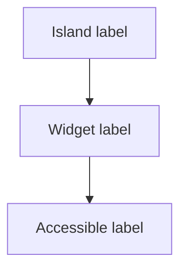

# Diagram label boundary

<HydrationCanary origin="trusted-widget" hydrate="load" />

```mermaid
%%{init: {"dompurifyConfig":{"ALLOW_DATA_ATTR":true,"ALLOW_ARIA_ATTR":true}}}%%
flowchart TB
A["<p data-lumen-island=label-island data-component=HydrationCanary data-props='{}' data-hydrate=load>Island label</p>"] --> B["<p data-widget=HydrationCanary data-props='{}' data-hydrate=load>Widget label</p>"]
B --> C["<p aria-label=spoofed aria-live=assertive data-author=untrusted>Accessible label</p>"]
```
