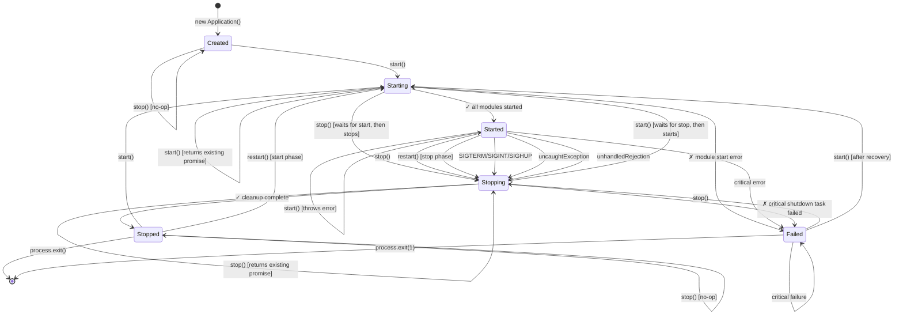
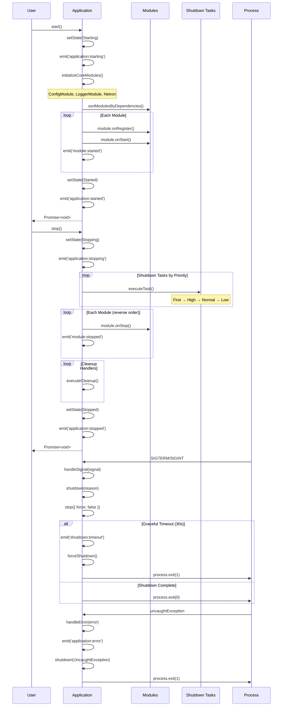
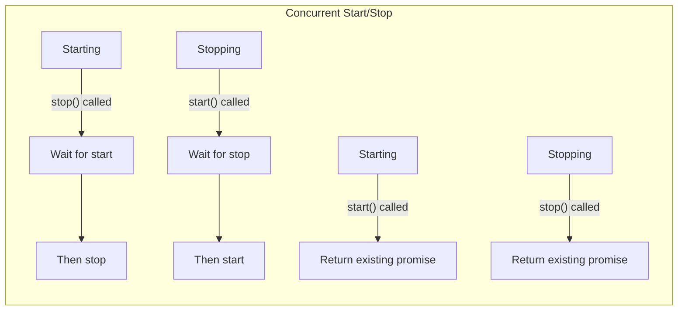
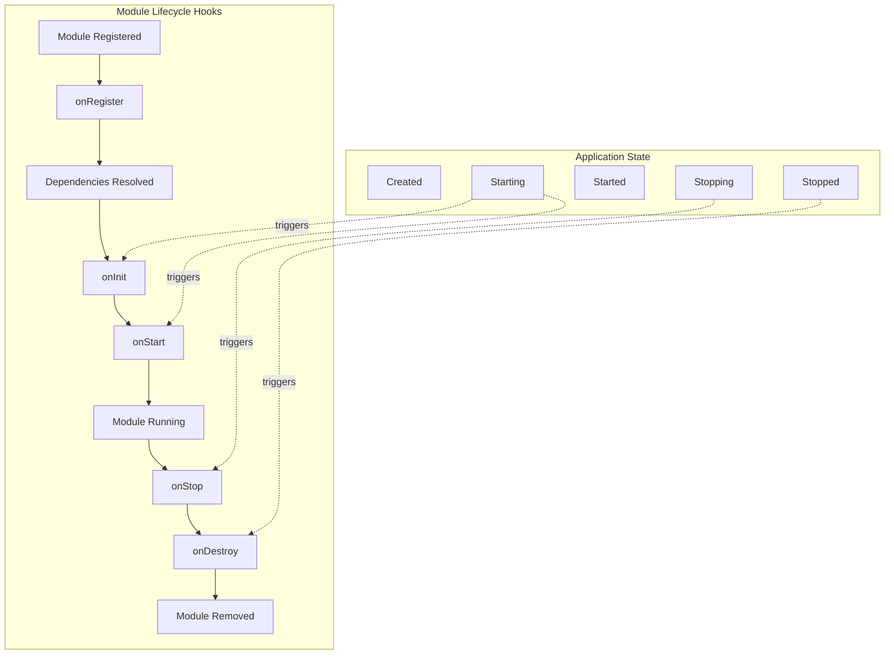
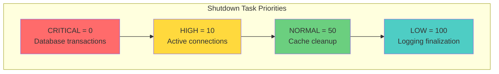
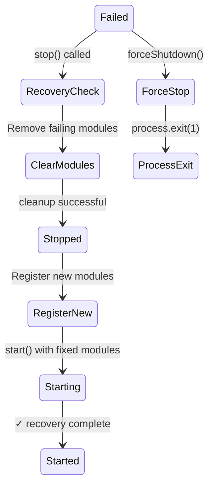

# Titan Application Layer API - Complete Reference

## Table of Contents

- [Overview](#overview)
- [Core Files](#core-files)
- [Application Lifecycle](#application-lifecycle)
  - [Comprehensive State Diagram](#comprehensive-state-diagram)
  - [Detailed Lifecycle Flow](#detailed-lifecycle-flow)
  - [Concurrent Operations Handling](#concurrent-operations-handling)
  - [Module Lifecycle Within Application](#module-lifecycle-within-application)
  - [Shutdown Priority System](#shutdown-priority-system)
  - [Error Recovery Paths](#error-recovery-paths)
- [Application Class (application.ts)](#application-class-applicationts)
  - [Constructor and Factory](#constructor-and-factory)
  - [Lifecycle Methods](#lifecycle-methods)
  - [Module Management](#module-management)
  - [Dependency Injection](#dependency-injection)
  - [Event System](#event-system)
  - [Configuration Management](#configuration-management)
  - [Health and Metrics](#health-and-metrics)
  - [Process Lifecycle](#process-lifecycle)
  - [Internal Methods](#internal-methods)
  - [State Management](#state-management)
- [Simplified API (simple.ts)](#simplified-api-simplets)
  - [titan() Function](#titan-function)
  - [service() Function](#service-function)
  - [module() Function](#module-function)
  - [Configuration Helpers](#configuration-helpers)
  - [Injection Helpers](#injection-helpers)
  - [Controller Registration](#controller-registration)
  - [Export Functions](#export-functions)
  - [Lifecycle Interfaces](#lifecycle-interfaces)
- [Complete API Reference](#complete-api-reference)
- [Internal Mechanisms](#internal-mechanisms)
- [Usage Patterns](#usage-patterns)
- [Best Practices](#best-practices)
- [Migration Guides](#migration-guides)

## Overview

The Titan Application layer consists of two primary files that provide both a powerful core application framework and a simplified API for ease of use:

1. **application.ts** (2538 lines) - The core Application class with comprehensive lifecycle, module, and dependency management
2. **simple.ts** (380 lines) - Zero-configuration, minimal cognitive load API wrapper

## Core Files

### application.ts
- **Size**: 2538 lines
- **Purpose**: Core application kernel implementing IApplication interface
- **Exports**:
  - `Application` class
  - `APPLICATION_TOKEN` - DI token for Application instance
  - `NETRON_TOKEN` - DI token for Netron networking service
  - `createApp()` - Factory function
  - `startApp()` - Quick start function

### simple.ts
- **Size**: 380 lines
- **Purpose**: Simplified API for rapid development
- **Exports**:
  - `titan()` - Zero-config app creation
  - `service()` - Service factory
  - `module()` - Module factory
  - `configure()` - Config helper
  - `env()` - Environment variable helper
  - `inject()` - DI helper
  - `controller()` - HTTP controller helper
  - Re-exports from application.ts
  - Lifecycle interfaces

## Application Lifecycle

### Comprehensive State Diagram



### Detailed Lifecycle Flow



### Concurrent Operations Handling



### Module Lifecycle Within Application



### Shutdown Priority System



### Error Recovery Paths



### Lifecycle Behavior Details

#### State Transition Rules

1. **Created → Starting**: Only via `start()`
2. **Starting → Started**: Automatic on successful module initialization
3. **Starting → Failed**: On module initialization error
4. **Started → Stopping**: Via `stop()`, signals, or errors
5. **Stopping → Stopped**: Automatic on successful cleanup
6. **Stopping → Failed**: On critical shutdown task failure
7. **Failed → Stopping**: Via `stop()` for recovery
8. **Stopped → Starting**: Via `start()` to restart

#### Concurrent Operation Handling

The application implements intelligent promise management for concurrent operations:

- **During Starting**:
  - `start()` → Returns the existing start promise
  - `stop()` → Waits for start to complete, then stops

- **During Stopping**:
  - `stop()` → Returns the existing stop promise
  - `start()` → Waits for stop to complete, then starts

This ensures operations are properly sequenced without race conditions.

#### Module Initialization Order

1. **Dependency Resolution**: Modules are topologically sorted based on dependencies
2. **Registration Phase**: `onRegister()` called for each module
3. **Initialization Phase**: `onInit()` called in dependency order
4. **Start Phase**: `onStart()` called in dependency order
5. **Stop Phase**: `onStop()` called in reverse dependency order
6. **Cleanup Phase**: `onDestroy()` called in reverse order

#### Signal Handling Behavior

| Signal | Reason | Exit Code | Behavior |
|--------|--------|-----------|----------|
| SIGTERM | Graceful shutdown | 0 | Normal shutdown with cleanup |
| SIGINT | User interruption | 130 | Normal shutdown with cleanup |
| SIGHUP | Terminal disconnect | 129 | Normal shutdown with cleanup |
| uncaughtException | Unhandled error | 1 | Emergency shutdown |
| unhandledRejection | Promise rejection | 1 | Emergency shutdown |

#### Shutdown Task Execution

Tasks are executed in priority order with timeout protection:

```
CRITICAL (0) → HIGH (10) → NORMAL (50) → LOW (100)
```

- **Critical tasks**: Must complete or shutdown fails
- **Non-critical tasks**: Failures are logged but don't block shutdown
- **Timeout behavior**: After `shutdownTimeout` (default 30s), force shutdown occurs

#### Error Recovery Strategy

1. **Module Start Failure**:
   - State transitions to `Failed`
   - Error event emitted
   - Can recover by calling `stop()` then `start()` with fixed modules

2. **Shutdown Task Failure**:
   - Critical tasks cause transition to `Failed`
   - Non-critical task failures are logged only
   - Force shutdown available as last resort

3. **Uncaught Errors**:
   - Immediate shutdown initiated
   - Process exits with code 1
   - No recovery possible

#### Lifecycle Events

| Event | When Emitted | Data |
|-------|--------------|------|
| `application:starting` | Before module initialization | Application metadata |
| `application:started` | After all modules started | Startup duration |
| `application:stopping` | Before shutdown tasks | Shutdown reason |
| `application:stopped` | After cleanup complete | Total uptime |
| `application:error` | On any error | Error object |
| `module:started` | After each module starts | Module name |
| `module:stopped` | After each module stops | Module name |
| `shutdown:initiated` | When shutdown begins | Reason and details |
| `shutdown:timeout` | On graceful timeout | Timeout duration |
| `shutdown:complete` | After process cleanup | Exit code |

## Application Class (application.ts)

### Constructor and Factory

#### Constructor
```typescript
constructor(options: IApplicationOptions = {})
```

**Initialization Process**:
1. Creates or uses provided Container instance
2. Registers Application itself in container with APPLICATION_TOKEN
3. Sets metadata (name, version, debug)
4. Stores user config separately from full config
5. Merges config with app metadata
6. Configures process lifecycle if not disabled
7. Sets shutdown timeout (default 30000ms)

**Internal Properties Set**:
```typescript
private _isStarted = false;
private _state: ApplicationState = ApplicationState.Created;
private _container: Container;
private _config: IApplicationConfig;
private _userConfig: ConfigObject;  // Stored separately
private _name: string;
private _version: string;
private _debug: boolean;
private _startTime: number = 0;
private _startupTime: number = 0;
private _eventEmitter = new EventEmitter();
private _modules = new Map<Token<any>, IModule>();
private _startHooks: ILifecycleHook[] = [];
private _stopHooks: ILifecycleHook[] = [];
private _errorHandlers: ((error: Error) => void)[] = [];
private _logger?: ILogger;
private _shutdownTasks = new Map<string, IShutdownTask>();
private _signalHandlers = new Map<string, (...args: any[]) => any>();
private _cleanupHandlers = new Set<() => Promise<void> | void>();
private _isShuttingDown = false;
private _shutdownPromise: Promise<void> | null = null;
private _lifecycleState: LifecycleState = LifecycleState.Created;
private _disableProcessExit = false;
private _shutdownTimeout = 30000;
private _startPromise: Promise<void> | null = null;
private _stopPromise: Promise<void> | null = null;
```

#### Static Factory Method
```typescript
static async create(options?: IApplicationOptions & {
  modules?: ModuleInput[];
  imports?: Token<IModule>[];
  providers?: Array<[InjectionToken<any>, Provider<any>]>;
  autoDiscovery?: boolean;
  scanPaths?: string[];
  excludePaths?: string[];
}): Promise<Application>
```

**Creation Process**:
1. Creates Application instance
2. Initializes core modules if not disabled
3. Performs auto-discovery if enabled
4. Registers modules from options.modules
5. Registers imports from options.imports (backward compatibility)
6. Creates anonymous RootContext module for direct providers
7. Returns configured application

### Lifecycle Methods

#### start()
```typescript
async start(): Promise<void>
```

**Start Process**:
1. Returns existing promise if already starting (prevents duplicate starts)
2. Waits for stop to complete if currently stopping
3. Validates state (must be Created or Stopped)
4. Creates and tracks start promise via `_doStart()`
5. Cleans up promise reference after completion

**Internal _doStart() Process**:
1. Sets state to Starting
2. Records start time
3. Yields to event loop with setImmediate
4. Emits Starting event
5. Initializes core modules if needed
6. Initializes logger from container
7. Sets up signal handlers
8. Sets up error handlers
9. Registers pending global shutdown tasks
10. Sorts modules by dependencies
11. For each module:
    - Calls onRegister()
    - Calls onStart()
12. Starts Netron if available
13. Executes start hooks
14. Sets state to Started
15. Records startup time
16. Emits Started event

#### stop()
```typescript
async stop(options: IShutdownOptions = {}): Promise<void>
```

**Stop Process**:
1. Returns existing promise if already stopping
2. Waits for start to complete if starting
3. Validates state
4. Creates and tracks stop promise via `_doStop()`
5. Cleans up promise reference

**Internal _doStop() Process**:
1. Sets state to Stopping
2. Emits Stopping event
3. Executes stop hooks in reverse order
4. Executes shutdown tasks sorted by priority
5. Stops modules in reverse dependency order
6. Calls onStop() and onDestroy() for each module
7. Stops Netron if available
8. Flushes logger
9. Executes cleanup handlers
10. Removes signal handlers
11. Sets state to Stopped
12. Clears event listeners
13. Forces process exit if configured

#### restart()
```typescript
async restart(): Promise<void>
```

Performs stop() followed by start() with proper state management.

#### forceShutdown()
```typescript
async forceShutdown(reason: string = 'Forced shutdown'): Promise<void>
```

Immediate shutdown with:
- 5-second timeout
- Force flag enabled
- Process exit after completion

### Module Management

#### registerModule()
```typescript
async registerModule(moduleInput: ModuleInput): Promise<IModule>
```

**Registration Process**:
1. Handles different input types:
   - Class constructors
   - Module instances
   - Dynamic modules
   - Modules with forRoot()
2. Extracts metadata via reflection
3. Creates unique token
4. Prevents duplicate registration
5. Registers providers in container
6. Handles exports
7. Configures module if config exists
8. Stores in internal registry
9. Returns module instance

**Module Resolution Logic**:
```typescript
// For class constructors
if (typeof moduleInput === 'function') {
  // Check for forRoot pattern
  if (ModuleClass.forRoot && typeof ModuleClass.forRoot === 'function') {
    const result = await ModuleClass.forRoot(this._config);
    // Handle dynamic module
  }
  // Create instance
  moduleInstance = new ModuleClass();
}
```

#### use()
```typescript
use(module: ModuleInput): this
```

Synchronously registers module for later initialization. Returns `this` for chaining.

#### useMany()
```typescript
useMany(...modules: ModuleInput[]): this
```

Registers multiple modules. Returns `this` for chaining.

#### getModule()
```typescript
getModule<T extends IModule>(nameOrToken: string | Token<T>): T | undefined
```

Retrieves module by name or token with type safety.

#### hasModule()
```typescript
hasModule(nameOrToken: string | Token<any>): boolean
```

Checks if module is registered by name or token.

#### getModules()
```typescript
getModules(): IModule[]
```

Returns array of all registered modules.

#### discoverModules()
```typescript
private async discoverModules(
  scanPaths?: string[],
  excludePaths?: string[]
): Promise<ModuleConstructor[]>
```

Auto-discovers @Module decorated classes in filesystem.

#### sortModulesByDependencies()
```typescript
private sortModulesByDependencies(): Array<[Token<IModule>, IModule]>
```

Topologically sorts modules based on dependency graph.

#### registerDynamic()
```typescript
async registerDynamic(module: IModule): Promise<void>
```

Dynamically registers a module at runtime. This allows adding modules after application has started.
- Validates application is in Started state
- Initializes and starts the module
- Adds to module registry
- Emits module:registered event

#### shutdown()
```typescript
async shutdown(
  reason: ShutdownReason,
  details?: {
    signal?: string;
    error?: Error;
    reason?: unknown;
    promise?: Promise<unknown>;
  }
): Promise<void>
```

Comprehensive shutdown orchestrator that handles:
1. Prevents concurrent shutdown attempts
2. Logs shutdown reason and details
3. Emits shutdown:initiated event
4. Executes stop() with appropriate options
5. Handles force shutdown on timeout
6. Manages process exit codes based on reason
7. Cleans up all resources

### Dependency Injection

#### get()
```typescript
get<T>(token: InjectionToken<T>): T
```

Resolves and returns service from DI container.

#### has()
```typescript
has(token: Token<any>): boolean
```

Checks if provider exists in container.

#### hasProvider()
```typescript
hasProvider(token: Token<any>): boolean
```

Alias for has() for clarity.

#### provide()
```typescript
provide<T>(token: InjectionToken<T>, provider: Provider<T>): this
```

Registers provider in container. Returns `this` for chaining.

#### getContainer()
```typescript
getContainer(): Container
```

Returns underlying DI container instance.

#### createScope()
```typescript
createScope(): Container
```

Creates child container scope for isolated dependency resolution.

### Event System

#### emit()
```typescript
emit(event: ApplicationEvent | string, data?: any): void
```

**Event Emission Process**:
1. Prepares metadata (timestamp, application info)
2. Handles error events specially
3. Emits to specific listeners
4. Emits to wildcard listeners (*)
5. Logs debug info if logger available

#### emitAsync()
```typescript
async emitAsync(event: ApplicationEvent | string, data?: any): Promise<void>
```

Async version that waits for all handlers to complete.

#### on()
```typescript
on(event: string, handler: EventHandler): void
```

Subscribes to event. Supports wildcard (*) for all events.

#### once()
```typescript
once(event: string, handler: EventHandler): void
```

Subscribes to single event occurrence.

#### off()
```typescript
off(event: string, handler: EventHandler): void
```

Unsubscribes from event.

#### onStart()
```typescript
onStart(
  hook: ILifecycleHook | (() => void | Promise<void>),
  priority?: number,
  timeout?: number
): this
```

Registers startup hook with priority and timeout.

#### onStop()
```typescript
onStop(
  hook: ILifecycleHook | (() => void | Promise<void>),
  priority?: number,
  timeout?: number
): this
```

Registers shutdown hook with priority and timeout.

#### onError()
```typescript
onError(handler: (error: Error) => void): this
```

Registers global error handler.

### Configuration Management

#### config()
```typescript
config(): IApplicationConfig;
config<T>(key: string): T | undefined;
```

Gets full config or specific key value.

#### getConfig()
```typescript
getConfig(): IApplicationConfig
```

Returns sanitized config without internal keys.

#### setConfig()
```typescript
setConfig(key: string, value: ConfigValue): void
```

Sets config value at path (dot notation supported).

#### updateConfig()
```typescript
updateConfig(options: Partial<IApplicationConfig>): void
```

**Update Process**:
1. Deep merges with existing config
2. Updates user config separately
3. Merges into full config
4. Reconfigures logger if needed
5. Updates event emitter settings
6. Reconfigures all modules

**Deep Merge Logic**:
```typescript
private deepMerge(target: ConfigObject, source: ConfigObject): ConfigObject {
  // Preserves existing objects
  // Overwrites primitives and arrays
  // Recursively merges nested objects
}
```

### Health and Metrics

#### health()
```typescript
async health(): Promise<IHealthStatus>
```

**Health Check Process**:
1. Collects module health statuses
2. Aggregates into overall status
3. Includes metadata (uptime, version)
4. Returns structured health response

#### checkHealth()
```typescript
async checkHealth(moduleName: string): Promise<IHealthStatus>
```

Checks health of specific module.

#### metrics()
```typescript
async metrics(): Promise<IApplicationMetrics>
```

Returns comprehensive application metrics:
- Uptime
- Module count
- Event count
- Memory usage
- CPU usage
- Module-specific metrics

#### getMetrics()
```typescript
getMetrics(): IApplicationMetrics
```

Synchronous version returning current metrics snapshot.

#### getUptime()
```typescript
getUptime(): number
```

Returns milliseconds since start.

#### getStartupTime()
```typescript
getStartupTime(): number
```

Returns startup duration in milliseconds.

### Process Lifecycle

#### setupProcessLifecycle()
```typescript
private setupProcessLifecycle(): void
```

Configures signal handlers for:
- SIGTERM
- SIGINT
- SIGQUIT
- SIGHUP
- uncaughtException
- unhandledRejection

#### setupSignalHandlers()
```typescript
private setupSignalHandlers(): void
```

Registers process signal handlers with proper cleanup.

#### setupErrorHandlers()
```typescript
private setupErrorHandlers(): void
```

Configures global error handlers for uncaught exceptions.

#### registerShutdownTask()
```typescript
registerShutdownTask(task: IShutdownTask): void
```

**Task Structure**:
```typescript
interface IShutdownTask {
  id?: string;
  name: string;
  handler: () => Promise<void>;
  priority?: ShutdownPriority;
  timeout?: number;
  critical?: boolean;
}
```

**Priority Levels**:
- CRITICAL: 0 (first)
- HIGH: 10
- NORMAL: 50
- LOW: 100 (last)

#### addCleanupHandler()
```typescript
addCleanupHandler(handler: () => Promise<void> | void): void
```

Adds simple cleanup handler executed during shutdown.

#### handleShutdown()
```typescript
async handleShutdown(reason: ShutdownReason): Promise<void>
```

Central shutdown coordinator:
1. Prevents duplicate shutdowns
2. Logs reason
3. Emits shutdown events
4. Calls stop() with appropriate options
5. Manages shutdown promise

### Internal Methods

#### initializeCoreModules()
```typescript
private async initializeCoreModules(): Promise<void>
```

**Initialization Order**:
1. ConfigModule.forRoot() with user config
2. LoggerModule.forRoot() with logging config
3. Creates Netron instance
4. Registers all in container

#### setState()
```typescript
private setState(state: ApplicationState): void
```

Thread-safe state transition with:
- Validation
- Event emission
- Lifecycle state sync

#### isDynamicModule()
```typescript
private isDynamicModule(obj: any): obj is IDynamicModule
```

Type guard for dynamic module detection.

#### isModuleConstructor()
```typescript
private isModuleConstructor(obj: any): obj is ModuleConstructor
```

Type guard for module class detection.

#### isTokenBasedModule()
```typescript
private isTokenBasedModule(module: any): boolean
```

Checks if module uses token-based registration.

#### extractModuleMetadata()
```typescript
private extractModuleMetadata(moduleInstance: any): ModuleMetadata | undefined
```

Uses reflection to get @Module decorator metadata.

#### handleSignal()
```typescript
private handleSignal(signal: ProcessSignal): void
```

Processes incoming process signals:
- Logs signal reception
- Maps signal to ShutdownReason
- Initiates graceful shutdown
- Manages signal-specific behavior

#### executeShutdown()
```typescript
private async executeShutdown(
  reason: ShutdownReason,
  details?: unknown
): Promise<void>
```

Core shutdown execution logic:
1. Sets shutting down state
2. Executes shutdown tasks by priority
3. Stops all modules in reverse order
4. Runs cleanup handlers
5. Manages timeout and force shutdown
6. Determines exit code based on reason

#### processDynamicModule()
```typescript
private async processDynamicModule(
  dynamicModule: IDynamicModule,
  moduleInstance: IModule
): Promise<void>
```

Processes dynamic module configuration:
- Merges providers
- Handles imports/exports
- Applies configuration overrides
- Manages dynamic module metadata

#### handleError()
```typescript
private handleError(error: Error): void
```

Central error handler:
- Logs error with context
- Emits error event
- Calls registered error handlers
- Initiates shutdown for critical errors

### State Management

#### Application States
```typescript
enum ApplicationState {
  Created = 'created',
  Starting = 'starting',
  Started = 'started',
  Stopping = 'stopping',
  Stopped = 'stopped',
  Failed = 'failed'
}
```

#### Lifecycle States
```typescript
enum LifecycleState {
  Created = 'created',
  Initializing = 'initializing',
  Initialized = 'initialized',
  Starting = 'starting',
  Started = 'started',
  Stopping = 'stopping',
  Stopped = 'stopped',
  Failed = 'failed',
  Destroyed = 'destroyed'
}
```

#### State Getters
```typescript
get state(): ApplicationState
get lifecycleState(): LifecycleState
get isStarted(): boolean
get isStopped(): boolean
get isStopping(): boolean
get isShuttingDown(): boolean
```

#### Property Getters
```typescript
get uptime(): number          // Milliseconds since start
get environment(): IEnvironment // Runtime environment info
get container(): Container     // DI container instance
get name(): string            // Application name
get version(): string         // Application version
get debug(): boolean          // Debug mode flag
get logger(): ILogger | undefined    // Logger instance if available
get netron(): Netron | undefined      // Netron instance if available
get modules(): Map<string, IModule>  // All registered modules
```

## Simplified API (simple.ts)

### titan() Function

```typescript
export async function titan(
  moduleOrOptions?: ModuleInput | IApplicationOptions,
  startOptions?: { start?: boolean }
): Promise<Application>
```

**Zero-configuration application creation**:
1. Auto-detects input type (module vs options)
2. Creates application with defaults
3. Optionally auto-starts
4. Returns configured Application instance

**Usage Patterns**:
```typescript
// Minimal
const app = await titan();

// With module
@Module()
class AppModule {}
const app = await titan(AppModule);

// With options
const app = await titan({
  port: 3000,
  redis: 'localhost:6379'
});

// With service object
const app = await titan({
  greet(name: string) {
    return `Hello ${name}`;
  }
});
```

### service() Function

```typescript
export function service<T extends object>(
  name: string,
  implementation: T,
  options?: {
    dependencies?: any[];
    singleton?: boolean;
  }
): T & { __metadata?: ServiceMetadata }
```

**Creates service with metadata**:
- Attaches service metadata
- Configures dependencies
- Sets scope (singleton by default)
- Returns enhanced service object

**Example**:
```typescript
const userService = service('UserService', {
  async findUser(id: string) {
    return db.users.findById(id);
  },
  async createUser(data: UserInput) {
    return db.users.create(data);
  }
}, {
  dependencies: [DatabaseService],
  singleton: true
});
```

### module() Function

```typescript
export function module(definition: {
  name?: string;
  services?: any[];
  imports?: any[];
  exports?: any[];
  config?: any;
  onStart?: () => void | Promise<void>;
  onStop?: () => void | Promise<void>;
}): IModule
```

**Creates module programmatically**:
1. Generates dynamic module class
2. Implements IModule interface
3. Attaches metadata
4. Handles lifecycle hooks
5. Returns module instance

**Dynamic Module Generation**:
```typescript
class DynamicModule implements IModule {
  name = definition.name || 'DynamicModule';
  providers = definition.services || [];
  imports = definition.imports || [];
  exports = definition.exports || [];

  async onStart() {
    if (definition.onStart) {
      await definition.onStart();
    }
  }

  async onStop() {
    if (definition.onStop) {
      await definition.onStop();
    }
  }
}
```

### Configuration Helpers

#### configure()
```typescript
export function configure<T extends object>(config: T): T
```

Type-safe configuration helper that returns typed config object.

#### env()
```typescript
export function env<T>(
  key: string,
  defaultValue: T
): T
```

**Environment variable helper with type conversion**:
1. Reads from process.env
2. Auto-converts types based on defaultValue
3. Handles boolean strings ('true', 'false')
4. Parses numbers
5. Returns typed value

**Type Conversion Logic**:
```typescript
if (typeof defaultValue === 'boolean') {
  return value === 'true' || value === '1';
}
if (typeof defaultValue === 'number') {
  const num = Number(value);
  return isNaN(num) ? defaultValue : num;
}
```

### Injection Helpers

#### inject()
```typescript
export function inject<T = any>(token: Token<T> | string): T
```

**Global injection helper**:
1. Gets global application instance
2. Resolves token from container
3. Throws if app not initialized
4. Returns typed service instance

**Implementation**:
```typescript
const app = (global as any).__titanApp;
if (!app) {
  throw new Error('No Titan application found');
}
return app.get(token);
```

### Controller Registration

#### controller()
```typescript
export function controller(
  path: string,
  handlers: Record<string, Function>
): Record<string, Function>
```

**HTTP controller helper** (placeholder):
- Prepares controller metadata
- Returns handlers object
- Full implementation pending

### Export Functions

#### createApp
```typescript
export const createApp = Application.create.bind(Application);
```

Bound version of Application.create for convenience.

#### createToken
```typescript
export const createToken = nexusCreateToken;
```

Re-export of Nexus DI token creator.

#### createModule
```typescript
export function createModule(config: {
  name?: string;
  providers?: any[];
  imports?: any[];
  exports?: any[];
  onStart?: () => void | Promise<void>;
  onStop?: () => void | Promise<void>;
}): IModule
```

Wrapper around module() with provider terminology.

#### defineModule
```typescript
export function defineModule<TService = {}>(
  definition: IModule & TService
): IModule & TService
```

Type-safe module definition with service methods.

### Lifecycle Interfaces

```typescript
export interface OnStart {
  onStart(): void | Promise<void>;
}

export interface OnStop {
  onStop(): void | Promise<void>;
}

export interface OnInit {
  onInit(): void | Promise<void>;
}

export interface OnDestroy {
  onDestroy(): void | Promise<void>;
}
```

Standard lifecycle hook interfaces for services and modules.

## Internal Mechanisms

### Module Resolution

**Dependency Graph Building**:
1. Collects all module dependencies
2. Builds adjacency list
3. Performs topological sort
4. Returns ordered module array

**Circular Dependency Detection**:
```typescript
// In sortModulesByDependencies()
const visited = new Set<string>();
const visiting = new Set<string>();
// DFS with cycle detection
```

### Event Propagation

**Event Flow**:
1. Event emitted with metadata
2. Specific listeners called
3. Wildcard listeners called
4. Error events trigger error handlers
5. Debug logging if enabled

**Metadata Structure**:
```typescript
interface IEventMeta {
  timestamp: number;
  application: {
    name: string;
    version: string;
    state: ApplicationState;
  };
}
```

### Configuration Merging

**Deep Merge Algorithm**:
1. Preserves target structure
2. Recursively merges objects
3. Overwrites primitives
4. Replaces arrays entirely
5. Handles null/undefined

### Container Hierarchy

**Scope Chain**:
1. Application container (root)
2. Module containers (children)
3. Request scopes (grandchildren)

**Resolution Order**:
1. Current scope
2. Parent scope
3. Root scope
4. Throw if not found

### Graceful Shutdown

**Shutdown Sequence**:
1. Signal received
2. Shutdown initiated
3. Stop hooks executed (reverse order)
4. Shutdown tasks by priority
5. Modules stopped (reverse order)
6. Cleanup handlers executed
7. Process exit

**Timeout Handling**:
```typescript
const timeoutId = setTimeout(() => {
  this.emit('shutdown:timeout');
  if (!options.force) {
    this.forceShutdown('Timeout');
  }
}, this._shutdownTimeout);
```

### Error Recovery

**Error Handling Strategy**:
1. Try operation
2. Catch error
3. Log if logger available
4. Emit error event
5. Call error handlers
6. Set failed state if critical
7. Attempt recovery or shutdown

### Memory Management

**Resource Cleanup**:
1. Clear event listeners
2. Destroy module instances
3. Clear container bindings
4. Remove signal handlers
5. Cancel timers
6. Close connections

### Performance Optimizations

**Lazy Loading**:
- Modules loaded on first access
- Services created on demand
- Config cached after first read

**Async Operations**:
- Parallel module initialization where possible
- Promise.all for independent operations
- Timeout protection for all async ops

## Usage Patterns

### Basic Application
```typescript
// Using titan()
const app = await titan({
  name: 'my-app',
  version: '1.0.0'
});

// Using Application.create()
const app = await Application.create({
  modules: [AppModule],
  config: { port: 3000 }
});

// Using createApp()
const app = await createApp({
  name: 'api-service'
});
await app.start();
```

### Module Patterns
```typescript
// Class-based
@Module({
  providers: [Service],
  imports: [OtherModule]
})
class MyModule {}

// Function-based
const MyModule = module({
  name: 'MyModule',
  services: [Service],
  onStart: async () => {
    console.log('Started');
  }
});

// Dynamic module
const DynamicModule = {
  module: MyModule,
  providers: [
    { provide: TOKEN, useValue: value }
  ]
};
```

### Service Patterns
```typescript
// Class service
@Injectable()
class UserService {
  constructor(private db: Database) {}
}

// Object service
const userService = service('UserService', {
  findUser: async (id) => { ... }
});

// Factory service
{
  provide: UserService,
  useFactory: (db) => new UserService(db),
  inject: [Database]
}
```

### Configuration Patterns
```typescript
// Environment-based
const config = configure({
  port: env('PORT', 3000),
  database: {
    url: env('DATABASE_URL', 'postgres://localhost/app'),
    pool: {
      max: env('DB_POOL_MAX', 10)
    }
  }
});

// Programmatic
app.setConfig('server.port', 3001);
app.updateConfig({
  logging: { level: 'debug' }
});

// Module-specific
const module = {
  name: 'ApiModule',
  configure(config) {
    this.port = config.port;
  }
};
```

### Lifecycle Patterns
```typescript
// Application hooks
app.onStart(async () => {
  await database.connect();
}, /* priority */ 10, /* timeout */ 5000);

app.onStop(async () => {
  await database.close();
}, 10, 5000);

// Module hooks
const module = {
  async onRegister(app) {
    // One-time setup
  },
  async onStart(app) {
    // Start services
  },
  async onStop(app) {
    // Stop services
  },
  async onDestroy(app) {
    // Cleanup
  }
};

// Shutdown tasks
app.registerShutdownTask({
  name: 'close-connections',
  priority: ShutdownPriority.HIGH,
  handler: async () => {
    await closeAllConnections();
  },
  timeout: 10000,
  critical: true
});
```

### Event Patterns
```typescript
// Emit events
app.emit('user:created', { id: 123 });
await app.emitAsync('data:processed', result);

// Subscribe
app.on('user:created', async (user) => {
  await sendWelcomeEmail(user);
});

// One-time
app.once('app:ready', () => {
  console.log('Ready!');
});

// Wildcard
app.on('*', (event, data) => {
  logger.debug(`Event: ${event}`, data);
});

// Error handling
app.onError((error) => {
  errorReporter.report(error);
});
```

### Health Check Patterns
```typescript
// Module health
const module = {
  async health(): Promise<IHealthStatus> {
    const dbOk = await db.ping();
    return {
      status: dbOk ? 'healthy' : 'unhealthy',
      checks: {
        database: {
          status: dbOk ? 'up' : 'down'
        }
      }
    };
  }
};

// Global health
const health = await app.health();
if (health.status === 'unhealthy') {
  await app.restart();
}
```

### Testing Patterns
```typescript
// Test application
const app = await Application.create({
  disableGracefulShutdown: true,
  disableProcessExit: true,
  environment: 'test'
});

// Mock services
app.provide(Database, {
  useValue: createMockDatabase()
});

// Isolated scope
const scope = app.createScope();
scope.register(RequestId, {
  useValue: 'test-123'
});
```

## Best Practices

### Application Structure
1. **Single Application Instance**: Create one Application per process
2. **Module Boundaries**: Keep modules focused and cohesive
3. **Dependency Direction**: Dependencies flow from high-level to low-level modules
4. **Configuration Isolation**: Keep environment-specific config separate

### Error Handling
1. **Global Error Handler**: Always register at least one error handler
2. **Module Error Boundaries**: Handle errors within module scope when possible
3. **Graceful Degradation**: Design for partial failures
4. **Error Recovery**: Implement retry logic with exponential backoff

### Performance
1. **Lazy Loading**: Use dynamic imports for optional modules
2. **Parallel Initialization**: Start independent services concurrently
3. **Resource Pooling**: Reuse expensive resources (connections, threads)
4. **Memory Limits**: Monitor and enforce memory boundaries

### Security
1. **Input Validation**: Validate all external input
2. **Secret Management**: Never hardcode secrets
3. **Dependency Scanning**: Regularly audit dependencies
4. **Least Privilege**: Run with minimal required permissions

### Testing
1. **Test Isolation**: Each test should have its own application instance
2. **Mock External Services**: Use test doubles for external dependencies
3. **Lifecycle Testing**: Test startup and shutdown sequences
4. **Error Scenarios**: Test failure modes and recovery

### Monitoring
1. **Health Endpoints**: Expose health checks for monitoring
2. **Metrics Collection**: Track key performance indicators
3. **Structured Logging**: Use consistent log formats
4. **Distributed Tracing**: Implement request tracing

## Migration Guides

### From Express to Titan
```typescript
// Express
const app = express();
app.use(bodyParser.json());
app.get('/users', userController.list);
app.listen(3000);

// Titan
const HttpModule = module({
  name: 'HttpModule',
  services: [UserController],
  onStart: async () => {
    const server = createServer();
    server.route('/users', userController.list);
    await server.listen(3000);
  }
});

const app = await titan(HttpModule);
```

### From NestJS to Titan
```typescript
// NestJS
@Module({
  imports: [TypeOrmModule],
  providers: [UserService],
  controllers: [UserController]
})
export class AppModule {}

// Titan
const AppModule = module({
  imports: [DatabaseModule],
  services: [UserService, UserController]
});

const app = await titan(AppModule);
```

### From Custom DI to Titan
```typescript
// Custom DI
const container = new DIContainer();
container.register('db', Database);
container.register('users', UserService);

// Titan
const app = await titan();
app.provide(Database, { useClass: Database });
app.provide(UserService, {
  useFactory: (db) => new UserService(db),
  inject: [Database]
});
```

## Complete Type Definitions

### Core Types
```typescript
interface IApplicationOptions {
  name?: string;
  version?: string;
  debug?: boolean;
  config?: ConfigObject;
  container?: Container;
  disableCoreModules?: boolean;
  disableGracefulShutdown?: boolean;
  disableProcessExit?: boolean;
  environment?: string;
  gracefulShutdownTimeout?: number;
  logging?: LoggerConfig;
  netron?: NetronOptions;
}

interface IApplicationConfig {
  name: string;
  version: string;
  debug: boolean;
  environment: string;
  [key: string]: any;
}

interface IShutdownOptions {
  timeout?: number;
  force?: boolean;
  reason?: string;
  graceful?: boolean;
}

interface IShutdownTask {
  id?: string;
  name: string;
  handler: () => Promise<void>;
  priority?: ShutdownPriority;
  timeout?: number;
  critical?: boolean;
}

enum ShutdownPriority {
  CRITICAL = 0,
  HIGH = 10,
  NORMAL = 50,
  LOW = 100
}

interface ILifecycleHook {
  handler: () => void | Promise<void>;
  priority?: number;
  timeout?: number;
  name?: string;
}

interface IHealthStatus {
  status: 'healthy' | 'degraded' | 'unhealthy';
  message?: string;
  checks?: Record<string, any>;
  metadata?: Record<string, any>;
}

interface IApplicationMetrics {
  uptime: number;
  startupTime: number;
  modules: number;
  events: number;
  memory: {
    heapUsed: number;
    heapTotal: number;
    external: number;
    rss: number;
  };
  cpu?: {
    user: number;
    system: number;
  };
}
```

### Module Types
```typescript
interface IModule {
  name: string;
  providers?: Provider[];
  imports?: ModuleInput[];
  exports?: (Token<any> | string)[];
  dependencies?: (string | Token<any>)[];
  onRegister?(app: IApplication): void | Promise<void>;
  onStart?(app: IApplication): void | Promise<void>;
  onStop?(app: IApplication): void | Promise<void>;
  onDestroy?(app: IApplication): void | Promise<void>;
  configure?(config: any): void | Promise<void>;
  health?(): Promise<IHealthStatus>;
}

interface IDynamicModule {
  module: ModuleConstructor | IModule;
  providers?: Provider[];
  imports?: ModuleInput[];
  exports?: (Token<any> | string)[];
  global?: boolean;
}

type ModuleInput =
  | ModuleConstructor
  | IModule
  | IDynamicModule
  | Token<IModule>;

type ModuleConstructor = new (...args: any[]) => IModule;
```

### Event Types
```typescript
enum ApplicationEvent {
  Initializing = 'application:initializing',
  Initialized = 'application:initialized',
  Starting = 'application:starting',
  Started = 'application:started',
  Stopping = 'application:stopping',
  Stopped = 'application:stopped',
  Error = 'application:error',
  ModuleRegistered = 'module:registered',
  ModuleInitializing = 'module:initializing',
  ModuleInitialized = 'module:initialized',
  ModuleStarting = 'module:starting',
  ModuleStarted = 'module:started',
  ModuleStopping = 'module:stopping',
  ModuleStopped = 'module:stopped',
  ModuleError = 'module:error',
  ShutdownInitiated = 'shutdown:initiated',
  ShutdownTimeout = 'shutdown:timeout:warning',
  ShutdownForced = 'shutdown:forced',
  ShutdownComplete = 'shutdown:complete'
}

enum ShutdownReason {
  Manual = 'manual',
  SIGTERM = 'SIGTERM',
  SIGINT = 'SIGINT',
  SIGHUP = 'SIGHUP',
  Signal = 'signal',
  UncaughtException = 'uncaughtException',
  UnhandledRejection = 'unhandledRejection',
  Timeout = 'timeout',
  Error = 'error',
  Reload = 'reload',
  Forced = 'forced'
}

interface IEventMeta {
  timestamp: number;
  application: {
    name: string;
    version: string;
    state: ApplicationState;
  };
}

type EventHandler = (
  data: any,
  meta?: IEventMeta
) => void | Promise<void>;
```

## Performance Characteristics

### Memory Usage
- Base application: ~30MB
- Per module: ~1-5MB (depending on providers)
- Event listener: ~100 bytes each
- Container binding: ~500 bytes each

### Startup Time
- Base initialization: ~10-50ms
- Core modules: ~20-100ms
- Per custom module: ~5-20ms
- Total typical: ~100-500ms

### Shutdown Time
- Graceful shutdown: 0-30s (configurable)
- Force shutdown: <5s
- Per module stop: ~10-100ms
- Cleanup handlers: ~1-10ms each

### Scalability
- Modules: Tested up to 1000+
- Event listeners: Tested up to 10,000+
- Concurrent operations: Limited by Node.js/runtime
- Memory limit: Platform dependent (typically 1.5GB Node.js)

## Debugging

### Debug Mode
```typescript
const app = await Application.create({
  debug: true
});

// Enables:
// - Verbose logging
// - Event tracing
// - Performance metrics
// - State transitions
// - Module registration details
```

### State Inspection
```typescript
console.log(app.state); // Current state
console.log(app.lifecycleState); // Detailed lifecycle
console.log(app.getMetrics()); // Performance metrics
console.log(app.getModules()); // Registered modules
```

### Event Monitoring
```typescript
app.on('*', (event, data, meta) => {
  console.log(`[${meta.timestamp}] ${event}:`, data);
});
```

### Container Inspection
```typescript
const container = app.getContainer();
console.log(container.getTokens()); // All registered tokens
console.log(container.getBindings()); // All bindings
```

## Common Issues and Solutions

### Issue: Application Won't Start
```typescript
// Enable detailed logging
const app = await Application.create({ debug: true });

// Check for circular dependencies
app.on('module:error', (data) => {
  console.error('Module error:', data);
});

// Verify module registration
console.log('Modules:', app.getModules());
```

### Issue: Memory Leak
```typescript
// Monitor memory
setInterval(() => {
  const metrics = app.getMetrics();
  console.log('Memory:', metrics.memory);
}, 10000);

// Check event listeners
console.log('Event listeners:', app._eventEmitter.listenerCount());

// Review cleanup
app.addCleanupHandler(async () => {
  // Ensure all resources freed
});
```

### Issue: Slow Startup
```typescript
// Profile startup
const start = Date.now();
await app.start();
console.log('Startup time:', Date.now() - start);

// Check module initialization
app.on('module:starting', (data) => {
  console.time(`module:${data.module}`);
});
app.on('module:started', (data) => {
  console.timeEnd(`module:${data.module}`);
});
```

### Issue: Shutdown Hangs
```typescript
// Add timeout warning
app.on('shutdown:timeout:warning', () => {
  console.warn('Shutdown taking too long');
});

// Force shutdown after timeout
setTimeout(() => {
  if (!app.isStopped()) {
    app.forceShutdown('Timeout');
  }
}, 35000);

// Debug shutdown tasks
app.on('shutdown:task:start', (task) => {
  console.log('Shutting down:', task.name);
});
```

## Version History

- **1.0.0** - Initial release with core Application and simplified API
- **1.0.1** - Added forRoot pattern support
- **1.0.2** - Improved auto-discovery
- **1.0.3** - Enhanced error handling
- **1.0.4** - Performance optimizations

## License

MIT

---

*This document contains comprehensive documentation of the Titan Application layer implementation as of 2024. Every method, property, and internal mechanism has been documented to provide complete understanding for both human developers and AI assistants.*

*Total lines documented: application.ts (2538) + simple.ts (380) = 2918 lines of code fully documented*