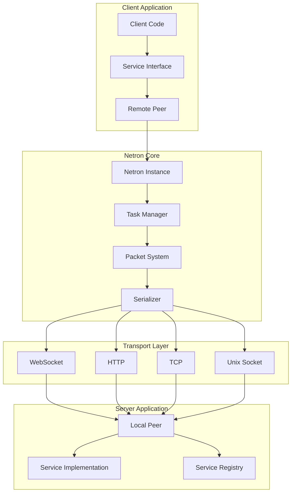

# Netron RPC Framework

## Table of Contents

- [Overview](#overview)
- [Key Features](#key-features)
- [Architecture](#architecture)
- [Core Concepts](#core-concepts)
  - [Services](#services)
  - [Peers](#peers)
  - [Interfaces](#interfaces)
  - [Tasks](#tasks)
  - [Streams](#streams)
- [Quick Start](#quick-start)
- [API Reference](#api-reference)
  - [Netron Class](#netron-class)
  - [Service Decorators](#service-decorators)
  - [Peer Types](#peer-types)
  - [Transport Layer](#transport-layer)
  - [Middleware System](#middleware-system)
- [Advanced Topics](#advanced-topics)
  - [Service Discovery](#service-discovery)
  - [Load Balancing](#load-balancing)
  - [Error Handling](#error-handling)
  - [Security](#security)
- [Configuration](#configuration)
- [Examples](#examples)
- [Best Practices](#best-practices)
- [Related Documentation](#related-documentation)

## Overview

Netron is a powerful, transport-agnostic RPC (Remote Procedure Call) framework for building distributed TypeScript applications. It provides seamless communication between services with automatic serialization, type safety, and support for multiple transport protocols.

### Design Philosophy

- **Transport Agnostic**: Works with WebSocket, HTTP, TCP, Unix sockets, and custom transports
- **Type Safe**: Full TypeScript support with compile-time type checking
- **Streaming Support**: Native support for async iterables and streaming data
- **Pluggable**: Extensible through middleware and custom transports
- **Performance**: Optimized binary protocol with MessagePack serialization

## Key Features

- 🌐 **Multiple Transports**: WebSocket, HTTP, TCP, Unix domain sockets
- 🔒 **Type Safety**: Strong typing for RPC calls and responses
- 🌊 **Streaming**: Bidirectional streaming with async iterables
- 🔄 **Auto-Reconnection**: Built-in connection recovery
- 📡 **Service Discovery**: Redis-based service registry
- ⚖️ **Load Balancing**: Client-side load balancing
- 🎭 **Middleware**: Request/response interception
- 📦 **Binary Protocol**: Efficient MessagePack serialization
- 🔍 **Service Introspection**: Runtime service discovery
- 🚀 **High Performance**: Optimized for low latency

## Architecture



## Core Concepts

### Services

Services are TypeScript classes decorated with `@Service` that expose methods for remote invocation:

```typescript
import { Service, Public } from '@omnitron-dev/titan/netron';

@Service('calculator@1.0.0')
export class CalculatorService {
  @Public()
  add(a: number, b: number): number {
    return a + b;
  }

  @Public()
  async multiply(a: number, b: number): Promise<number> {
    return a * b;
  }

  @Public()
  async *fibonacci(n: number): AsyncGenerator<number> {
    let [a, b] = [0, 1];
    for (let i = 0; i < n; i++) {
      yield a;
      [a, b] = [b, a + b];
    }
  }
}
```

### Peers

Peers represent nodes in the distributed system:

- **LocalPeer**: Represents the local node, exposes services
- **RemotePeer**: Represents a remote node, consumes services
- **HttpRemotePeer**: Special peer for HTTP-based communication

### Interfaces

Interfaces provide type-safe proxies to remote services:

```typescript
// Server exposes service
const calculator = new CalculatorService();
await netron.peer.expose(calculator);

// Client consumes service
const calc = await remotePeer.getInterface<CalculatorService>('calculator@1.0.0');
const result = await calc.add(10, 20); // Type-safe RPC call
```

### Tasks

Tasks represent asynchronous RPC operations with tracking:

```typescript
// Tasks are automatically created for RPC calls
const task = netron.peer.createTask('call', {
  service: 'calculator@1.0.0',
  method: 'add',
  args: [10, 20]
});

// Track task status
task.on('complete', (result) => {
  console.log('Result:', result);
});

task.on('error', (error) => {
  console.error('Task failed:', error);
});
```

### Streams

Native support for streaming data with async iterables:

```typescript
// Server-side streaming
@Public()
async *streamData(count: number): AsyncGenerator<Data> {
  for (let i = 0; i < count; i++) {
    yield { id: i, timestamp: Date.now() };
    await delay(100);
  }
}

// Client-side consumption
const stream = await service.streamData(100);
for await (const data of stream) {
  console.log('Received:', data);
}
```

## Quick Start

### Installation

```bash
npm install @omnitron-dev/titan
```

### Server Setup

```typescript
import { Netron } from '@omnitron-dev/titan/netron';
import { Service, Public } from '@omnitron-dev/titan/decorators';

// Define a service
@Service('greeting@1.0.0')
class GreetingService {
  @Public()
  async hello(name: string): Promise<string> {
    return `Hello, ${name}!`;
  }
}

// Create Netron instance
const netron = new Netron({
  transport: 'websocket',
  listenHost: 'localhost',
  listenPort: 8080
});

// Expose service
const service = new GreetingService();
await netron.peer.expose(service);

// Start server
await netron.listen();
console.log('Server listening on ws://localhost:8080');
```

### Client Setup

```typescript
import { Netron } from '@omnitron-dev/titan/netron';

// Create Netron instance
const netron = new Netron();

// Connect to server
const peer = await netron.connect('ws://localhost:8080');

// Get service interface
const greeting = await peer.getInterface<GreetingService>('greeting@1.0.0');

// Make RPC call
const message = await greeting.hello('World');
console.log(message); // "Hello, World!"
```

## API Reference

### Netron Class

The main class for managing distributed communication:

```typescript
class Netron extends EventEmitter {
  constructor(logger?: ILogger, options?: NetronOptions);

  // Properties
  id: string;                    // Unique instance ID
  peer: LocalPeer;               // Local peer instance
  transportServers: Map<string, ITransportServer>;  // Transport servers map

  // Core methods
  listen(): Promise<void>;       // Start server
  stop(): Promise<void>;         // Stop server
  connect(url: string, options?: ConnectOptions): Promise<RemotePeer>;
  disconnect(peer: RemotePeer): Promise<void>;

  // Service management
  expose(service: object): Promise<void>;
  unexpose(service: object): Promise<void>;

  // Event handling
  on(event: 'peer:connect', handler: (peer: RemotePeer) => void): this;
  on(event: 'peer:disconnect', handler: (peer: RemotePeer) => void): this;
  on(event: 'error', handler: (error: Error) => void): this;
}
```

#### NetronOptions

```typescript
interface NetronOptions {
  // Server options
  transport?: 'websocket' | 'http' | 'tcp' | 'unix';
  listenHost?: string;
  listenPort?: number;
  listenPath?: string;  // For Unix sockets

  // Discovery options
  discoveryEnabled?: boolean;
  discoveryRedisUrl?: string;
  discoveryInterval?: number;
  discoveryTTL?: number;

  // Connection options
  reconnect?: boolean;
  reconnectDelay?: number;
  reconnectMaxAttempts?: number;
  connectTimeout?: number;

  // Protocol options
  compression?: boolean;
  maxPacketSize?: number;

  // Security
  auth?: {
    type: 'token' | 'certificate';
    credentials: any;
  };
}
```

### Service Decorators

Decorators for defining services and methods:

```typescript
// Mark class as a service
@Service(name: string, options?: ServiceOptions)

// Mark method as public (callable via RPC)
@Public(options?: MethodOptions)

// Mark method as internal (not exposed via RPC)
@Method(options?: MethodOptions)
```

#### ServiceOptions

```typescript
interface ServiceOptions {
  version?: string;        // Service version
  description?: string;    // Service description
  tags?: string[];        // Service tags for discovery
  timeout?: number;       // Default timeout for all methods
  middleware?: Middleware[]; // Service-level middleware
}
```

### Peer Types

#### LocalPeer

Represents the local node:

```typescript
class LocalPeer extends AbstractPeer {
  // Service management
  expose(service: object, name?: string): Promise<void>;
  unexpose(service: object | string): Promise<void>;
  getExposedServices(): ServiceInfo[];

  // Event subscription
  subscribe(event: string, handler: Function): void;
  unsubscribe(event: string, handler?: Function): void;
  emit(event: string, data: any): void;

  // Direct method calls (local)
  call(service: string, method: string, args: any[]): Promise<any>;
  get(service: string, property: string): Promise<any>;
  set(service: string, property: string, value: any): Promise<void>;
}
```

#### RemotePeer

Represents a remote node:

```typescript
class RemotePeer extends AbstractPeer {
  // Connection info
  readonly id: string;
  readonly address: string;
  readonly state: ConnectionState;

  // Service discovery
  getInterface<T>(serviceName: string): Promise<T>;
  getAvailableServices(): Promise<ServiceInfo[]>;

  // Remote calls
  call(service: string, method: string, args: any[]): Promise<any>;
  get(service: string, property: string): Promise<any>;
  set(service: string, property: string, value: any): Promise<void>;

  // Connection management
  connect(): Promise<void>;
  disconnect(): Promise<void>;
  ping(): Promise<number>;  // Returns latency in ms

  // Events
  on(event: 'disconnect', handler: () => void): this;
  on(event: 'error', handler: (error: Error) => void): this;
}
```

### Transport Layer

For detailed transport documentation, see [Transport Documentation](./transport/README.md).

Supported transports:

- **WebSocket**: Full-duplex, real-time communication
- **HTTP**: Request-response pattern, REST-compatible
- **TCP**: Raw TCP sockets for high performance
- **Unix**: Unix domain sockets for local IPC

### Middleware System

For detailed middleware documentation, see [Middleware Documentation](./middleware/README.md).

Middleware allows intercepting and modifying requests/responses:

```typescript
// Global middleware
netron.use((ctx, next) => {
  console.log(`Calling ${ctx.service}.${ctx.method}`);
  return next();
});

// Service-specific middleware
netron.useForService('calculator@1.0.0', authMiddleware);

// Method-specific middleware
netron.useForMethod('calculator@1.0.0', 'multiply', rateLimitMiddleware);
```

## Advanced Topics

### Service Discovery

Redis-based service discovery for dynamic environments:

```typescript
const netron = new Netron({
  discoveryEnabled: true,
  discoveryRedisUrl: 'redis://localhost:6379',
  discoveryInterval: 5000,  // Heartbeat interval
  discoveryTTL: 15000       // Service TTL
});

// Services are automatically registered
await netron.peer.expose(service);

// Discover services
const services = await netron.discoverServices('calculator@*');
```

### Load Balancing

Client-side load balancing strategies:

```typescript
// Round-robin
const pool = new PeerPool(peers, 'round-robin');

// Least connections
const pool = new PeerPool(peers, 'least-connections');

// Random
const pool = new PeerPool(peers, 'random');

// Custom strategy
const pool = new PeerPool(peers, (peers) => {
  // Custom selection logic
  return peers[0];
});
```

### Error Handling

Comprehensive error handling with typed errors:

```typescript
import { NetronError, TimeoutError, ServiceNotFoundError } from '@omnitron-dev/titan/netron';

try {
  const result = await service.method();
} catch (error) {
  if (error instanceof TimeoutError) {
    console.error('Request timed out');
  } else if (error instanceof ServiceNotFoundError) {
    console.error('Service not available');
  } else if (error instanceof NetronError) {
    console.error('Netron error:', error.code, error.message);
  }
}
```

### Security

Built-in security features:

```typescript
// Token-based authentication
const netron = new Netron({
  auth: {
    type: 'token',
    credentials: {
      token: process.env.AUTH_TOKEN
    }
  }
});

// Certificate-based authentication
const netron = new Netron({
  auth: {
    type: 'certificate',
    credentials: {
      cert: fs.readFileSync('client.crt'),
      key: fs.readFileSync('client.key'),
      ca: fs.readFileSync('ca.crt')
    }
  }
});

// Method-level authorization
@Service('secure@1.0.0')
class SecureService {
  @Public()
  @Authorize('admin')
  async deleteUser(id: string): Promise<void> {
    // Only admins can call this
  }
}
```

## Configuration

### Environment Variables

```bash
# Server configuration
NETRON_HOST=0.0.0.0
NETRON_PORT=8080
NETRON_TRANSPORT=websocket

# Discovery
NETRON_DISCOVERY_ENABLED=true
NETRON_DISCOVERY_REDIS=redis://localhost:6379

# Security
NETRON_AUTH_TOKEN=secret-token
NETRON_TLS_ENABLED=true
NETRON_TLS_CERT=./server.crt
NETRON_TLS_KEY=./server.key
```

### Configuration File

```typescript
// netron.config.ts
export default {
  transport: 'websocket',
  server: {
    host: '0.0.0.0',
    port: 8080
  },
  discovery: {
    enabled: true,
    redis: {
      host: 'localhost',
      port: 6379
    }
  },
  security: {
    tls: {
      enabled: true,
      cert: './certs/server.crt',
      key: './certs/server.key'
    }
  },
  middleware: [
    loggingMiddleware,
    authMiddleware,
    rateLimitMiddleware
  ]
};
```

## Examples

### Microservice Communication

```typescript
// User Service
@Service('users@1.0.0')
class UserService {
  @Public()
  async getUser(id: string): Promise<User> {
    return db.users.findById(id);
  }
}

// Order Service
@Service('orders@1.0.0')
class OrderService {
  constructor(
    private users: UserServiceInterface
  ) {}

  @Public()
  async getOrderWithUser(orderId: string): Promise<OrderWithUser> {
    const order = await db.orders.findById(orderId);
    const user = await this.users.getUser(order.userId);
    return { ...order, user };
  }
}
```

### Real-time Updates

```typescript
// Server: Stream updates
@Service('updates@1.0.0')
class UpdateService {
  @Public()
  async *subscribe(topic: string): AsyncGenerator<Update> {
    const subscription = pubsub.subscribe(topic);
    try {
      for await (const message of subscription) {
        yield message;
      }
    } finally {
      subscription.unsubscribe();
    }
  }
}

// Client: Consume updates
const updates = await updateService.subscribe('user-events');
for await (const update of updates) {
  console.log('Update received:', update);
  updateUI(update);
}
```

### File Transfer

```typescript
// Server: Stream file chunks
@Service('files@1.0.0')
class FileService {
  @Public()
  async *download(path: string): AsyncGenerator<Buffer> {
    const stream = fs.createReadStream(path);
    for await (const chunk of stream) {
      yield chunk;
    }
  }

  @Public()
  async upload(filename: string, chunks: AsyncIterable<Buffer>): Promise<void> {
    const stream = fs.createWriteStream(filename);
    for await (const chunk of chunks) {
      stream.write(chunk);
    }
    stream.end();
  }
}
```

## Best Practices

### 1. Service Versioning

Always version your services to ensure compatibility:

```typescript
@Service('api@2.0.0')  // Semantic versioning
class ApiServiceV2 {
  // Breaking changes from v1
}
```

### 2. Error Handling

Implement proper error handling at all levels:

```typescript
@Service('resilient@1.0.0')
class ResilientService {
  @Public()
  async riskyOperation(): Promise<Result> {
    try {
      return await externalApi.call();
    } catch (error) {
      // Log error
      logger.error('Operation failed', error);

      // Transform to Netron error
      throw new NetronError('EXTERNAL_API_ERROR', 'External API failed', error);
    }
  }
}
```

### 3. Connection Management

Use connection pools for better performance:

```typescript
class ServiceClient {
  private pool: PeerPool;

  constructor() {
    this.pool = new PeerPool({
      min: 2,
      max: 10,
      idleTimeout: 30000
    });
  }

  async call(method: string, ...args: any[]) {
    const peer = await this.pool.acquire();
    try {
      return await peer.call('service', method, args);
    } finally {
      this.pool.release(peer);
    }
  }
}
```

### 4. Monitoring

Implement comprehensive monitoring:

```typescript
netron.on('task:start', (task) => {
  metrics.increment('rpc.calls.started');
});

netron.on('task:complete', (task) => {
  metrics.increment('rpc.calls.completed');
  metrics.histogram('rpc.duration', task.duration);
});

netron.on('task:error', (task, error) => {
  metrics.increment('rpc.calls.failed');
  alerting.notify('RPC call failed', error);
});
```

### 5. Testing

Write comprehensive tests for services:

```typescript
describe('CalculatorService', () => {
  let netron: Netron;
  let service: CalculatorService;

  beforeEach(async () => {
    netron = new Netron({ transport: 'memory' });
    service = new CalculatorService();
    await netron.peer.expose(service);
  });

  it('should add numbers correctly', async () => {
    const calc = await netron.peer.getInterface<CalculatorService>('calculator@1.0.0');
    const result = await calc.add(2, 3);
    expect(result).toBe(5);
  });
});
```

## Related Documentation

### Core Documentation

- 📚 [Transport Layer Documentation](./transport/README.md) - Comprehensive transport implementation guide
  - Pluggable transport architecture with WebSocket, HTTP, TCP, Unix socket implementations
  - Creating custom transports with step-by-step examples
  - Connection management, pooling, and state transitions
  - Performance comparison and optimization strategies

- 🔌 [HTTP Transport Guide](./transport/http/README.md) - HTTP-specific features and configuration
  - REST API mapping with automatic route generation
  - Server-Sent Events (SSE) for real-time streaming
  - CORS, compression, and security configuration
  - Request/response handling with content negotiation

- 🚀 [HTTP Interface & Retry Manager Guide](./transport/http/HTTP-INTERFACE-GUIDE.md) - **Intelligent Client Features**
  - **RetryManager**: Exponential backoff, circuit breaker, jitter, custom retry logic
  - **HttpInterface**: Fluent API for queries, caching, retries, transformations
  - **TanStack Query-like** capabilities with type-safe builder pattern
  - Complete integration examples and best practices

- 🎯 [Middleware System](./middleware/README.md) - Request/response interception and modification
  - Multi-stage pipeline architecture (PRE_PROCESS, PRE_INVOKE, POST_INVOKE, POST_PROCESS, ERROR)
  - Built-in middleware: authentication, rate limiting, caching, validation
  - Creating custom middleware with examples
  - Transport-specific middleware adapters

- 📦 [Packet Protocol](./packet/README.md) - Binary protocol specification
  - Detailed packet structure with header and payload formats
  - MessagePack serialization with custom type extensions
  - Streaming protocol implementation
  - Error handling and recovery mechanisms

- 🔧 [Core Tasks](./core-tasks/README.md) - Fundamental Netron operations
  - Capability exchange between peers (abilities)
  - Service lifecycle management (expose/unexpose)
  - Event system implementation (subscribe/emit)
  - Reference counting and cleanup

## Performance Characteristics

### Latency

- **Local calls**: < 0.1ms
- **WebSocket RPC**: 1-5ms (LAN)
- **HTTP RPC**: 5-20ms (LAN)
- **TCP RPC**: 0.5-2ms (LAN)

### Throughput

- **Small messages** (< 1KB): 10,000+ msg/sec
- **Medium messages** (1-10KB): 5,000+ msg/sec
- **Large messages** (> 100KB): 500+ msg/sec
- **Streaming**: Limited by network bandwidth

### Memory Usage

- **Base overhead**: ~10MB per Netron instance
- **Per connection**: ~100KB
- **Per service**: ~50KB
- **Message buffering**: Configurable (default 10MB)

## Troubleshooting

### Common Issues

#### Connection Refused

```typescript
// Check if server is running
netron.on('error', (error) => {
  if (error.code === 'ECONNREFUSED') {
    console.error('Server is not running on', address);
  }
});
```

#### Service Not Found

```typescript
// Verify service is exposed
const services = netron.peer.getExposedServices();
console.log('Available services:', services);

// Check service name and version
const service = await peer.getInterface('calculator@1.0.0'); // Exact match required
```

#### Timeout Errors

```typescript
// Increase timeout for long operations
const netron = new Netron({
  connectTimeout: 30000,  // 30 seconds
  defaultTimeout: 60000   // 60 seconds for RPC calls
});

// Per-call timeout
const result = await service.longOperation({ timeout: 120000 });
```

### Debug Mode

Enable debug logging for troubleshooting:

```typescript
// Enable debug mode
const netron = new Netron(logger, {
  debug: true,
  logLevel: 'trace'
});

// Custom logger
const logger = {
  trace: (...args) => console.log('[TRACE]', ...args),
  debug: (...args) => console.log('[DEBUG]', ...args),
  info: (...args) => console.log('[INFO]', ...args),
  warn: (...args) => console.warn('[WARN]', ...args),
  error: (...args) => console.error('[ERROR]', ...args)
};
```

## License

MIT - See LICENSE file for details