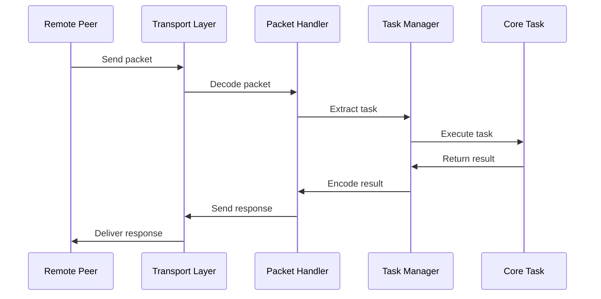

# Netron Core Tasks

## Table of Contents

- [Overview](#overview)
- [Architecture](#architecture)
- [Task Types](#task-types)
  - [Abilities Task](#abilities-task)
  - [Emit Task](#emit-task)
  - [Expose Service Task](#expose-service-task)
  - [Subscribe Task](#subscribe-task)
  - [Unsubscribe Task](#unsubscribe-task)
  - [Unexpose Service Task](#unexpose-service-task)
  - [Unref Service Task](#unref-service-task)
- [Task Registration](#task-registration)
- [Task Execution](#task-execution)
- [Error Handling](#error-handling)
- [Performance Considerations](#performance-considerations)
- [Examples](#examples)
- [Implementation Details](#implementation-details)

## Overview

Core Tasks are fundamental operations that enable peer-to-peer communication in Netron. These tasks handle essential functionality like capability exchange, service registration, event management, and service lifecycle operations.

### Purpose

Core Tasks provide:
- **Capability Exchange**: Peers discover each other's services
- **Service Management**: Register and unregister services
- **Event System**: Subscribe and emit events
- **Reference Management**: Handle service reference counting

### Design Principles

- **Minimal Dependencies**: Core tasks have minimal external dependencies
- **Idempotent Operations**: Tasks can be safely retried
- **Type Safety**: Strong typing throughout
- **Performance**: Optimized for low overhead

## Architecture

```mermaid
graph TD
    subgraph "Remote Peer"
        RP[Remote Peer]
        RT[Remote Tasks]
    end

    subgraph "Core Tasks"
        ABILITIES[abilities()]
        EMIT[emit()]
        EXPOSE[expose_service()]
        SUBSCRIBE[subscribe()]
        UNSUBSCRIBE[unsubscribe()]
        UNEXPOSE[unexpose_service()]
        UNREF[unref_service()]
    end

    subgraph "Local Peer"
        LP[Local Peer]
        SM[Service Manager]
        EM[Event Manager]
    end

    RP --> ABILITIES
    RP --> EMIT
    RP --> EXPOSE
    RP --> SUBSCRIBE

    ABILITIES --> LP
    EMIT --> EM
    EXPOSE --> SM
    SUBSCRIBE --> EM
    UNSUBSCRIBE --> EM
    UNEXPOSE --> SM
    UNREF --> SM

    style ABILITIES fill:#f9f,stroke:#333,stroke-width:2px
    style EXPOSE fill:#f9f,stroke:#333,stroke-width:2px
```

## Task Types

### Abilities Task

**File**: `abilities.ts`

Exchanges capabilities between peers during connection establishment.

#### Function Signature

```typescript
export function abilities(
  peer: RemotePeer,
  remoteAbilities?: Abilities
): Abilities
```

#### Purpose

1. Process remote peer's capabilities
2. Store remote service definitions
3. Return local peer's capabilities
4. Enable service event subscriptions

#### Abilities Structure

```typescript
interface Abilities {
  // Available services on the peer
  services: Map<string, Definition>;

  // Whether peer supports service events
  allowServiceEvents: boolean;

  // Protocol version (optional)
  version?: string;

  // Additional capabilities
  features?: string[];
}
```

#### Usage Example

```typescript
// During peer connection
const localAbilities = abilities(remotePeer, {
  services: new Map([
    ['calculator@1.0.0', calculatorDefinition],
    ['storage@1.0.0', storageDefinition]
  ]),
  allowServiceEvents: true,
  version: '1.0.0',
  features: ['streaming', 'compression']
});
```

#### Implementation Details

```typescript
export function abilities(peer: RemotePeer, remoteAbilities?: Abilities) {
  // Store remote capabilities
  if (remoteAbilities) {
    peer.abilities = remoteAbilities;

    // Setup event subscriptions if supported
    if (remoteAbilities.allowServiceEvents) {
      // Subscribe to service lifecycle events
      peer.subscribe('service:exposed');
      peer.subscribe('service:unexposed');
    }
  }

  // Build local capabilities
  const result: Abilities = {
    services: new Map<string, Definition>(),
    allowServiceEvents: peer.netron.options?.allowServiceEvents ?? false
  };

  // Add all local services
  for (const [name, stub] of peer.netron.services.entries()) {
    result.services.set(name, stub.definition);
  }

  return result;
}
```

### Emit Task

**File**: `emit.ts`

Emits events from one peer to another.

#### Function Signature

```typescript
export function emit(
  peer: RemotePeer,
  eventName: string,
  eventData?: any
): void
```

#### Purpose

1. Propagate events across peers
2. Handle both local and remote event delivery
3. Support event bubbling
4. Manage event metadata

#### Event Structure

```typescript
interface NetronEvent {
  // Event identifier
  name: string;

  // Event payload
  data?: any;

  // Event metadata
  metadata?: {
    timestamp: number;
    source: string;
    correlationId?: string;
  };

  // Propagation control
  propagate?: boolean;
  bubble?: boolean;
}
```

#### Usage Example

```typescript
// Emit a simple event
emit(peer, 'user:login', {
  userId: '123',
  timestamp: Date.now()
});

// Emit with metadata
emit(peer, 'service:call', {
  service: 'calculator',
  method: 'add',
  args: [1, 2]
});
```

#### Implementation Details

```typescript
export function emit(peer: RemotePeer, eventName: string, eventData?: any) {
  // Get the fully qualified event name
  const eventPeerName = getPeerEventName(peer.remoteId, eventName);

  // Check if this is a special internal event
  if (peer.netron.ownEvents.has(eventName)) {
    // Queue for sequential processing
    const queue = peer.netron.ownEvents.get(eventName) || [];
    queue.push({ name: eventPeerName, data: eventData });
    peer.netron.ownEvents.set(eventName, queue);
  }

  // Emit to local event system
  peer.netron.emit(eventPeerName, eventData);
  peer.netron.emit(eventName, eventData);

  // Log for debugging
  if (peer.netron.logger) {
    peer.netron.logger.debug(`Event emitted: ${eventName}`, eventData);
  }
}
```

### Expose Service Task

**File**: `expose-service.ts`

Registers a service for remote access.

#### Function Signature

```typescript
export function expose_service(
  peer: RemotePeer,
  definition: Definition
): Reference
```

#### Purpose

1. Register service with the peer
2. Create service reference
3. Enable remote method calls
4. Setup service lifecycle

#### Service Registration Process

```typescript
interface ServiceRegistration {
  // Service definition
  definition: Definition;

  // Service implementation
  implementation: any;

  // Registration metadata
  metadata: {
    exposedAt: number;
    exposedBy: string;
    version: string;
  };

  // Reference counting
  refCount: number;
}
```

#### Usage Example

```typescript
// Expose a service
const reference = expose_service(peer, {
  id: 'calculator@1.0.0',
  meta: {
    methods: {
      add: { params: ['number', 'number'], returns: 'number' },
      multiply: { params: ['number', 'number'], returns: 'number' }
    },
    properties: {
      lastResult: { type: 'number' }
    }
  }
});
```

#### Implementation Details

```typescript
export function expose_service(peer: RemotePeer, definition: Definition) {
  // Check if service already exists
  const existingStub = peer.netron.services.get(definition.id);

  if (existingStub) {
    // Increment reference count
    existingStub.refCounts.set(
      peer.id,
      (existingStub.refCounts.get(peer.id) || 0) + 1
    );
    return existingStub.reference;
  }

  // Create new service stub
  const stub = new ServiceStub(definition, peer.netron);
  stub.refCounts.set(peer.id, 1);

  // Register service
  peer.netron.services.set(definition.id, stub);

  // Emit service exposed event
  if (peer.netron.options?.allowServiceEvents) {
    peer.netron.emit('service:exposed', {
      service: definition.id,
      peer: peer.id
    });
  }

  return stub.reference;
}
```

### Subscribe Task

**File**: `subscribe.ts`

Subscribes a peer to specific events.

#### Function Signature

```typescript
export function subscribe(
  peer: RemotePeer,
  eventPattern: string | RegExp,
  options?: SubscribeOptions
): Subscription
```

#### Purpose

1. Register event listeners
2. Manage subscription lifecycle
3. Handle pattern matching
4. Support event filtering

#### Subscription Options

```typescript
interface SubscribeOptions {
  // Filter events
  filter?: (event: any) => boolean;

  // Transform events
  transform?: (event: any) => any;

  // Subscription metadata
  metadata?: Record<string, any>;

  // Auto-unsubscribe after N events
  maxEvents?: number;

  // Auto-unsubscribe after timeout
  timeout?: number;
}
```

#### Usage Example

```typescript
// Simple subscription
const subscription = subscribe(peer, 'user:*');

// Subscription with options
const sub = subscribe(peer, /^service:.*/, {
  filter: (event) => event.critical === true,
  maxEvents: 100,
  timeout: 60000
});
```

#### Implementation Details

```typescript
export function subscribe(peer: RemotePeer, eventPattern: string | RegExp, options?: SubscribeOptions) {
  // Normalize pattern
  const pattern = typeof eventPattern === 'string'
    ? new RegExp(eventPattern.replace('*', '.*'))
    : eventPattern;

  // Create subscription
  const subscription: Subscription = {
    id: generateId(),
    pattern,
    options,
    peer: peer.id,
    createdAt: Date.now(),
    eventCount: 0
  };

  // Register handler
  const handler = (eventName: string, data: any) => {
    if (!pattern.test(eventName)) return;

    // Apply filter
    if (options?.filter && !options.filter(data)) return;

    // Apply transform
    const transformed = options?.transform ? options.transform(data) : data;

    // Send to peer
    peer.send({
      type: 'event',
      subscription: subscription.id,
      name: eventName,
      data: transformed
    });

    // Update count
    subscription.eventCount++;

    // Check limits
    if (options?.maxEvents && subscription.eventCount >= options.maxEvents) {
      unsubscribe(peer, subscription.id);
    }
  };

  // Store subscription
  peer.subscriptions.set(subscription.id, { subscription, handler });

  // Register with event system
  peer.netron.on('*', handler);

  // Setup timeout
  if (options?.timeout) {
    setTimeout(() => unsubscribe(peer, subscription.id), options.timeout);
  }

  return subscription;
}
```

### Unsubscribe Task

**File**: `unsubscribe.ts`

Removes event subscriptions.

#### Function Signature

```typescript
export function unsubscribe(
  peer: RemotePeer,
  subscriptionId: string | Subscription
): boolean
```

#### Purpose

1. Remove event listeners
2. Clean up resources
3. Notify peer of unsubscription
4. Handle cascade unsubscription

#### Usage Example

```typescript
// Unsubscribe by ID
unsubscribe(peer, subscriptionId);

// Unsubscribe with subscription object
unsubscribe(peer, subscription);

// Unsubscribe all
unsubscribeAll(peer);
```

#### Implementation Details

```typescript
export function unsubscribe(peer: RemotePeer, subscriptionId: string | Subscription) {
  // Normalize input
  const id = typeof subscriptionId === 'string'
    ? subscriptionId
    : subscriptionId.id;

  // Find subscription
  const entry = peer.subscriptions.get(id);
  if (!entry) return false;

  // Remove handler
  peer.netron.off('*', entry.handler);

  // Clean up
  peer.subscriptions.delete(id);

  // Notify peer
  peer.send({
    type: 'unsubscribed',
    subscription: id
  });

  // Log
  if (peer.netron.logger) {
    peer.netron.logger.debug(`Unsubscribed: ${id}`);
  }

  return true;
}

// Helper to unsubscribe all
export function unsubscribeAll(peer: RemotePeer): number {
  const count = peer.subscriptions.size;

  for (const [id] of peer.subscriptions) {
    unsubscribe(peer, id);
  }

  return count;
}
```

### Unexpose Service Task

**File**: `unexpose-service.ts`

Removes a service from remote access.

#### Function Signature

```typescript
export function unexpose_service(
  peer: RemotePeer,
  serviceId: string
): boolean
```

#### Purpose

1. Unregister service
2. Clean up resources
3. Notify connected peers
4. Handle reference counting

#### Usage Example

```typescript
// Unexpose a service
const removed = unexpose_service(peer, 'calculator@1.0.0');

// Check if successful
if (removed) {
  console.log('Service unexposed');
}
```

#### Implementation Details

```typescript
export function unexpose_service(peer: RemotePeer, serviceId: string) {
  // Find service stub
  const stub = peer.netron.services.get(serviceId);
  if (!stub) return false;

  // Check reference count
  const refCount = stub.refCounts.get(peer.id) || 0;
  if (refCount <= 0) return false;

  // Decrement reference count
  const newCount = refCount - 1;
  stub.refCounts.set(peer.id, newCount);

  // Remove if no references remain
  if (newCount === 0) {
    stub.refCounts.delete(peer.id);

    // Check total references
    const totalRefs = Array.from(stub.refCounts.values())
      .reduce((sum, count) => sum + count, 0);

    if (totalRefs === 0) {
      // Remove service completely
      peer.netron.services.delete(serviceId);

      // Cleanup resources
      stub.cleanup();

      // Emit event
      if (peer.netron.options?.allowServiceEvents) {
        peer.netron.emit('service:unexposed', {
          service: serviceId,
          peer: peer.id
        });
      }
    }
  }

  return true;
}
```

### Unref Service Task

**File**: `unref-service.ts`

Decrements service reference count.

#### Function Signature

```typescript
export function unref_service(
  peer: RemotePeer,
  serviceId: string
): number
```

#### Purpose

1. Manage service lifecycle
2. Decrement reference count
3. Auto-cleanup at zero references
4. Support shared services

#### Reference Counting

```typescript
interface ReferenceCount {
  // Peer ID -> count mapping
  counts: Map<string, number>;

  // Total reference count
  total: number;

  // Cleanup threshold
  threshold: number;
}
```

#### Usage Example

```typescript
// Decrement reference
const remaining = unref_service(peer, 'calculator@1.0.0');

if (remaining === 0) {
  console.log('Service has no more references');
}
```

#### Implementation Details

```typescript
export function unref_service(peer: RemotePeer, serviceId: string): number {
  // Find service
  const stub = peer.netron.services.get(serviceId);
  if (!stub) return 0;

  // Get current count
  const currentCount = stub.refCounts.get(peer.id) || 0;
  if (currentCount <= 0) return 0;

  // Decrement
  const newCount = currentCount - 1;
  stub.refCounts.set(peer.id, newCount);

  // Remove peer entry if zero
  if (newCount === 0) {
    stub.refCounts.delete(peer.id);
  }

  // Calculate total
  const total = Array.from(stub.refCounts.values())
    .reduce((sum, count) => sum + count, 0);

  // Auto-cleanup if no references
  if (total === 0) {
    unexpose_service(peer, serviceId);
  }

  return total;
}
```

## Task Registration

Core tasks are registered during Netron initialization:

```typescript
class Netron {
  private registerCoreTasks() {
    // Register all core tasks
    this.taskManager.register('abilities', abilities);
    this.taskManager.register('emit', emit);
    this.taskManager.register('expose_service', expose_service);
    this.taskManager.register('subscribe', subscribe);
    this.taskManager.register('unsubscribe', unsubscribe);
    this.taskManager.register('unexpose_service', unexpose_service);
    this.taskManager.register('unref_service', unref_service);
  }
}
```

### Task Manager Integration

```typescript
class TaskManager {
  private tasks = new Map<string, TaskHandler>();

  register(name: string, handler: TaskHandler): void {
    if (this.tasks.has(name)) {
      throw new Error(`Task already registered: ${name}`);
    }
    this.tasks.set(name, handler);
  }

  async execute(name: string, peer: RemotePeer, ...args: any[]): Promise<any> {
    const handler = this.tasks.get(name);
    if (!handler) {
      throw new Error(`Unknown task: ${name}`);
    }
    return handler(peer, ...args);
  }
}
```

## Task Execution

### Execution Flow



### Error Handling

Tasks implement robust error handling:

```typescript
async function executeTask(taskName: string, peer: RemotePeer, args: any[]) {
  try {
    // Validate inputs
    validateTaskInputs(taskName, args);

    // Execute task
    const result = await taskManager.execute(taskName, peer, ...args);

    // Validate output
    validateTaskOutput(taskName, result);

    return { success: true, result };
  } catch (error) {
    // Log error
    logger.error(`Task failed: ${taskName}`, error);

    // Transform error
    const netronError = {
      code: error.code || 'TASK_ERROR',
      message: error.message,
      task: taskName,
      details: error.details
    };

    return { success: false, error: netronError };
  }
}
```

## Performance Considerations

### Task Optimization

1. **Caching**: Cache frequently accessed data
2. **Batching**: Batch multiple operations
3. **Lazy Loading**: Load resources on demand
4. **Connection Pooling**: Reuse connections

### Memory Management

```typescript
class TaskMemoryManager {
  private cache = new Map<string, any>();
  private maxCacheSize = 1000;

  set(key: string, value: any): void {
    // LRU eviction
    if (this.cache.size >= this.maxCacheSize) {
      const firstKey = this.cache.keys().next().value;
      this.cache.delete(firstKey);
    }
    this.cache.set(key, value);
  }

  get(key: string): any {
    const value = this.cache.get(key);
    if (value) {
      // Move to end (LRU)
      this.cache.delete(key);
      this.cache.set(key, value);
    }
    return value;
  }
}
```

### Task Metrics

```typescript
interface TaskMetrics {
  // Execution counts
  executions: Map<string, number>;

  // Average execution time
  avgTime: Map<string, number>;

  // Error counts
  errors: Map<string, number>;

  // Last execution time
  lastExecution: Map<string, number>;
}

class TaskMonitor {
  private metrics: TaskMetrics = {
    executions: new Map(),
    avgTime: new Map(),
    errors: new Map(),
    lastExecution: new Map()
  };

  recordExecution(task: string, duration: number, error?: Error): void {
    // Update counters
    const executions = (this.metrics.executions.get(task) || 0) + 1;
    this.metrics.executions.set(task, executions);

    // Update average time
    const currentAvg = this.metrics.avgTime.get(task) || 0;
    const newAvg = (currentAvg * (executions - 1) + duration) / executions;
    this.metrics.avgTime.set(task, newAvg);

    // Update error count
    if (error) {
      const errors = (this.metrics.errors.get(task) || 0) + 1;
      this.metrics.errors.set(task, errors);
    }

    // Update last execution
    this.metrics.lastExecution.set(task, Date.now());
  }
}
```

## Examples

### Complete Service Lifecycle

```typescript
// 1. Exchange capabilities
const abilities = await peer.executeTask('abilities', {
  services: localServices,
  allowServiceEvents: true
});

// 2. Expose a service
const reference = await peer.executeTask('expose_service', {
  id: 'api@1.0.0',
  meta: serviceMeta
});

// 3. Subscribe to events
const subscription = await peer.executeTask('subscribe', 'api:*', {
  filter: (event) => event.priority === 'high'
});

// 4. Emit events
await peer.executeTask('emit', 'api:request', {
  method: 'getData',
  timestamp: Date.now()
});

// 5. Cleanup
await peer.executeTask('unsubscribe', subscription.id);
await peer.executeTask('unexpose_service', 'api@1.0.0');
```

### Event System Example

```typescript
// Setup event handlers
const handlers = new Map<string, EventHandler>();

// Subscribe to all service events
const sub = subscribe(peer, 'service:*', {
  transform: (event) => ({
    ...event,
    receivedAt: Date.now()
  })
});

// Handle events
peer.on('event', ({ subscription, name, data }) => {
  if (subscription === sub.id) {
    const handler = handlers.get(name);
    if (handler) {
      handler(data);
    }
  }
});

// Emit service event
emit(peer, 'service:started', {
  service: 'api@1.0.0',
  timestamp: Date.now()
});
```

### Reference Counting Example

```typescript
// Multiple peers reference same service
const peer1Ref = expose_service(peer1, definition);
const peer2Ref = expose_service(peer2, definition);
const peer3Ref = expose_service(peer3, definition);

// Service has 3 references
console.log(getRefCount('service@1.0.0')); // 3

// Peer 1 releases reference
unref_service(peer1, 'service@1.0.0');
console.log(getRefCount('service@1.0.0')); // 2

// Peer 2 releases reference
unref_service(peer2, 'service@1.0.0');
console.log(getRefCount('service@1.0.0')); // 1

// Last peer releases - service is unexposed
unref_service(peer3, 'service@1.0.0');
console.log(getRefCount('service@1.0.0')); // 0 - Service removed
```

## Implementation Details

### File Structure

```
core-tasks/
├── abilities.ts       # Capability exchange
├── emit.ts           # Event emission
├── expose-service.ts # Service registration
├── subscribe.ts      # Event subscription
├── unsubscribe.ts    # Subscription removal
├── unexpose-service.ts # Service unregistration
└── unref-service.ts  # Reference management
```

### Dependencies

Core tasks depend on:

```typescript
import { RemotePeer } from '../remote-peer.js';
import { Definition } from '../definition.js';
import { Reference } from '../reference.js';
import { ServiceStub } from '../service-stub.js';
import { Abilities } from '../types.js';
import { getPeerEventName } from '../utils.js';
```

### Type Definitions

```typescript
// Task handler type
type TaskHandler = (peer: RemotePeer, ...args: any[]) => any;

// Task result type
type TaskResult<T> = {
  success: boolean;
  result?: T;
  error?: TaskError;
};

// Task error type
interface TaskError {
  code: string;
  message: string;
  task: string;
  details?: any;
}
```

### Testing Core Tasks

```typescript
describe('Core Tasks', () => {
  let peer: RemotePeer;
  let netron: Netron;

  beforeEach(() => {
    netron = new Netron();
    peer = new RemotePeer('test-peer', netron);
  });

  describe('abilities', () => {
    it('should exchange capabilities', () => {
      const result = abilities(peer, {
        services: new Map(),
        allowServiceEvents: true
      });

      expect(result.services).toBeDefined();
      expect(result.allowServiceEvents).toBeDefined();
    });
  });

  describe('expose_service', () => {
    it('should register service', () => {
      const definition = new Definition('test@1.0.0', {});
      const reference = expose_service(peer, definition);

      expect(reference).toBeDefined();
      expect(netron.services.has('test@1.0.0')).toBe(true);
    });
  });

  // ... more tests
});
```

## See Also

- [Netron Main Documentation](../README.md)
- [Task Manager](../task-manager.ts)
- [Remote Peer](../remote-peer.ts)
- [Service Stub](../service-stub.ts)
- [Packet Protocol](../packet/README.md)