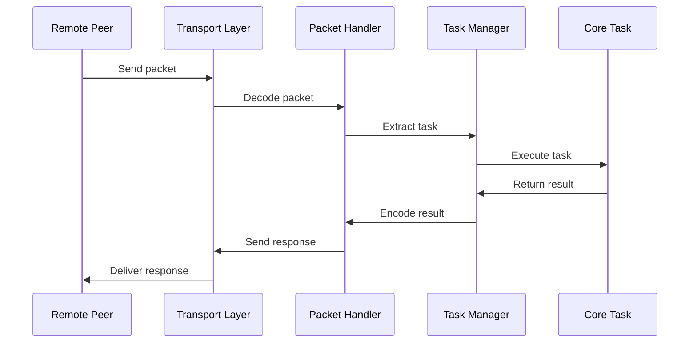

# Netron Core Tasks

## Table of Contents

- [Overview](#overview)
- [Architecture](#architecture)
- [Task Types](#task-types)
  - [Authenticate Task](#authenticate-task)
  - [Query Interface Task](#query-interface-task)
  - [Invalidate Cache Task](#invalidate-cache-task)
  - [Emit Task](#emit-task)
  - [Expose Service Task](#expose-service-task)
  - [Subscribe Task](#subscribe-task)
  - [Unsubscribe Task](#unsubscribe-task)
  - [Unexpose Service Task](#unexpose-service-task)
  - [Unref Service Task](#unref-service-task)
- [Task Registration](#task-registration)
- [Task Execution](#task-execution)
- [Error Handling](#error-handling)
- [Performance Considerations](#performance-considerations)
- [Examples](#examples)
- [Implementation Details](#implementation-details)

## Overview

Core Tasks are fundamental operations that enable peer-to-peer communication in Netron. These tasks handle essential functionality like authentication, service discovery, service registration, event management, and service lifecycle operations.

### Purpose

Core Tasks provide:
- **Authentication**: Peer authentication with credentials or tokens
- **Service Discovery**: Query service interfaces with authorization
- **Cache Management**: Invalidate cached service definitions
- **Service Management**: Register and unregister services
- **Event System**: Subscribe and emit events
- **Reference Management**: Handle service reference counting

### Design Principles

- **Minimal Dependencies**: Core tasks have minimal external dependencies
- **Idempotent Operations**: Tasks can be safely retried
- **Type Safety**: Strong typing throughout
- **Performance**: Optimized for low overhead

## Architecture

```mermaid
graph TD
    subgraph "Remote Peer"
        RP[Remote Peer]
        RT[Remote Tasks]
    end

    subgraph "Core Tasks"
        AUTH[authenticate()]
        QUERY[query_interface()]
        INVALIDATE[invalidate_cache()]
        EMIT[emit()]
        EXPOSE[expose_service()]
        SUBSCRIBE[subscribe()]
        UNSUBSCRIBE[unsubscribe()]
        UNEXPOSE[unexpose_service()]
        UNREF[unref_service()]
    end

    subgraph "Local Peer"
        LP[Local Peer]
        SM[Service Manager]
        EM[Event Manager]
        AM[Auth Manager]
    end

    RP --> AUTH
    RP --> QUERY
    RP --> INVALIDATE
    RP --> EMIT
    RP --> EXPOSE
    RP --> SUBSCRIBE

    AUTH --> AM
    QUERY --> SM
    INVALIDATE --> SM
    EMIT --> EM
    EXPOSE --> SM
    SUBSCRIBE --> EM
    UNSUBSCRIBE --> EM
    UNEXPOSE --> SM
    UNREF --> SM

    style AUTH fill:#f9f,stroke:#333,stroke-width:2px
    style QUERY fill:#f9f,stroke:#333,stroke-width:2px
    style EXPOSE fill:#f9f,stroke:#333,stroke-width:2px
```

## Task Types

### Authenticate Task

**File**: `authenticate.ts`

Handles peer authentication using credentials or tokens.

#### Function Signature

```typescript
export async function authenticate(
  peer: RemotePeer,
  credentials: AuthCredentials
): Promise<AuthResult>
```

#### Purpose

1. Validate credentials using AuthenticationManager
2. Store auth context in the RemotePeer if successful
3. Return authentication result
4. Enable authorization for subsequent requests

#### Credentials Structure

```typescript
interface AuthCredentials {
  // Username/password authentication
  username?: string;
  password?: string;

  // Token-based authentication
  token?: string;
}

interface AuthResult {
  success: boolean;
  context?: AuthContext;
  error?: string;
  metadata?: Record<string, any>;
}
```

#### Usage Example

```typescript
// Authenticate with username/password
const result = await peer.runTask('authenticate', {
  username: 'user@example.com',
  password: 'secret123'
});

// Authenticate with token
const result = await peer.runTask('authenticate', {
  token: 'eyJhbGciOiJIUzI1NiIsInR5cCI6IkpXVCJ9...'
});
```

#### Implementation Details

- Uses `AuthenticationManager` from Netron instance
- Validates credentials or tokens
- Stores `AuthContext` in the peer upon success
- Throws `TitanError` with `SERVICE_UNAVAILABLE` if auth not configured
- Returns `AuthResult` with success status and context

### Query Interface Task

**File**: `query-interface.ts`

Queries service interface with authorization checks.

#### Function Signature

```typescript
export async function query_interface(
  peer: RemotePeer,
  serviceName: string
): Promise<Definition | null>
```

#### Purpose

1. Find the requested service in the local registry
2. Check if the requesting peer has authorization to access it
3. Filter the service definition based on user permissions
4. Return the filtered definition

#### Usage Example

```typescript
// Query a service interface
const definition = await peer.runTask('query_interface', 'userService@1.0.0');

// Returns filtered definition based on user's roles/permissions
// If user lacks permissions for some methods, those methods are excluded
```

#### Implementation Details

- Searches local service registry for the requested service
- Supports wildcard version lookup (e.g., 'mathService' finds 'mathService@1.0.0')
- Uses `AuthorizationManager` to check access permissions
- Filters definition based on user's roles and permissions
- Throws `TitanError` with `NOT_FOUND` if service doesn't exist
- Throws `TitanError` with `FORBIDDEN` if user lacks permissions
- Returns full definition if authorization is not configured

### Invalidate Cache Task

**File**: `invalidate-cache.ts`

Clears cached service definitions with optional pattern matching.

#### Function Signature

```typescript
export async function invalidate_cache(
  peer: RemotePeer,
  pattern?: string
): Promise<number>
```

#### Purpose

1. Clear cached service definitions from the peer
2. Support wildcard pattern matching (e.g., "user*" matches "userService", "userAuth")
3. Return the count of invalidated entries
4. Enable cache refresh after service updates

#### Usage Example

```typescript
// Clear specific service cache
const count = await peer.runTask('invalidate_cache', 'userService@1.0.0');

// Clear all services starting with "user"
const count = await peer.runTask('invalidate_cache', 'user*');

// Clear all cached definitions
const count = await peer.runTask('invalidate_cache');
```

#### Implementation Details

- Clears `peer.services` Map entries matching the pattern
- Supports wildcard `*` for pattern matching
- If no pattern provided, clears all cached definitions
- Returns the count of invalidated cache entries
- Pattern matching uses regex conversion for flexibility

### Emit Task

**File**: `emit.ts`

Emits events from one peer to all subscribers.

#### Function Signature

```typescript
export function emit(
  peer: RemotePeer,
  eventName: string,
  ...args: any[]
): void
```

#### Purpose

1. Propagate events from one peer to all subscribers
2. Execute all registered event handlers for the given event
3. Pass arguments to each handler

#### Usage Example

```typescript
// Emit a service event with data
emit(remotePeer, 'service:update', { id: '123', status: 'active' });

// Emit with multiple arguments
emit(remotePeer, 'peer:connected', peerId, timestamp, metadata);

// Via task (no return value)
peer.runTask('emit', 'user:login', { userId: '456' });
```

#### Implementation Details

The actual implementation is minimal - it delegates to the peer's event system:

```typescript
export function emit(peer: RemotePeer, eventName: string, ...args: any[]) {
  // Retrieve handlers registered for the event name
  const handlers = peer.remoteSubscriptions.get(eventName);

  // Execute each handler with spread arguments
  if (handlers) {
    for (const handler of handlers) {
      handler(...args);
    }
  }
}
```

**Characteristics:**
- Synchronous execution
- Handlers execute immediately when event is emitted
- Multiple handlers for same event all receive the event
- No event bubbling or propagation control (unlike DOM events)

### Expose Service Task

**File**: `expose-service.ts`

Exposes a service to a remote peer.

#### Function Signature

```typescript
export function expose_service(
  peer: RemotePeer,
  meta: ServiceMetadata
): Promise<void>
```

#### Purpose

1. Expose a service to the remote peer
2. Enable remote method calls on the service
3. Bridge between core task layer and peer implementation
4. Setup service lifecycle for the remote peer

#### Usage Example

```typescript
// Expose a service to a connected peer
const serviceMeta = {
  name: 'auth',
  version: '1.0.0',
  methods: ['login', 'logout'],
  properties: ['isAuthenticated']
};
await expose_service(remotePeer, serviceMeta);
```

#### Implementation Details

- Delegates to `peer.netron.peer.exposeRemoteService(peer, meta)`
- Returns a `Promise<void>` that resolves when service is exposed
- May reject if peer is not connected or lacks permissions
- Service metadata includes name, version, methods, and properties

### Subscribe Task

**File**: `subscribe.ts`

Subscribes a peer to specific events from the local Netron instance.

#### Function Signature

```typescript
export function subscribe(
  peer: RemotePeer,
  eventName: string
): void
```

#### Purpose

1. Register event listener for a specific event
2. Forward events to the remote peer when they occur locally
3. Store subscription in peer's remote subscriptions map
4. Enable bidirectional event communication

#### Usage Example

```typescript
// Subscribe to a service update event
subscribe(remotePeer, 'service:update');

// Subscribe to user events
subscribe(remotePeer, 'user:login');

// Via task
peer.runTask('subscribe', 'service:changed');

// Later, when local peer emits:
netron.emit('service:update', { id: '123' });
// → Remote peer receives: emit('service:update', { id: '123' })
```

#### Implementation Details

```typescript
export function subscribe(peer: RemotePeer, eventName: string): void {
  // Create a handler that forwards events to the remote peer
  const handler = (...args: any[]) => {
    peer.runTask('emit', eventName, ...args);
  };

  // Store subscription for later unsubscription
  peer.remoteSubscriptions.set(eventName, handler);

  // Register with local Netron peer instance
  peer.netron.peer.subscribe(eventName, handler);
}
```

**Characteristics:**
- Creates bidirectional event channel between peers
- No pattern matching - exact event name only
- Stores handler for later unsubscription
- Idempotent within same event name (overwrites previous handler)

### Unsubscribe Task

**File**: `unsubscribe.ts`

Removes event subscriptions created by subscribe().

#### Function Signature

```typescript
export function unsubscribe(
  peer: RemotePeer,
  eventName: string
): void
```

#### Purpose

1. Remove event listeners
2. Clean up event handler resources
3. Prevent further event forwarding

#### Usage Example

```typescript
// Unsubscribe from event
unsubscribe(remotePeer, 'service:update');

// Via task
peer.runTask('unsubscribe', 'service:update');
```

#### Implementation Details

```typescript
export function unsubscribe(peer: RemotePeer, eventName: string): void {
  // Retrieve the handler stored during subscribe()
  const handler = peer.remoteSubscriptions.get(eventName);

  if (handler) {
    // Remove handler from local Netron peer instance
    peer.netron.peer.unsubscribe(eventName, handler);

    // Delete subscription from peer's remoteSubscriptions Map
    peer.remoteSubscriptions.delete(eventName);
  }
}
```

**Characteristics:**
- Idempotent - safe to call multiple times (no error if not subscribed)
- Checks for existence before unsubscription
- Proper memory cleanup by deleting Map entries
- Returns void (no status indicator)

### Unexpose Service Task

**File**: `unexpose-service.ts`

Removes a previously exposed service from a remote peer.

#### Function Signature

```typescript
export function unexpose_service(
  peer: RemotePeer,
  serviceName: string
): Promise<void>
```

#### Purpose

1. Remove a previously exposed service from remote peer
2. Clean up service resources
3. Disable remote method calls

#### Usage Example

```typescript
// Unexpose a service
await unexpose_service(remotePeer, 'auth');

// Or via task
await peer.runTask('unexpose_service', 'auth');
```

#### Implementation Details

The actual implementation is minimal - it delegates to the LocalPeer:

```typescript
export function unexpose_service(
  peer: RemotePeer,
  serviceName: string
): Promise<void> {
  return peer.netron.peer.unexposeRemoteService(peer, serviceName);
}
```

**Characteristics:**
- Asynchronous operation
- May reject if service not exposed or peer lacks permissions
- Resource cleanup after promise resolves
- Counterpart to expose_service()

### Unref Service Task

**File**: `unref-service.ts`

Removes a service reference from a remote peer.

#### Function Signature

```typescript
export function unref_service(
  peer: RemotePeer,
  defId: string
): void
```

#### Purpose

1. Remove service reference from remote peer
2. Clean up service references when no longer needed
3. Prevent memory leaks
4. Ensure proper resource management

#### Usage Example

```typescript
// Remove a service reference from a connected peer
unref_service(remotePeer, 'auth-service-123');
```

#### Implementation Details

- Delegates to `peer.netron.peer.unrefService(defId)`
- Returns void (no return value)
- Idempotent operation - can be safely called multiple times
- Used for cleanup when services are no longer needed

## Task Registration

Core tasks are registered during Netron initialization using the `addTask` method:

```typescript
class Netron {
  private registerCoreTasks() {
    // Register all 9 core tasks
    this.taskManager.addTask(authenticate as Task);
    this.taskManager.addTask(query_interface as Task);
    this.taskManager.addTask(invalidate_cache as Task);
    this.taskManager.addTask(emit as Task);
    this.taskManager.addTask(expose_service as Task);
    this.taskManager.addTask(subscribe as Task);
    this.taskManager.addTask(unsubscribe as Task);
    this.taskManager.addTask(unexpose_service as Task);
    this.taskManager.addTask(unref_service as Task);
  }
}
```

### Task Manager Integration

```typescript
class TaskManager {
  private tasks = new Map<string, Task>();

  addTask(fn: Task): string {
    // Task function name is used as task identifier
    const taskName = fn.name;
    if (this.tasks.has(taskName)) {
      throw new Error(`Task already registered: ${taskName}`);
    }
    this.tasks.set(taskName, fn);
    return taskName;
  }

  async execute(name: string, peer: RemotePeer, ...args: any[]): Promise<any> {
    const handler = this.tasks.get(name);
    if (!handler) {
      throw new Error(`Unknown task: ${name}`);
    }
    return handler(peer, ...args);
  }
}
```

## Task Execution

### Execution Flow


```mermaid
sequenceDiagram
    participant Remote as Remote Peer
    participant Transport as Transport Layer
    participant Packet as Packet Handler
    participant Task as Task Manager
    participant CoreTask as Core Task

    Remote->>Transport: Send packet
    Transport->>Packet: Decode packet
    Packet->>Task: Extract task
    Task->>CoreTask: Execute task
    CoreTask->>Task: Return result
    Task->>Packet: Encode result
    Packet->>Transport: Send response
    Transport->>Remote: Deliver response
```

### Error Handling

Tasks implement robust error handling:

```typescript
async function executeTask(taskName: string, peer: RemotePeer, args: any[]) {
  try {
    // Validate inputs
    validateTaskInputs(taskName, args);

    // Execute task
    const result = await taskManager.execute(taskName, peer, ...args);

    // Validate output
    validateTaskOutput(taskName, result);

    return { success: true, result };
  } catch (error) {
    // Log error
    logger.error(`Task failed: ${taskName}`, error);

    // Transform error
    const netronError = {
      code: error.code || 'TASK_ERROR',
      message: error.message,
      task: taskName,
      details: error.details
    };

    return { success: false, error: netronError };
  }
}
```

## Performance Considerations

### Task Optimization

1. **Caching**: Cache frequently accessed data
2. **Batching**: Batch multiple operations
3. **Lazy Loading**: Load resources on demand
4. **Connection Pooling**: Reuse connections

### Memory Management

```typescript
class TaskMemoryManager {
  private cache = new Map<string, any>();
  private maxCacheSize = 1000;

  set(key: string, value: any): void {
    // LRU eviction
    if (this.cache.size >= this.maxCacheSize) {
      const firstKey = this.cache.keys().next().value;
      this.cache.delete(firstKey);
    }
    this.cache.set(key, value);
  }

  get(key: string): any {
    const value = this.cache.get(key);
    if (value) {
      // Move to end (LRU)
      this.cache.delete(key);
      this.cache.set(key, value);
    }
    return value;
  }
}
```

### Task Metrics

```typescript
interface TaskMetrics {
  // Execution counts
  executions: Map<string, number>;

  // Average execution time
  avgTime: Map<string, number>;

  // Error counts
  errors: Map<string, number>;

  // Last execution time
  lastExecution: Map<string, number>;
}

class TaskMonitor {
  private metrics: TaskMetrics = {
    executions: new Map(),
    avgTime: new Map(),
    errors: new Map(),
    lastExecution: new Map()
  };

  recordExecution(task: string, duration: number, error?: Error): void {
    // Update counters
    const executions = (this.metrics.executions.get(task) || 0) + 1;
    this.metrics.executions.set(task, executions);

    // Update average time
    const currentAvg = this.metrics.avgTime.get(task) || 0;
    const newAvg = (currentAvg * (executions - 1) + duration) / executions;
    this.metrics.avgTime.set(task, newAvg);

    // Update error count
    if (error) {
      const errors = (this.metrics.errors.get(task) || 0) + 1;
      this.metrics.errors.set(task, errors);
    }

    // Update last execution
    this.metrics.lastExecution.set(task, Date.now());
  }
}
```

## Examples

### Complete Service Lifecycle

```typescript
// 1. Authenticate the peer
const authResult = await peer.runTask('authenticate', {
  username: 'user@example.com',
  password: 'secret123'
});

// 2. Query available service interfaces
const definition = await peer.runTask('query_interface', 'api@1.0.0');

// 3. Expose a service
await peer.runTask('expose_service', {
  name: 'api',
  version: '1.0.0',
  methods: ['getData', 'setData']
});

// 4. Subscribe to events
peer.runTask('subscribe', 'api:request');

// 5. Emit events
await peer.runTask('emit', 'api:request', {
  method: 'getData',
  timestamp: Date.now()
});

// 6. Invalidate cache when service is updated
const count = await peer.runTask('invalidate_cache', 'api*');

// 7. Cleanup
await peer.runTask('unsubscribe', 'api:request');
await peer.runTask('unexpose_service', 'api');
peer.runTask('unref_service', 'api-def-id');
```

### Event System Example

```typescript
// Subscribe to specific events
subscribe(peer, 'service:started');
subscribe(peer, 'service:stopped');
subscribe(peer, 'user:login');

// Emit events to subscribers
emit(peer, 'service:started', {
  service: 'api@1.0.0',
  timestamp: Date.now()
});

emit(peer, 'user:login', {
  userId: '123',
  username: 'john.doe'
});

// Unsubscribe when no longer needed
unsubscribe(peer, 'service:started');
```

### Authentication and Authorization Example

```typescript
// Authenticate a peer with username/password
const authResult = await peer.runTask('authenticate', {
  username: 'admin@example.com',
  password: 'securePassword123'
});

if (authResult.success) {
  console.log('Authenticated:', authResult.context.userId);

  // Query service interface - filtered by user permissions
  const definition = await peer.runTask('query_interface', 'adminService@1.0.0');
  console.log('Available methods:', Object.keys(definition.meta.methods));
} else {
  console.error('Authentication failed:', authResult.error);
}

// Authenticate with token
const tokenAuth = await peer.runTask('authenticate', {
  token: 'eyJhbGciOiJIUzI1NiIsInR5cCI6IkpXVCJ9...'
});
```

### Cache Management Example

```typescript
// Invalidate specific service cache
const count1 = await peer.runTask('invalidate_cache', 'userService@1.0.0');
console.log(`Invalidated ${count1} cache entries`);

// Invalidate all services matching pattern
const count2 = await peer.runTask('invalidate_cache', 'user*');
console.log(`Invalidated ${count2} cache entries for user* pattern`);

// Invalidate all cached definitions
const count3 = await peer.runTask('invalidate_cache');
console.log(`Invalidated all ${count3} cache entries`);
```

## Implementation Details

### File Structure

```
core-tasks/
├── authenticate.ts        # Peer authentication
├── query-interface.ts     # Service discovery with authorization
├── invalidate-cache.ts    # Cache management
├── emit.ts               # Event emission
├── expose-service.ts     # Service registration
├── subscribe.ts          # Event subscription
├── unsubscribe.ts        # Subscription removal
├── unexpose-service.ts   # Service unregistration
└── unref-service.ts      # Reference management
```

### Dependencies

Core tasks depend on:

```typescript
import { RemotePeer } from '../remote-peer.js';
import { Definition } from '../definition.js';
import { ServiceStub } from '../service-stub.js';
import { ServiceMetadata, AuthCredentials, AuthResult } from '../types.js';
import { TitanError, ErrorCode } from '../../errors/index.js';
import { getPeerEventName } from '../utils.js';
```

### Type Definitions

```typescript
// Task handler type
type TaskHandler = (peer: RemotePeer, ...args: any[]) => any;

// Task result type
type TaskResult<T> = {
  success: boolean;
  result?: T;
  error?: TaskError;
};

// Task error type
interface TaskError {
  code: string;
  message: string;
  task: string;
  details?: any;
}
```

### Testing Core Tasks

```typescript
describe('Core Tasks', () => {
  let peer: RemotePeer;
  let netron: Netron;

  beforeEach(() => {
    netron = new Netron();
    peer = new RemotePeer('test-peer', netron);
  });

  describe('authenticate', () => {
    it('should authenticate with valid credentials', async () => {
      const result = await authenticate(peer, {
        username: 'test@example.com',
        password: 'password123'
      });

      expect(result.success).toBe(true);
      expect(result.context).toBeDefined();
    });
  });

  describe('query_interface', () => {
    it('should return filtered service definition', async () => {
      const definition = await query_interface(peer, 'testService@1.0.0');

      expect(definition).toBeDefined();
      expect(definition.meta).toBeDefined();
    });
  });

  describe('invalidate_cache', () => {
    it('should invalidate cache entries', async () => {
      const count = await invalidate_cache(peer, 'test*');

      expect(count).toBeGreaterThanOrEqual(0);
    });
  });

  // ... more tests
});
```

## See Also

- [Netron Main Documentation](../README.md)
- [Task Manager](../task-manager.ts)
- [Remote Peer](../remote-peer.ts)
- [Service Stub](../service-stub.ts)
- [Packet Protocol](../packet/README.md)