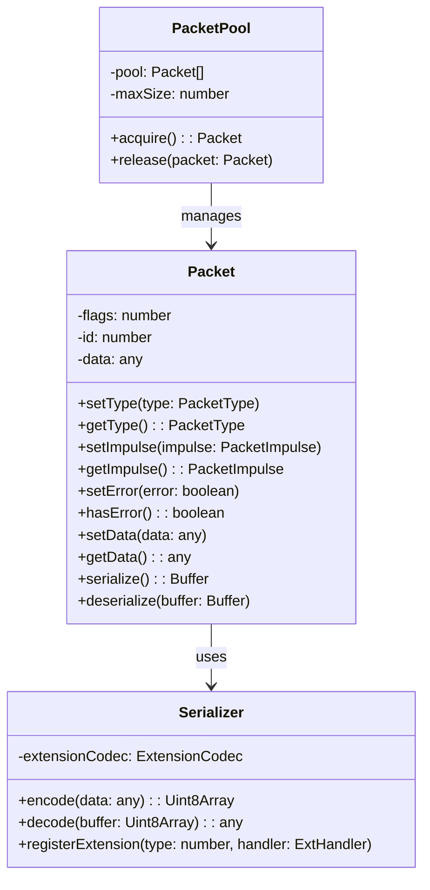

# Netron Packet Protocol

## Table of Contents

- [Overview](#overview)
- [Packet Structure](#packet-structure)
  - [Binary Format](#binary-format)
  - [Header Fields](#header-fields)
  - [Payload Format](#payload-format)
- [Packet Types](#packet-types)
- [Serialization](#serialization)
  - [MessagePack Protocol](#messagepack-protocol)
  - [Type Mapping](#type-mapping)
  - [Custom Types](#custom-types)
- [Streaming Protocol](#streaming-protocol)
  - [Stream Initialization](#stream-initialization)
  - [Data Transmission](#data-transmission)
  - [Stream Termination](#stream-termination)
- [Error Handling](#error-handling)
- [Performance Optimizations](#performance-optimizations)
- [Examples](#examples)
- [Protocol Versioning](#protocol-versioning)
- [Security Considerations](#security-considerations)

## Overview

The Netron Packet Protocol is a binary protocol designed for efficient RPC communication. It uses MessagePack for serialization and implements a compact header structure for minimal overhead while maintaining flexibility and extensibility.

### Design Goals

- **Efficiency**: Minimal overhead with binary encoding
- **Type Safety**: Strong typing with serialization validation
- **Streaming Support**: Native support for async iterables
- **Error Recovery**: Built-in error handling and recovery
- **Extensibility**: Support for custom types and future extensions

## Packet Structure

### Binary Format

Each packet consists of a header and optional payload:

```
┌─────────────────────────────────────────────┐
│                   HEADER                    │
├─────────┬────────┬──────────┬───────────────┤
│  FLAGS  │   ID   │  LENGTH  │   CHECKSUM    │
│ (1 byte)│(4 bytes)│(4 bytes) │   (4 bytes)   │
├─────────┴────────┴──────────┴───────────────┤
│                   PAYLOAD                   │
│              (Variable Length)               │
└─────────────────────────────────────────────┘
```

### Header Fields

#### FLAGS (8 bits)

The flags byte contains control information:

```
Bit 7   6   5   4   3   2   1   0
┌───┬───┬───┬───┬───┬───┬───┬───┐
│ERR│IMP│LIV│EOS│  TYPE (4 bits) │
└───┴───┴───┴───┴───┴───┴───┴───┘

ERR (bit 7): Error flag
IMP (bit 6): Impulse (0=Response, 1=Request)
LIV (bit 5): Live stream flag
EOS (bit 4): End of stream flag
TYPE (bits 0-3): Packet type
```

**Detailed Flag Descriptions:**

- **ERR (Error Flag)**: Indicates packet contains error information
- **IMP (Impulse)**: Distinguishes requests (1) from responses (0)
- **LIV (Live Stream)**: Indicates ongoing streaming data
- **EOS (End of Stream)**: Marks the final packet in a stream
- **TYPE**: 4-bit field for packet type (0x00-0x0F)

#### ID (32 bits)

Unique packet identifier for correlation:

- **Request packets**: Generate new ID
- **Response packets**: Echo request ID
- **Stream packets**: Share common stream ID

#### LENGTH (32 bits)

Payload size in bytes (0 to 4,294,967,295)

#### CHECKSUM (32 bits)

CRC32 checksum of payload for integrity verification

### Payload Format

Payloads are MessagePack-encoded arrays with type-specific structures:

#### Basic RPC Structure

```typescript
// Request payload
[
  service: string,    // Service identifier
  method: string,     // Method name
  args: any[]        // Method arguments
]

// Response payload
[
  result: any,       // Method result
  error?: Error      // Optional error
]
```

## Packet Types

### Core Types

```typescript
// Type definitions from types.ts
export const TYPE_PING = 0x00;         // Health check
export const TYPE_GET = 0x01;          // Property getter
export const TYPE_SET = 0x02;          // Property setter
export const TYPE_CALL = 0x03;         // Method invocation
export const TYPE_TASK = 0x04;         // Task execution
export const TYPE_STREAM = 0x05;       // Streaming data
export const TYPE_STREAM_ERROR = 0x06; // Stream error
export const TYPE_STREAM_CLOSE = 0x07; // Stream closure
```

### Type Details

#### TYPE_PING (0x00)

Health check and latency measurement:

```typescript
// Request
{
  impulse: 1,
  type: TYPE_PING,
  payload: [timestamp: number]
}

// Response
{
  impulse: 0,
  type: TYPE_PING,
  payload: [timestamp: number, serverTime: number]
}
```

#### TYPE_GET (0x01)

Property retrieval:

```typescript
// Request
{
  impulse: 1,
  type: TYPE_GET,
  payload: [
    service: string,
    property: string
  ]
}

// Response
{
  impulse: 0,
  type: TYPE_GET,
  payload: [value: any]
}
```

#### TYPE_SET (0x02)

Property modification:

```typescript
// Request
{
  impulse: 1,
  type: TYPE_SET,
  payload: [
    service: string,
    property: string,
    value: any
  ]
}

// Response
{
  impulse: 0,
  type: TYPE_SET,
  payload: [success: boolean]
}
```

#### TYPE_CALL (0x03)

Remote method invocation:

```typescript
// Request
{
  impulse: 1,
  type: TYPE_CALL,
  payload: [
    service: string,
    method: string,
    args: any[]
  ]
}

// Response
{
  impulse: 0,
  type: TYPE_CALL,
  payload: [result: any]
}
```

#### TYPE_TASK (0x04)

Task execution:

```typescript
// Request
{
  impulse: 1,
  type: TYPE_TASK,
  payload: [
    taskName: string,
    params: any
  ]
}

// Response
{
  impulse: 0,
  type: TYPE_TASK,
  payload: [
    taskId: string,
    status: 'queued' | 'running' | 'completed' | 'failed'
  ]
}
```

#### TYPE_STREAM (0x05)

Streaming data chunk:

```typescript
{
  type: TYPE_STREAM,
  flags: {
    live: boolean,     // Ongoing stream
    eos: boolean       // End of stream
  },
  payload: [
    streamId: string,
    sequenceNumber: number,
    data: any
  ]
}
```

#### TYPE_STREAM_ERROR (0x06)

Stream error notification:

```typescript
{
  type: TYPE_STREAM_ERROR,
  payload: [
    streamId: string,
    error: {
      code: string,
      message: string,
      details?: any
    }
  ]
}
```

#### TYPE_STREAM_CLOSE (0x07)

Stream closure notification:

```typescript
{
  type: TYPE_STREAM_CLOSE,
  payload: [
    streamId: string,
    reason?: string
  ]
}
```

## Serialization

### MessagePack Protocol

Netron uses MessagePack for efficient binary serialization:

```typescript
import * as msgpack from '@msgpack/msgpack';

// Serialization
const encoded = msgpack.encode(data);

// Deserialization
const decoded = msgpack.decode(buffer);
```

### Type Mapping

#### JavaScript to MessagePack

| JavaScript Type | MessagePack Type | Size |
|----------------|------------------|------|
| null | nil | 1 byte |
| boolean | bool | 1 byte |
| number (int) | int8-64 | 1-9 bytes |
| number (float) | float32/64 | 5/9 bytes |
| string | str | 1-5 + length |
| Buffer | bin | 1-5 + length |
| Array | array | 1-5 + items |
| Object | map | 1-5 + pairs |
| Date | ext (type 0) | Variable |
| RegExp | ext (type 1) | Variable |
| Reference | ext (type 2) | Variable |
| Definition | ext (type 3) | Variable |
| StreamRef | ext (type 4) | Variable |

### Custom Types

#### Service Reference

Serialized as MessagePack extension type 2:

```typescript
class Reference {
  id: string;
  meta: {
    methods: Record<string, any>;
    properties: Record<string, any>;
  };
}

// Serialization
const ext = new ExtensionCodec();
ext.register({
  type: 2,
  encode: (ref: Reference) => {
    return msgpack.encode([ref.id, ref.meta]);
  },
  decode: (data: Uint8Array) => {
    const [id, meta] = msgpack.decode(data);
    return new Reference(id, meta);
  }
});
```

#### Service Definition

Serialized as MessagePack extension type 3:

```typescript
class Definition {
  id: string;
  meta: ServiceMetadata;
}

// Extension registration
ext.register({
  type: 3,
  encode: (def: Definition) => {
    return msgpack.encode([def.id, def.meta]);
  },
  decode: (data: Uint8Array) => {
    const [id, meta] = msgpack.decode(data);
    return new Definition(id, meta);
  }
});
```

#### Stream Reference

Serialized as MessagePack extension type 4:

```typescript
class StreamReference {
  streamId: string;
  metadata: Record<string, any>;
}

// Extension registration
ext.register({
  type: 4,
  encode: (stream: StreamReference) => {
    return msgpack.encode([stream.streamId, stream.metadata]);
  },
  decode: (data: Uint8Array) => {
    const [streamId, metadata] = msgpack.decode(data);
    return new StreamReference(streamId, metadata);
  }
});
```

## Streaming Protocol

### Stream Initialization

Starting a new stream:

```typescript
// 1. Send stream initialization
const initPacket = new Packet();
initPacket.setType(TYPE_CALL);
initPacket.setImpulse(1);
initPacket.setData([
  'service',
  'streamMethod',
  [args]
]);

// 2. Receive stream reference
const response = await send(initPacket);
const streamRef = response.getData()[0]; // StreamReference

// 3. Start receiving stream packets
```

### Data Transmission

Stream data flow:

```typescript
// Stream packet structure
interface StreamPacket {
  type: TYPE_STREAM;
  flags: {
    live: true,    // Stream is active
    eos: false     // Not end of stream
  };
  payload: [
    streamId: string,
    sequence: number,
    chunk: any
  ];
}

// Sending stream data
async function* sendStream(data: AsyncIterable<any>) {
  let sequence = 0;
  for await (const chunk of data) {
    const packet = new Packet();
    packet.setType(TYPE_STREAM);
    packet.setLive(true);
    packet.setData([streamId, sequence++, chunk]);
    yield packet;
  }

  // Send end-of-stream
  const endPacket = new Packet();
  endPacket.setType(TYPE_STREAM);
  endPacket.setEOS(true);
  endPacket.setData([streamId, sequence, null]);
  yield endPacket;
}
```

### Stream Termination

Proper stream cleanup:

```typescript
// Normal termination
const closePacket = new Packet();
closePacket.setType(TYPE_STREAM_CLOSE);
closePacket.setData([streamId, 'completed']);

// Error termination
const errorPacket = new Packet();
errorPacket.setType(TYPE_STREAM_ERROR);
errorPacket.setData([
  streamId,
  {
    code: 'STREAM_ERROR',
    message: 'Unexpected error',
    details: error
  }
]);
```

### Backpressure Handling

Managing stream flow control:

```typescript
class StreamController {
  private buffer: any[] = [];
  private maxBuffer = 100;
  private paused = false;

  async write(chunk: any): Promise<void> {
    if (this.buffer.length >= this.maxBuffer) {
      this.paused = true;
      await this.drain();
    }
    this.buffer.push(chunk);
  }

  async drain(): Promise<void> {
    while (this.buffer.length > this.maxBuffer / 2) {
      await new Promise(resolve => setTimeout(resolve, 10));
    }
    this.paused = false;
  }
}
```

## Error Handling

### Error Packet Structure

```typescript
interface ErrorPacket {
  flags: {
    error: true
  };
  payload: {
    code: string;
    message: string;
    stack?: string;
    details?: any;
  };
}
```

### Error Codes

Standard error codes:

```typescript
enum ErrorCode {
  // Protocol errors
  INVALID_PACKET = 'E001',
  CHECKSUM_MISMATCH = 'E002',
  UNSUPPORTED_TYPE = 'E003',
  SERIALIZATION_ERROR = 'E004',

  // Service errors
  SERVICE_NOT_FOUND = 'E101',
  METHOD_NOT_FOUND = 'E102',
  INVALID_ARGUMENTS = 'E103',
  EXECUTION_ERROR = 'E104',

  // Stream errors
  STREAM_NOT_FOUND = 'E201',
  STREAM_CLOSED = 'E202',
  STREAM_ERROR = 'E203',
  STREAM_TIMEOUT = 'E204',

  // Connection errors
  CONNECTION_LOST = 'E301',
  TIMEOUT = 'E302',
  RATE_LIMITED = 'E303'
}
```

### Error Recovery

Implementing error recovery:

```typescript
class PacketHandler {
  async handlePacket(packet: Packet): Promise<void> {
    try {
      // Verify checksum
      if (!packet.verifyChecksum()) {
        throw new Error(ErrorCode.CHECKSUM_MISMATCH);
      }

      // Process packet
      await this.process(packet);
    } catch (error) {
      // Send error response
      const errorPacket = new Packet();
      errorPacket.setError(true);
      errorPacket.setImpulse(0);
      errorPacket.setId(packet.getId());
      errorPacket.setData({
        code: error.code || ErrorCode.EXECUTION_ERROR,
        message: error.message,
        stack: error.stack
      });

      await this.send(errorPacket);
    }
  }
}
```

## Performance Optimizations

### Packet Pooling

Reuse packet instances:

```typescript
class PacketPool {
  private pool: Packet[] = [];
  private maxSize = 100;

  acquire(): Packet {
    if (this.pool.length > 0) {
      const packet = this.pool.pop()!;
      packet.reset();
      return packet;
    }
    return new Packet();
  }

  release(packet: Packet): void {
    if (this.pool.length < this.maxSize) {
      packet.reset();
      this.pool.push(packet);
    }
  }
}
```

### Buffer Management

Efficient buffer operations:

```typescript
class BufferManager {
  private buffers: ArrayBuffer[] = [];
  private currentBuffer?: ArrayBuffer;
  private offset = 0;

  write(data: Uint8Array): void {
    if (!this.currentBuffer || this.offset + data.length > this.currentBuffer.byteLength) {
      this.currentBuffer = new ArrayBuffer(65536); // 64KB
      this.buffers.push(this.currentBuffer);
      this.offset = 0;
    }

    new Uint8Array(this.currentBuffer, this.offset).set(data);
    this.offset += data.length;
  }

  getBuffer(): ArrayBuffer {
    // Combine all buffers
    const totalSize = this.buffers.reduce((sum, buf) => sum + buf.byteLength, 0);
    const result = new ArrayBuffer(totalSize);
    let offset = 0;

    for (const buffer of this.buffers) {
      new Uint8Array(result, offset).set(new Uint8Array(buffer));
      offset += buffer.byteLength;
    }

    return result;
  }
}
```

### Compression

Optional payload compression:

```typescript
import { compress, decompress } from 'lz4';

class CompressedPacket extends Packet {
  setCompressedData(data: any): void {
    const serialized = msgpack.encode(data);

    if (serialized.length > 1024) { // Compress if > 1KB
      const compressed = compress(serialized);
      this.setData(compressed);
      this.setCompressed(true);
    } else {
      this.setData(serialized);
      this.setCompressed(false);
    }
  }

  getCompressedData(): any {
    const data = this.getData();

    if (this.isCompressed()) {
      const decompressed = decompress(data);
      return msgpack.decode(decompressed);
    }

    return msgpack.decode(data);
  }
}
```

## Examples

### Basic RPC Call

```typescript
// Client side
const packet = new Packet();
packet.setType(TYPE_CALL);
packet.setImpulse(1);
packet.setId(generateId());
packet.setData([
  'calculator@1.0.0',
  'add',
  [10, 20]
]);

const response = await connection.sendPacket(packet);
const result = response.getData()[0]; // 30
```

### Streaming Example

```typescript
// Server side - streaming method
async *streamData(count: number): AsyncGenerator<number> {
  for (let i = 0; i < count; i++) {
    yield i;
    await delay(100);
  }
}

// Client side - consuming stream
const streamRef = await service.streamData(10);
for await (const value of streamRef) {
  console.log('Received:', value);
}
```

### Error Handling Example

```typescript
try {
  const packet = new Packet();
  packet.setType(TYPE_CALL);
  packet.setData(['service', 'method', []]);

  const response = await send(packet);

  if (response.hasError()) {
    const error = response.getData();
    throw new Error(`${error.code}: ${error.message}`);
  }

  return response.getData()[0];
} catch (error) {
  console.error('RPC failed:', error);
}
```

## Protocol Versioning

### Version Negotiation

Protocol version is negotiated during connection:

```typescript
// Initial handshake
{
  type: 'handshake',
  version: '1.0.0',
  capabilities: ['compression', 'streaming', 'binary']
}

// Version response
{
  type: 'handshake_ack',
  version: '1.0.0',  // Agreed version
  selectedCapabilities: ['streaming', 'binary']
}
```

### Backward Compatibility

Maintaining compatibility:

```typescript
class ProtocolHandler {
  private handlers = new Map<string, PacketHandler>();

  constructor() {
    this.handlers.set('1.0.0', new HandlerV1());
    this.handlers.set('1.1.0', new HandlerV1_1());
    this.handlers.set('2.0.0', new HandlerV2());
  }

  handle(packet: Packet, version: string): void {
    const handler = this.handlers.get(version) || this.handlers.get('1.0.0');
    handler.handle(packet);
  }
}
```

## Security Considerations

### Packet Validation

Always validate incoming packets:

```typescript
class PacketValidator {
  validate(packet: Packet): void {
    // Check packet size
    if (packet.size > MAX_PACKET_SIZE) {
      throw new Error('Packet too large');
    }

    // Verify checksum
    if (!packet.verifyChecksum()) {
      throw new Error('Invalid checksum');
    }

    // Validate type
    if (!isValidType(packet.getType())) {
      throw new Error('Invalid packet type');
    }

    // Check payload structure
    this.validatePayload(packet);
  }

  private validatePayload(packet: Packet): void {
    const data = packet.getData();

    // Type-specific validation
    switch (packet.getType()) {
      case TYPE_CALL:
        if (!Array.isArray(data) || data.length !== 3) {
          throw new Error('Invalid CALL payload');
        }
        break;
      // ... other types
    }
  }
}
```

### Rate Limiting

Prevent packet flooding:

```typescript
class PacketRateLimiter {
  private counts = new Map<string, number>();
  private resetTime = Date.now() + 60000;

  check(source: string): boolean {
    if (Date.now() > this.resetTime) {
      this.counts.clear();
      this.resetTime = Date.now() + 60000;
    }

    const count = this.counts.get(source) || 0;
    if (count > 1000) { // 1000 packets per minute
      return false;
    }

    this.counts.set(source, count + 1);
    return true;
  }
}
```

### Input Sanitization

Sanitize packet data:

```typescript
class PacketSanitizer {
  sanitize(data: any): any {
    if (typeof data === 'string') {
      // Remove control characters
      return data.replace(/[\x00-\x1F\x7F]/g, '');
    }

    if (Array.isArray(data)) {
      return data.map(item => this.sanitize(item));
    }

    if (data && typeof data === 'object') {
      const sanitized: any = {};
      for (const [key, value] of Object.entries(data)) {
        sanitized[this.sanitize(key)] = this.sanitize(value);
      }
      return sanitized;
    }

    return data;
  }
}
```

## Implementation Files

### Core Files

- `packet.ts` - Main Packet class implementation
- `types.ts` - Type definitions and constants
- `serializer.ts` - MessagePack serialization logic
- `index.ts` - Module exports

### Class Hierarchy



## See Also

- [Netron Main Documentation](../README.md)
- [Transport Layer](../transport/README.md)
- [Core Tasks](../core-tasks/README.md)
- [Serialization Guide](./serializer.ts)