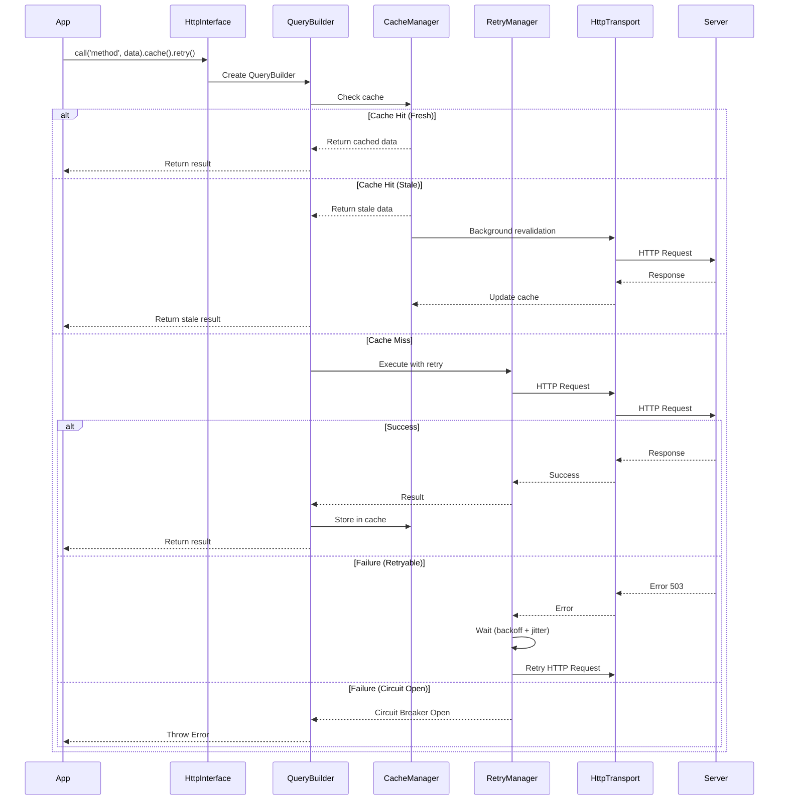

# HTTP Interface & Retry Manager - Complete Guide

> **Comprehensive documentation for Titan's HTTP transport intelligent client features**
> **Status**: Enterprise Grade - Enhanced Fluent API Available!
> **Last Updated**: 2025-10-08

---

## 🎉 New: Enhanced Fluent API

**The recommended way to use HTTP transport is now the Enhanced Fluent API!**

```typescript
// ✨ NEW: Natural Netron-style calls
const user = await userService
  .cache(60000)
  .retry(3)
  .getUser('user-123');

// 📖 See: FLUENT-API-GUIDE.md for complete documentation
```

---

## Table of Contents

1. [Overview](#overview)
2. [Quick Start](#quick-start)
3. [Enhanced Fluent API (NEW!)](#enhanced-fluent-api)
   - [Creating Fluent Interfaces](#creating-fluent-interfaces)
   - [Configuration Methods](#configuration-methods)
   - [Advanced Features](#advanced-features)
   - [Migration from HttpInterface](#migration-from-httpinterface)
4. [Architecture](#architecture)
5. [RetryManager](#retrymanager)
   - [Features](#retry-features)
   - [Configuration](#retry-configuration)
   - [Circuit Breaker](#circuit-breaker)
   - [Examples](#retry-examples)
6. [HttpInterface (Legacy)](#httpinterface)
   - [Fluent API](#fluent-api)
   - [QueryBuilder](#querybuilder)
   - [Integration](#integration)
   - [Examples](#interface-examples)
7. [Complete Integration Examples](#complete-integration-examples)
8. [Best Practices](#best-practices)
9. [Performance Considerations](#performance-considerations)
10. [Troubleshooting](#troubleshooting)
11. [Additional Resources](#additional-resources)

---

## Overview

The HTTP transport provides **TanStack Query-like capabilities** for Netron RPC with:

- ✅ **Intelligent Retry Logic** - Exponential backoff, circuit breaker, Retry-After header support
- ✅ **Circuit Breaker Pattern** - Automatic failure detection and recovery
- ✅ **Fluent Query API** - Chainable, type-safe method calls
- ✅ **Cache Integration** - Stale-while-revalidate caching
- ✅ **Request Pipeline** - Transform, validate, fallback support
- ✅ **Metrics & Monitoring** - Built-in performance tracking
- ✅ **Deduplication** - Prevents duplicate in-flight requests
- ✅ **Query Cancellation** - AbortController support for resource management
- ✅ **Optimistic Updates** - Instant UI feedback with automatic rollback

### Key Features

| Feature | RetryManager | HttpInterface | CacheManager |
|---------|--------------|---------------|--------------|
| Exponential Backoff | ✅ | ✅ (via RetryManager) | ❌ |
| Circuit Breaker | ✅ | ✅ (via RetryManager) | ❌ |
| Jitter | ✅ | ✅ (via RetryManager) | ❌ |
| Retry-After Support | ✅ | ✅ (via RetryManager) | ❌ |
| Caching | ❌ | ✅ (via CacheManager) | ✅ |
| SWR | ❌ | ✅ (via CacheManager) | ✅ |
| Deduplication | ❌ | ✅ | ❌ |
| Query Cancellation | ❌ | ✅ | ❌ |
| Optimistic Updates | ❌ | ✅ | ✅ (integration) |
| Background Refetch | ❌ | ⚡ (partial) | ✅ (partial) |

---

## Quick Start

### Option 1: Enhanced Fluent API (Recommended)

```typescript
import { HttpRemotePeer } from '@omnitron-dev/titan/netron';
import { HttpCacheManager, RetryManager } from '@omnitron-dev/titan/netron/transport/http';

// Create fluent interface
const userService = await peer.createFluentInterface<IUserService>(
  'UserService@1.0.0',
  {
    cache: new HttpCacheManager(),
    retry: new RetryManager()
  }
);

// Natural method calls with configuration
const user = await userService
  .cache(60000)
  .retry(3)
  .getUser('user-123');
```

### Option 2: HttpInterface (Legacy)

```typescript
// Create interface
const userService = await peer.createHttpInterface<IUserService>(
  'UserService@1.0.0'
);

// Call with .execute()
const user = await userService
  .call('getUser', 'user-123')
  .cache(60000)
  .retry(3)
  .execute();
```

**See [Enhanced Fluent API](#enhanced-fluent-api) for complete documentation.**

---

## Enhanced Fluent API

The Enhanced Fluent API provides a natural, Netron-native way to call remote services with powerful configuration options.

### Why Use Enhanced Fluent API?

**Natural Netron-Style Calls**:
```typescript
// ✨ Enhanced Fluent API (Recommended)
const user = await userService
  .cache(60000)
  .retry(3)
  .getUser('user-123');
```

**vs Traditional API**:
```typescript
// Old call().execute() pattern
const user = await userService
  .call('getUser', 'user-123')
  .cache(60000)
  .retry(3)
  .execute();
```

### Key Benefits

- **🎯 Natural**: Call methods directly on service interface
- **⚡ Performant**: Minimal overhead, optimized execution
- **🔧 Flexible**: Chain configurations as needed
- **💪 Type-Safe**: Full TypeScript support
- **🚀 Feature-Rich**: All HttpInterface features + more
- **📦 Composable**: Reusable configuration presets

### Creating Fluent Interfaces

```typescript
import { HttpRemotePeer } from '@omnitron-dev/titan/netron';
import { HttpCacheManager, RetryManager } from '@omnitron-dev/titan/netron/transport/http';

// Create HTTP peer
const peer = new HttpRemotePeer(
  connection,
  netron,
  'http://localhost:3000'
);

// Create fluent interface
const userService = await peer.createFluentInterface<IUserService>(
  'UserService@1.0.0',
  {
    cache: new HttpCacheManager(),
    retry: new RetryManager(),
    globalOptions: {
      // Optional: Default options for all calls
      retry: { attempts: 3 },
      timeout: 5000
    }
  }
);
```

### Configuration Methods

All configuration methods return a `ConfigurableProxy` that allows method chaining:

```typescript
// Simple configurations
await service.cache(60000).getUser('123');
await service.retry(3).getUser('123');
await service.timeout(5000).getUser('123');

// Advanced configurations
await service
  .cache({
    maxAge: 60000,
    staleWhileRevalidate: 10000,
    tags: ['users']
  })
  .retry({
    attempts: 5,
    backoff: 'exponential'
  })
  .timeout(10000)
  .priority('high')
  .getUser('123');
```

**Available Configuration Methods**:

- `.cache(options)` - Enable caching
- `.retry(options)` - Enable retry logic
- `.timeout(ms)` - Set request timeout
- `.priority(level)` - Set request priority
- `.transform(fn)` - Transform response data
- `.validate(fn)` - Validate response
- `.fallback(data)` - Provide fallback on error
- `.optimistic(updater)` - Optimistic cache updates
- `.invalidateOn(tags)` - Set cache invalidation tags
- `.dedupe(key)` - Custom deduplication key
- `.background(interval)` - Background refetch
- `.metrics(fn)` - Track metrics

See [FLUENT-API-GUIDE.md](./FLUENT-API-GUIDE.md) for complete API reference.

### Advanced Features

#### 1. Global Configuration

Set default options for all method calls:

```typescript
const service = await peer.createFluentInterface<IUserService>(
  'UserService@1.0.0',
  {
    globalOptions: {
      cache: { maxAge: 60000 },
      retry: { attempts: 3 }
    }
  }
);

// All calls inherit global options
await service.getUser('123');  // Uses global cache + retry
```

#### 2. Optimistic Updates

Instant UI feedback with automatic rollback:

```typescript
const updated = await userService
  .cache(60000)
  .optimistic((current: User) => ({
    ...current,
    name: 'New Name'
  }))
  .updateUser('123', { name: 'New Name' });

// Cache updated immediately, rolled back if request fails
```

#### 3. Background Refetch

Keep data fresh automatically:

```typescript
const products = await productService
  .cache({ maxAge: 300000 })
  .background(60000)  // Refresh every minute
  .getProducts();

// First call: Fresh data
// Subsequent calls: Cached (instant)
// Every 60s: Silent background refresh
```

#### 4. Request Deduplication

Prevent duplicate concurrent requests:

```typescript
// Multiple components call simultaneously
const [user1, user2, user3] = await Promise.all([
  userService.cache(60000).getUser('123'),
  userService.cache(60000).getUser('123'),
  userService.cache(60000).getUser('123')
]);

// Only 1 HTTP request made!
```

#### 5. Query Cancellation

Cancel in-flight requests:

```typescript
const builder = service.call('getUser', '123');

// Start request
const promise = builder.execute();

// Cancel if needed
builder.cancel();

// Promise rejects with 'Query cancelled'
await promise;  // throws
```

### Migration from HttpInterface

**Old API (HttpInterface)**:
```typescript
const service = await peer.createHttpInterface<IUserService>('UserService@1.0.0');

const user = await service
  .call('getUser', 'user-123')
  .cache(60000)
  .retry(3)
  .execute();
```

**New API (FluentInterface)**:
```typescript
const service = await peer.createFluentInterface<IUserService>('UserService@1.0.0');

const user = await service
  .cache(60000)
  .retry(3)
  .getUser('user-123');
```

**Migration Steps**:

1. Replace `createHttpInterface` with `createFluentInterface`
2. Remove `.call()` and `.execute()` - call methods directly
3. Update global configuration to use `globalOptions`

**Both APIs work side-by-side** - gradual migration is supported!

### Complete Examples

See [FLUENT-API-EXAMPLES.md](./FLUENT-API-EXAMPLES.md) for:

- E-Commerce Application
- User Management System
- Real-Time Analytics Dashboard
- Microservices Communication
- Social Media Platform
- Financial Trading System

### Performance

See [PERFORMANCE.md](./PERFORMANCE.md) for:

- Benchmark results
- Performance characteristics
- Optimization strategies
- Best practices

---

## Architecture

### Component Diagram

```
┌───────────────────────────────────────────────────────────┐
│                   Application Code                         │
│  ┌──────────────────────────────────────────────────────┐ │
│  │  const result = await interface                       │ │
│  │    .call('method', data)                             │ │
│  │    .cache(60000)                                     │ │
│  │    .retry(3)                                         │ │
│  │    .execute();                                       │ │
│  └──────────────────────────────────────────────────────┘ │
└───────────────────────────────────────────────────────────┘
                          │
                          ▼
┌───────────────────────────────────────────────────────────┐
│                   HttpInterface                            │
│  ┌──────────────┐  ┌──────────────┐  ┌────────────────┐  │
│  │ QueryBuilder │  │ Service Proxy│  │ Global Options │  │
│  └──────────────┘  └──────────────┘  └────────────────┘  │
└───────────────────────────────────────────────────────────┘
         │                   │                   │
         ▼                   ▼                   ▼
┌──────────────┐   ┌──────────────┐   ┌──────────────┐
│RetryManager  │   │CacheManager  │   │ HttpTransport│
│              │   │              │   │    Client    │
│- Circuit     │   │- SWR         │   │              │
│  Breaker     │   │- Tag         │   │- Connection  │
│- Backoff     │   │  Invalidation│   │- Pooling     │
│- Jitter      │   │- Background  │   │              │
│              │   │  Revalidate  │   │              │
└──────────────┘   └──────────────┘   └──────────────┘
         │                   │                   │
         └───────────────────┴───────────────────┘
                          │
                          ▼
                  ┌──────────────┐
                  │    Server    │
                  │   (Titan)    │
                  └──────────────┘
```

### Request Flow



---

## RetryManager

### Features <a name="retry-features"></a>

The `RetryManager` provides intelligent, configurable retry logic with enterprise-grade features:

**1. Multiple Backoff Strategies:**
- ✅ **Exponential** - Delay grows exponentially (default: factor 2)
- ✅ **Linear** - Delay increases by constant amount
- ✅ **Constant** - Fixed delay between retries

**2. Jitter Support:**
- Prevents thundering herd problem
- Randomizes delays to spread load
- Configurable jitter factor (0-1)

**3. Circuit Breaker:**
- Automatic failure detection
- Three states: CLOSED, OPEN, HALF-OPEN
- Configurable thresholds and cooldown

**4. Smart Retry Conditions:**
- Default logic handles network errors, 5xx, 429, 408
- Custom retry conditions per request
- Error type detection (network vs application)

**5. Monitoring:**
- Events for retry, success, failure, circuit breaker state changes
- Statistics tracking (attempts, success rate, avg delay)
- Debug logging support

### Configuration <a name="retry-configuration"></a>

#### Basic Configuration

```typescript
import { RetryManager } from '@omnitron-dev/titan/netron/transport/http';

// Create retry manager with defaults
const retryManager = new RetryManager({
  defaultOptions: {
    attempts: 3,
    backoff: 'exponential',
    initialDelay: 1000,
    maxDelay: 30000,
    factor: 2,
    jitter: 0.1
  },
  debug: true
});
```

#### With Circuit Breaker

```typescript
const retryManager = new RetryManager({
  defaultOptions: {
    attempts: 3,
    initialDelay: 1000
  },
  circuitBreaker: {
    threshold: 5,           // Open after 5 failures
    windowTime: 60000,      // Within 60 seconds
    cooldownTime: 30000,    // Wait 30s before half-open
    successThreshold: 3     // Need 3 successes to close from half-open
  },
  debug: true
});
```

#### Retry Options Reference

```typescript
interface RetryOptions {
  /** Maximum retry attempts (in addition to initial attempt) */
  attempts: number;

  /** Backoff strategy: 'exponential' | 'linear' | 'constant' */
  backoff?: 'exponential' | 'linear' | 'constant';

  /** Initial delay in milliseconds */
  initialDelay?: number;

  /** Maximum delay between retries in milliseconds */
  maxDelay?: number;

  /** Jitter factor (0-1) to randomize delays */
  jitter?: number;

  /** Custom retry condition */
  shouldRetry?: (error: any, attempt: number) => boolean | Promise<boolean>;

  /** Callback on retry */
  onRetry?: (attempt: number, error: any) => void;

  /** Timeout for each attempt in milliseconds */
  attemptTimeout?: number;

  /** Factor for exponential backoff (default: 2) */
  factor?: number;
}
```

### Circuit Breaker <a name="circuit-breaker"></a>

The circuit breaker prevents cascading failures by stopping requests when failure rate is high.

#### States

```
┌─────────┐
│ CLOSED  │ ────────┐
│ (Normal)│         │ threshold failures
└────┬────┘         │ within window
     │              ▼
     │         ┌────────┐
     │         │  OPEN  │
     │         │(Blocked)│
     │         └────┬───┘
     │              │ cooldown period
     │              ▼
     │         ┌──────────┐
     └─────────│HALF-OPEN │
success        │ (Testing)│
threshold      └──────────┘
                    │
                    └─── failure ───┐
                                    │
                                    ▼
                              Back to OPEN
```

#### State Transitions

1. **CLOSED → OPEN**:
   - Triggered when `failures >= threshold` within `windowTime`
   - All requests immediately fail with `SERVICE_UNAVAILABLE`

2. **OPEN → HALF-OPEN**:
   - Triggered after `cooldownTime` elapsed
   - Allows test requests through

3. **HALF-OPEN → CLOSED**:
   - Triggered when `successes >= successThreshold`
   - Normal operation resumes

4. **HALF-OPEN → OPEN**:
   - Any failure triggers immediate return to OPEN
   - Cooldown timer resets

#### Monitoring Circuit Breaker

```typescript
retryManager.on('circuit-breaker-open', ({ nextAttemptTime }) => {
  console.error(`Circuit breaker OPEN. Next attempt at ${new Date(nextAttemptTime)}`);
  alerting.sendAlert('Circuit breaker triggered!');
});

retryManager.on('circuit-breaker-half-open', () => {
  console.warn('Circuit breaker HALF-OPEN, testing connection...');
});

retryManager.on('circuit-breaker-closed', () => {
  console.info('Circuit breaker CLOSED, service healthy');
});

// Check current state
const state = retryManager.getCircuitBreakerState();
console.log('Circuit breaker state:', state); // 'closed' | 'open' | 'half-open'
```

### Examples <a name="retry-examples"></a>

#### Basic Retry

```typescript
import { RetryManager } from '@omnitron-dev/titan/netron/transport/http';

const retryManager = new RetryManager();

const result = await retryManager.execute(
  async () => {
    // Your async operation
    const response = await fetch('https://api.example.com/data');
    if (!response.ok) throw new Error(`HTTP ${response.status}`);
    return response.json();
  },
  {
    attempts: 3,
    initialDelay: 1000,
    backoff: 'exponential'
  }
);
```

#### Exponential Backoff with Jitter

```typescript
// Retry with exponential backoff and jitter
const result = await retryManager.execute(
  async () => callUnreliableAPI(),
  {
    attempts: 5,                // Total: 6 attempts (initial + 5 retries)
    backoff: 'exponential',
    initialDelay: 1000,         // Start with 1 second
    factor: 2,                  // Double each time
    maxDelay: 30000,            // Cap at 30 seconds
    jitter: 0.3                 // ±30% randomization
  }
);

// Delay progression (approximate):
// Attempt 1: 0ms (immediate)
// Attempt 2: ~1000ms ± 300ms = 700-1300ms
// Attempt 3: ~2000ms ± 600ms = 1400-2600ms
// Attempt 4: ~4000ms ± 1200ms = 2800-5200ms
// Attempt 5: ~8000ms ± 2400ms = 5600-10400ms
// Attempt 6: ~16000ms ± 4800ms = 11200-20800ms
```

#### Custom Retry Condition

```typescript
const result = await retryManager.execute(
  async () => callAPI(),
  {
    attempts: 3,
    shouldRetry: (error, attempt) => {
      // Only retry on specific error codes
      if (error.code === 'ECONNRESET') return true;
      if (error.code === 'ETIMEDOUT') return true;

      // Retry on rate limit (but check Retry-After header)
      if (error.status === 429) {
        const retryAfter = error.headers?.['retry-after'];
        if (retryAfter) {
          console.log(`Rate limited. Retry after ${retryAfter}s`);
        }
        return attempt < 2; // Max 2 retries for rate limit
      }

      // Don't retry 4xx client errors
      if (error.status >= 400 && error.status < 500) {
        return false;
      }

      return true; // Retry everything else
    },
    onRetry: (attempt, error) => {
      console.log(`Retry attempt ${attempt} after error: ${error.message}`);
      metrics.increment('api.retry', { attempt, error: error.code });
    }
  }
);
```

#### Per-Attempt Timeout

```typescript
const result = await retryManager.execute(
  async () => slowOperation(),
  {
    attempts: 3,
    initialDelay: 1000,
    attemptTimeout: 5000  // Each attempt times out after 5 seconds
  }
);
```

#### Monitoring Retries

```typescript
retryManager.on('retry', ({ attempt, error, delay }) => {
  console.log(`Retrying (attempt ${attempt}) after ${delay}ms due to: ${error}`);
  metrics.histogram('retry.delay', delay);
});

retryManager.on('retry-success', ({ attempt, delay }) => {
  console.log(`Retry succeeded on attempt ${attempt}`);
  metrics.increment('retry.success', { attempt });
});

retryManager.on('retry-exhausted', ({ attempts, error }) => {
  console.error(`All ${attempts} retry attempts failed: ${error}`);
  metrics.increment('retry.exhausted');
  alerting.sendAlert(`API failing after ${attempts} retries`);
});

// Get statistics
const stats = retryManager.getStats();
console.log('Retry stats:', {
  totalAttempts: stats.totalAttempts,
  successfulRetries: stats.successfulRetries,
  failedRetries: stats.failedRetries,
  avgRetryDelay: stats.avgRetryDelay,
  circuitState: stats.circuitState
});
```

#### Manual Circuit Breaker Control

```typescript
// Manually trip the circuit breaker (emergency)
retryManager.tripCircuitBreaker();

// Manually reset (after manual intervention)
retryManager.resetCircuitBreaker();

// Reset all statistics
retryManager.resetStats();
```

---

## HttpInterface

### Fluent API <a name="fluent-api"></a>

The `HttpInterface` provides a **fluent, chainable API** similar to TanStack Query:

```typescript
import { HttpInterface } from '@omnitron-dev/titan/netron/transport/http';

// Create interface with cache and retry managers
const userInterface = new HttpInterface<IUserService>(
  transport,
  definition,
  {
    cache: cacheManager,
    retry: retryManager,
    globalOptions: {
      cache: { maxAge: 60000 },
      retry: { attempts: 3 }
    }
  }
);

// Use fluent API
const users = await userInterface
  .call('getUsers', { status: 'active' })
  .cache(300000)                    // Cache for 5 minutes
  .retry(5)                         // Retry up to 5 times
  .timeout(10000)                   // 10 second timeout
  .priority('high')                 // High priority request
  .transform(data => data.users)    // Extract users array
  .validate(data => Array.isArray(data)) // Validate response
  .fallback([])                     // Fallback to empty array on error
  .metrics(({ duration, cacheHit }) => {
    console.log(`Request took ${duration}ms, cache hit: ${cacheHit}`);
  })
  .execute();
```

### QueryBuilder <a name="querybuilder"></a>

The `QueryBuilder` class provides the chainable interface:

#### Available Methods

```typescript
class QueryBuilder<TService, TMethod> {
  // Core
  method(name: TMethod): this;
  input(data: any): this;
  execute(): Promise<any>;
  cancel(): void;  // ✅ NEW: Cancel in-flight request

  // Caching
  cache(options: CacheOptions | number): this;
  dedupe(key: string): this;  // ✅ Automatic for cached requests
  invalidateOn(tags: string[]): this;

  // Retry
  retry(options: RetryOptions | number): this;

  // Optimistic Updates
  optimistic<T>(updater: (current: T | undefined) => T): this;  // ✅ Fully integrated

  // Background Refetch (partial)
  background(interval: number): this;

  // Request Configuration
  timeout(ms: number): this;
  priority(level: 'high' | 'normal' | 'low'): this;

  // Response Pipeline
  transform<T>(fn: (data: any) => T): this;
  validate(fn: (data: any) => boolean | Promise<boolean>): this;
  fallback(data: any): this;

  // Monitoring
  metrics(fn: (timing: { duration: number; cacheHit?: boolean }) => void): this;
}
```

#### Method Chaining Examples

```typescript
// Simple cache
await interface.call('getUser', id).cache(60000).execute();

// Simple retry
await interface.call('updateUser', data).retry(3).execute();

// Cache with retry
await interface
  .call('getUsers')
  .cache({ maxAge: 300000, staleWhileRevalidate: 60000 })
  .retry({ attempts: 5, backoff: 'exponential' })
  .execute();

// Full pipeline
await interface
  .call('complexOperation', params)
  .cache(120000)
  .retry(3)
  .timeout(30000)
  .transform(response => response.data.items)
  .validate(items => Array.isArray(items) && items.length > 0)
  .fallback([])
  .metrics(({ duration }) => console.log(`Took ${duration}ms`))
  .execute();
```

#### Advanced Features (Phase 1 - Enterprise Grade)

##### 1. Request Deduplication

Automatically prevents duplicate in-flight requests for the same data:

```typescript
// Automatic deduplication for cached requests
const query1 = interface.call('getUsers').cache(60000);
const query2 = interface.call('getUsers').cache(60000);

// Both execute() calls will share the same underlying request
const [users1, users2] = await Promise.all([
  query1.execute(),
  query2.execute()
]);
// Only 1 HTTP request is made!

// Manual deduplication with custom key
await interface
  .call('getUser', userId)
  .dedupe(`user-${userId}`)
  .execute();
```

**How it works:**
- Cached requests are automatically deduplicated using cache key
- Manual deduplication with `dedupe(key)` for non-cached requests
- Static Map tracks in-flight requests across all QueryBuilder instances
- Requests are cleaned up automatically after completion

##### 2. Query Cancellation

Cancel in-flight requests when they're no longer needed:

```typescript
const query = interface
  .call('longRunningOperation', params)
  .timeout(30000)
  .execute();

// Cancel after 1 second (e.g., user navigated away)
setTimeout(() => query.cancel(), 1000);

try {
  const result = await query;
} catch (error) {
  if (error.message === 'Query cancelled') {
    console.log('User cancelled the operation');
  }
}
```

**Use cases:**
- User navigates away from page
- Component unmounts before request completes
- User triggers new search before previous completes
- Prevent race conditions
- Resource cleanup

##### 3. Optimistic Updates

Instant UI feedback with automatic rollback on error:

```typescript
// Update user profile optimistically
await userInterface
  .call('updateProfile', { name: 'John Doe', email: 'john@example.com' })
  .cache(60000)  // Required for optimistic updates
  .optimistic((current) => ({
    ...current,
    name: 'John Doe',
    email: 'john@example.com'
  }))
  .execute();

// Cache is updated immediately with optimistic data
// If request fails, cache is automatically rolled back
```

**Features:**
- Instant UI update before request completes
- Automatic rollback on error
- Tagged with `__optimistic__` for tracking
- Requires caching to be enabled
- Preserves original data for rollback

**Real-world example:**
```typescript
// Todo app with optimistic updates
async function toggleTodo(id: string) {
  try {
    await todoInterface
      .call('toggleTodo', { id })
      .cache(60000)
      .optimistic((current: Todo[]) =>
        current.map(todo =>
          todo.id === id
            ? { ...todo, completed: !todo.completed }
            : todo
        )
      )
      .execute();
    // UI updates instantly, syncs with server in background
  } catch (error) {
    // Cache automatically rolled back to pre-optimistic state
    toast.error('Failed to update todo');
  }
}
```

##### 4. Retry-After Header Support

Respects server rate limits by honoring `Retry-After` headers:

```typescript
const retryManager = new RetryManager({
  defaultOptions: {
    attempts: 5,
    backoff: 'exponential'
  }
});

// When server returns 429 with Retry-After header:
// HTTP/1.1 429 Too Many Requests
// Retry-After: 60
//
// RetryManager will wait 60 seconds before retrying,
// overriding the exponential backoff delay

const result = await interface
  .call('rateLimitedOperation')
  .retry(5)
  .execute();
```

**Supported formats:**
- Seconds: `Retry-After: 60` (wait 60 seconds)
- HTTP Date: `Retry-After: Wed, 21 Oct 2025 07:28:00 GMT`

**Debug logging:**
```typescript
const retryManager = new RetryManager({
  debug: true  // Enable to see Retry-After parsing
});
// [Retry] Retry-After header: 60s
// [Retry] Using Retry-After delay: 60000ms
```

### Integration <a name="integration"></a>

#### With Titan Service

```typescript
// Server (Titan)
import { Injectable, Service, Public } from '@omnitron-dev/titan';

@Injectable()
@Service('users@1.0.0')
export class UserService {
  @Public()
  async getUsers(filters?: { status?: string }): Promise<User[]> {
    return await this.db.users.findMany({ where: filters });
  }

  @Public()
  async updateUser(id: string, data: UpdateUserDto): Promise<User> {
    return await this.db.users.update({ where: { id }, data });
  }
}

// Client
import { HttpTransportClient } from '@omnitron-dev/titan/netron/transport/http';
import { HttpInterface } from '@omnitron-dev/titan/netron/transport/http';
import { HttpCacheManager } from '@omnitron-dev/titan/netron/transport/http';
import { RetryManager } from '@omnitron-dev/titan/netron/transport/http';

// Create managers
const cacheManager = new HttpCacheManager({ maxEntries: 100 });
const retryManager = new RetryManager({
  circuitBreaker: {
    threshold: 5,
    windowTime: 60000,
    cooldownTime: 30000
  }
});

// Create transport
const transport = new HttpTransportClient('http://localhost:3000');

// Get service definition
const definition = await transport.getDefinition('users@1.0.0');

// Create interface
const userInterface = new HttpInterface<IUserService>(
  transport,
  definition,
  {
    cache: cacheManager,
    retry: retryManager,
    globalOptions: {
      retry: { attempts: 3 },
      cache: { maxAge: 60000 }
    }
  }
);
```

### Examples <a name="interface-examples"></a>

#### Direct Service Proxy

```typescript
// Use the direct service proxy (applies global options)
const user = await userInterface.api.getUser('user-123');
const users = await userInterface.api.getUsers({ status: 'active' });
```

#### Custom Configuration Per Call

```typescript
// Override global options for specific call
const users = await userInterface
  .call('getUsers', { status: 'active' })
  .cache(600000)  // Cache for 10 minutes (overrides global)
  .retry(5)       // Retry 5 times (overrides global)
  .execute();
```

#### Cache Invalidation

```typescript
// Invalidate specific cache key
userInterface.invalidate('users@1.0.0.getUsers:*');

// Invalidate by pattern
userInterface.invalidate(/users@1\.0\.0\.getUser:.*/);

// Invalidate multiple patterns
userInterface.invalidate([
  'users@1.0.0.getUsers*',
  'users@1.0.0.getUser*'
]);

// Clear all cache
userInterface.clearCache();
```

#### Transform & Validate

```typescript
// Transform response
const userNames = await userInterface
  .call('getUsers')
  .transform((users: User[]) => users.map(u => u.name))
  .execute();
// Result: string[]

// Validate response
const users = await userInterface
  .call('getUsers')
  .validate((users) => {
    if (!Array.isArray(users)) return false;
    if (users.length === 0) return false;
    return users.every(u => u.id && u.name);
  })
  .execute();
```

#### Fallback Data

```typescript
// Return fallback on error
const users = await userInterface
  .call('getUsers')
  .fallback([])  // Return empty array on any error
  .execute();

// Fallback with complex object
const config = await userInterface
  .call('getConfig')
  .fallback({ theme: 'light', language: 'en' })
  .execute();
```

#### Metrics Tracking

```typescript
await userInterface
  .call('getUsers')
  .metrics(({ duration, cacheHit }) => {
    // Track in your metrics system
    metrics.histogram('api.duration', duration, {
      method: 'getUsers',
      cache: cacheHit ? 'hit' : 'miss'
    });

    if (duration > 1000) {
      console.warn(`Slow API call: ${duration}ms`);
    }
  })
  .execute();
```

---

## Complete Integration Examples

### Example 1: E-Commerce Product Service

```typescript
import {
  HttpTransportClient,
  HttpInterface,
  HttpCacheManager,
  RetryManager
} from '@omnitron-dev/titan/netron/transport/http';

// Service interface
interface IProductService {
  getProducts(filters?: { category?: string }): Promise<Product[]>;
  getProduct(id: string): Promise<Product>;
  searchProducts(query: string): Promise<Product[]>;
  updateStock(id: string, quantity: number): Promise<Product>;
}

// Setup
const cache = new HttpCacheManager({
  maxEntries: 500,
  defaultMaxAge: 300000  // 5 minutes
});

const retry = new RetryManager({
  defaultOptions: {
    attempts: 3,
    backoff: 'exponential',
    initialDelay: 1000,
    jitter: 0.2
  },
  circuitBreaker: {
    threshold: 10,
    windowTime: 60000,
    cooldownTime: 30000,
    successThreshold: 5
  }
});

const transport = new HttpTransportClient('https://api.shop.com');
const definition = await transport.getDefinition('products@1.0.0');

const productAPI = new HttpInterface<IProductService>(
  transport,
  definition,
  { cache, retry }
);

// Use cases

// 1. List products with caching
async function listProducts(category?: string) {
  return await productAPI
    .call('getProducts', { category })
    .cache({
      maxAge: 300000,              // 5 minutes
      staleWhileRevalidate: 60000, // Serve stale for 1 minute while revalidating
      tags: ['products', `category:${category}`]
    })
    .retry(3)
    .transform(products => products.sort((a, b) => b.popularity - a.popularity))
    .fallback([])
    .execute();
}

// 2. Get single product with retry
async function getProduct(id: string) {
  return await productAPI
    .call('getProduct', id)
    .cache({ maxAge: 600000 })  // 10 minutes
    .retry({
      attempts: 5,
      onRetry: (attempt, error) => {
        console.log(`Retrying getProduct (${attempt}): ${error.message}`);
      }
    })
    .timeout(5000)
    .execute();
}

// 3. Search without caching (always fresh)
async function searchProducts(query: string) {
  return await productAPI
    .call('searchProducts', query)
    .retry(2)
    .timeout(3000)
    .validate(results => Array.isArray(results))
    .fallback([])
    .metrics(({ duration }) => {
      metrics.histogram('search.duration', duration, { query });
    })
    .execute();
}

// 4. Update stock (no cache, high priority)
async function updateStock(id: string, quantity: number) {
  try {
    const product = await productAPI
      .call('updateStock', { id, quantity })
      .retry({
        attempts: 3,
        shouldRetry: (error, attempt) => {
          // Only retry on network errors, not on validation errors
          return error.code?.startsWith('E') || error.status >= 500;
        }
      })
      .priority('high')
      .execute();

    // Invalidate product caches
    productAPI.invalidate([
      `products@1.0.0.getProduct:${id}`,
      'products@1.0.0.getProducts*'
    ]);

    return product;
  } catch (error) {
    console.error('Failed to update stock:', error);
    throw error;
  }
}
```

### Example 2: Real-Time Analytics Dashboard

```typescript
interface IAnalyticsService {
  getDashboardData(timeRange: string): Promise<DashboardData>;
  getMetrics(metric: string, timeRange: string): Promise<MetricData>;
  getAlerts(): Promise<Alert[]>;
}

const analyticsAPI = new HttpInterface<IAnalyticsService>(
  transport,
  definition,
  {
    cache: new HttpCacheManager({ maxEntries: 50 }),
    retry: new RetryManager({
      defaultOptions: { attempts: 5, backoff: 'exponential' },
      circuitBreaker: { threshold: 3, windowTime: 30000, cooldownTime: 10000 }
    }),
    globalOptions: {
      retry: { attempts: 5 },
      cache: { maxAge: 30000 }  // Default 30 seconds
    }
  }
);

// Dashboard data with SWR
async function loadDashboard(timeRange: string) {
  return await analyticsAPI
    .call('getDashboardData', timeRange)
    .cache({
      maxAge: 60000,               // 1 minute
      staleWhileRevalidate: 30000  // Serve stale for 30s while refetching
    })
    .retry(5)
    .timeout(10000)
    .transform(data => ({
      ...data,
      timestamp: Date.now()
    }))
    .metrics(({ duration, cacheHit }) => {
      console.log(`Dashboard loaded in ${duration}ms (cache: ${cacheHit})`);
    })
    .execute();
}

// Critical alerts - no cache, high priority
async function getAlerts() {
  return await analyticsAPI
    .call('getAlerts')
    .retry({
      attempts: 3,
      initialDelay: 500,
      backoff: 'constant'  // Fixed delay for alerts
    })
    .priority('high')
    .timeout(3000)
    .fallback([])
    .execute();
}
```

### Example 3: Microservice Communication

```typescript
// Order service calling User service
interface IUserService {
  getUser(id: string): Promise<User>;
  getUserPreferences(id: string): Promise<Preferences>;
}

interface IOrderService {
  createOrder(data: CreateOrderDto): Promise<Order>;
  getOrders(userId: string): Promise<Order[]>;
}

// Configure with circuit breaker for service resilience
const userAPI = new HttpInterface<IUserService>(
  new HttpTransportClient('http://user-service:3000'),
  await getUserDefinition(),
  {
    cache: new HttpCacheManager({ maxEntries: 1000 }),
    retry: new RetryManager({
      circuitBreaker: {
        threshold: 5,        // Open after 5 failures
        windowTime: 60000,   // In 60 seconds
        cooldownTime: 30000  // Wait 30s before retry
      },
      debug: true
    })
  }
);

// Monitor circuit breaker
userAPI.retryManager.on('circuit-breaker-open', () => {
  console.error('[UserService] Circuit breaker OPEN - service degraded');
  alerting.sendAlert('User service circuit breaker triggered');
});

// Use with fallback for degraded service
async function createOrderWithUser(data: CreateOrderDto) {
  let user: User | null = null;

  try {
    // Try to get user data
    user = await userAPI
      .call('getUser', data.userId)
      .cache(60000)
      .retry(3)
      .timeout(2000)
      .execute();
  } catch (error) {
    console.warn('Failed to fetch user, proceeding with minimal data');
    // Service continues in degraded mode
  }

  // Create order with or without full user data
  return await orderAPI
    .call('createOrder', {
      ...data,
      userName: user?.name || 'Unknown User'
    })
    .retry(3)
    .priority('high')
    .execute();
}
```

---

## Best Practices

### 1. Configure Circuit Breaker Appropriately

```typescript
// Good: Reasonable thresholds
const retry = new RetryManager({
  circuitBreaker: {
    threshold: 5,         // Not too aggressive
    windowTime: 60000,    // 1 minute window
    cooldownTime: 30000,  // 30s cooldown gives service time to recover
    successThreshold: 3   // Need multiple successes before fully trusting
  }
});

// Bad: Too aggressive
const badRetry = new RetryManager({
  circuitBreaker: {
    threshold: 1,        // Opens on first failure - too sensitive
    windowTime: 5000,    // Too short
    cooldownTime: 1000   // Too short - doesn't give time to recover
  }
});
```

### 2. Use Appropriate Backoff Strategies

```typescript
// Exponential for most cases (distributed systems)
.retry({ backoff: 'exponential', factor: 2 })

// Linear for rate-limited APIs
.retry({ backoff: 'linear', initialDelay: 1000 })

// Constant for time-sensitive operations
.retry({ backoff: 'constant', initialDelay: 500 })
```

### 3. Cache Strategically

```typescript
// Frequently accessed, slow-changing data - long cache
.cache({ maxAge: 3600000 })  // 1 hour

// Real-time data - short cache with SWR
.cache({
  maxAge: 30000,               // 30 seconds
  staleWhileRevalidate: 15000  // Serve stale for 15s while refetching
})

// User-specific data - no cache
// (No .cache() call)
```

### 4. Always Set Timeouts

```typescript
// Good: Explicit timeout
.timeout(5000)

// Better: Timeout + attemptTimeout in retry
.retry({
  attempts: 3,
  attemptTimeout: 3000  // Each attempt times out after 3s
})
.timeout(10000)  // Overall timeout 10s
```

### 5. Implement Proper Monitoring

```typescript
// Track all metrics
interface
  .call('method', data)
  .metrics(({ duration, cacheHit }) => {
    // Track duration
    metrics.histogram('api.duration', duration, {
      service: 'users',
      method: 'getUsers',
      cache: cacheHit ? 'hit' : 'miss'
    });

    // Alert on slow requests
    if (duration > 5000) {
      alerting.sendAlert(`Slow API call: ${duration}ms`);
    }
  })
  .execute();

// Monitor retry manager
retry.on('retry', ({ attempt, error }) => {
  metrics.increment('retry.attempt', { attempt, error: error.code });
});

retry.on('circuit-breaker-open', () => {
  metrics.increment('circuit_breaker.open');
  alerting.sendCriticalAlert('Circuit breaker triggered!');
});
```

### 6. Handle Errors Gracefully

```typescript
// With fallback
const users = await interface
  .call('getUsers')
  .fallback([])  // Return empty array on error
  .execute();

// With error handling
try {
  const user = await interface
    .call('getUser', id)
    .execute();
} catch (error) {
  if (error.code === ErrorCode.SERVICE_UNAVAILABLE) {
    // Circuit breaker open
    return renderServiceUnavailablePage();
  }

  if (error.code === ErrorCode.NOT_FOUND) {
    return renderUserNotFound();
  }

  throw error;
}
```

---

## Performance Considerations

### Memory Usage

```typescript
// Configure cache limits
const cache = new HttpCacheManager({
  maxEntries: 1000,         // Limit cache entries
  maxSizeBytes: 50_000_000  // 50MB max cache size
});

// Periodically clear old entries
setInterval(() => {
  cache.clear();
}, 3600000); // Clear every hour
```

### Request Deduplication

```typescript
// Use dedupe key to prevent duplicate in-flight requests
const users1 = interface.call('getUsers').dedupe('users-active').execute();
const users2 = interface.call('getUsers').dedupe('users-active').execute();
// Only one actual request is made
```

### Optimize Retry Delays

```typescript
// Don't set delays too high
.retry({
  attempts: 3,
  initialDelay: 500,     // Start small
  maxDelay: 5000,        // Cap at 5s
  backoff: 'exponential'
})

// Progression: 500ms, 1000ms, 2000ms, 4000ms (capped at 5000ms)
```

---

## Troubleshooting

### Circuit Breaker Stuck Open

```typescript
// Check circuit state
const state = retry.getCircuitBreakerState();
console.log('Circuit state:', state);

// Manual reset if needed (after fixing underlying issue)
retry.resetCircuitBreaker();
```

### Too Many Retries

```typescript
// Check retry stats
const stats = retry.getStats();
console.log('Retry stats:', stats);

// If too many retries, adjust retry condition
.retry({
  attempts: 3,
  shouldRetry: (error, attempt) => {
    // Be more selective
    return error.code === 'ECONNRESET' && attempt < 2;
  }
})
```

### Cache Not Working

```typescript
// Verify cache manager is passed
const interface = new HttpInterface(transport, definition, {
  cache: cacheManager  // ← Must be provided
});

// Check if cache option is set
.cache(60000)  // ← Must be called

// Monitor cache hits
.metrics(({ cacheHit }) => {
  console.log('Cache hit:', cacheHit);
})
```

### Slow Requests

```typescript
// Add timeout
.timeout(5000)

// Monitor duration
.metrics(({ duration }) => {
  if (duration > 1000) {
    console.warn(`Slow request: ${duration}ms`);
  }
})

// Use cache to avoid repeated slow requests
.cache({
  maxAge: 300000,
  staleWhileRevalidate: 60000
})
```

---

## Summary

The HTTP Interface and Retry Manager provide **enterprise-grade** resilience and performance for Netron RPC:

✅ **Production-Ready Features:**
- Intelligent retry with multiple backoff strategies
- Circuit breaker with proper state machine
- Fluent, chainable API for great DX
- Cache integration with SWR support
- Comprehensive monitoring and metrics

✅ **Best Practices Built-In:**
- Smart default retry conditions
- Jitter to prevent thundering herd
- Event emitters for observability
- Type-safe throughout

✅ **Flexible & Extensible:**
- Custom retry conditions
- Per-request configuration
- Transform/validate pipelines
- Fallback support

Use these tools to build **resilient, performant microservices** with confidence.

---

## Additional Resources

### Documentation

- **[FLUENT-API-GUIDE.md](./FLUENT-API-GUIDE.md)** - Complete guide to Enhanced Fluent API
- **[FLUENT-API-EXAMPLES.md](./FLUENT-API-EXAMPLES.md)** - Real-world examples for all features
- **[PERFORMANCE.md](./PERFORMANCE.md)** - Performance benchmarks and optimization guide
- **[ENHANCED-FLUENT-API-SPEC.md](./ENHANCED-FLUENT-API-SPEC.md)** - Technical specification

### Quick Links

- **Migration Guide**: See [Enhanced Fluent API - Migration](#migration-from-httpinterface)
- **Examples**: See [FLUENT-API-EXAMPLES.md](./FLUENT-API-EXAMPLES.md)
- **API Reference**: See [FLUENT-API-GUIDE.md - API Reference](./FLUENT-API-GUIDE.md#api-reference)
- **Troubleshooting**: See [FLUENT-API-GUIDE.md - Troubleshooting](./FLUENT-API-GUIDE.md#troubleshooting)

### Getting Started

1. **Read**: [Enhanced Fluent API](#enhanced-fluent-api) section above
2. **Try**: [Quick Start](#quick-start) examples
3. **Learn**: [FLUENT-API-EXAMPLES.md](./FLUENT-API-EXAMPLES.md)
4. **Optimize**: [PERFORMANCE.md](./PERFORMANCE.md)

### Support

- Open an issue on GitHub
- Check existing documentation
- Review examples and guides

---

**Last Updated**: 2025-10-08
**Version**: 1.0.0 (Enhanced Fluent API)
**Status**: ✅ Production Ready
