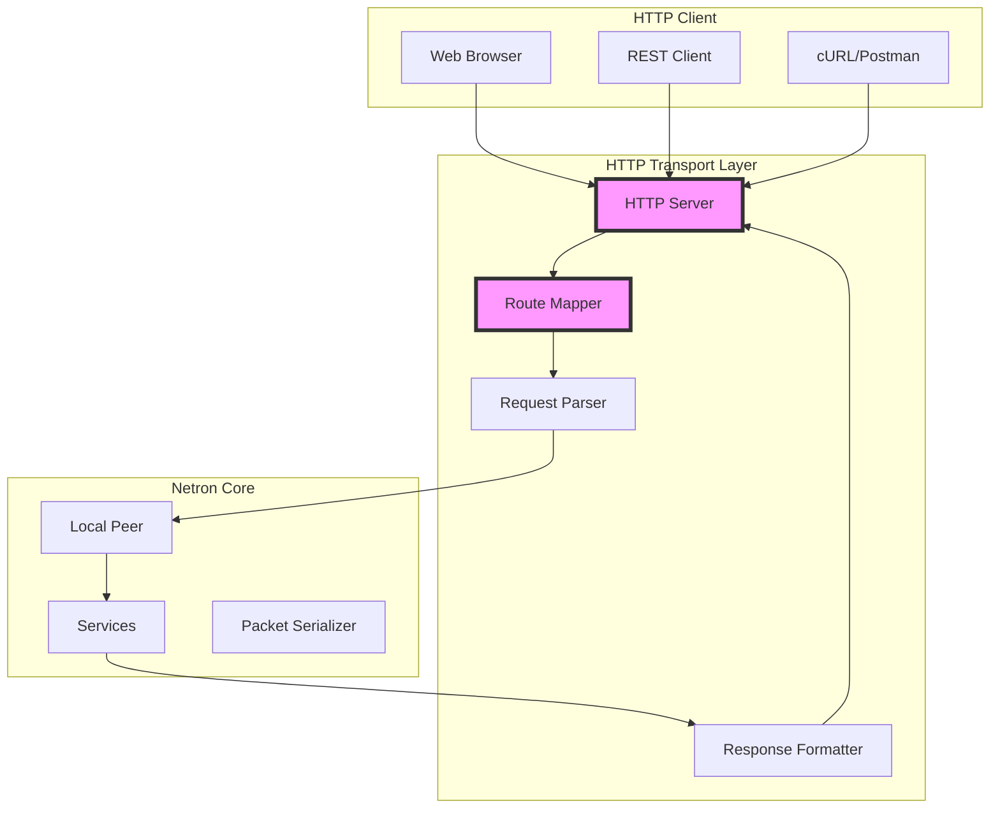

# HTTP Transport for Netron

## Table of Contents

- [Overview](#overview)
- [Architecture](#architecture)
- [Features](#features)
- [Server Implementation](#server-implementation)
  - [Route Generation](#route-generation)
  - [Request Handling](#request-handling)
  - [Response Formats](#response-formats)
  - [Streaming Support](#streaming-support)
- [Client Implementation](#client-implementation)
  - [Connection Management](#connection-management)
  - [Request Methods](#request-methods)
  - [Error Handling](#error-handling)
- [REST API Mapping](#rest-api-mapping)
- [Middleware Support](#middleware-support)
- [Configuration](#configuration)
- [Performance Optimization](#performance-optimization)
- [Security](#security)
- [Examples](#examples)
- [Best Practices](#best-practices)

## Overview

The HTTP Transport enables Netron services to be exposed as RESTful HTTP endpoints while maintaining compatibility with the Netron RPC paradigm. This transport bridges the gap between RPC-style services and HTTP/REST clients, making services accessible to web browsers, REST clients, and existing HTTP infrastructure.

### Key Benefits

- **REST Compatibility**: Automatic REST endpoint generation
- **Browser Support**: Direct access from web applications
- **Infrastructure Integration**: Works with existing HTTP tools
- **Firewall Friendly**: Uses standard HTTP/HTTPS ports
- **Streaming**: Server-Sent Events (SSE) for real-time data
- **CORS Support**: Cross-origin resource sharing
- **HTTP/2 Ready**: Multiplexing and server push support

## Architecture



## Features

### Core Features

- ✅ **Automatic REST Mapping**: Services become REST endpoints
- ✅ **Content Negotiation**: JSON, MessagePack, Protocol Buffers
- ✅ **Streaming**: SSE for async iterables
- ✅ **WebSocket Upgrade**: Hybrid HTTP/WebSocket support
- ✅ **File Upload**: Multipart form data handling
- ✅ **CORS**: Configurable cross-origin support
- ✅ **Compression**: Gzip/Brotli response compression
- ✅ **Caching**: ETag and conditional requests
- ✅ **Rate Limiting**: Built-in request throttling
- ✅ **Metrics**: Prometheus-compatible metrics

### Protocol Features

- **HTTP/1.1**: Keep-alive, pipelining
- **HTTP/2**: Multiplexing, server push, header compression
- **HTTPS**: TLS/SSL encryption
- **WebSocket**: Protocol upgrade for real-time

## Server Implementation

### Route Generation

Services are automatically mapped to REST endpoints:

```typescript
// Service definition
@Service('users@1.0.0')
class UserService {
  @Public()
  async getUser(id: string): Promise<User> {
    return db.users.findById(id);
  }

  @Public()
  async createUser(data: UserInput): Promise<User> {
    return db.users.create(data);
  }

  @Public()
  async updateUser(id: string, data: UserUpdate): Promise<User> {
    return db.users.update(id, data);
  }

  @Public()
  async deleteUser(id: string): Promise<void> {
    await db.users.delete(id);
  }

  @Public()
  async *listUsers(filter?: UserFilter): AsyncGenerator<User> {
    yield* db.users.stream(filter);
  }
}
```

Generated REST endpoints:

```
GET    /netron/users/getUser/:id
POST   /netron/users/createUser
PUT    /netron/users/updateUser/:id
DELETE /netron/users/deleteUser/:id
GET    /netron/users/listUsers        (SSE stream)
```

### Custom Route Mapping

Override default route generation:

```typescript
@Service('api@1.0.0')
class ApiService {
  @Public()
  @Route('GET', '/api/users/:id')
  async getUser(id: string): Promise<User> {
    // Available at GET /api/users/:id
  }

  @Public()
  @Route('POST', '/api/users')
  async createUser(@Body() data: UserInput): Promise<User> {
    // Available at POST /api/users
  }
}
```

### Request Handling

The HTTP server processes requests through these stages:

1. **Route Matching**: Find service and method
2. **Parameter Extraction**: Parse path, query, body
3. **Validation**: Validate against method contract
4. **Serialization**: Convert to Netron packet
5. **Invocation**: Call service method
6. **Response Formatting**: Format result as HTTP response

```typescript
class HttpServer {
  private async handleRequest(req: Request, res: Response) {
    // 1. Match route
    const route = this.matchRoute(req.path, req.method);
    if (!route) {
      return this.sendError(res, 404, 'Not Found');
    }

    // 2. Extract parameters
    const params = this.extractParams(req, route);

    // 3. Validate
    const validation = await this.validate(params, route.contract);
    if (!validation.valid) {
      return this.sendError(res, 400, validation.errors);
    }

    // 4. Create packet
    const packet = this.createPacket({
      service: route.serviceName,
      method: route.methodName,
      args: params
    });

    // 5. Invoke service
    const result = await this.peer.handlePacket(packet);

    // 6. Send response
    this.sendResponse(res, result);
  }
}
```

### Response Formats

Content negotiation based on Accept header:

#### JSON (default)

```typescript
// Request
GET /netron/users/getUser/123
Accept: application/json

// Response
{
  "success": true,
  "data": {
    "id": "123",
    "name": "John Doe",
    "email": "john@example.com"
  },
  "metadata": {
    "timestamp": 1234567890,
    "version": "1.0.0"
  }
}
```

#### MessagePack

```typescript
// Request
GET /netron/users/getUser/123
Accept: application/msgpack

// Response (binary MessagePack)
```

#### Protocol Buffers

```typescript
// Request
GET /netron/users/getUser/123
Accept: application/x-protobuf

// Response (binary protobuf)
```

### Streaming Support

Server-Sent Events for async iterables:

```typescript
// Service method
@Public()
async *streamUpdates(): AsyncGenerator<Update> {
  while (true) {
    yield await getNextUpdate();
  }
}
```

```http
// Client request
GET /netron/updates/streamUpdates
Accept: text/event-stream

// Server response
HTTP/1.1 200 OK
Content-Type: text/event-stream

data: {"id": 1, "message": "First update"}

data: {"id": 2, "message": "Second update"}

data: {"id": 3, "message": "Third update"}
```

### Error Handling

Structured error responses:

```typescript
// Error response format
{
  "success": false,
  "error": {
    "code": "SERVICE_ERROR",
    "message": "Failed to process request",
    "details": {
      "service": "users@1.0.0",
      "method": "getUser",
      "timestamp": 1234567890
    }
  }
}
```

HTTP status code mapping:

| Netron Error | HTTP Status | Description |
|--------------|-------------|-------------|
| NOT_FOUND | 404 | Service/method not found |
| INVALID_ARGS | 400 | Invalid arguments |
| UNAUTHORIZED | 401 | Authentication required |
| FORBIDDEN | 403 | Access denied |
| TIMEOUT | 408 | Request timeout |
| INTERNAL | 500 | Internal server error |
| UNAVAILABLE | 503 | Service unavailable |

## Client Implementation

### HttpClientConnection

The HTTP client maintains compatibility with Netron's connection interface:

```typescript
class HttpClientConnection extends EventEmitter implements ITransportConnection {
  constructor(
    private baseUrl: string,
    private options?: HttpClientOptions
  ) {
    super();
    this.initialize();
  }

  async send(data: Buffer | ArrayBuffer): Promise<void> {
    // Parse packet
    const packet = Packet.deserialize(data);

    // Convert to HTTP request
    const request = this.packetToRequest(packet);

    // Send HTTP request
    const response = await fetch(request);

    // Convert response to packet
    const responsePacket = await this.responseToPacket(response);

    // Emit packet event
    this.emit('packet', responsePacket);
  }

  private packetToRequest(packet: Packet): Request {
    // Map packet to HTTP request
    return new Request(`${this.baseUrl}/netron/${packet.service}/${packet.method}`, {
      method: 'POST',
      headers: {
        'Content-Type': 'application/json',
        'X-Netron-Version': '1.0.0'
      },
      body: JSON.stringify(packet.data)
    });
  }
}
```

### Request Methods

Different HTTP methods for different operations:

```typescript
// Query operations (GET)
const user = await httpClient.get('/users/123');

// Mutations (POST/PUT/DELETE)
const newUser = await httpClient.post('/users', userData);
const updated = await httpClient.put('/users/123', updates);
await httpClient.delete('/users/123');

// Streaming (SSE)
const stream = httpClient.stream('/updates');
for await (const event of stream) {
  console.log('Update:', event);
}
```

### Connection Management

HTTP is stateless, but the client simulates connection state:

```typescript
class HttpClientConnection {
  private state = ConnectionState.DISCONNECTED;
  private healthCheckInterval?: NodeJS.Timer;

  async connect(): Promise<void> {
    // Verify server is reachable
    const response = await fetch(`${this.baseUrl}/netron/health`);
    if (!response.ok) {
      throw new Error('Server unreachable');
    }

    this.state = ConnectionState.CONNECTED;
    this.emit('connect');

    // Start health checks
    this.startHealthCheck();
  }

  private startHealthCheck(): void {
    this.healthCheckInterval = setInterval(async () => {
      try {
        await fetch(`${this.baseUrl}/netron/ping`);
      } catch (error) {
        this.state = ConnectionState.ERROR;
        this.emit('error', error);
      }
    }, 30000);
  }
}
```

## REST API Mapping

### Default Mapping Rules

| RPC Method | HTTP Method | Path Pattern | Body |
|------------|-------------|--------------|------|
| get* | GET | /service/method/:params | - |
| list* | GET | /service/method?filters | - |
| create* | POST | /service/method | JSON |
| update* | PUT | /service/method/:id | JSON |
| delete* | DELETE | /service/method/:id | - |
| * (others) | POST | /service/method | JSON |

### Custom Mapping

Define custom REST mappings:

```typescript
const httpServer = new HttpServer({
  routes: {
    'users@1.0.0': {
      getUser: {
        method: 'GET',
        path: '/api/v1/users/:id'
      },
      createUser: {
        method: 'POST',
        path: '/api/v1/users'
      },
      updateUser: {
        method: 'PATCH',
        path: '/api/v1/users/:id'
      }
    }
  }
});
```

### OpenAPI Generation

Automatic OpenAPI/Swagger documentation:

```typescript
const server = new HttpServer({
  openapi: {
    enabled: true,
    path: '/api/docs',
    info: {
      title: 'My API',
      version: '1.0.0',
      description: 'API documentation'
    }
  }
});

// Access at http://localhost:3000/api/docs
```

## Middleware Support

### HTTP-Specific Middleware

```typescript
// CORS middleware
server.use(corsMiddleware({
  origin: 'https://example.com',
  credentials: true,
  maxAge: 86400
}));

// Body parser middleware
server.use(bodyParser({
  json: { limit: '10mb' },
  urlencoded: { extended: true }
}));

// Compression middleware
server.use(compression({
  threshold: 1024,
  level: 6
}));

// Rate limiting
server.use(rateLimit({
  windowMs: 15 * 60 * 1000,  // 15 minutes
  max: 100,                   // 100 requests
  message: 'Too many requests'
}));
```

### Netron Middleware Adapter

Bridge between HTTP and Netron middleware:

```typescript
class HttpMiddlewareAdapter {
  // Convert HTTP context to Netron context
  toNetronContext(req: Request, res: Response): NetronContext {
    return {
      service: this.extractService(req),
      method: this.extractMethod(req),
      input: this.extractInput(req),
      metadata: {
        headers: req.headers,
        ip: req.ip,
        userAgent: req.headers['user-agent']
      }
    };
  }

  // Apply Netron context back to HTTP
  fromNetronContext(ctx: NetronContext, res: Response): void {
    if (ctx.error) {
      res.status(this.mapErrorToStatus(ctx.error));
      res.json({ error: ctx.error });
    } else {
      res.json({ data: ctx.result });
    }
  }
}
```

## Configuration

### Server Configuration

```typescript
const server = new HttpServer({
  // Basic settings
  host: '0.0.0.0',
  port: 3000,

  // CORS
  cors: {
    origin: ['https://app.example.com'],
    methods: ['GET', 'POST', 'PUT', 'DELETE'],
    headers: ['Content-Type', 'Authorization'],
    credentials: true,
    maxAge: 86400
  },

  // Body parsing
  maxBodySize: 10 * 1024 * 1024,  // 10MB

  // Compression
  compression: {
    threshold: 1024,  // Compress responses > 1KB
    level: 6          // Compression level (1-9)
  },

  // Timeouts
  requestTimeout: 30000,  // 30 seconds

  // Security
  helmet: true,  // Enable helmet security headers

  // Rate limiting
  rateLimit: {
    windowMs: 15 * 60 * 1000,
    max: 100
  },

  // Custom headers
  headers: {
    'X-Powered-By': 'Netron',
    'X-API-Version': '1.0.0'
  },

  // Metrics
  metrics: {
    enabled: true,
    path: '/metrics',
    format: 'prometheus'
  }
});
```

### Client Configuration

```typescript
const client = new HttpClientConnection('http://api.example.com', {
  // Request defaults
  headers: {
    'Authorization': 'Bearer token',
    'X-API-Key': 'secret'
  },

  // Timeouts
  timeout: 30000,
  connectTimeout: 5000,

  // Retry
  retry: {
    maxAttempts: 3,
    delay: 1000,
    maxDelay: 10000,
    factor: 2,
    methods: ['GET', 'PUT', 'DELETE']
  },

  // Caching
  cache: 'no-cache',  // or 'default', 'force-cache'

  // Compression
  compress: true,

  // Keep-alive
  keepAlive: true,
  keepAliveTimeout: 60000
});
```

## Performance Optimization

### Connection Pooling

Reuse HTTP connections:

```typescript
// Node.js
import { Agent } from 'http';

const agent = new Agent({
  keepAlive: true,
  keepAliveMsecs: 60000,
  maxSockets: 50,
  maxFreeSockets: 10
});

const client = new HttpClientConnection(url, { agent });
```

### Response Caching

Implement caching strategies:

```typescript
// Server-side caching
server.use(cacheMiddleware({
  ttl: 300,  // 5 minutes
  keyGenerator: (req) => `${req.method}:${req.path}`,
  condition: (req) => req.method === 'GET'
}));

// Client-side caching
const cachedClient = new CachedHttpClient(client, {
  storage: new Map(),
  ttl: 60000,
  maxSize: 100
});
```

### Compression

Enable response compression:

```typescript
// Server
server.use(compression({
  filter: (req, res) => {
    // Compress JSON and text
    const type = res.getHeader('Content-Type');
    return /json|text/.test(type);
  },
  threshold: 1024  // Only compress > 1KB
}));

// Client
const client = new HttpClientConnection(url, {
  headers: {
    'Accept-Encoding': 'gzip, deflate, br'
  }
});
```

### HTTP/2 Support

Enable HTTP/2 for multiplexing:

```typescript
import { createSecureServer } from 'http2';

const server = new HttpServer({
  http2: true,
  https: {
    key: fs.readFileSync('server.key'),
    cert: fs.readFileSync('server.cert')
  }
});
```

### Request Batching

Batch multiple requests:

```typescript
// Client-side batching
const batch = client.batch();
batch.add('getUser', { id: '123' });
batch.add('getPosts', { userId: '123' });
batch.add('getComments', { postId: '456' });

const results = await batch.execute();
```

## Security

### HTTPS/TLS

Enable HTTPS:

```typescript
const server = new HttpServer({
  https: {
    key: fs.readFileSync('private-key.pem'),
    cert: fs.readFileSync('certificate.pem'),
    ca: fs.readFileSync('ca.pem'),
    // TLS options
    secureProtocol: 'TLSv1_2_method',
    ciphers: 'ECDHE-RSA-AES128-GCM-SHA256'
  }
});
```

### Authentication

Implement authentication middleware:

```typescript
// JWT authentication
server.use(async (ctx, next) => {
  const token = ctx.headers['authorization']?.split(' ')[1];

  if (!token) {
    throw new Error('Authentication required');
  }

  try {
    const payload = jwt.verify(token, SECRET);
    ctx.user = payload;
    await next();
  } catch (error) {
    throw new Error('Invalid token');
  }
});
```

### Input Validation

Validate and sanitize input:

```typescript
server.use(validationMiddleware({
  schemas: {
    'users.createUser': Joi.object({
      name: Joi.string().required(),
      email: Joi.string().email().required(),
      age: Joi.number().min(0).max(150)
    })
  }
}));
```

### Rate Limiting

Prevent abuse:

```typescript
// IP-based rate limiting
server.use(rateLimit({
  windowMs: 15 * 60 * 1000,  // 15 minutes
  max: 100,                   // 100 requests per window
  keyGenerator: (req) => req.ip,
  handler: (req, res) => {
    res.status(429).json({
      error: 'Too many requests'
    });
  }
}));

// User-based rate limiting
server.use(userRateLimit({
  windowMs: 60 * 1000,  // 1 minute
  max: 10,               // 10 requests per minute
  keyGenerator: (ctx) => ctx.user?.id
}));
```

### Security Headers

Add security headers:

```typescript
server.use(helmet({
  contentSecurityPolicy: {
    directives: {
      defaultSrc: ["'self'"],
      styleSrc: ["'self'", "'unsafe-inline'"]
    }
  },
  hsts: {
    maxAge: 31536000,
    includeSubDomains: true,
    preload: true
  }
}));
```

## Examples

### Complete Server Example

```typescript
import { Netron } from '@omnitron-dev/titan/netron';
import { HttpServer } from '@omnitron-dev/titan/netron/transport/http';

// Create Netron with HTTP transport
const netron = new Netron({
  transport: 'http',
  listenHost: '0.0.0.0',
  listenPort: 3000
});

// Configure HTTP-specific options
const httpServer = netron.transportServer as HttpServer;

httpServer.configure({
  cors: {
    origin: '*',
    credentials: true
  },
  compression: true,
  rateLimit: {
    windowMs: 60000,
    max: 100
  }
});

// Add middleware
httpServer.use(loggingMiddleware());
httpServer.use(authenticationMiddleware());
httpServer.use(validationMiddleware());

// Define and expose services
@Service('api@1.0.0')
class ApiService {
  @Public()
  @Route('GET', '/api/health')
  async health(): Promise<{ status: string }> {
    return { status: 'healthy' };
  }

  @Public()
  @Route('GET', '/api/users/:id')
  async getUser(id: string): Promise<User> {
    return db.users.findById(id);
  }

  @Public()
  @Route('POST', '/api/users')
  async createUser(@Body() data: UserInput): Promise<User> {
    return db.users.create(data);
  }

  @Public()
  @Route('GET', '/api/stream')
  async *streamData(): AsyncGenerator<Data> {
    while (true) {
      yield await getNextData();
      await delay(1000);
    }
  }
}

// Expose service
const service = new ApiService();
await netron.peer.expose(service);

// Start server
await netron.listen();
console.log('HTTP API running at http://localhost:3000');
```

### Complete Client Example

```typescript
import { HttpClientConnection } from '@omnitron-dev/titan/netron/transport/http';

// Create HTTP client
const client = new HttpClientConnection('http://api.example.com', {
  headers: {
    'Authorization': 'Bearer token'
  },
  retry: {
    maxAttempts: 3,
    delay: 1000
  }
});

// Connect (verify server)
await client.connect();

// Make requests
try {
  // GET request
  const user = await client.request('GET', '/api/users/123');
  console.log('User:', user);

  // POST request
  const newUser = await client.request('POST', '/api/users', {
    body: {
      name: 'John Doe',
      email: 'john@example.com'
    }
  });
  console.log('Created:', newUser);

  // Streaming
  const stream = client.stream('GET', '/api/stream');
  for await (const data of stream) {
    console.log('Stream data:', data);
  }
} catch (error) {
  console.error('Request failed:', error);
}

// Close connection
await client.close();
```

### REST Client Example

```typescript
// Using standard fetch API
const response = await fetch('http://localhost:3000/api/users/123', {
  method: 'GET',
  headers: {
    'Accept': 'application/json',
    'Authorization': 'Bearer token'
  }
});

if (!response.ok) {
  throw new Error(`HTTP ${response.status}: ${response.statusText}`);
}

const user = await response.json();
console.log('User:', user);
```

### Browser SSE Example

```typescript
// Server-Sent Events in browser
const eventSource = new EventSource('http://localhost:3000/api/stream');

eventSource.onmessage = (event) => {
  const data = JSON.parse(event.data);
  console.log('Received:', data);
};

eventSource.onerror = (error) => {
  console.error('Stream error:', error);
  eventSource.close();
};

// Clean up
window.addEventListener('beforeunload', () => {
  eventSource.close();
});
```

## Best Practices

### 1. Use Proper HTTP Methods

Follow RESTful conventions:

```typescript
// ✅ Good
GET    /users/123        // Read
POST   /users            // Create
PUT    /users/123        // Full update
PATCH  /users/123        // Partial update
DELETE /users/123        // Delete

// ❌ Bad
GET    /deleteUser/123   // GET should not mutate
POST   /getUser/123      // POST for reading
```

### 2. Implement Proper Error Handling

Return appropriate status codes:

```typescript
server.use(async (ctx, next) => {
  try {
    await next();
  } catch (error) {
    if (error.code === 'NOT_FOUND') {
      ctx.status = 404;
    } else if (error.code === 'UNAUTHORIZED') {
      ctx.status = 401;
    } else if (error.code === 'VALIDATION_ERROR') {
      ctx.status = 400;
    } else {
      ctx.status = 500;
    }

    ctx.body = {
      error: {
        code: error.code,
        message: error.message
      }
    };
  }
});
```

### 3. Use Content Negotiation

Support multiple formats:

```typescript
server.use((ctx, next) => {
  const accept = ctx.headers['accept'];

  if (accept.includes('application/json')) {
    ctx.responseType = 'json';
  } else if (accept.includes('application/msgpack')) {
    ctx.responseType = 'msgpack';
  } else if (accept.includes('text/html')) {
    ctx.responseType = 'html';
  }

  return next();
});
```

### 4. Implement Caching

Use HTTP caching headers:

```typescript
server.use((ctx, next) => {
  if (ctx.method === 'GET') {
    // Set cache headers
    ctx.headers['Cache-Control'] = 'public, max-age=300';
    ctx.headers['ETag'] = generateETag(ctx.response);

    // Check If-None-Match
    if (ctx.headers['If-None-Match'] === ctx.headers['ETag']) {
      ctx.status = 304;  // Not Modified
      return;
    }
  }

  return next();
});
```

### 5. Monitor Performance

Track metrics:

```typescript
server.use(async (ctx, next) => {
  const start = Date.now();

  await next();

  const duration = Date.now() - start;

  // Log metrics
  metrics.histogram('http_request_duration', duration, {
    method: ctx.method,
    path: ctx.path,
    status: ctx.status
  });
});
```

### 6. Secure Your API

Implement security best practices:

```typescript
// Use HTTPS in production
if (process.env.NODE_ENV === 'production') {
  server.configure({
    https: {
      key: fs.readFileSync('server.key'),
      cert: fs.readFileSync('server.cert')
    }
  });
}

// Validate input
server.use(validationMiddleware());

// Rate limit
server.use(rateLimitMiddleware());

// Add security headers
server.use(helmetMiddleware());

// Log security events
server.on('security:violation', (event) => {
  logger.warn('Security violation', event);
});
```

## Troubleshooting

### Common Issues

#### CORS Errors

```javascript
// Browser console error:
// Access to fetch at 'http://api.example.com' from origin 'http://localhost:3000'
// has been blocked by CORS policy

// Solution: Configure CORS
server.configure({
  cors: {
    origin: 'http://localhost:3000',
    credentials: true
  }
});
```

#### Large Payload Errors

```javascript
// Error: Request body too large

// Solution: Increase body size limit
server.configure({
  maxBodySize: 50 * 1024 * 1024  // 50MB
});
```

#### Timeout Errors

```javascript
// Error: Request timeout

// Solution: Increase timeout
server.configure({
  requestTimeout: 60000  // 60 seconds
});
```

### Debug Mode

Enable debug logging:

```typescript
const server = new HttpServer({
  debug: true,
  logger: {
    level: 'debug',
    transport: 'console'
  }
});

// Debug specific components
server.on('debug:route', (info) => {
  console.log('Route matched:', info);
});

server.on('debug:request', (req) => {
  console.log('Request:', req.method, req.path);
});
```

## See Also

- [Netron Main Documentation](../../README.md)
- [Transport Layer Overview](../README.md)
- [Middleware System](../../middleware/README.md)
- [WebSocket Transport](../websocket-transport.ts)